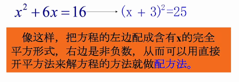
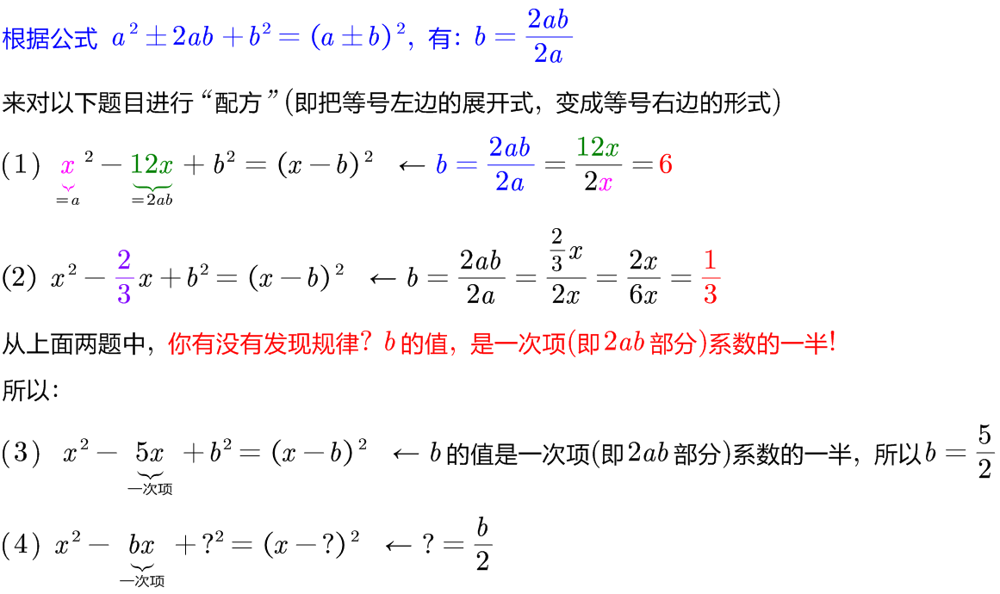
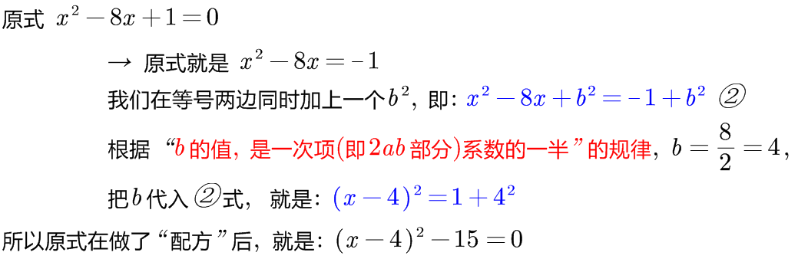
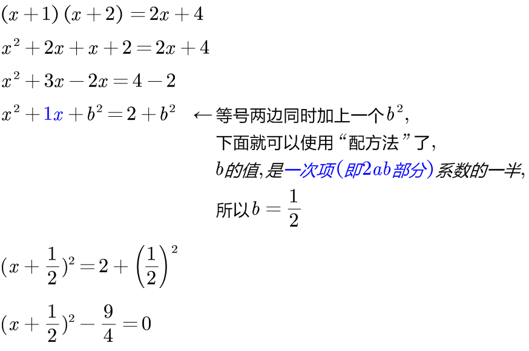
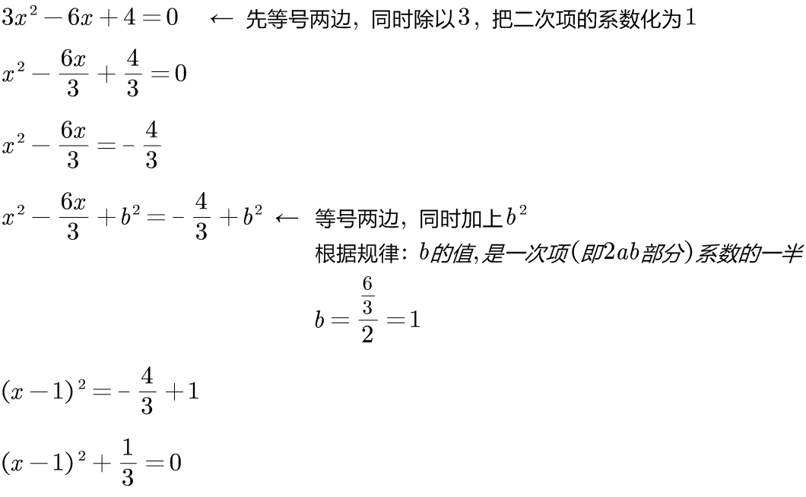
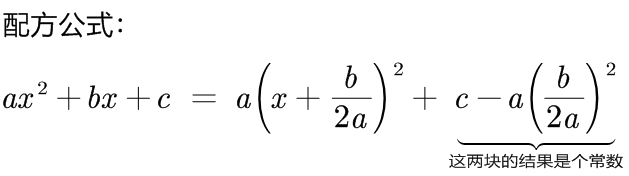
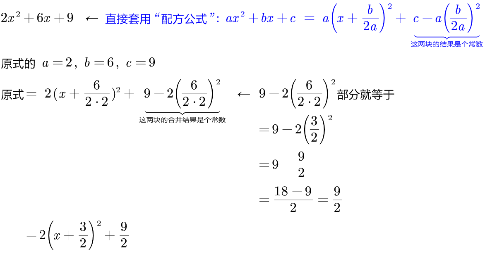

= 基础_一元二次方程的"配方法 Completing the square"
:toc: left
:toclevels: 3
:sectnums:

---

== 配方法 Completing the square

配方法: 是一种用来把"二次多项式"化为一个"一次多项式的平方 与一个常数的和"的方法。

知道了上面的规律后, 我们就能来进行"配方"了:

.标题
====
例如： +

====

.标题
====
例如： +

====

.标题
====
例如： +

====

---

== 配方公式 -> stem:[ a x^2 + bx + c = a(x + \frac{b}{2a})^2 + c - a (\frac{b}{2a})^2]

.标题
====
例如： +

====

---
