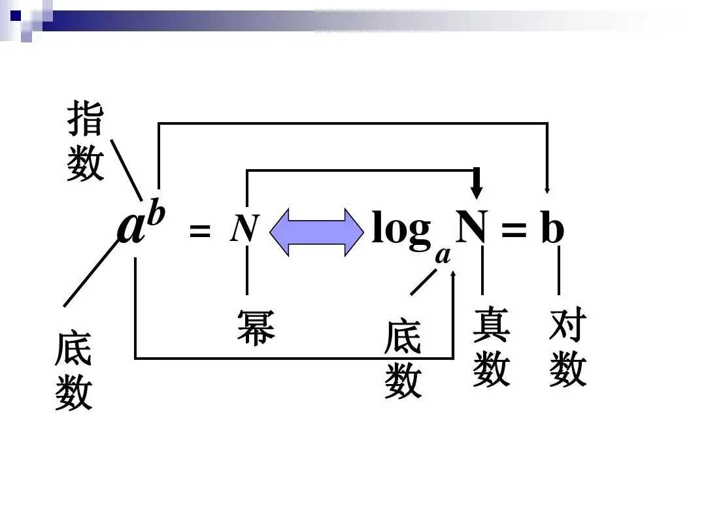
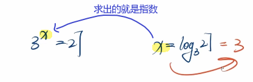
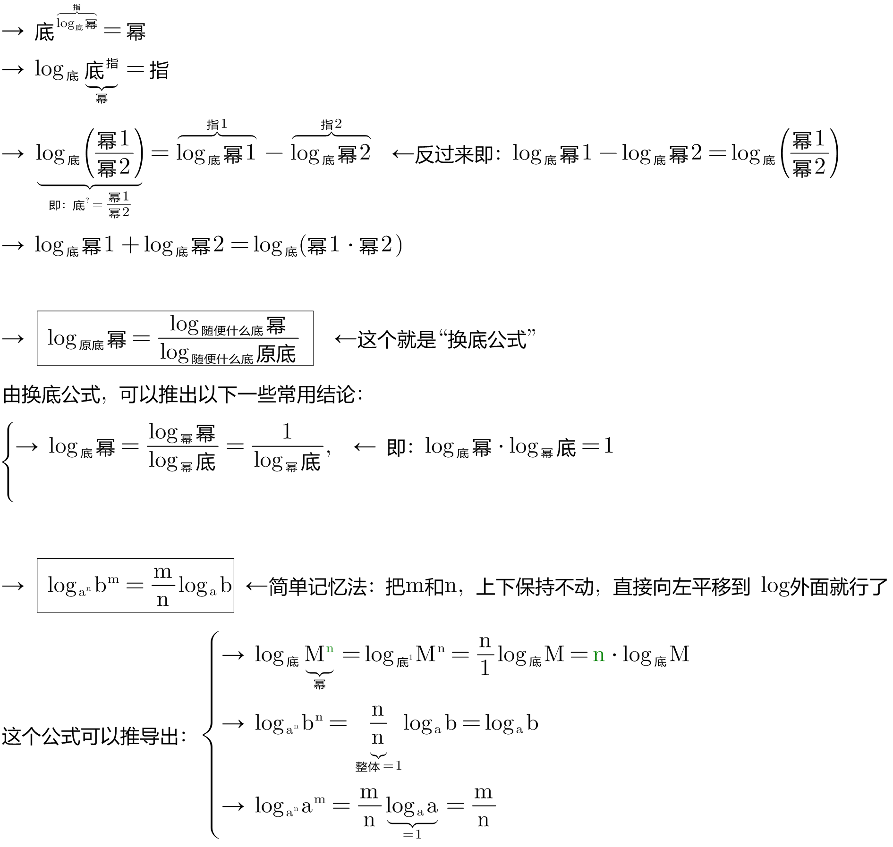
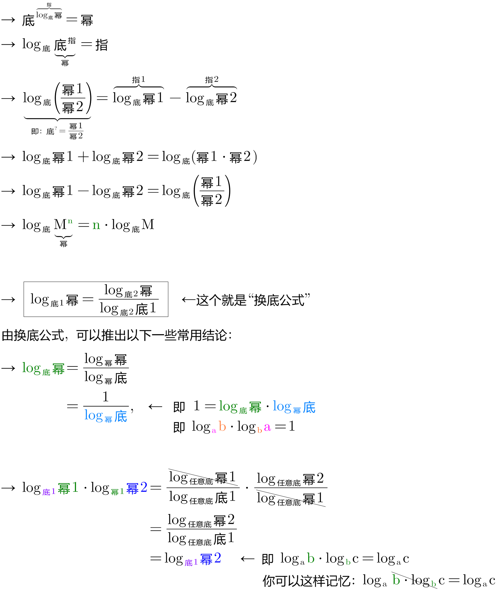
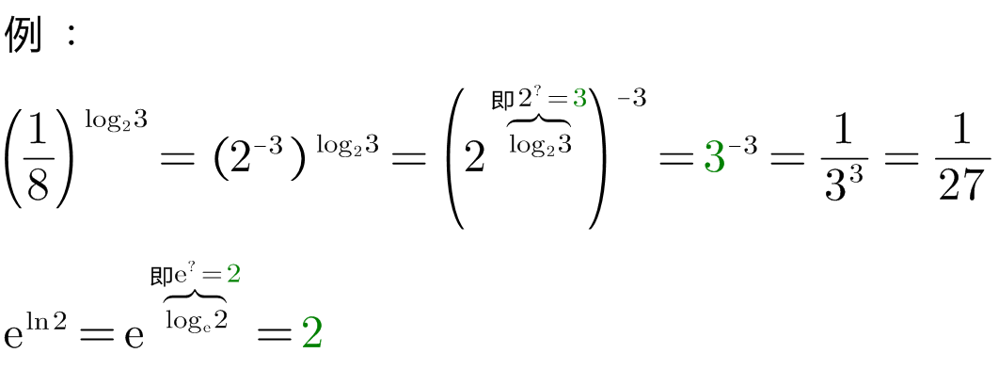
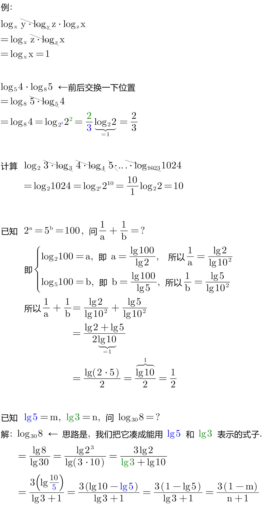
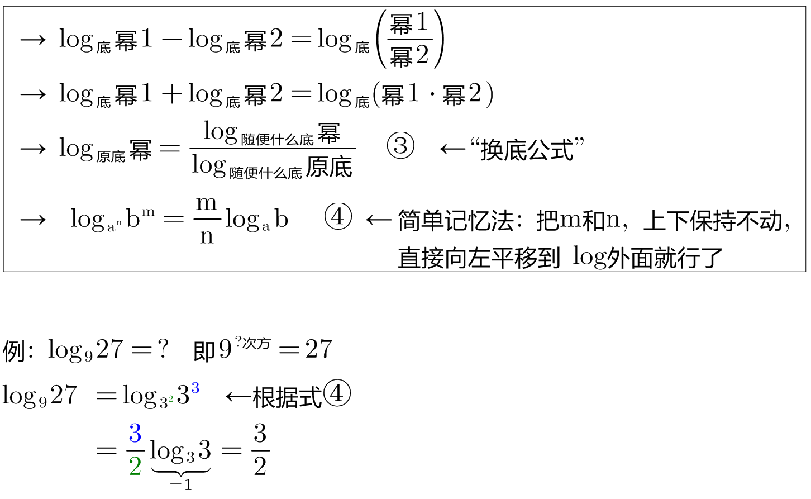
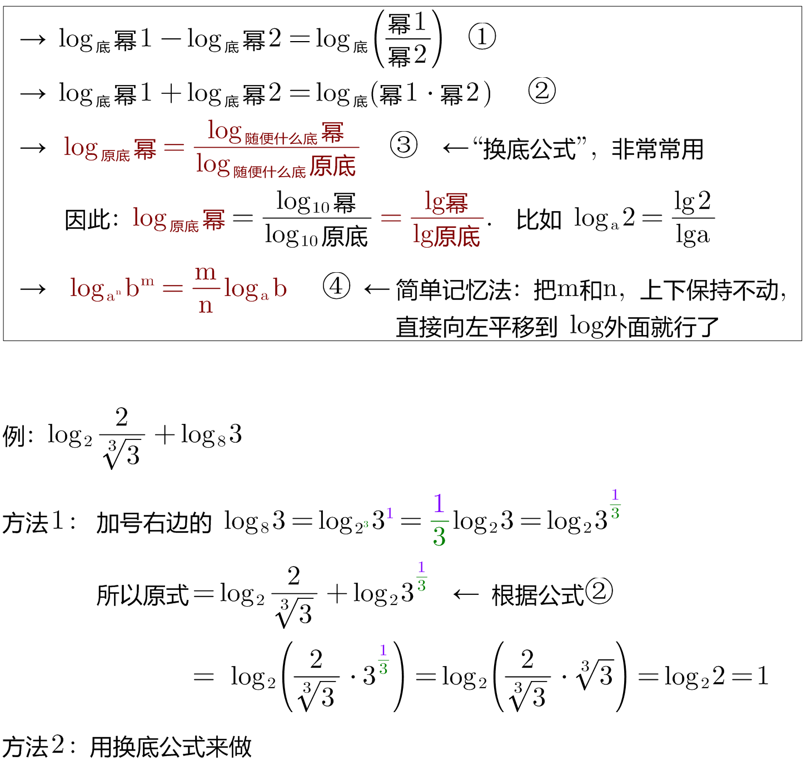

= 对数(logarithms) log, ln
:toc: left
:toclevels: 3
:sectnums:

---

== log

stem:[ 底^指=幂]  -> -> ->   stem:[ log_底 幂=指]

stem:[ log_{10} 幂 = lg 幂]

stem:[ log_{e} 幂 = ln 幂]

显然, 就有:

.标题
====
例如： +

====

.标题
====
例如： +

====

---

== ln

=== 对数公式

==== stem:[ ln ab = ln a + ln b]

---

==== stem:[ ln \frac{a} {b} = ln a - ln b]

---

==== ★ 换底公式  stem:[ log_a b = \frac{log_c b} {log_c a}]

---

==== ★ stem:[ log_{a^n} b^m = \frac{m} {n} log_a b]

.标题
====
例如： +

====

.标题
====
例如： +

====

---

==== stem:[ ln a^b = b ln a]

---

==== stem:[ ln \[f(m) - f(h)\] = ln f(m-h)  = ln f - ln(m-h)]

---

== 对数函数

https://www.bilibili.com/video/BV1Q44y1C7nk/?spm_id_from=333.788&vd_source=52c6cb2c1143f8e222795afbab2ab1b5

