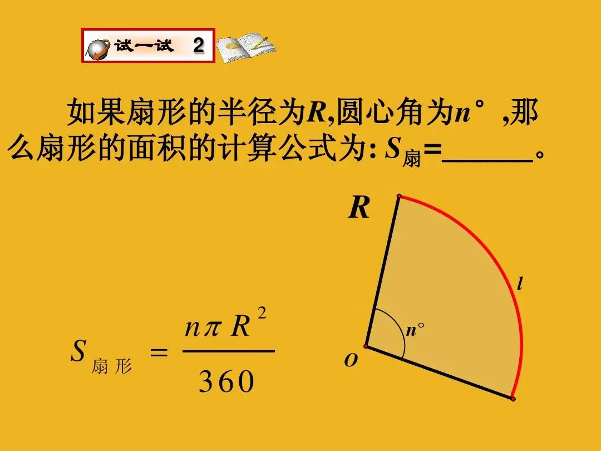
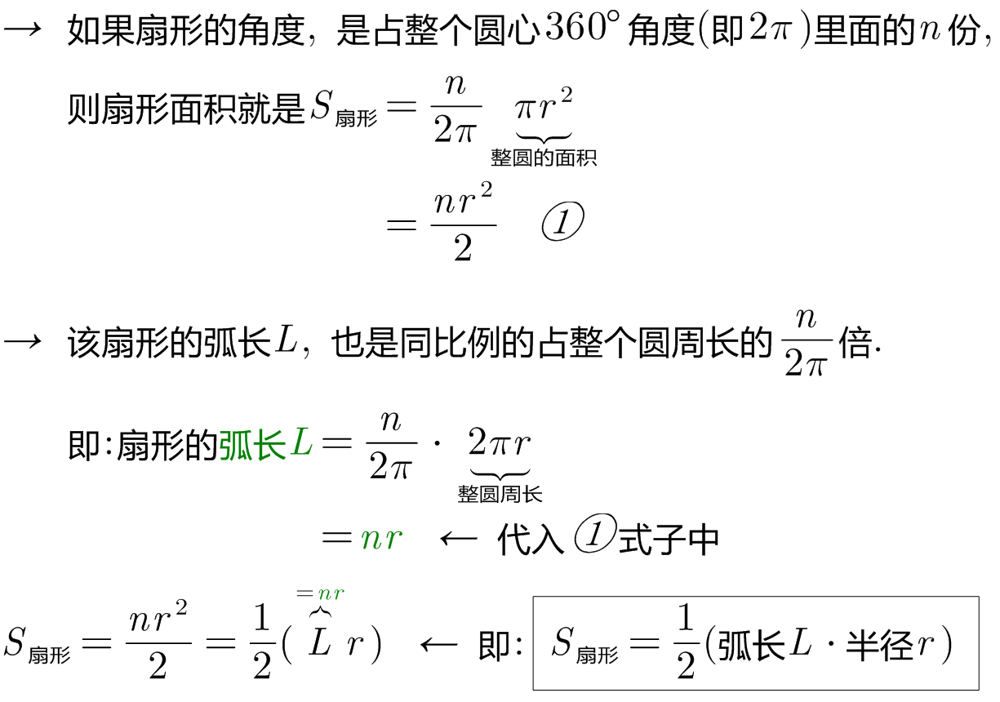
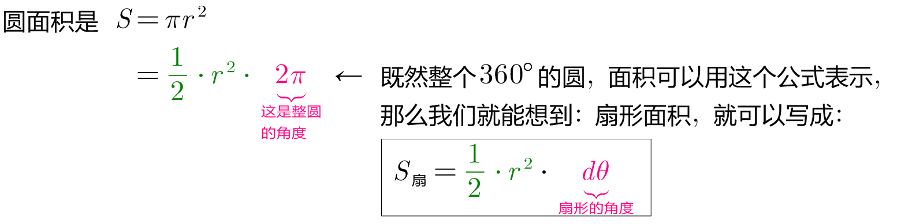
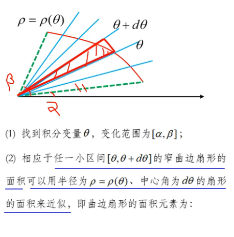
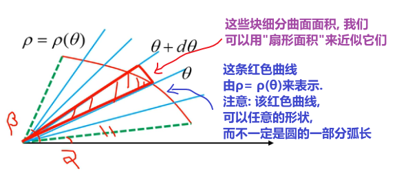
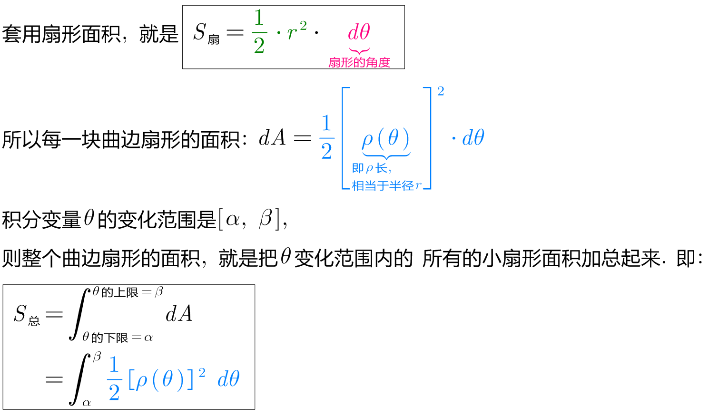
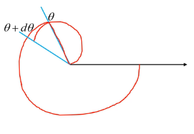
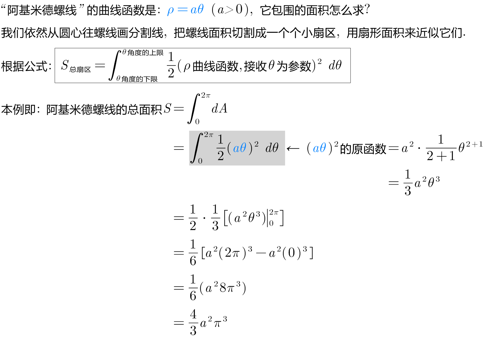

= 扇形面积
:toc: left
:toclevels: 3
:sectnums:

---

== 扇形面积 -> stem:[ S_扇= \frac{1} {2} ("弧长"L \cdot "半径"r)]

扇形的弧长, 而我们用 L (arc length) 表示.

---

== 扇形面积 -> stem:[S_扇= \frac{1} {2} r^2 \cdot dθ ]

---

== 扇形面积 (极坐标表示) -> stem:[ dA = \frac{1} {2} \cdot "ρ曲线函数"^2 \cdot dθ]

[options="autowidth"]
|===
|Header 1 |Header 2

|
|

|===

.标题
====
例如： +

====

---

