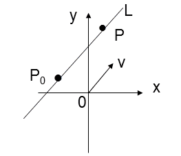
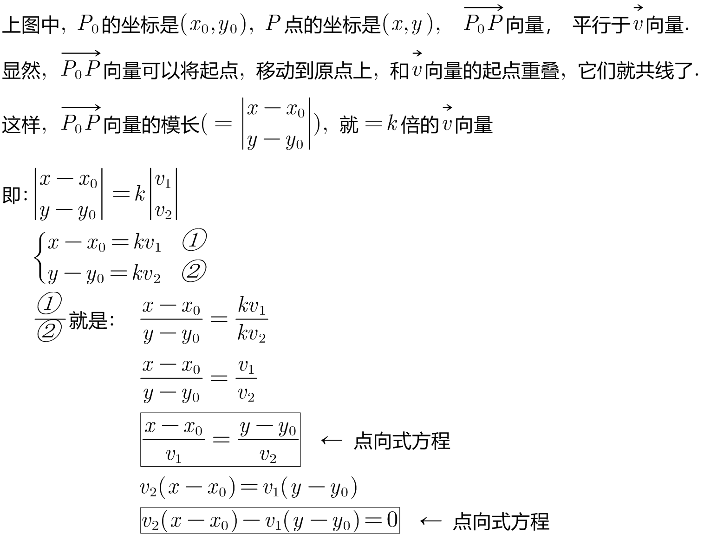
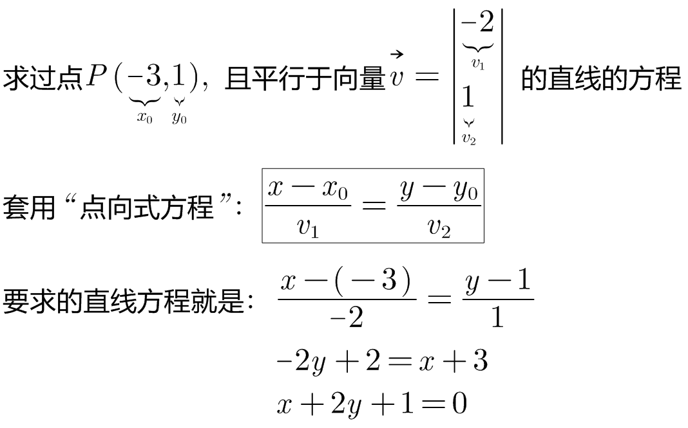

= 点法向式
:toc: left
:toclevels: 3
:sectnums:

---

== 点法向式

.标题
====
例如： +

====

---

https://www.bilibili.com/video/BV18b4y1v73j?spm_id_from=333.337.search-card.all.click&vd_source=52c6cb2c1143f8e222795afbab2ab1b5
