= 极限_两个重要的极限
:toc: left
:toclevels: 3
:sectnums:

---

== ★ 两个重要的极限 (必考)

==== stem:[\lim_{x \to 0} \frac{sinx} {x} = 1 ]

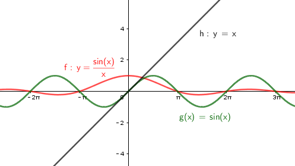

不严谨的理解方法, 可以这样来记: 当 x 趋向于0时, 显然, 分子 sinx 也趋近于0, 分母x也趋近于0, 所以 stem:[\lim_{x \to 0} \frac{sinx} {x}  ] 就相当于 是 stem:[0/0], 就=1 了.

其实, 它的骨架是这种形式的: +
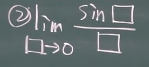

该公式在实际应用中, 有很多披了马甲的形式, 你一定要火眼金睛能看出它的"本像".

.标题
====
如：

\begin{align*}
\lim_{x \to 1} \frac{sin(x^2 -1)} {x^2 -1} \quad ①
\end{align*}

当x趋近于1时, 分子的 stem:[sin(x^2 -1)] 就趋向于0, 分母的 stem:[x^2 -1] 也趋向于0. 所以它的"真身" 其实就是 stem:[0/0 =  \lim_{x \to 0} \frac{sinx} {x} = 1 ] 这个公式.

事实上, 这个① 可以改成 stem:[\lim_{x^2 - 1 \to 0} \frac{sin(x^2 -1)} {x^2 -1} \quad] 的形式, 就完全是"本像"的形式了.
====

.标题
====
另一种马甲: 没给出 sin, 但给出  cos, tan, arcsin, arctan 等 的形式.

如：
\begin{align*}
& \lim_{x \to 0} \dfrac{\tan x} {x}
= \lim_{x \to 0} \dfrac{\sin x} {\cos x} \cdot \dfrac{1} {x}
= \underset{这块就是本像了,\ =\ 0/0\ =1}{\underbrace{\lim_{x\rightarrow 0}\dfrac{\sin x}{x}}}\cdot \underset{当x→0时,这块=1}{\underbrace{\dfrac{1}{\cos x}}}
= 1
\end{align*}
====

.标题
====
另一种马甲: 无x. 那么我们就构造出一个x来.

如：
\begin{align*}
& \lim_{x\rightarrow 0}\frac{\sin x}{\sin 2x}\
= \lim_{x\rightarrow 0}\dfrac{\frac{\sin x}{x}}{\frac{\sin 2x}{2x}}\cdot \frac{1}{2} \\
& =\frac{0}{0}\cdot \dfrac{1}{2} = 1  ← 别忘了用本像公式时, 0/0 =1
\end{align*}
====

.标题
====
如：

\begin{align*}
\lim_{x\rightarrow 0}\frac{tan\ 2x}{tan\ 3x}
=\frac{\frac{sin\ 2x}{cos\ 2x}}{\frac{sin\ 3x}{cos\ 3x}}
=\frac{\frac{sin\ 2x}{2x}\cdot 2x\cdot \frac{1}{cos\ 2x}}{\frac{sin\ 3x}{3x}\cdot 3x\cdot \frac{1}{cos\ 3x}}
=\frac{2}{3}\ \frac{\frac{sin\ 2x}{2x}\cdot \frac{1}{cos\ 2x}}{\frac{sin\ 3x}{3x}\cdot \frac{1}{cos\ 3x}}
=\frac{2}{3}\ \frac{1\cdot 1}{1\cdot 1}=\frac{2}{3}
\end{align*}
====

.标题
====
如：
\begin{align*}
& \lim_{x\rightarrow 0} \frac{1-cos\ x} {x^2}\ ←上下两边同时乘上一个\ 1+cos\ x\\
& =\lim_{x\rightarrow 0} \frac{\left( 1-cos\ x \right) \left( 1+cos\ x \right)} {x^2\left( 1+cos\ x \right)}\\
& =\lim_{x\rightarrow 0} \frac{1-cos^2x} {x^2\left( 1+cos\ x \right)}\\
& =\lim_{x\rightarrow 0} \frac{sin^2x} {x^2} \cdot \frac{1} {1+cos\ x}\\
& =\ 1\cdot \frac{1}{2}= \frac{1}{2}\\
\end{align*}
====

.标题
====
例：
\begin{align*}
\begin{array}{l}
	&\lim_{x\rightarrow 0}\,\,\frac{arcsin\,\,x}{x}\ ←\ 令\ x=sin\ t\\
	&=\lim_{x\rightarrow 0}\ \frac{arcsin\left( sin\ t \right)}{sin\ t}\\
	&=\lim_{sin\ t\rightarrow 0}\ \frac{t}{sin\ t}=1\\
\end{array}
\end{align*}
====

总结规律: +
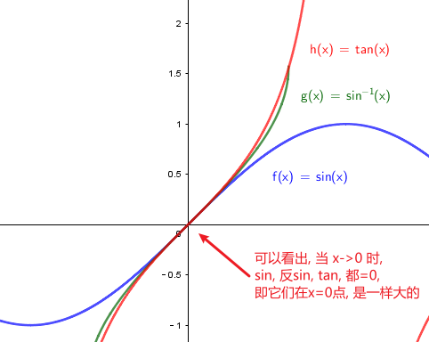

如图, 既然在 x->0 点处, sin x, 反sin x, tan x, 都是一样大的, 所以这三个中, 任意取两个, 分别放在分子和分母上, (在 x->0 点处时,)它们的比值都=1.

即如:
\begin{align*}
& \lim_{x \to 0} \frac{\tan x} {\arcsin x} = 1 \\
\end{align*}

还可以用 geogebra 来求极限. 方法是 : Limit(函数, x趋向的值)

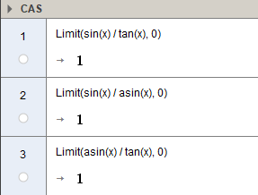

.标题
====
例如：
\begin{align*}
&\lim_{x \to 0} \frac{1- \cos x} {x^2} \\
&= \lim_{x \to 0}   \frac{(1- \cos x)(1 + \cos x)} {x^2 (1 + \cos x)} \\
&= \lim_{x \to 0}  \frac{\sin^2 x} {x^2} (\frac{1} {1 + \cos x}) <- 套用公式, \lim_{x \to 0} \frac{\sin^2 x} {x^2} =  \lim_{x \to 0} (\frac{\sin x} {x})^2 = 1^2\\
&= \frac{1} {2}
\end{align*}
====

跟着上例,
\begin{align*}
&既然 \lim_{x \to 0} \frac{1- \cos x} {x^2} = \frac{1} {2}\\
&那么  \lim_{x \to 0} 1- \cos x =\frac{1} {2} x^2\\
& 同样, \lim_{x \to 0} \cos x -1 = -\frac{1} {2} x^2 \\
\end{align*}

---

==== stem:[\lim_{x \to ∞} (1+ \frac{1} {x})^x = e]

\begin{align*}
& \lim_{x \to ∞} (1+ \frac{1} {x})^x = 自然常数 e = 2.718 \\
& 如果用 跟常见的"利息结算期限 n" 代替 x, 其实就是 : \\
& \lim_{x \to ∞} (1+ \frac{1} {n})^n = e
\end{align*}

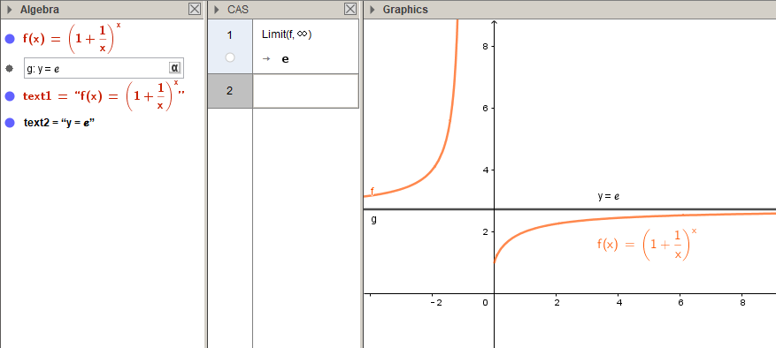

**注意: 使用该极限公式时, 中间必须是加号 +. 如果题目给出的不是加号, 你也要把它先变换成加号.** 如:

.标题
====

如：
\begin{align*}
\lim_{x -> ∞}(1-\frac{1}{x})^x
=\lim_{x -> ∞}\left( 1+\frac{1}{-x} \right) ^{-x\cdot -1}
=e^{-1}
\end{align*}

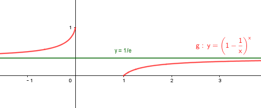
====

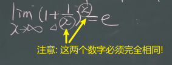

.标题
====

例：
\begin{align*}
\lim_{x -> ∞}(1+\frac{1} {3x})^{2x}
=\lim_{x -> ∞}\left[ (1+\frac{1} {3x})^{3x} \right] ^{\frac{2} {3}}
=e^{\frac{2} {3}}
\end{align*}
====

.标题
====

例：
\begin{align*}
& \lim_{x \to ∞} (1+ \frac{5} {x})^x \\
& =  \lim_{x \to ∞} (1+ \frac{1} {\frac{x} {5}})^x \\
& =  \lim_{x \to ∞} (1+ \frac{1} {\frac{x} {5}})^{{\frac{x} {5}} \cdot 5} \\
&= e^5
\end{align*}

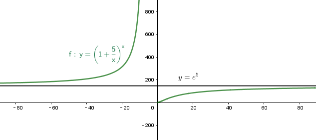
====

.标题
====

例:

\begin{align*}
\lim_{x\rightarrow \infty} \left( 2+\frac{1}{x} \right) ^x
=2^x \left( 1+\frac{1} {2x} \right) ^x
=2^x \left( 1+\frac{1} {2x} \right) ^{2x \cdot \frac{1} {2}}
=2^x \left[ \underset{这一块,\ 就是e}{\underbrace{\left( 1+\frac{1} {2x} \right) ^{2x}}} \right] ^{\frac{1} {2}}
=2^x e^{\frac{1} {2}}
\end{align*}

但这里, stem:[2^x] 的极限是什么, 就不确定了. 因为 x-> ∞时, x既可以是"正无穷大", 也可以是"负无穷大".

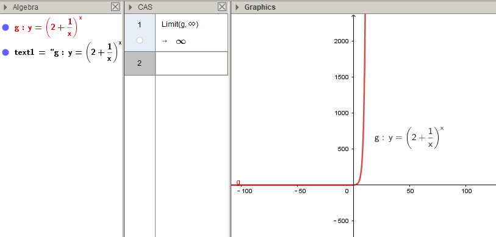
====

---

==== stem:[\lim_{x \to 0} (1+x)^{\frac{1} {x}} =e]

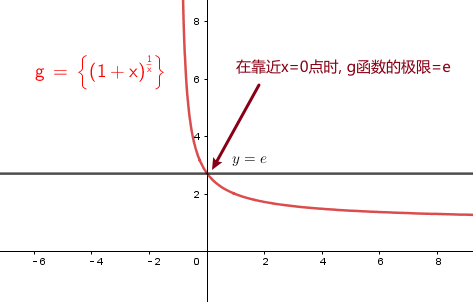

.标题
====
例：
\begin{align*}
\lim_{x\rightarrow 0}\left( 1-x \right) ^{\frac{1}{x}}
=\left( 1+\left( -x \right) \right) ^{\frac{1}{x}}
=\left( 1+\left( -x \right) \right) ^{\frac{1}{-x}\cdot \left( -1 \right)}
=e^{-1}
\end{align*}

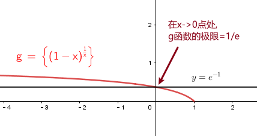
====

---

