= 导数_函数单调性&极值&函数画图
:toc: left
:toclevels: 3
:sectnums:

---

- 极值: 是指在某x点的"领域内", 找一个最大或最小值. 即: 极值是与它的两侧相比的. 大于两侧就是极大值，小于两侧就是极小值.

- 最值: 是在函数在"定义域", 或"指定区间内" 的最大或最小值。  +
"最值"是唯一的, 但"最值点"可能并不唯一. 比如有可能有好几个点, 具有相同的"最值数值".

- 驻点 Stationary Point : 是函数的"一阶导数=0"处的x点. 驻点处的切线平行于x轴。驻点不一定是这个函数的极值点.

image:img/238.webp[,350]

---

== 极值  extremum

极值点, 导数一定=0. 但反过来, 导数=0处的点, 未必是极值点. 因为它可能处于"从下一级台阶到上一级台阶的 中间水平台阶上".

定理 如果函数可二阶导, 并且在 stem:[ x_0]处,它的导数 stem:[ f(x_0)'=0], 且它的二阶导 stem:[  f(x_0)'' \ne 0], 那么该 stem:[x_0 ]点, 到底是属于极大值, 还是极小值呢?  +
-> 若 stem:[  f(x_0)''  <0 ], 表明一阶导的切线斜率趋势一直在下降(越来越疲软), 则说明 stem:[x_0 ] 是极大值. +
-> 若 stem:[  f(x_0)''  >0 ], 表明一阶导的切线斜率趋势一直在上降(越来越强劲), 则说明 stem:[x_0 ] 是极大值.

image:img/239.png[,100]

如果 发现 stem:[  f(x_0)'' = 0] 呢? 此时, 就无法判断 stem:[ x_0] 点到底是"极大值"还是"极小值", 只能回到查看该stem:[ x_0]点左右两侧的一阶导数, 是>0 还是<0, 即: 左右两侧的曲线图像是单调增, 还是单调减, 才能来判断该  stem:[ x_0] 点 是极大值, 还是极小值了.

.标题
====
例如： +
image:img/240.png[,800]

image:img/241.png[,500]
====

---

== 用导数来判断函数的"单调性"

显然, 在 导数>0 的区间中, 函数是"单调增"的. +
在 导数 < 0 的区间中, 函数是"单调减"的.

.标题
====
例如： +
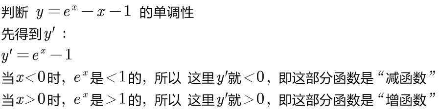

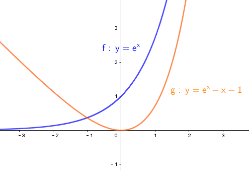
====

判断单调性, 可以从两种点入手:

1. 驻点, 即 "导数=0" 处的点.
2. "导数不存在"处的点.

.标题
====
例如：  +
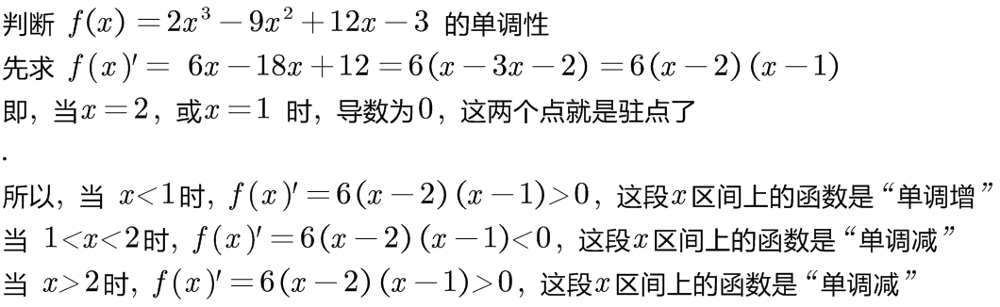

其实"驻点处"(那一个点处)的函数图像, 属于"增函数"还是"减函数"部分, 随你来定. 比如, 本例, 我们就可以写成: +
当 1 ≤ x ≤ 2 时, 函数为"单调减".

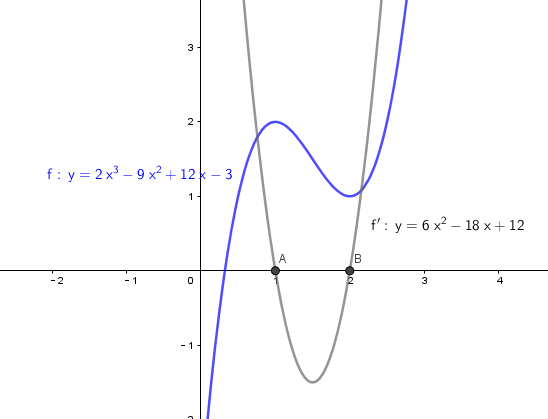
====

.标题
====
例如： +
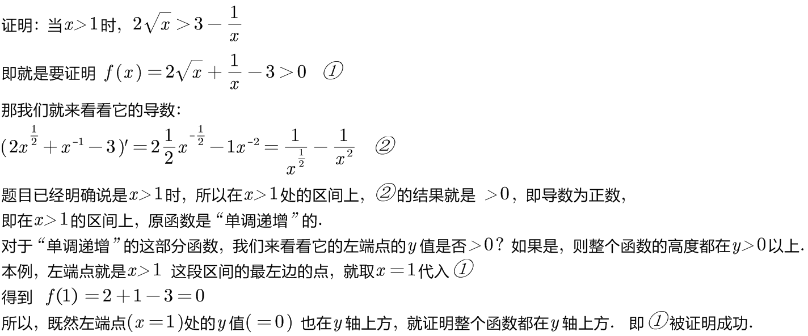

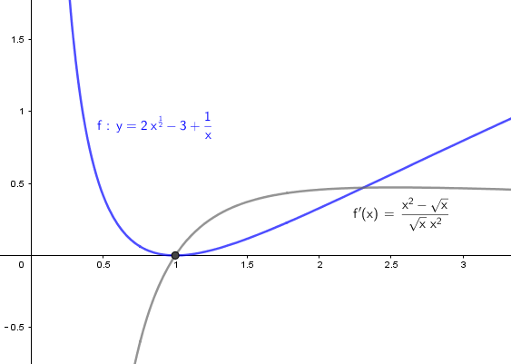
====

---

== 函数画图

对一个函数, 我们要大体画出它的图像, 可以按以下步骤来做:

[options="autowidth" cols="1a,1a"]
|===
|Header 1 |Header 2

|确定出"

- 定义域
- 值域
- 奇偶性(重要)
- 周期性(具有周期性的函数较少, 主要就是三角函数)
|

|- 求出一阶导数 stem:[ f'(x)]
- 找出stem:[ f'(x)=0] 的 x点, 即"驻点".
- 找出"极值"和"最值"
- 求出二阶导数 stem:[ f''(x)]
- 找出stem:[ f''(x)=0] 的x点
|- stem:[ f'(x) =0] 处的x点, 就是函数曲线的"驻点". "驻点"左右"邻域"的曲线的"导数是正是负", 就决定了函数曲线在这些区间上的"单调递增(升)"和"单调递减(降)"性, 和"极值点".
- stem:[ f''(x)=0] 处的x点, 就是函数曲线的"拐点". 拐点决定了函数的凹凸区间. "拐点"是使"切线"穿越曲线的点（即连续曲线的"凹弧"与"凸弧"的分界点）。拐点左右两侧的"领域"的曲线的二阶导数, 会变号, 即"由正变负"或"由负变正", 或"不存在"。

|- 找出 f(x)的间断点
- 找出 不存在"一阶导数" 的x点
- 找出 不存在"二阶导数" 的x点
|在"间断点"处, 函数没有意义. 比如函数 y=1/x 中，x=0 就是一个间断点。

函数的"间断点", 不存在"一阶导数"和"二阶导数" 的x点, 就会把函数的"定义域"分成几段了.

|找出"渐近线" Asymptotic line :

- 水平渐近线
- 垂直渐近线
- 斜渐近线 Oblique Asymptote

|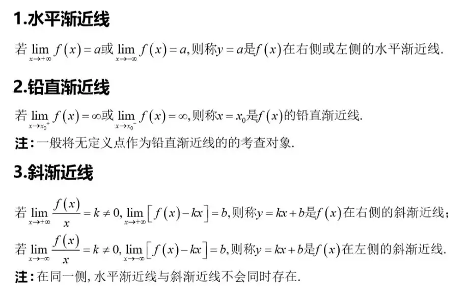

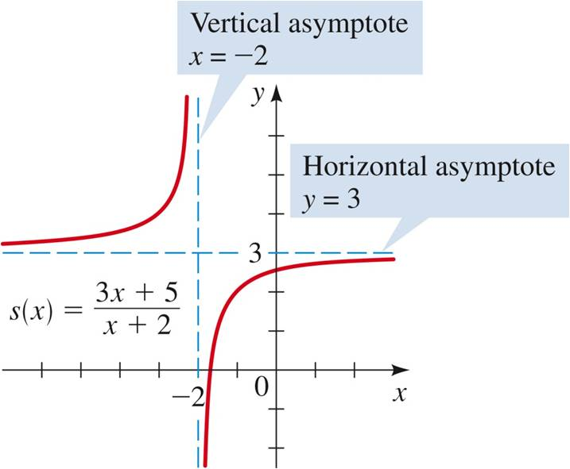

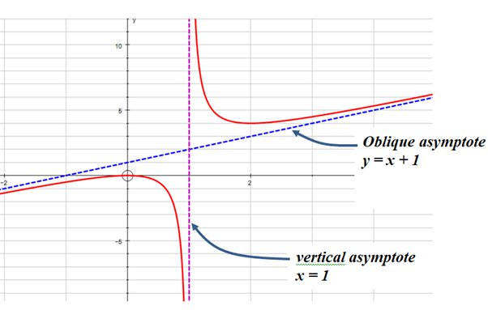

- 斜渐近线 Oblique Asymptote : 若当x趋向于无穷时，函数 stem:[ y=f(x)] 无限接近一条固定直线 stem:[ y=Ax+B]（函数y=f(x)与直线y=Ax+B的垂直距离PN无限小，且 stem:[ \lim PN=0]），当然也即 stem:[ PM=f(x)-(Ax+B)] 的极限为零，则称y=Ax+B为函数y=f(x)的斜渐近线。

|把 stem:[ f'(x)=0], stem:[ f''(x)=0] 和 x轴上无定义的点, 这些x点处的y值求出来.
|

|现在就可以画图了
|
|===

.标题
====
例如：

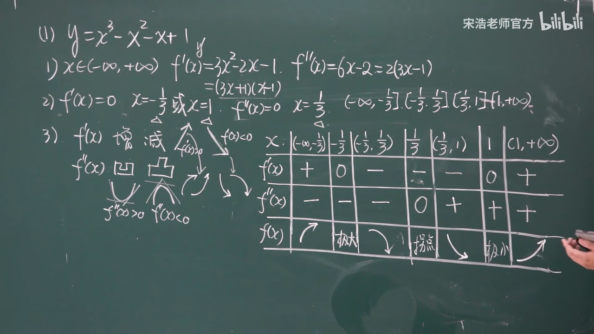

4.再找渐近线, 本例的函数为: +
x-> -∞ 时, y-> -∞ +
x-> +∞ 时, y-> +∞ +

5.再把所有"驻点"和"拐点"的y值, 求出来 +
6.求出y=0时, x的值, 即: 曲线经过x轴的何处.

7.就能画图了.

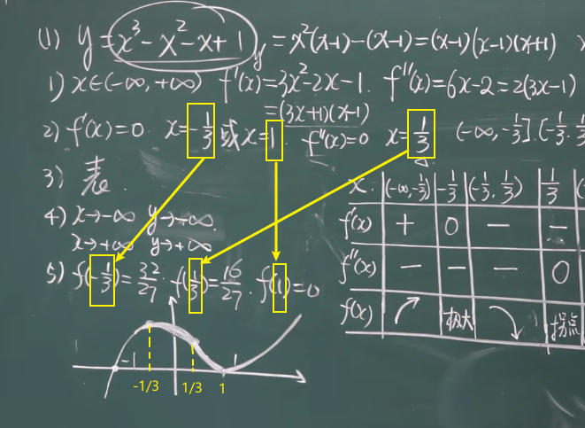

====

.标题
====
例如： +
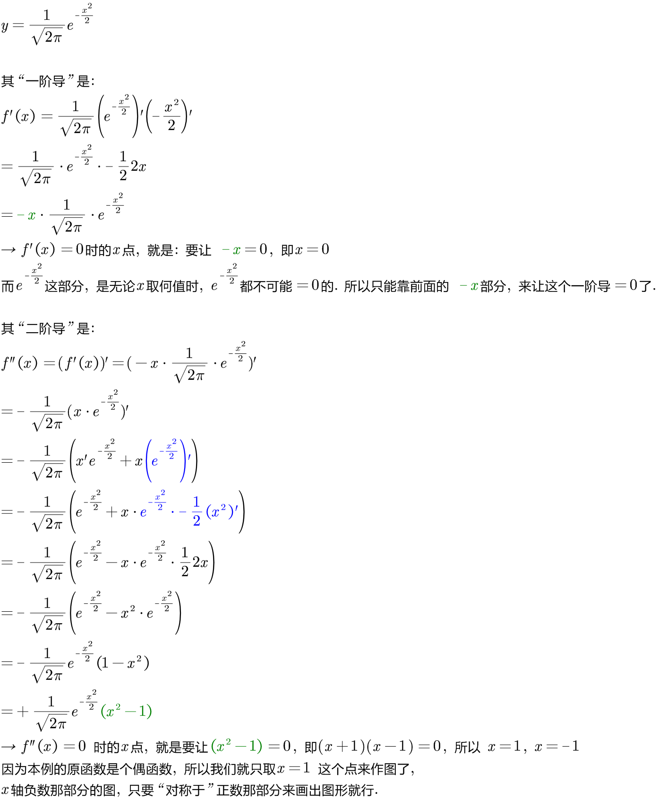

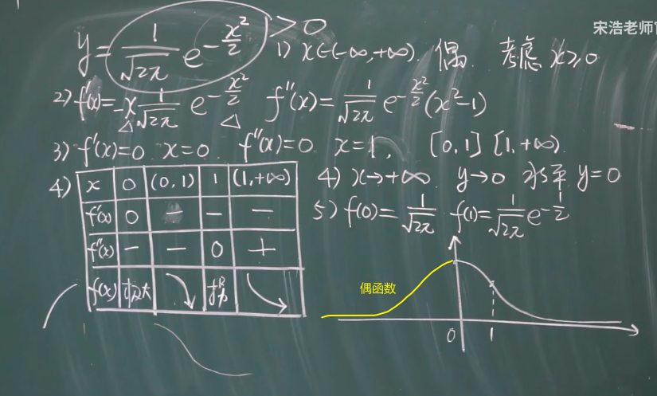
====

.标题
====
例如： +
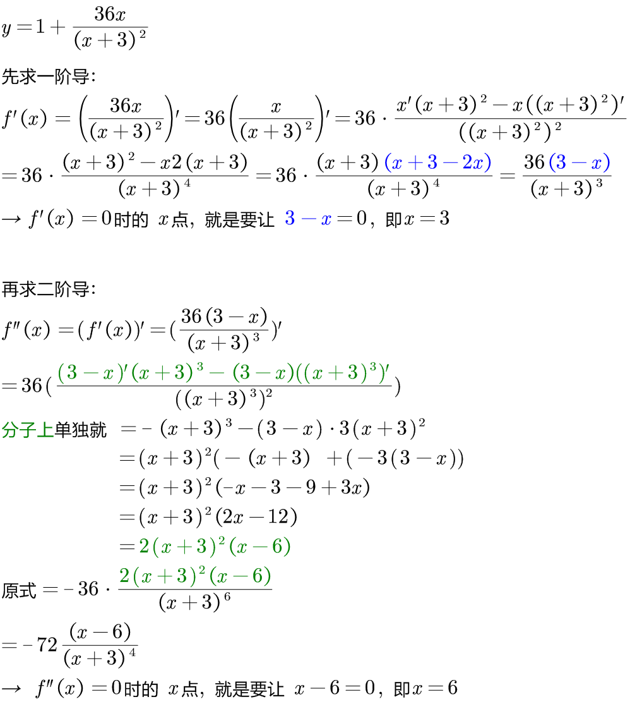

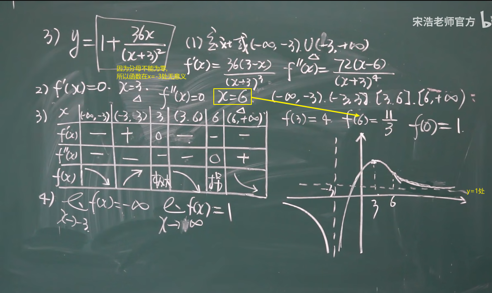

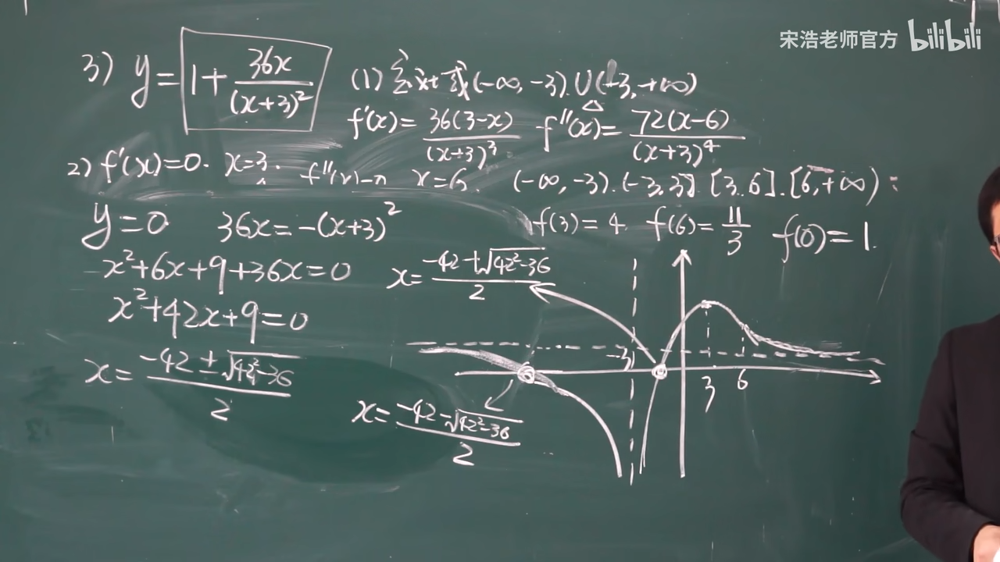

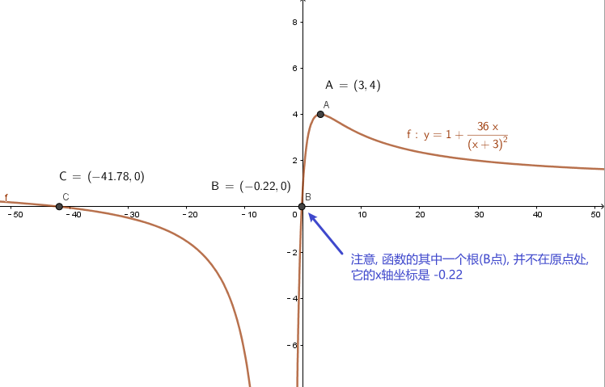
====

---
