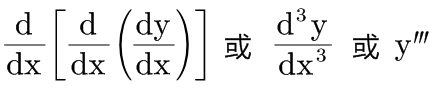
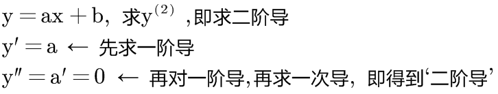
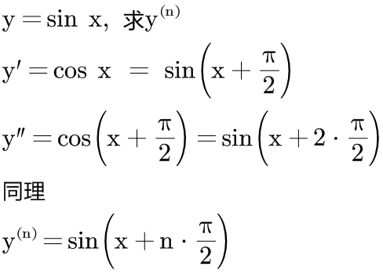
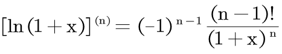

= 导数_高阶导数
:toc: left
:toclevels: 3
:sectnums:

---

== 高阶导

只求一次导数, 即"一阶导", 写作 stem:[ \frac{dy} {dx}] 或 stem:[ y']

连续求两次导数, 即"二阶导", 写作 stem:[ \frac{d(\frac{dy} {dx})} {dx} 或  \frac{d} {dx} (\frac{dy} {dx}) 或 \frac{d^2y} {dx^2}], 或 stem:[ y''], 表示 y 对 x 求两次导数.

同理, "三阶导", 就写作: +
 +
一般都优先写前一种形式. 为什么很少用  stem:[ y'''] 呢? 因为后者看不出"到底是对谁求导". 不是所有的求导都是对x求导的.

从"四阶"以上的导数, 就只写成类似这样的形式了: stem:[ y^{(4)}] +
n阶导数, 就是 stem:[ y^{(n)}]

.标题
====
例如： +
 +
====

.标题
====
例如： +
 +
====

---

== n阶导 的通用公式

=== stem:[ (Cf)^{(n)}= C f^{(n)}]

---

=== stem:[ (x^a)^{(n)}= a(a-1)(a-2) ... (a-n+1)x^{a-n} ]

---

=== stem:[ (a^x)^{(n)}= a^x (\ln a)^n ]

---

=== stem:[ (\log_a x)^{(n)} = \frac{(-1)^{n-1} (n-1)!} {x^n \ln a}]

---

=== stem:[ (e^x)^{(n)}= e^x ]

---

=== stem:[ (ln x)^{(n)}= (-1)^{n-1} (n-1)! x^{-n}]

.标题
====
例如：

====

---

=== stem:[ (a \pm b)^{(n)} = a^{(n)} \pm b^{(n)}]

---

=== stem:[ (ab)^{(n)}= \sum_{k=0}^{n} C_n^k a^{(n-k)} b^{(k)}]

高阶导数的莱布尼茨公式： +

初等数学中与之相对应的二项式定理： +

---

=== stem:[ (\sin x)^{(n)}= \sin (x + n \cdot \frac{\pi} {2})]

=== stem:[ (\sin (kx +a))^{(n)}= k^n \sin ((kx+a) + n \cdot \frac{\pi} {2})]

---

=== stem:[ (\cos x)^{(n)}= \cos (x + n \cdot \frac{\pi} {2})]

=== stem:[ (\cos (kx +a))^{(n)}= k^n \cos ((kx+a) + n \cdot \frac{\pi} {2})]

---

