= 微分
:toc: left
:toclevels: 3
:sectnums:

---

== 微分的概念

=== 解释1

在实际应用中, 会遇到很多复杂的函数，我们甚至很难找到它们的表达式，但是它们往往在一个很小的范围内可以用一类很简单的函数近似。例如, 当正数 a 充分小时, 有 stem:[ (1+a)^n ≈ 1+na]，就是把函数 f 在 a=0 附近, 近似为 stem:[ \hat{f}(a)=1+na]. 这就是"微分"的基本思想。

设函数 f 在 x 的某一邻域上有定义，且存在线性函数 l 使得 stem:[f(x+Δx)=f(x)+l(Δx)+o(Δx)(Δx→0)], 则称 f 在 x 处可微。

---

===  解释2

我们可能想去求曲线的长度、曲面梯形的面积. 求解思路是这样的 : 以求曲线长度为例，将曲线分为多个部分，每一部分都用切线来近似曲线：

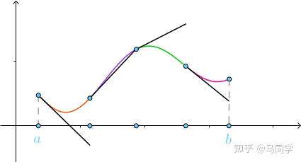

划分的越细，直到划分为无穷多份，最终这些切线的长度加起来, 就是曲线的长度.

求曲边梯形面积也是类似的，用小矩形来近似曲边梯形的面积，随着小矩形的增多最终得到曲边梯形的面积：

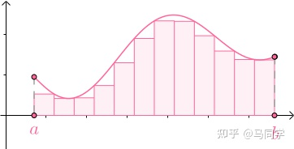

假设有曲线f(x) 和直线g(x) ，很显然, 在整个曲线和直线上, 它们是做不到的相等的(即做不到图形拟合)，但肯定可以做到在某点上相等，比如让它们在 stem:[x_0] 点处相等，从几何上看就是曲线f(x) 和直线g(x) 在x0 点相交：

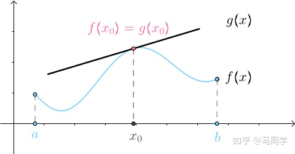

在 stem:[ (x_0−Δx, x_0+Δx)] 的区间内，曲线f(x) 和直线g(x) 相差很小：

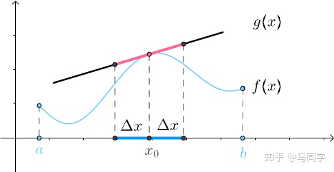

这点如果可以做到，那就可以按照上面说的，将曲线分成n份，每份都用各自的"微分"来近似。

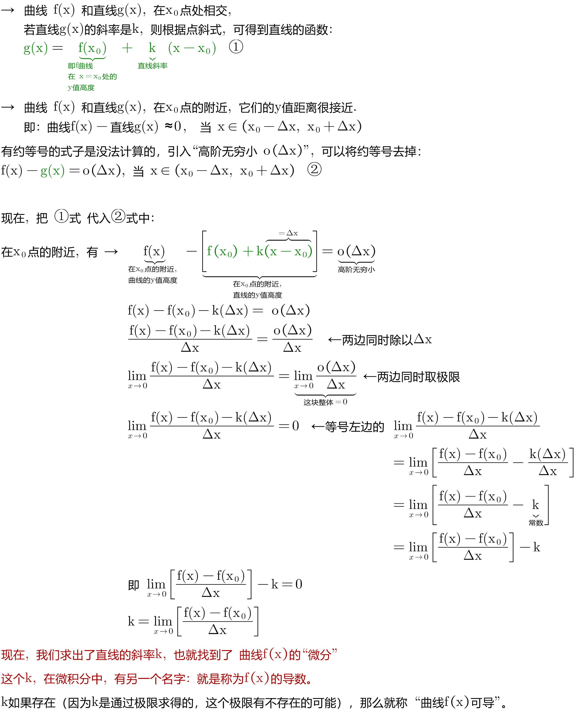

高阶无穷小 stem:[ o(Δx)], 比 Δx 更趋近于0

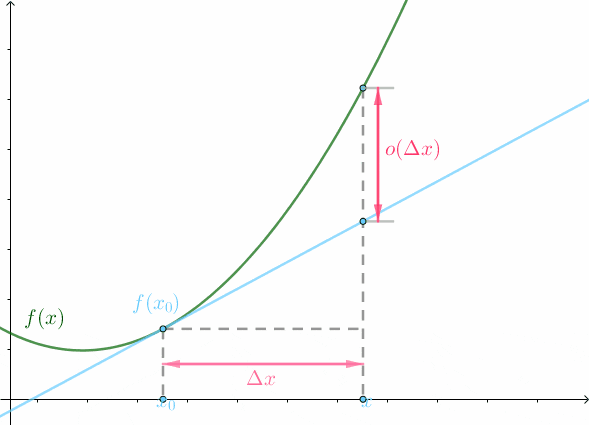

---

什么是"微分"? 简单地说，用来近似"局部曲线"的直线, 就称为微分。比如下图，若直线能近似点x0附近的曲线

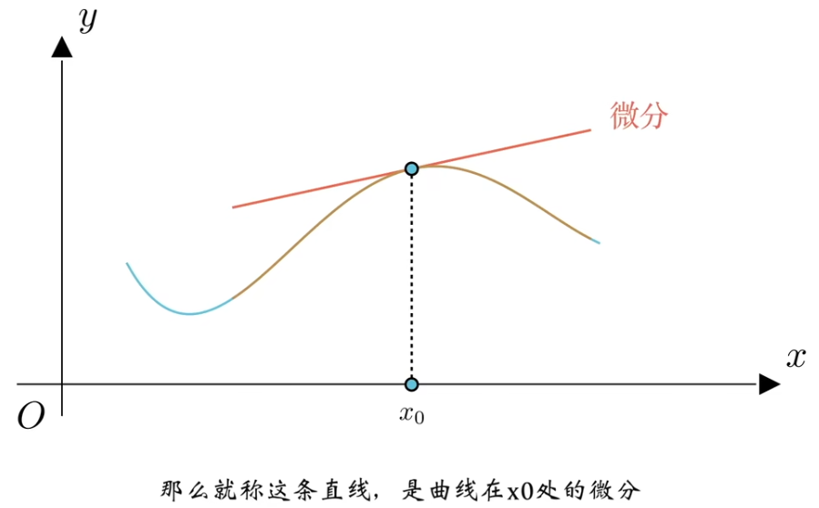

不过显然, 不可能每条直线都能用来近似曲线，它应该满足一定条件. 什么条件呢?

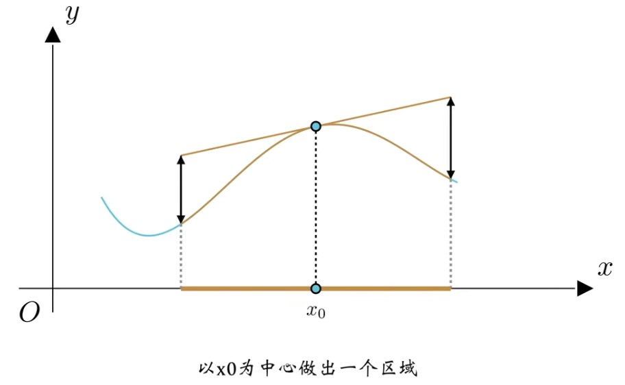

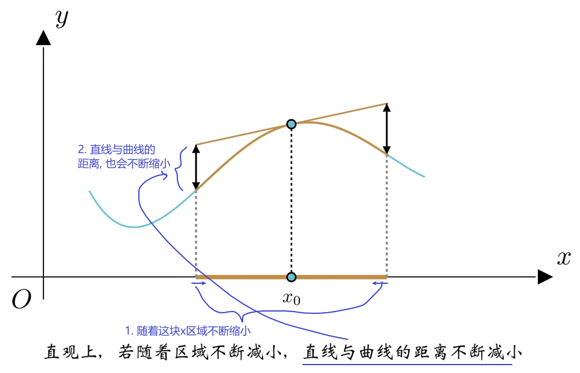

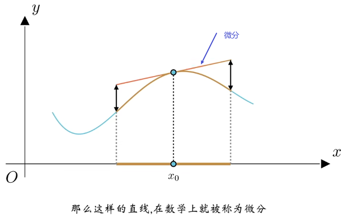

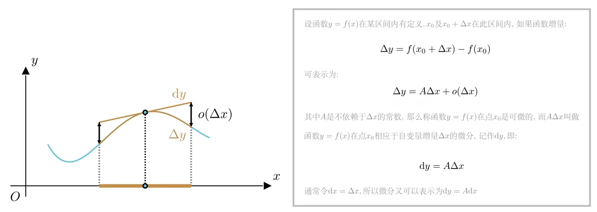

上图, 其中:

- Δy : 是 "函数曲线" 的表达式.
- dy : 是过曲线上一点的"直线"的表达式.
- Δy 表示的是: 曲线和直线的高度(y值)之间, 相差一个 o(Δx).

也就是说，*若曲线△y 与直线dy, 仅相差o(△x), 那么这里的直线dy 就是"微分". 即 stem:[ Δy - "微分直线"dy = "差值"o(Δx)]*

我们以stem:[ (x_0, f(x_0))]为原点, 建立一个新的坐标系.

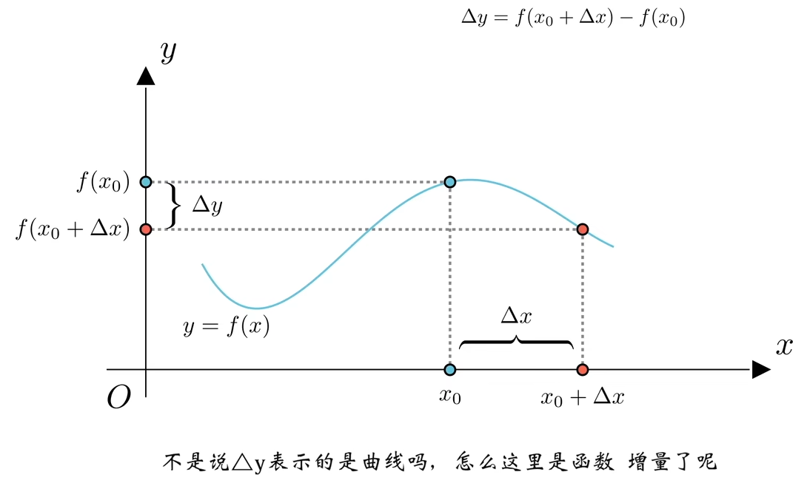

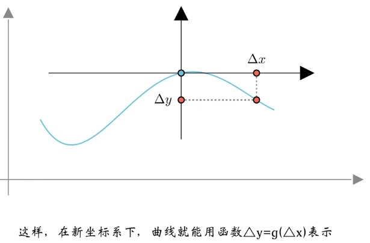

在原坐标系下, stem:[ Δy = f(x_0 + Δx)- f(x_0)] +
现在, 新坐标系下, 曲线能用函数 stem:[ Δy = g(Δx)] 来表示. 即, 也能用 stem:[ Δy = f(x_0 + Δx)- f(x_0)] 来表示.

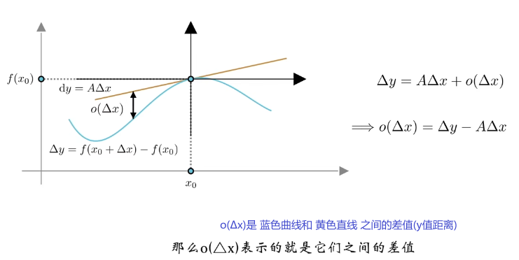

若直线(能用dy来表示), 与曲线(能用 Δy 来表示), 仅相差一个 Δx的高阶无穷小 (即 stem:[ o(Δx)]), 那么直线 stem:[ dy= AΔx], 就是曲线在 stem:[ x_0] 处的微分.

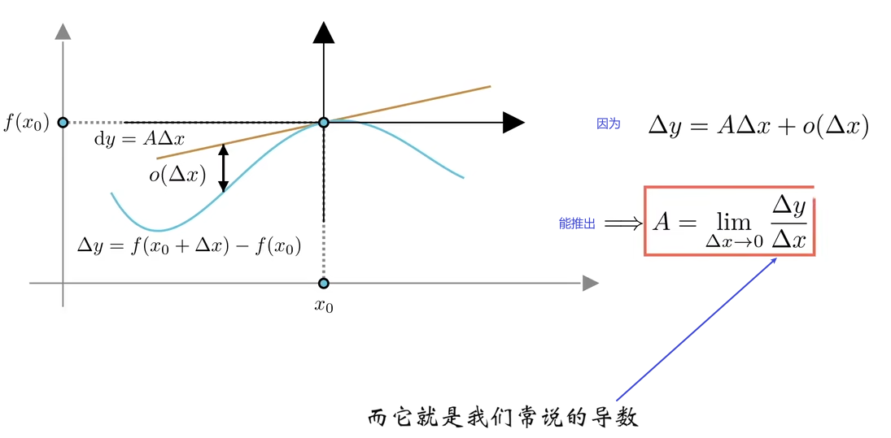

---

== 微分  Differential  ->  y的变化量的 近似值 stem:[ dy = f'(x) \cdot dx]  <- 别忘了: dx = Δx

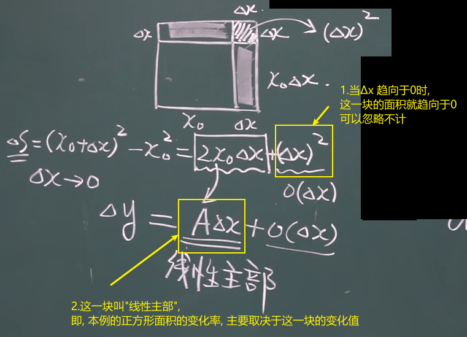

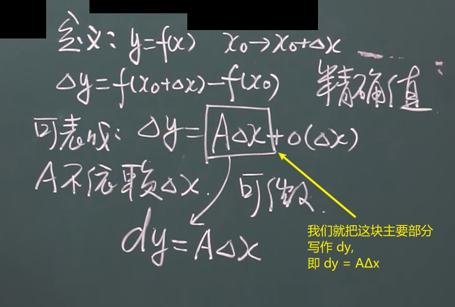

所以:

- 函数变换的"精确值"是: stem:[ Δy=AΔx + ο(Δx)] <- ο(Δx)是比 Δx 高阶的无穷小。
- 函数变换的"近似值"是: stem:[ dy=AΔx] <- 即"线性主部"部分.

A不依赖于 Δx, <- 其意思是说: A相对于Δx来说, **A可以看成是个"常数". 所以我们可以认为, Δy (此处用 dy来近似) 是关于 Δx 的"线性化函数"。 这也是微分的实质：微分 本质是一个微小的线性变化量，用一个线性函数 作为原函数变化的逼近。**

我们用"微分 Differential"的时候, 都是用的"近似值 dy"来表示函数的变化情况. 即, 用 dy(近似值) 来代替 Δy(精确值). +
另外注意: dx = Δx, 这两个不是近似关系. 就是 x的变化量.

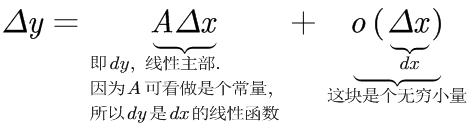

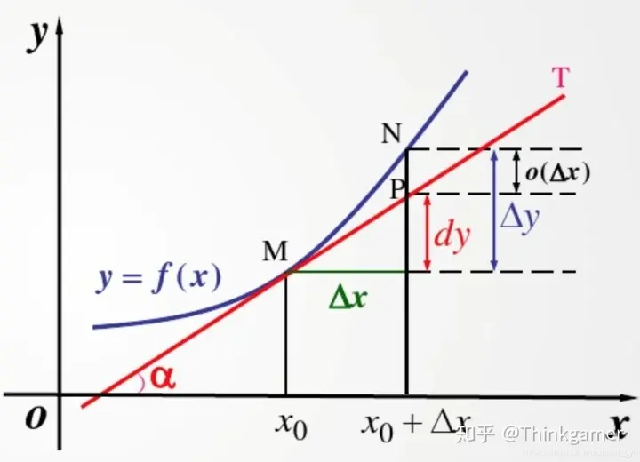

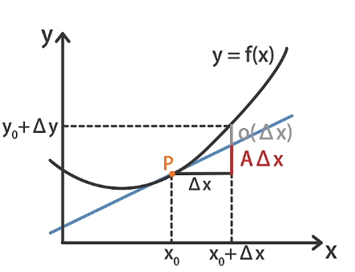

**上图**:

- **y的变化量 Δy = 红色的线段(即 stem:[ A Δx]) + 灰色的线段(即 stem:[ ο(ΔX)])**

- **点p处的导数, 就是点p处切线的斜率, 就 stem:[=\frac{A Δx} {Δx} = A], 所以A 就是点P处的导数, 即 stem:[A= f'(x_0)].**

- 灰色线段stem:[ ο(ΔX)], 是比红色线段高阶的无穷小, 即, 它是比无穷小 趋近于0的速度更快. 即, 当 Δx -> 0 时, 灰色线段,比红色线段趋近于0的速度更快. 所以灰色线段这部分, 可以忽略不计. +
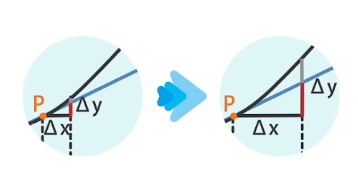

这时, **我们将 Δx, 称作自变量的"微分", 记作 dx.** +
**将 stem:[ A Δx], 称作** 函数在stem:[ x_0]处相对于"自变量增量Δx"的微分, 也就是**函数值的微分, 记作 dy.**

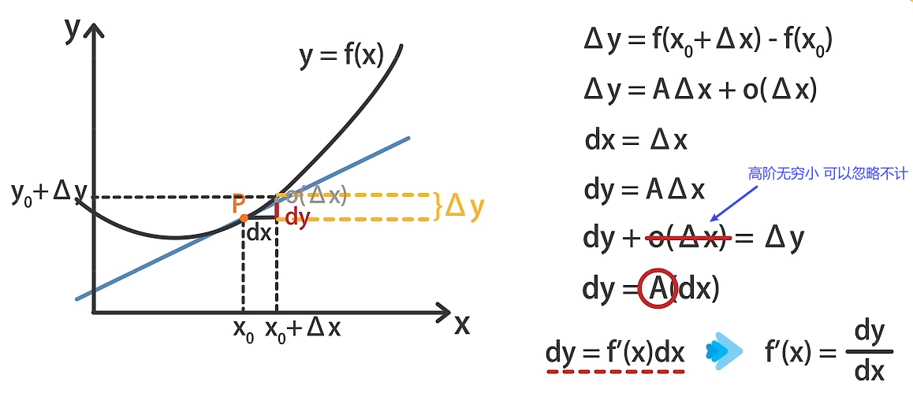

从微分的定义中, 也可以看出"微分"和"导数"的最大区别为：

- 导数: 是指函数在某一点"变化的快慢"，是一种"变化率".
- 微分: 是指函数在某一点处的"变化量"，是一种"变化的量". 即, **"微分"是一种对"局部变化量"的线性描述.**

---

可微 differentiability

若函数 y= f(x) 有 stem:[ Δy=AΔx + ο(Δx)],  则称:

- 函数 f(x)在点 x处 "可微".
- 并称 stem:[ AΔx] 为函数 f(x) 在点 x 的"微分"(即"线性主部")，记作 dy. 即: stem:[ dy=AΔx]

"可微"的充分必要条件, 就是"可导". 即: 可微必可导, 可导必可微.

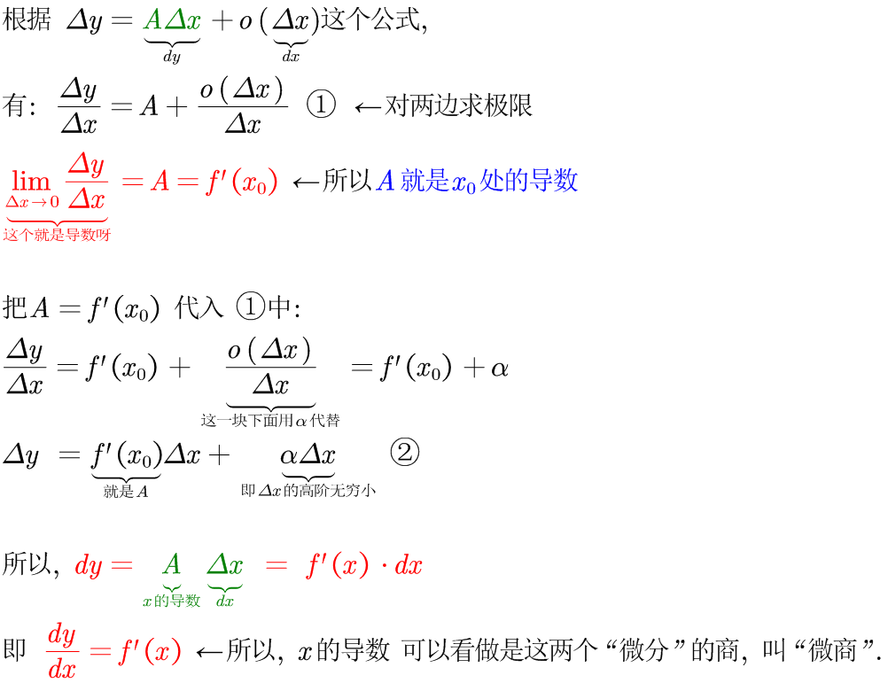

即有:
\begin{align}
\boxed{
dy = f'(x) \cdot dx
}
\end{align}

.标题
====
例如： +
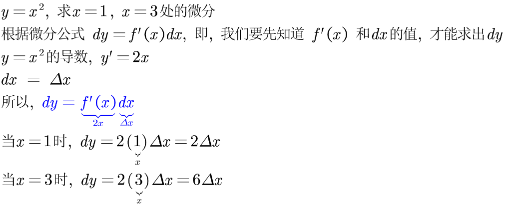
====

.标题
====
例如： +
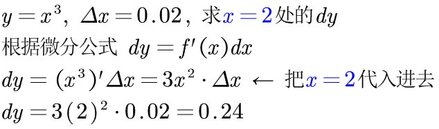
====

---

== 基本微分公式与法则

基本微分公式的核心, 依然是基于这个公式 stem:[ dy = f'(x) dx]

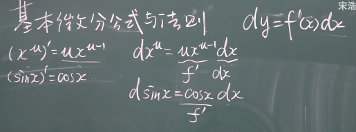

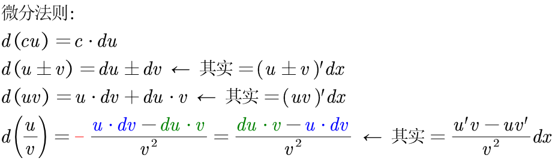

---

== 复合函数的微分 -> f(g(x))的微分dy = f对g求导 * g对x求导 * dx

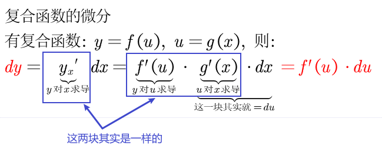

.标题
====
例如： +
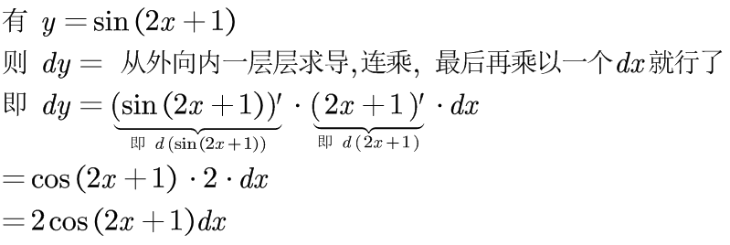
====

.标题
====
例如： +
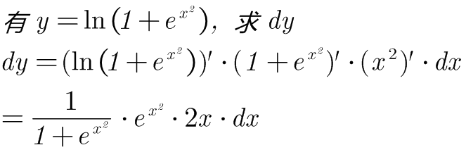
====

---

== 微分的几何意义 -> 某x点处的微分dy = 该点处的切线的斜率(即导数) * Δx

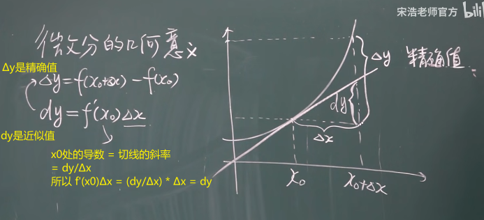

---

== 微分在"近似计算"中的运用 -> 变化后的y总长值, 即 stem:[ f(x_0 + Δx) = f(x_0) + Δy ≈ f(x_0) +dy  =  f(x_0)  + f'(x_0) \cdot Δx]

- y的变化量的 "精确值"是 stem:[Δy = f(x_0 + Δx) - f(x_0)]
- y的变化量的 "近似值"是 stem:[dy = f'(x_0) \cdot Δx]
- 即, dy ≈ Δy, 所以, 变化后的y总长值, 即 stem:[ f(x_0 + Δx) ≈ f(x_0) +dy  =  f(x_0)  + f'(x_0) \cdot Δx]

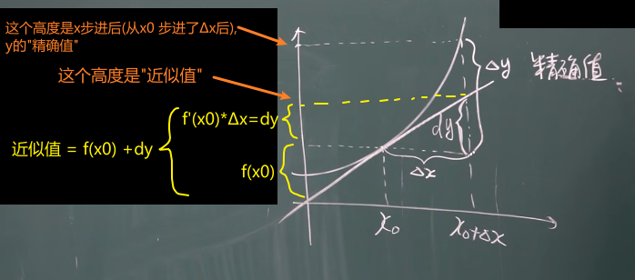

.标题
====
例如： +
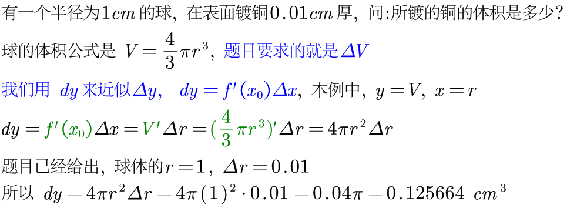
====

.标题
====
例如： +
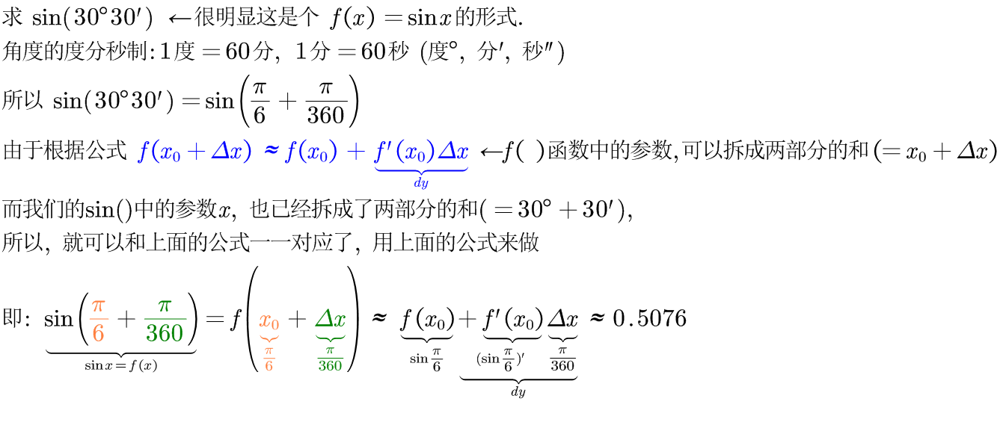

但注意, 使用此方法时, Δx 必须越小越好!

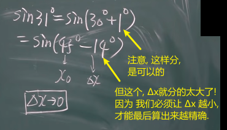
====

---

== "可以求出近似值"的公式

=== 当 x -> 0 时,  stem:[ (1+x)^α ≈ 1+ αx]

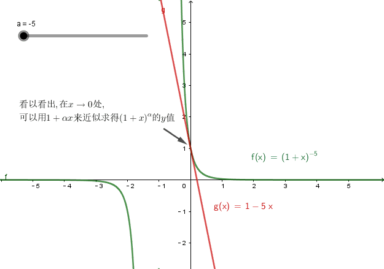

.标题
====
例如： +
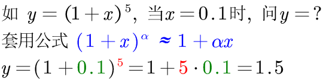
====

.标题
====
例如： +
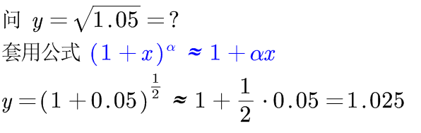
====

---

===  当 x -> 0 时,  stem:[ \sin x ≈ x]

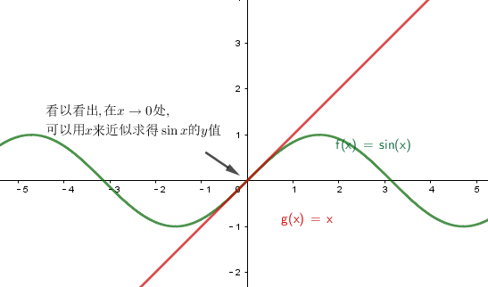

---

===  当 x -> 0 时,  stem:[ \tan x ≈ x]

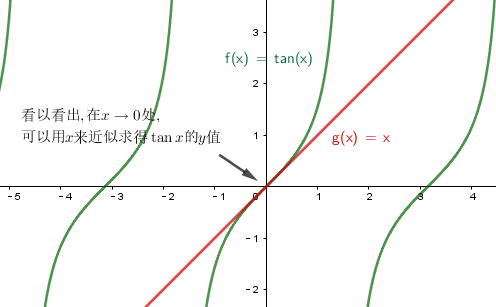

---

===  当 x -> 0 时,  stem:[ e^x ≈ 1+x]

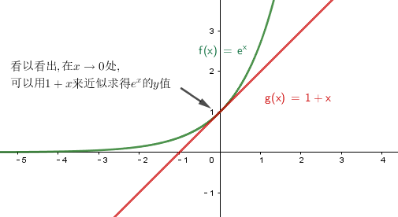

---

===  当 x -> 0 时,  stem:[ ln(1+x) ≈ x]

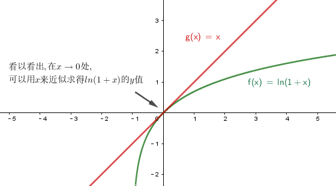

上面这些快捷计算公式, 其意义就是: 能帮助我们用(等号右边的) x 的多项式, 来近似计算(等号左边的)复杂的函数.

---

