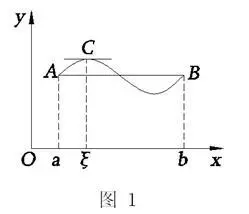
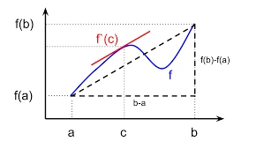
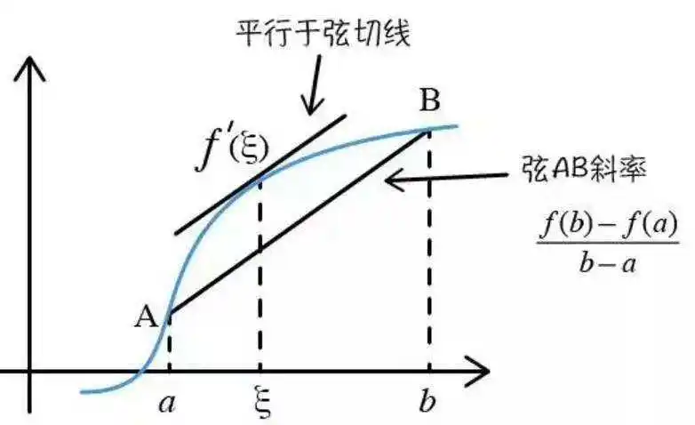
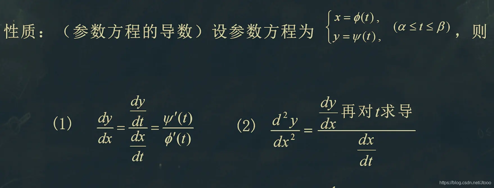
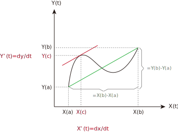
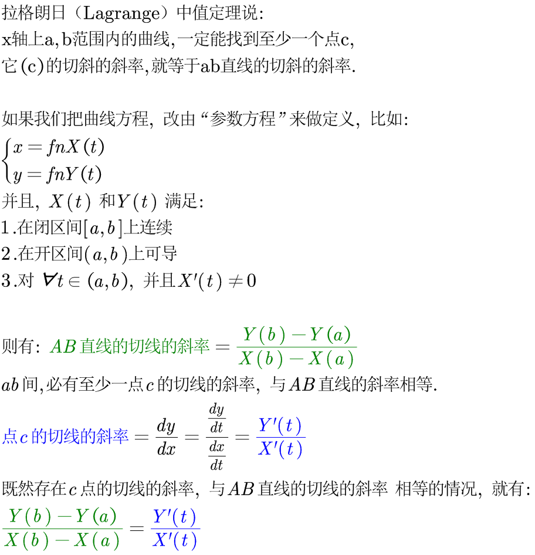

= 微分_三个中值定理
:toc: left
:toclevels: 3
:sectnums:

---

"导数=0" 的点, 就叫"驻点" 或 "临界点".

微分学中, 有三个"中值定理" :

- 罗尔（Rolle）中值定理
- 拉格朗日（Lagrange）中值定理
- 柯西（Cauchy）中值定理

== 罗尔中值定理 Rolle's theorem  -> x轴上, 如果 a,b 两点的高度相同(即y值相同), 则 a,b范围内, 必能找到至少一个点c, 它(c)的切线的斜率=0, 即是水平的切线.

Rolle 中值定理是说:  如果 R 上的函数 f(x) , 满足以下3个条件：

1.在闭区间 [a,b] 上连续 (连续, 就是必须一笔画出) +
2.在开区间 (a,b) 内可导 (可导, 就是曲线必须光滑, 不能有锐角) +
3. a,b点处的 y 值相等, 即 f(a)=f(b)

则有: 在 x轴上至少会存在一个点 ξ, 它∈(a,b)，并且它的y值, 即 f'(ξ)=0 <- 它的导数为0, 就是它切线的斜率=0, 是水平的切线

---

== 拉格朗日（Lagrange）中值定理 Lagrange mean value theorem -> x轴上 a,b范围内的曲线, 一定能找到至少一个点c, 它(c)的切斜的斜率, 就等于 ab直线的切斜的斜率.

"拉格朗日（Lagrange）中值定理", 只不过是"罗尔（Rolle）中值定理"的一种特殊形式而已.

该定理是说, 如果函数f(x)满足: +
1.在闭区间[a,b]上连续 +
2.在开区间(a,b)上可导 +
那么: 在x轴上的开区间(a,b)内, 至少存在一点c, 它的导数, 即 stem:[f'(c)= \frac{f(b)-f(a)} {b-a} ], <- 也就是说, 在 a-b 的范围内, 一定会存在至少一个点(如点c), 它的切斜的斜率, 和 ab直线的切斜的斜率, 完全相等.  +
它反映了可导函数 在闭区间上的"整体的平均变化率", 与区间内"某点的局部变化率"的关系。

---

== 柯西（Cauchy）中值定理 Cauchy mean value theorem -> 在x轴的 ab 区间中, 存在某点c, 它的切线的斜率 stem:[ \frac{Y'(c)} {X'(c)}] = AB直线的切线的斜率

柯西中值定理, 是把拉格朗日（Lagrange）中值定理中的曲线方程, 改成了"参数方程"的形式来做了. +
换言之, 柯西中值定理, 可看作是"拉格朗日中值定理"的推广。

首先, "参数方程"的求导公式为:

下面就是"柯西中值定理"的具体内容:

---

