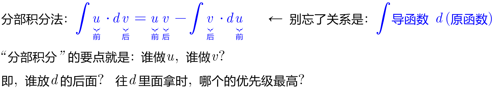
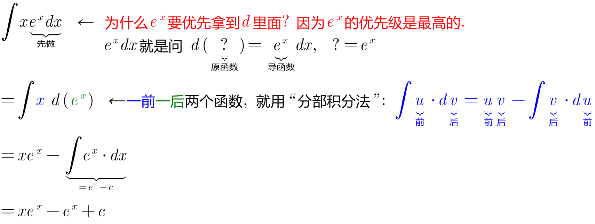
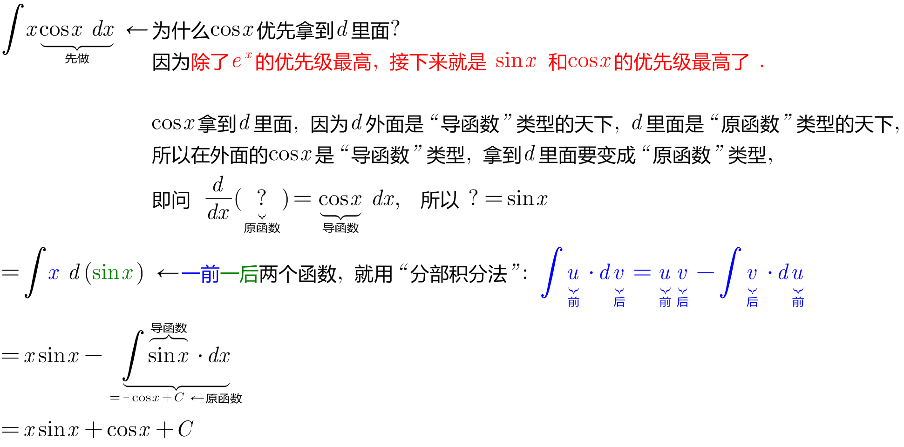
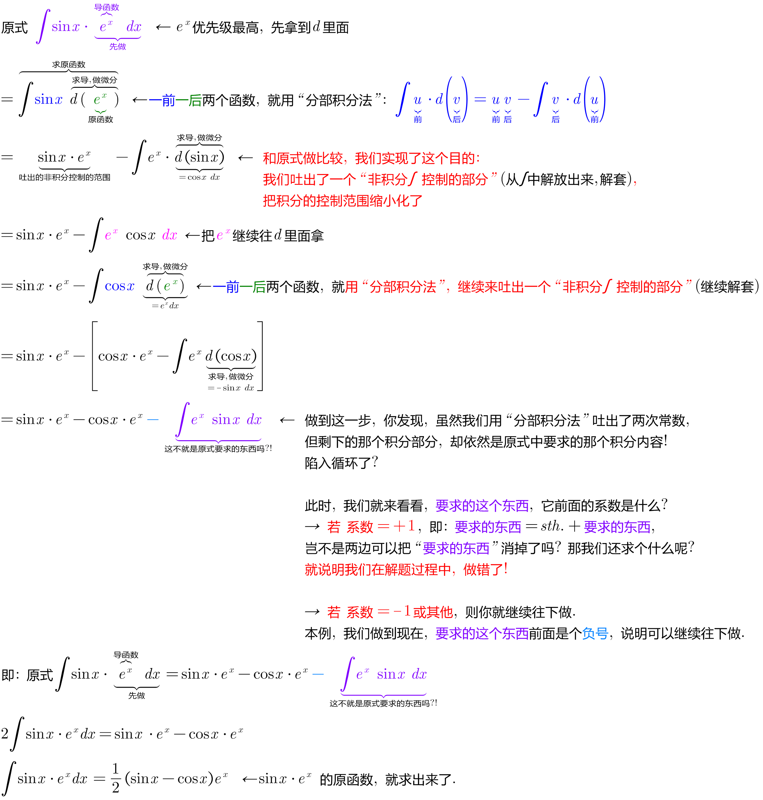
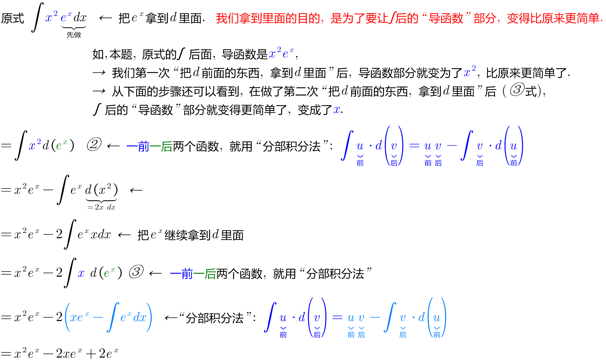
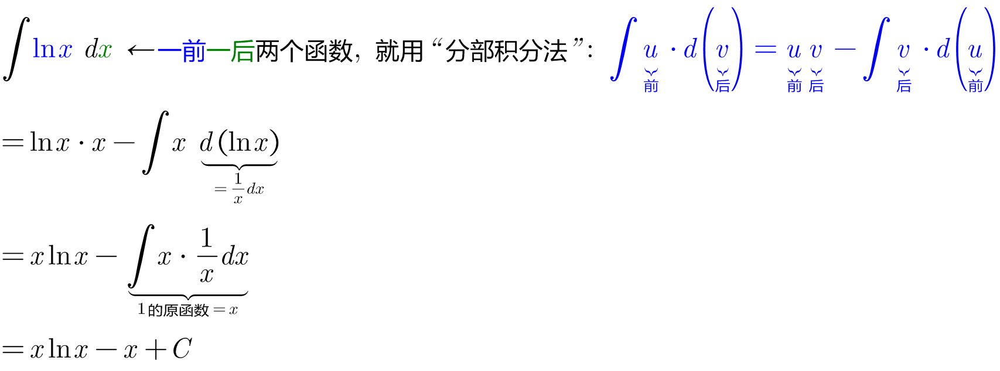

= 分部积分法 Integration by parts
:toc: left
:toclevels: 3
:sectnums:

---

== 分部积分法 Integration by parts -> 公式: stem:[ \int u \cdot dv = uv - \int v \cdot du]

.标题
====
例如： +

====

.标题
====
例如： +

====

实际解题中, 过程中往往至少会用到两次以上的"分部积分法", 很少有题目只用一次"分部积分法"就能做出来的.

.标题
====
例如： +

====

.标题
====
例如： +

====

.标题
====
例如： +

====

https://www.bilibili.com/video/BV1Eb411u7Fw?p=47&vd_source=52c6cb2c1143f8e222795afbab2ab1b5

37.51
