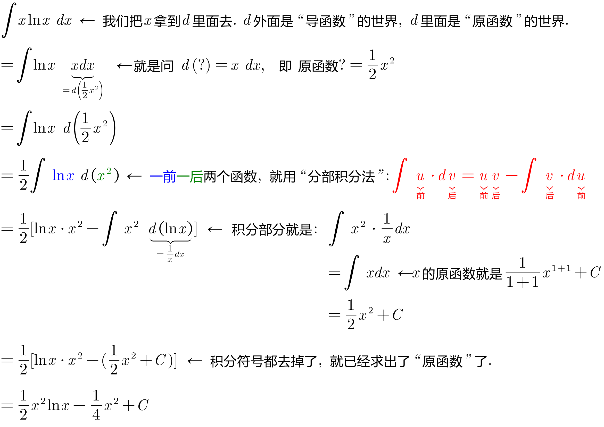
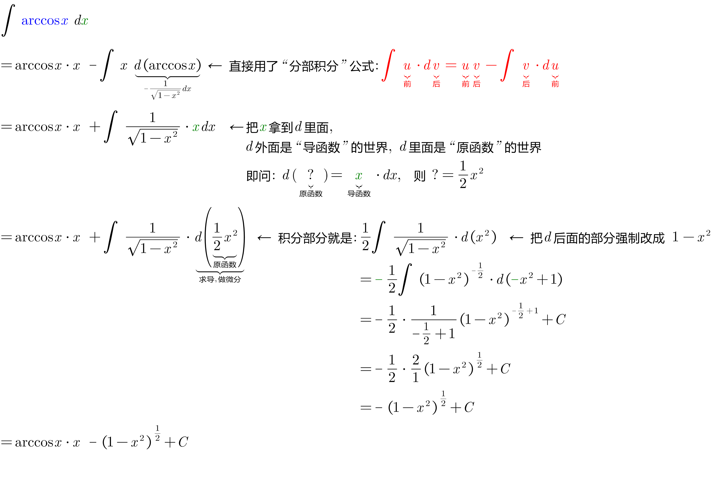
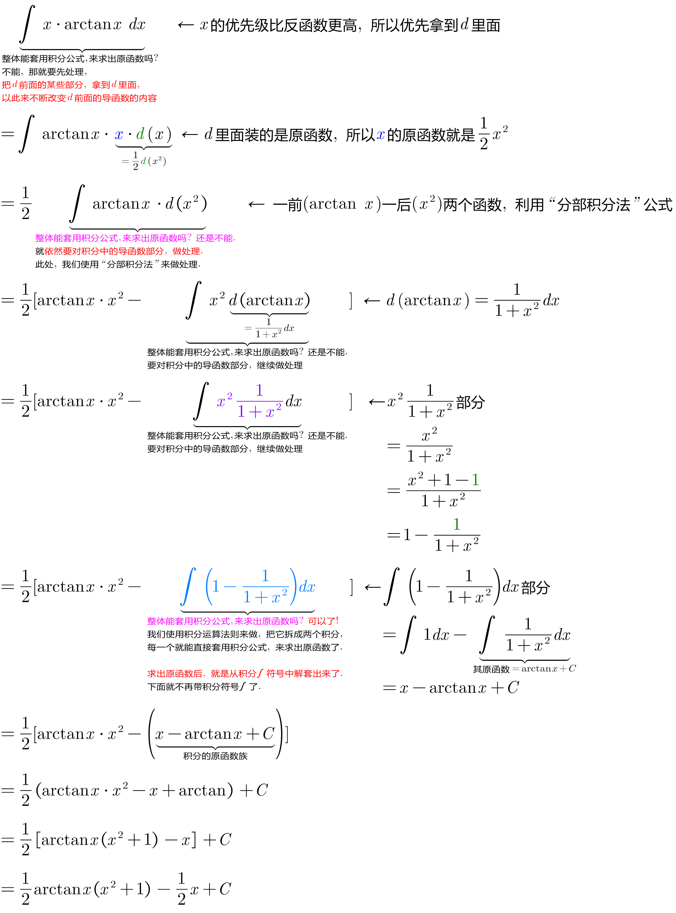
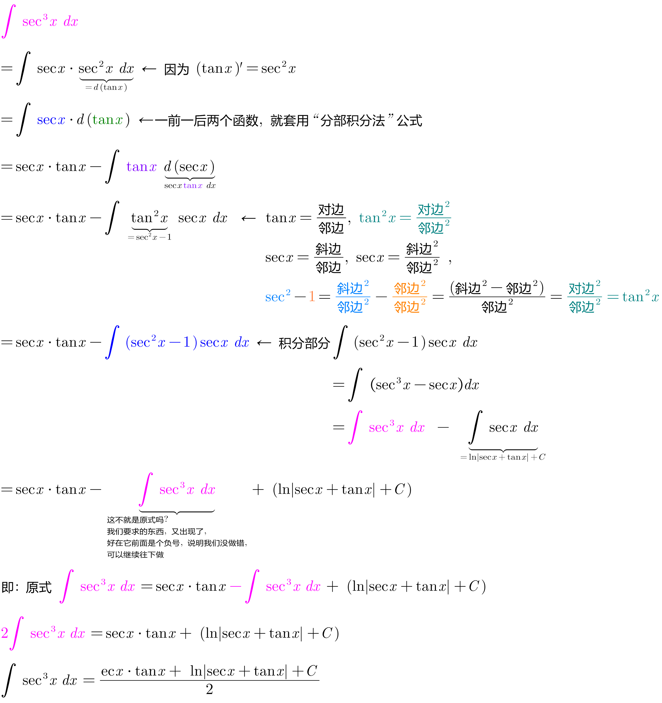
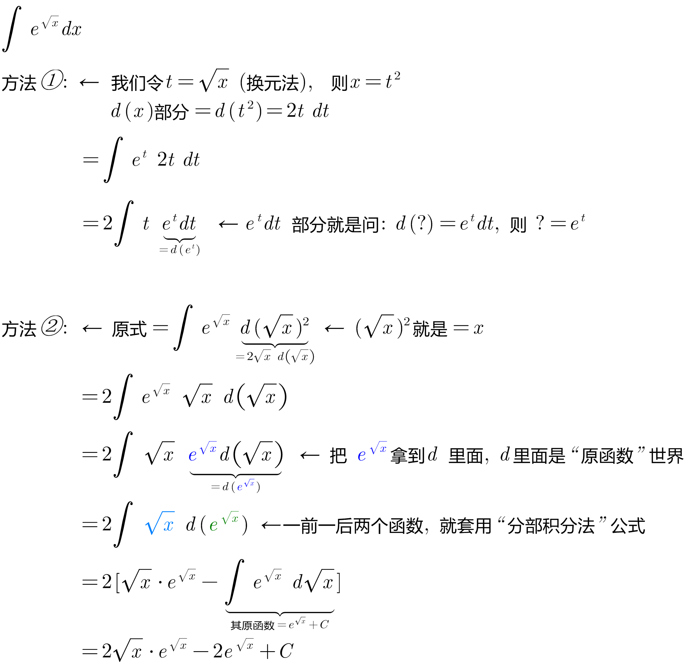

= 分部积分法 Integration by parts
:toc: left
:toclevels: 3
:sectnums:

---

== 分部积分法 Integration by parts -> 公式: stem:[ \int u \cdot dv = uv - \int v \cdot du]

"分部积分法"的目的, 是将不易直接求结果的"积分形式"，转化为等价的容易求出结果的"积分形式"的。

image:img/364.png[,550]

把前面的什么东西, 朝d里面拿? 优先级顺序是: ① stem:[e^x], ② stem:[sin x, cos x], ③stem:[x^n]

.标题
====
例如： +
image:img/365.png[,550]
====

.标题
====
例如： +
image:img/366.png[,650]
====

实际解题中, 过程中往往至少会用到两次以上的"分部积分法", 很少有题目只用一次"分部积分法"就能做出来的.

.标题
====
例如： +
image:img/367.png[,800]
====

.标题
====
例如： +
image:img/368.png[,750]
====

.标题
====
例如： +
image:img/369.png[,570]
====

.标题
====
例如： +

====

.标题
====
例如： +

====

.标题
====
例如： +

====

.标题
====
例如： +

====

.标题
====
例如： +

====

---

