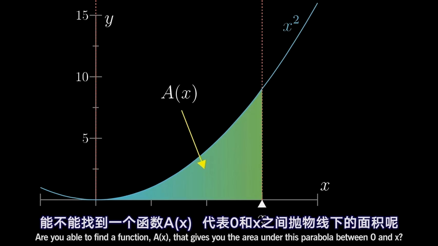
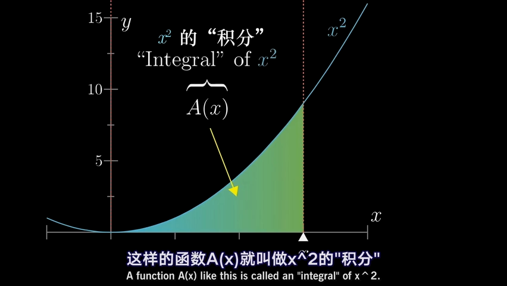
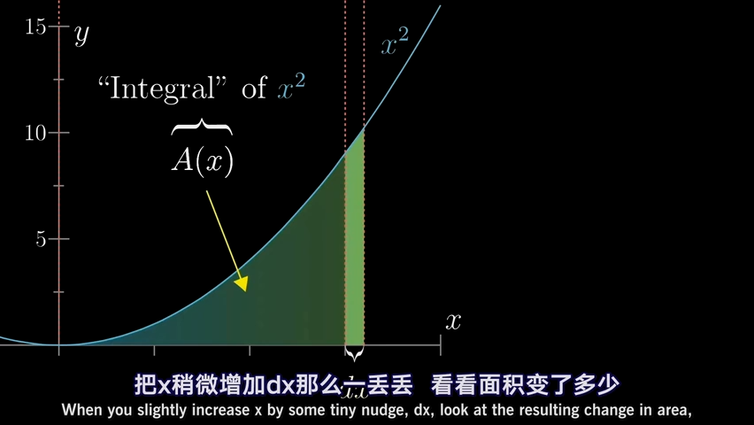
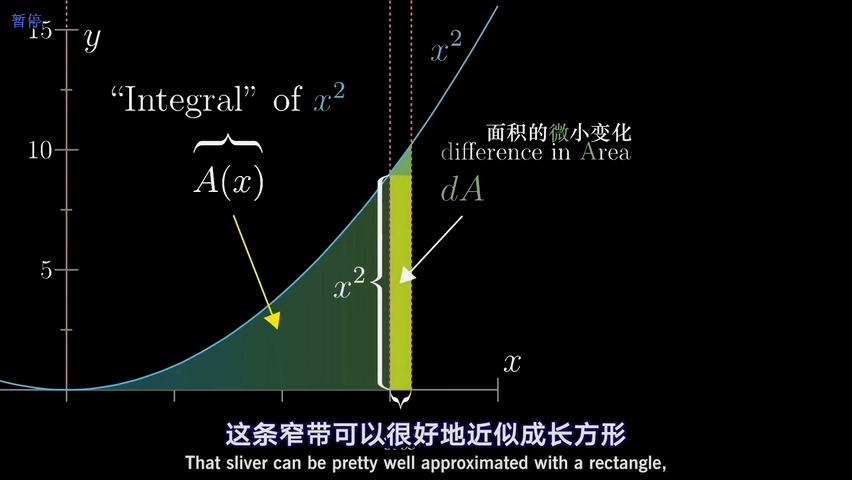
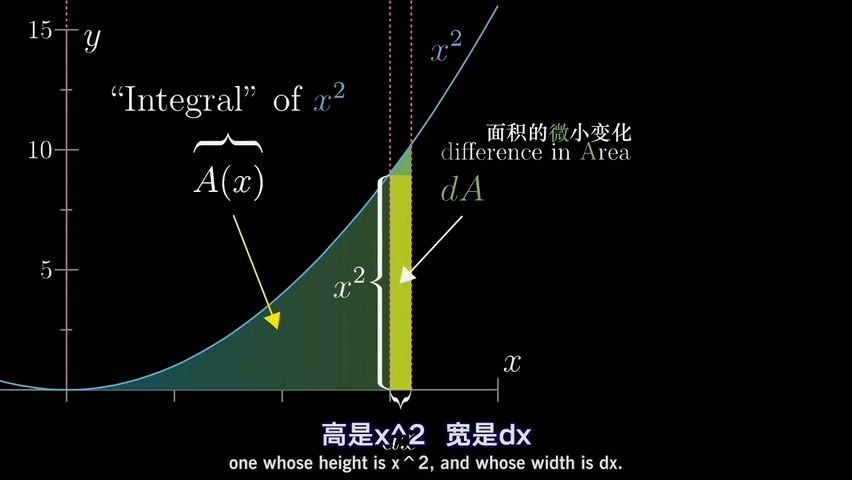
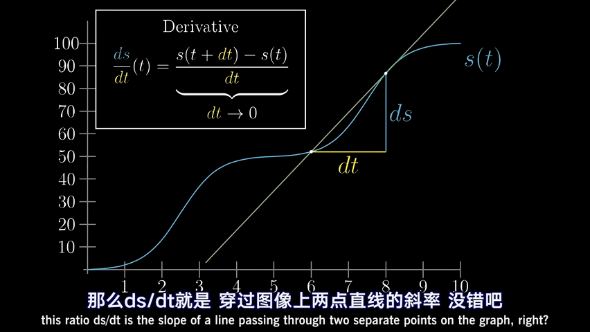
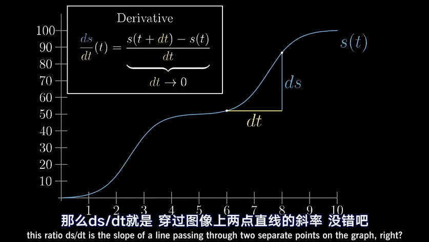
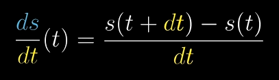
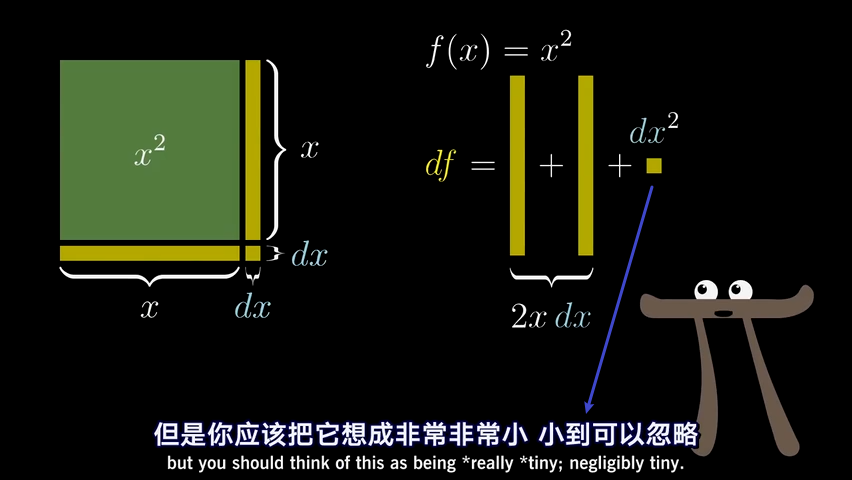
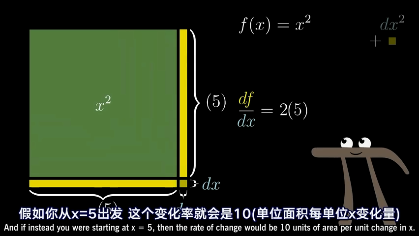

= 积分的几何意义
:toc: left
:toclevels: 3
:sectnums:

---

== 积分的几何意义

上图的例子中, 积分函数, 就是代表stem:[x^2] 的图像下面, 从某个固定的左端点, 到某个变动的右端点之间的面积.

积分很有用, 是因为很多生活中实际的问题, 都能近似成"大量很小的东西加起来", 而这样的问题都能转化成求某图像下的面积. 所以, 我们要找的, 就是这个能表示面积的"积分函数".

我们先要考虑, 某个函数图像, 比如stem:[x^2], 和面积(面积函数)之间, 会有着怎样的关系? 即, 先把x增加一点点, 看看面积变了多少? 我们把增加的这一小部分面积, 称作 dY 或 dA (即 different in area) 面积的微小变化.

面积的微小变化, 约等于上图的浅绿色长条(长方形), 其高度就是函数的y值, 即 stem:[y= x^2], 宽度就是 dx, 即Δx.  +
即:
\begin{align*}
& 面积的微小变化量 dA (即dY) ≈ x^2 \cdot dx = 曲线的函数体 \cdot Δx \\
& 经过变形, 就得到: x^2(即曲线函数的y值, 即f(x)) ≈ \frac{dA(即dy)} {dx(即Δx)}  \\
& ← 即, Δx趋向于无穷小时, 这个长方体的值, 就几乎等于 y值高度本身. \\
\end{align*}

---

== 导数的几何意义

=== 求导(即求切线的斜率), 并不是求的"某一点"瞬时的变化率, 而是求的"某一点附近(即 Δx -> 0 这段微小距离)"的变化率.

导数, 衡量的是函数(即y值) 对取值(即Δx)的微小变化, 有多敏感(y值会怎样变动). 即切线的斜率.

**当运动完全被凝固在某一个时间点, 变成切片时, 飞矢不动, 是不存在什么"瞬时变化率"的. 也不存在该点的切线公式, 因为此时的 dx完全=0, 而切线公式 dy/dx, 分母dx是不能为0的!  所以, 真正的导数(切线的斜率), 依然要求一个极其微小的 Δx 存在. 只不过这个 Δx, 是个不断趋近于0的极小值而已, 即 该Δx的极限值是0, 但它永远到不了0. **

即, **这个dt(=Δx) 永远都是一个有限小的量, 非0, 但永远在接近于0. 所以dt不是一个有着确定数值的值, 它是一个变量! dt is not "infinitely small". **

即: 导数 stem:[\frac{dy} {dx}] 并不是 dx为某个具体指时的 dy 和 dx 的比值, 而是dx这段微小距离无限趋近于0时, 这个比值的极限.

当两点越来越靠近时, (即 Δx → 0) 时, 过这两点的直线的斜率, 也就越来越变成在某一x点时的 该点切线的斜率. 这就是"导数".  +
所以, 求导(即求切线的斜率), 并不是求的"某一点"瞬时的变化率, 而是求的"某一点附近(即 Δx -> 0 这段微小距离)"的变化率.

*在微积分的传统中, 其实你只需写一个 d, 就表示了你相求 当dx -> 0 时, 会发生些什么.* You're gonna see what happens at approaches 0. 如: 指数函数 stem:[x^n] 的导数是:  stem:[\frac{d(x^n)} {dx} = n x^{n-1}]

比如, 我们对 函数 s(t) 求导, 就写作 stem:[\frac{ds} {dt}]

*但记住: 我们求的导数,本质上并不是一个分数, 而是求当 Δx 的变化量越来越小时, 这个分数(比值)的极限. 这就是"导数"和"传统切线"的精确区别了.*

---

=== dy

根据上图也可以知道, 当 dx->0 时, 那个小正方形 stem:[(dx)^2] 就更加是一个微小到可以忽略的变化量. 比如, 当 dx 取0.01时, dx的平方就是0.0001了, 可以被忽略不计了.

所以上图的 大正方形的面积增加量 stem:[df = 2(x \cdot dx)], 于是, 就有 stem:[\frac{df} {dx} = 2x], 这也正是大正方形的面积公式函数 stem:[y = x^2] 的导数.

即: *对于 stem:[y = x^2] 这个函数, 其 stem:[y'= 2x]. 也就是說, x值每增加1个单位, y值就会增加2x个单位.*

比如:

- 假设这个大正方形的边长是3, 即 x=3, 从这里出发, 其边长x每增加1个单位, 面积y值就会增加2x, 即6个单位(2*3=6)
- 假设边长 x=5, 从这里出发, 边长x每增加1个单位, 面积y值就增加2x, 即2*5=6个单位.

---

=== 三种组合函数 : ①stem:[\frac{d} {dx} (\sin x + x^2) ], ② stem:[\frac{d} {dx}  (sin x \cdot x^2) ], ③ stem:[\frac{d} {dx} (\sin (x^2)) ]

有三种"组合函数"的基本方法, 就是:

1. 函数相加: stem:[\frac{d} {dx} (\sin x + x^2) ]

2. 函数相乘:  stem:[\frac{d} {dx}  (sin x \cdot x^2) ]

3. 函数嵌套(即复合函数): stem:[\frac{d} {dx} (\sin (x^2)) ]

