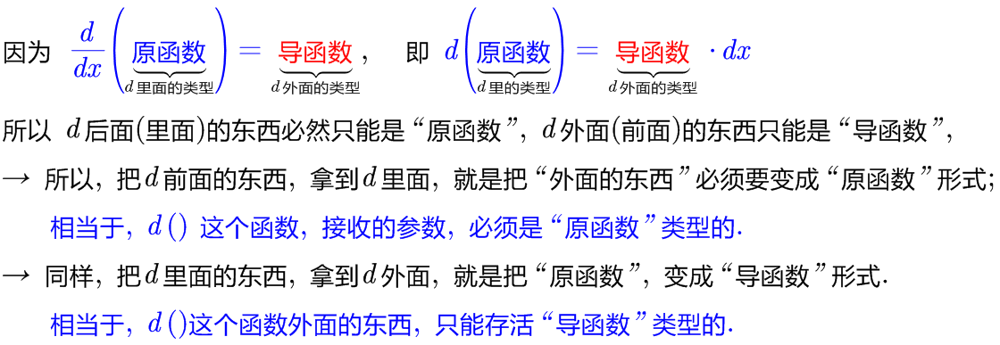
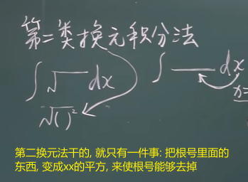
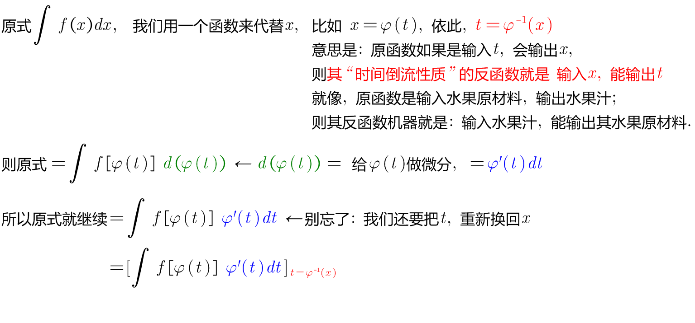
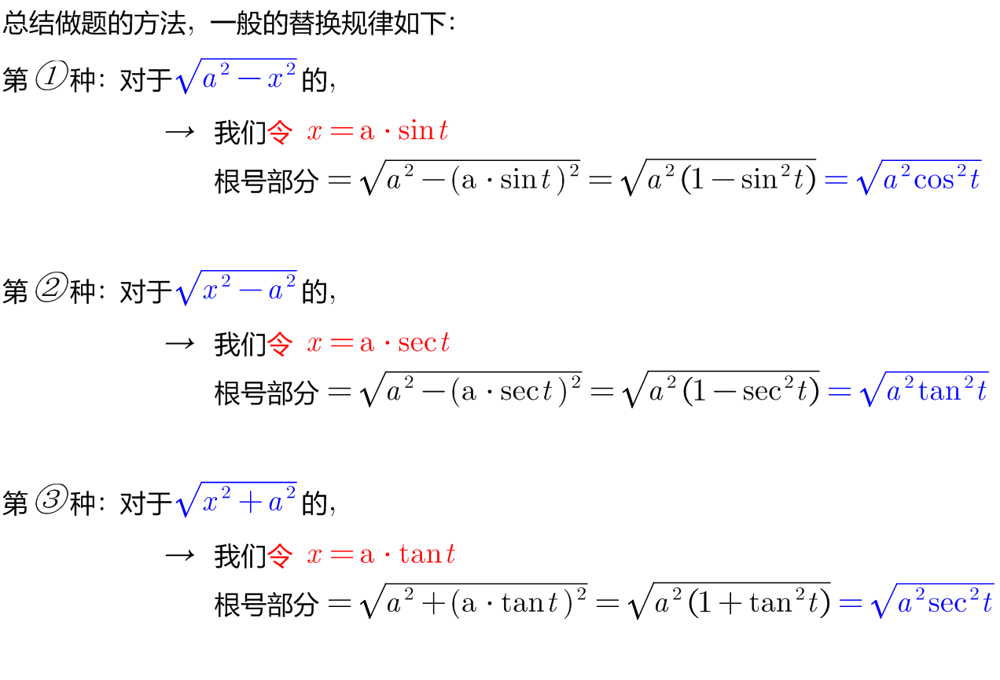
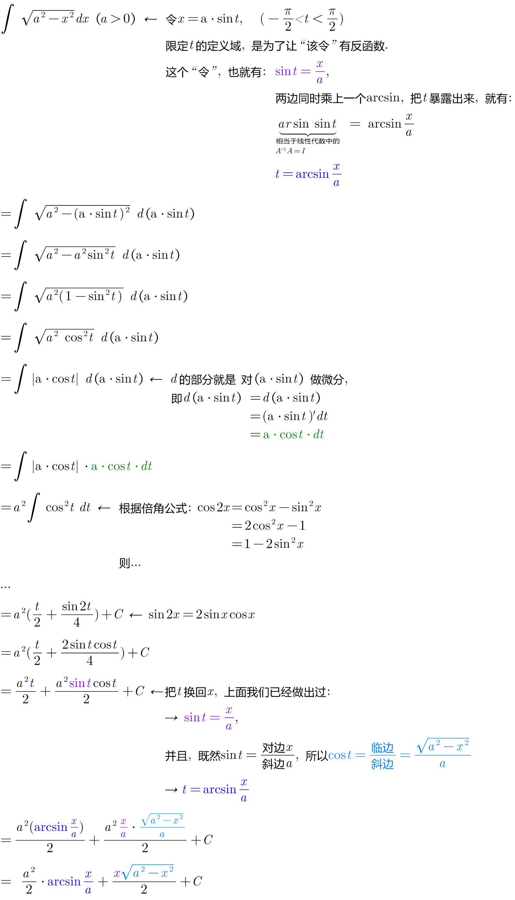
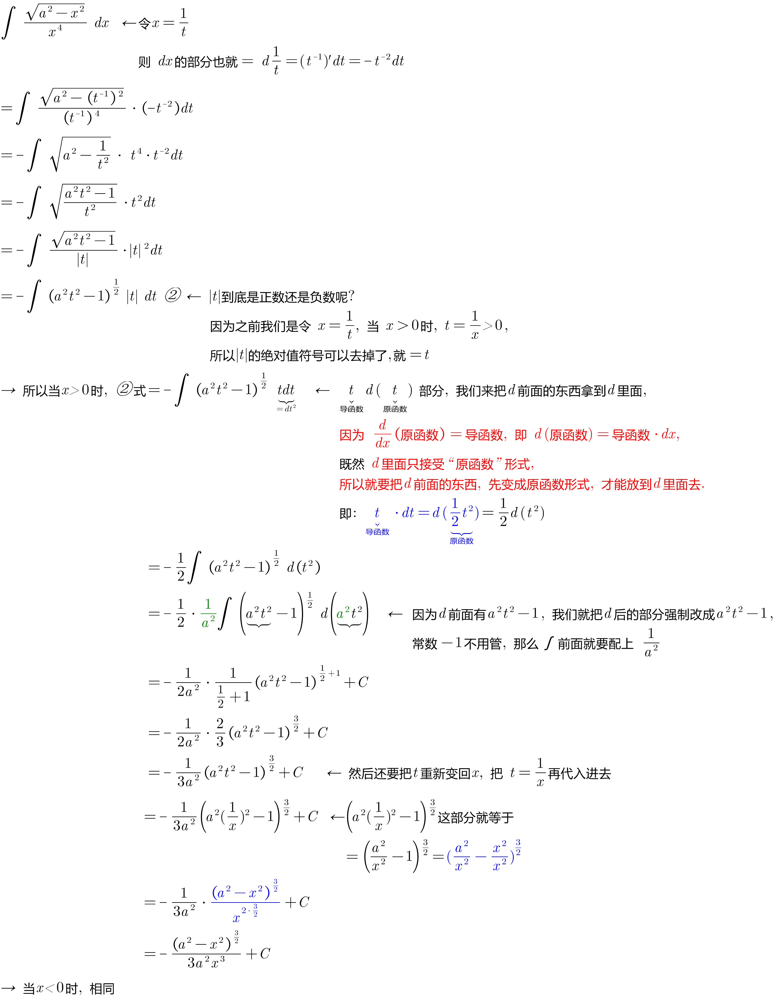
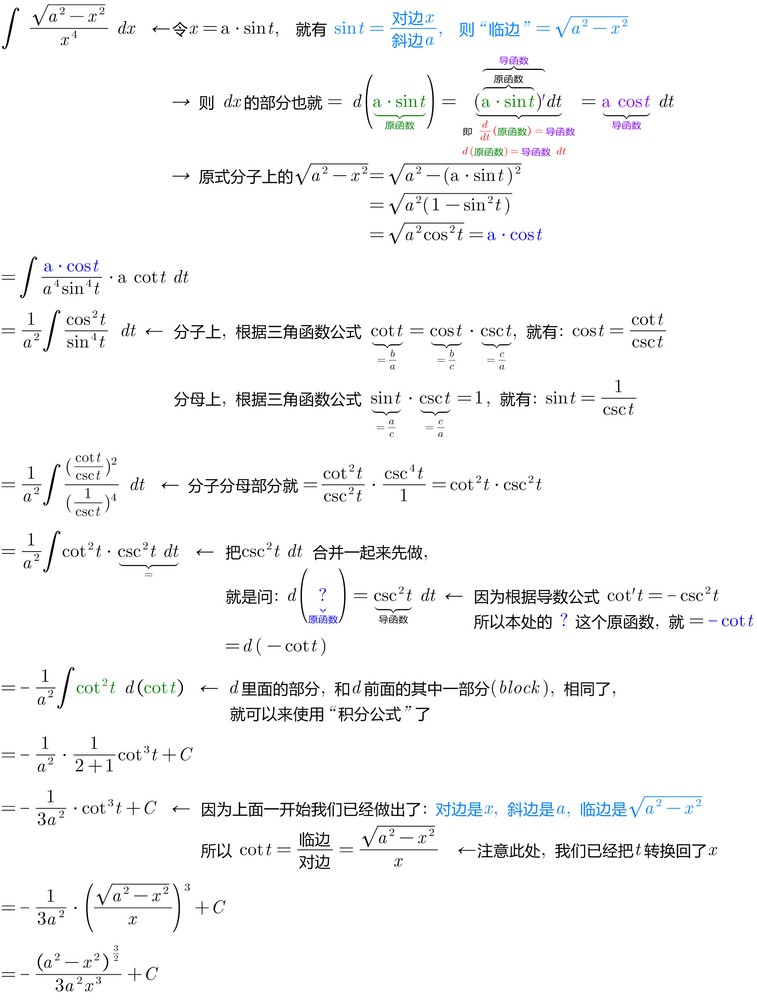
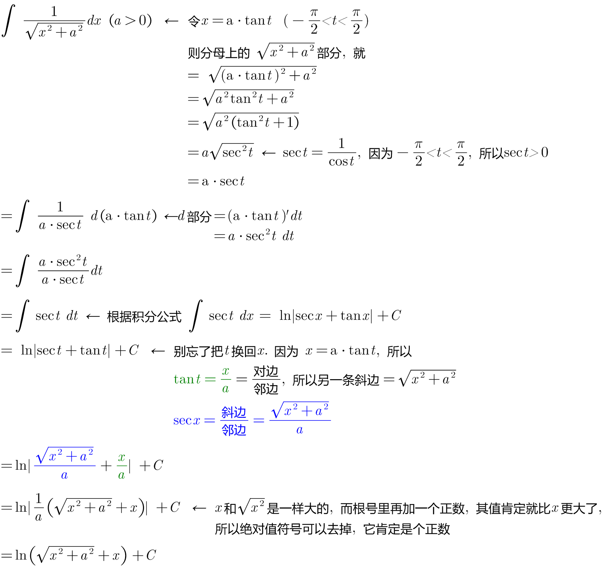
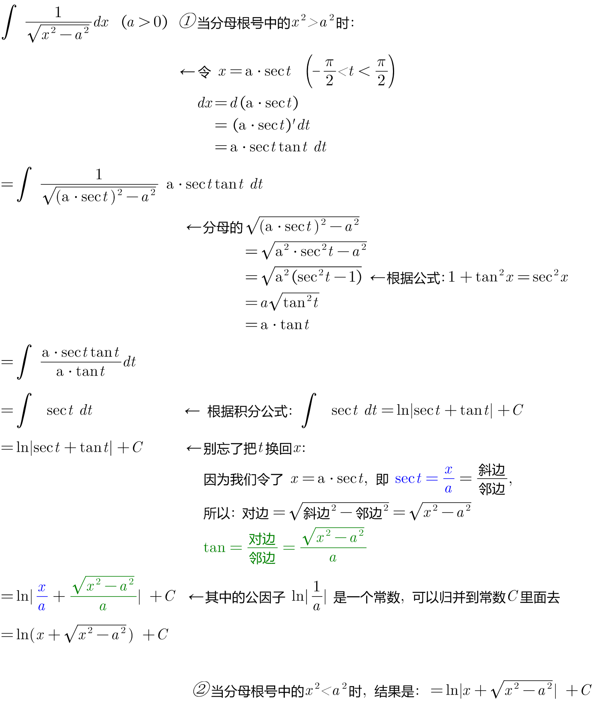

= 第二换元法 之"根式代换法"
:toc: left
:toclevels: 3
:sectnums:

---

== 第二换元法 之"根式代换法"

.标题
====
例如： +
image:img/301.png[,600]
====

.标题
====
例如： +
image:img/303.png[,600]
====

---

== 第二类换元积分法

[options="autowidth"]
|===
|Header 1 |Header 2

|第一类换元积分法
|是把d前面的东西, 往d里面拿, +
即这个过程相当于是: 先把d外面的东西"求原函数", 再放到d里面.

|第二类换元积分法 :  +
它主要解决 "∫(根号)dx" 这类导函数是带根号的问题
|是把d里面的东西, 朝外拿,  +
即: 对于dx,  将 stem:[x=φ(t)] 朝外拿, 这个过程相当于对 φ(t) 求导. 即变成 stem:[φ'(t)dt] ← 这个其实就是做微分. 这不也是第一换元法这个"凑微分法"的过程之一么?

|===

.标题
====
例如： +

====

---

=== 对于 stem:[\sqrt{a^2 - x^2}], 其中的x, 用 stem:[x= a \cdot \sin t] 来替换.

.标题
====
例如： +

====

.标题
====
例如： +

====

上面的题目, 我们用另一种方法来做:

.标题
====
例如： +

====

---

=== 对于 stem:[\sqrt{x^2 + a^2}], 其中的x, 用 stem:[x= a \cdot \tan t] 来替换.

.标题
====
例如： +

====

---

=== 对于 stem:[\sqrt{x^2 - a^2}], 其中的x, 用 stem:[x= a \cdot \sec t] 来替换.

.标题
====
例如： +

====

---

https://www.bilibili.com/video/BV1Jo4y1R7Bx?spm_id_from=333.337.top_right_bar_window_history.content.click&vd_source=52c6cb2c1143f8e222795afbab2ab1b5

9.55
