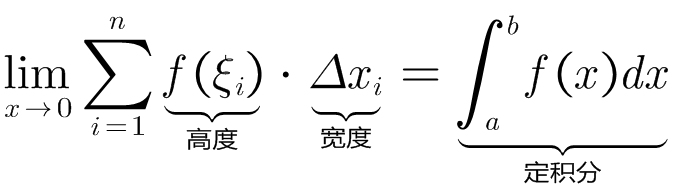
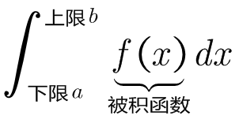
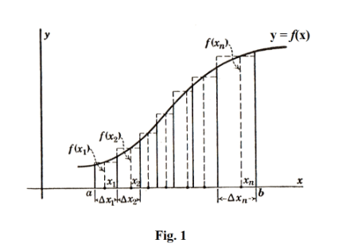
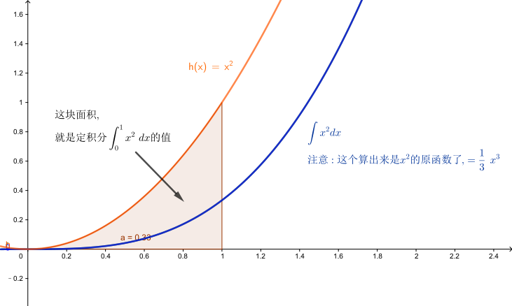
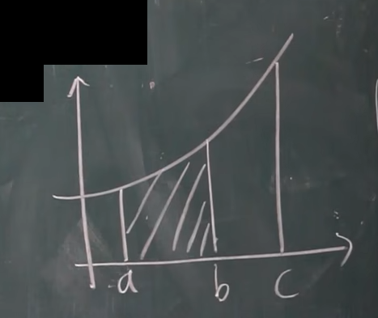
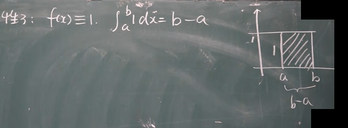
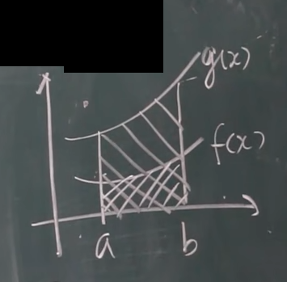
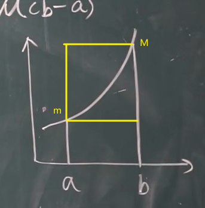
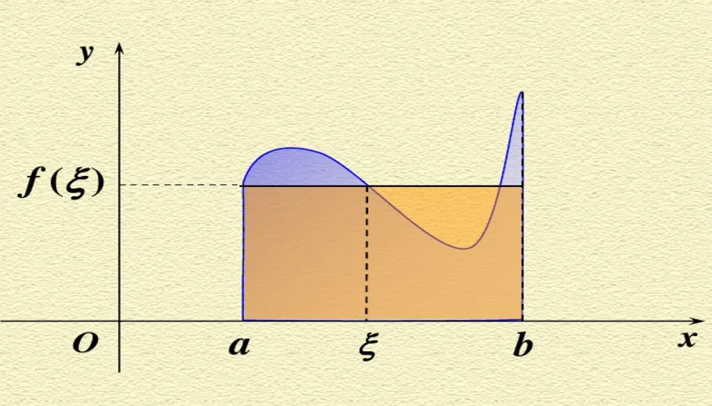

= 定积分 definite integral
:toc: left
:toclevels: 3
:sectnums:

---

== 定积分 definite integral

=== 定积分的几何意义 -> 求面积

"定积分"的定义:

1. 曲线函数f(x), 在x轴上有界, 比如端点是[a,b].
2. 然后, 我们在[a,b]这段区间上, 任意插入n个分点, 分成n个小区间. 它们不要求等分. 每个小区间的长度就是 stem:[ Δx_1, Δx_2,..., Δx_n].
3. 在每个Δ小区间上, 任取一点stem:[ ξ_i]. 这点的函数值(即y轴上的高度), 就是stem:[ y=f(ξ_i)].
4. 这样, 我们就能得到每一个Δ小区间, 所在的"长方形细条的面积"了, 即 stem:[ = 宽Δx_i \cdot 高f(ξ_i)]
5. 把所有这些Δ小区间的"长方形细条面积", 全加起来, 就是该曲线到x轴间的面积的近似值. stem:[ = \sum_{i=1}^n Delta x_i\cdot f(\xi _i) ]
6. 我们令其中 x轴宽度最大的那个Δx小区间 (假设起名为λ, 即 stem:[ λ= max{Δx_1, ..., Δx_n}]), 我们让这个λ, 极限趋向于0. 这样, 既然最大的 Δx小区间 都趋近于0了, 其他比它更小的 Δx小区间, 就都统统被约束, 也都趋向于0了. 这样, 它们的"长方形细条的面积之和", 就能精确的等于"函数曲线到x轴之间的面积"了, 而不仅仅是"近似"了. 即: +

其中:
[options="autowidth"]
|===
|Header 1 |名称

|f(x)
|被积函数

|f(x) dx
|被积表达式

|x
|积分变量

|a
|积分下限

|b
|积分上限

|[a, b]
|积分区间
|===

---

=== 什么样的函数"可积"?

1. 只要它在[a,b]区间上是"连续"的, 该函数就"可积".
2. 虽然有界, 但却有间断点, 不过只要这些间断点的数量是"有限个"的, 该函数在这段[a,b]界上, 依然"可积".

---

=== 定积分的性质

==== 若 b=a, 则 stem:[ \int_a^a f(x) = 0]

---

====  stem:[ \int_a^b f(x) = -  \int_b^a f(x)]  ← 交换上下限, 定积分的值要变号

---

====  stem:[ \int_a^b (α \cdot f(x) + β \cdot g(x)) dx = α \int_a^b  f(x) dx + β \int_a^b  g(x) dx] ← 即, 积分可以拆开, 常数可以提到外面去

---

==== 若 stem:[ a < c < b], 则: stem:[ \int_a^b f(x) dx = \int_a^c f(x) dx + \int_c^b f(x) dx] ← 其实就是原先的一步走, 分成两步走而已.

---

==== 若 stem:[ a < b < c], 则: stem:[ \int_a^b f(x) dx = \int_a^c f(x) dx - \int_c^b f(x) dx]

---

==== 若 f(x) 恒等于1 , 即该函数是条"水平直线", 它与x轴之间就形成一个矩形了. 则 stem:[  \int_a^b 1 dx = 1 \cdot (b-a) = b-a]

---

==== stem:[  \int_a^b k dx = k  \int_a^b 1 dx =  k(b-a) ]  <- k 是常数, 可以提到积分外面

---

==== 若 stem:[ f(x) >= 0], 即"函数曲线"都在x轴上方.  则 stem:[  \int_a^b f(x) dx >= 0]

---

==== 若 stem:[ f(x) <= 0], 即"函数曲线"都在x轴下方.  则 stem:[  \int_a^b f(x) dx <= 0]

---

====  若 stem:[ f(x) <= g(x)], 则 stem:[ \int_a^b f(x) dx  <=  \int_a^b g(x) dx  ]

---

==== stem:[ |\int_a^b f(x) dx | <= \int_a^b |f(x)| dx ]

因为"函数曲线"的定积分(面积), 在x轴上方是正的, 在x轴下方是负的, 如果一个曲线既有正的部分, 又有负的部分, 那它的总面积肯定会 正负抵消掉一部分.

而先把"函数曲线"取绝对值, 它就都在x轴上方了, 面积就不存在负数的一块, 就不会抵消总面积.

---

==== 一个曲线, 在[a,b]区间上, 若 m是它的最小y值高度, M是它的最大y值高度, 则有: stem:[ m(b-a) <= \int_a^b f(x) dx  <= M(b-a)]

如下图,  "高m" 乘以 "宽(b-a)", 就是 abm 这个小矩形的面积. +
 "高M" 乘以 "宽(b-a)", 就是 abM 这个大矩形的面积.

曲线的定积分,这个面积大小, 肯定是夹在上面两个矩形的面积之间的.

使用该方法, 可以对曲线的定积分值, 进行估计.

---

==== 定积分"中值定理"  Mean value theorems for definite integrals : 如果 f(x) 是连续的, stem:[ ∃ ξ \in \[a,b\], \int_a^b f(x) dx = f(ξ) (b-a)]

"定积分中值定理 Mean value theorems for definite integrals" 的意思就是说: 在函数曲线的 [a,b]区间上, 一定能找到一个点 ξ, 该ξ点的 y值高度(即 f(ξ)), 乘上 "b-a 这个宽度", 所形成的的矩形面积, 能恰好等于 函数曲线的定积分值.  你找吧, 一定能找到这个点 ξ 存在.

换言之, y= f(ξ), 就是原来的函数曲线的"平均高度值", 即平均y值.

---

