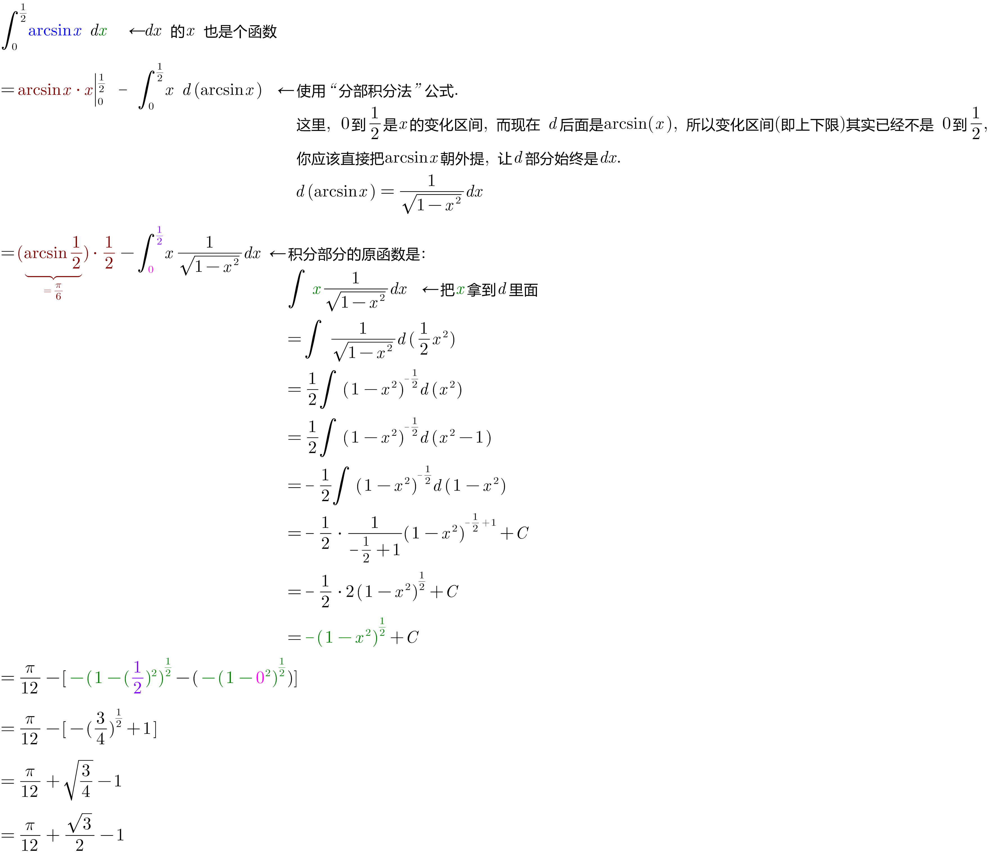
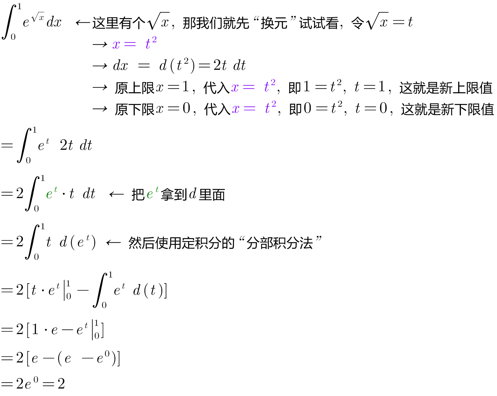
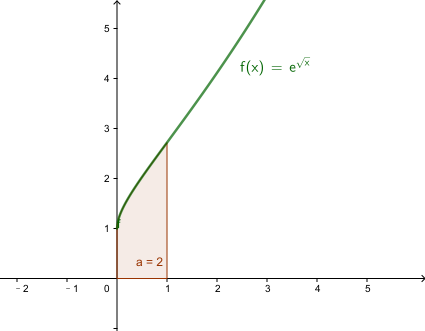
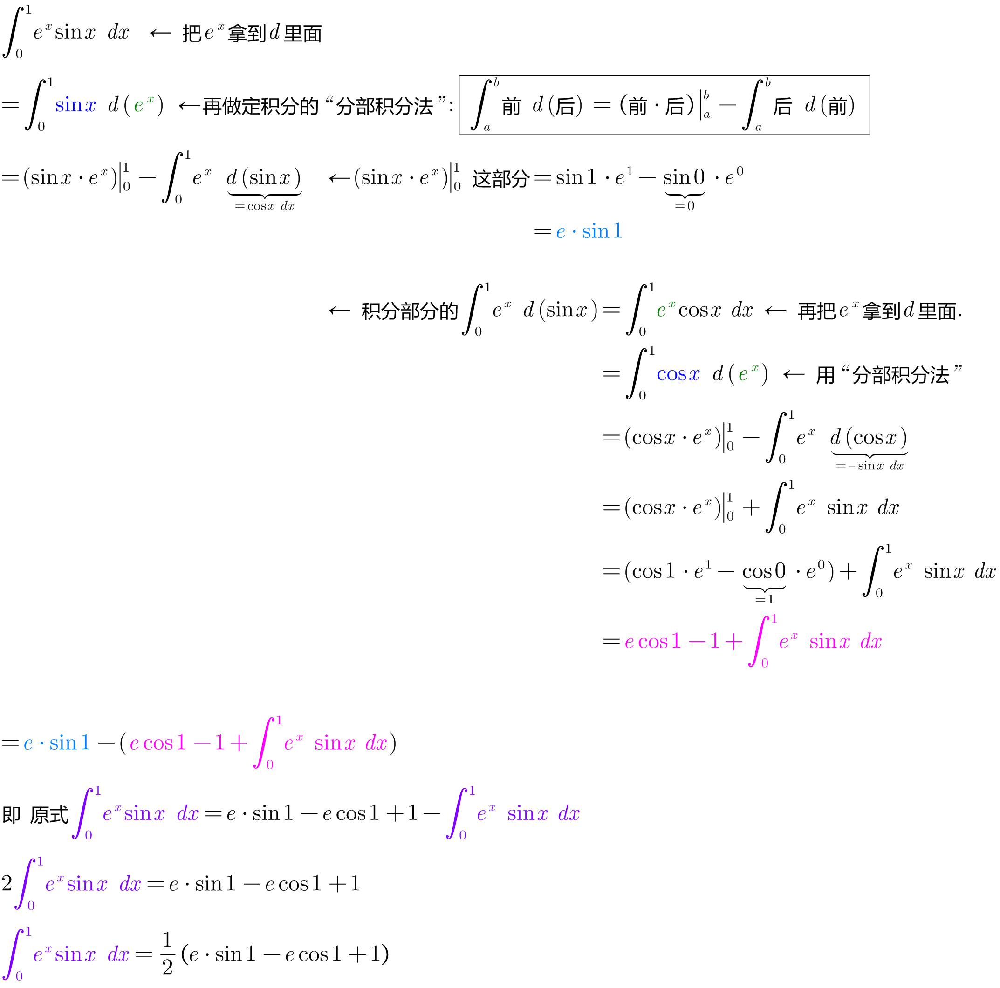

= 定积分 definite integral 分部积分法
:toc: left
:toclevels: 3
:sectnums:

---

==  定积分 分部积分法

[options="autowidth"]
|===
|Header 1 |分部积分法

|不定积分
|stem:[\int u \ dv = uv - \int v \ du] +
即: +
stem:[\int 前 \ d(后) = 前 \cdot 后 - \int 后 \ d(前)]

|定积分
|stem:[\int_a^b u \ dv = uv \|_a^b - \int_a^b v \ du]
|===

---

==== stem:[\int_0^{1/2} arcsin(x) \ dx]
.标题
====
例如： +

====

==== stem:[\int_0^1 e^(\sqrt{x}) \ dx]
.标题
====
例如： +

====

==== stem:[\int_0^1 e^x sinx \ dx]
.标题
====
例如： +

====

---

