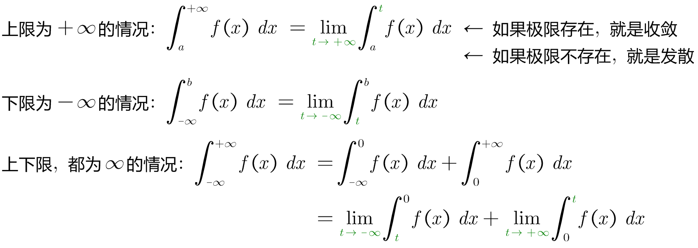
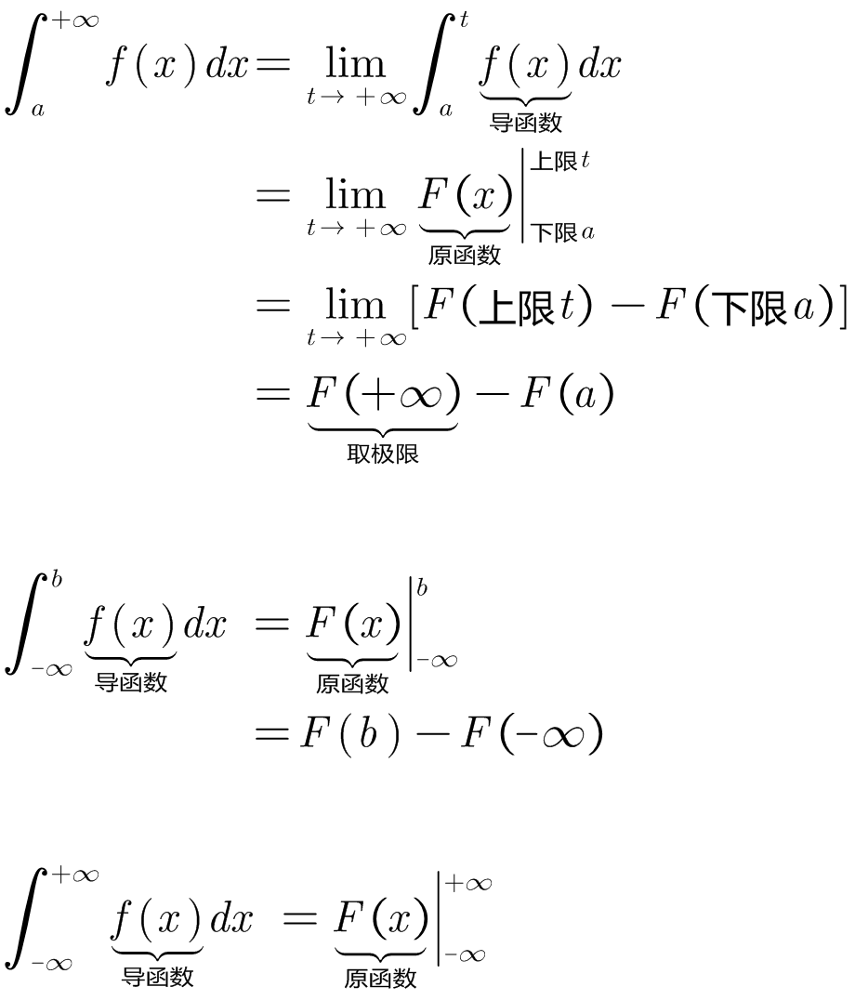
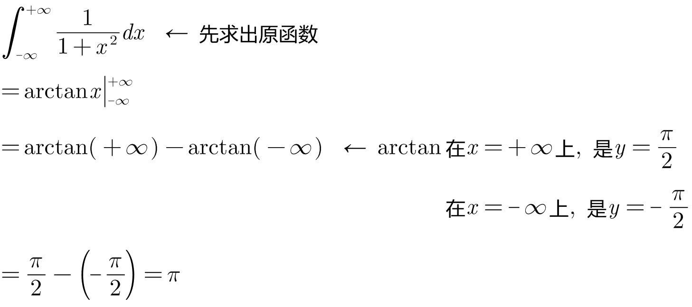
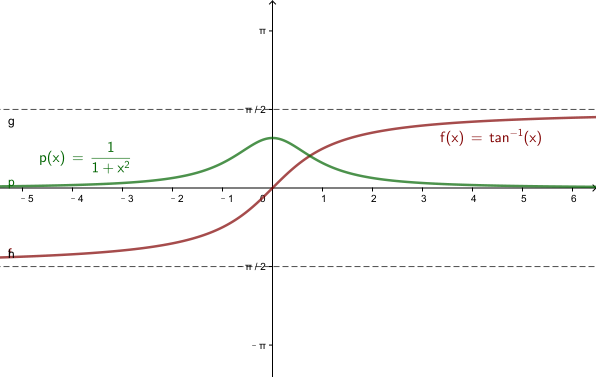
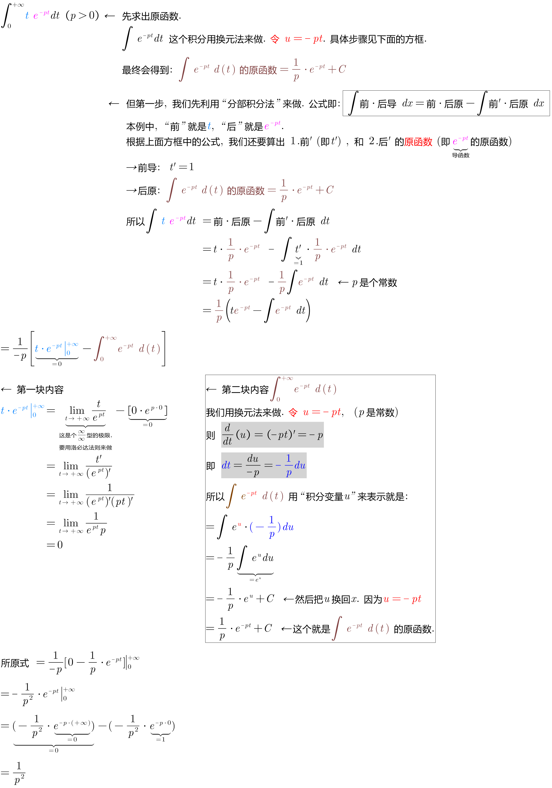
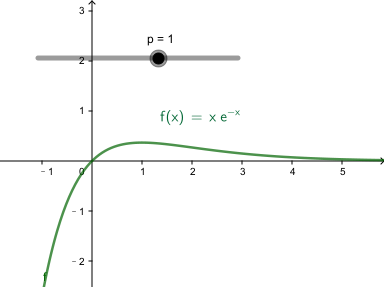
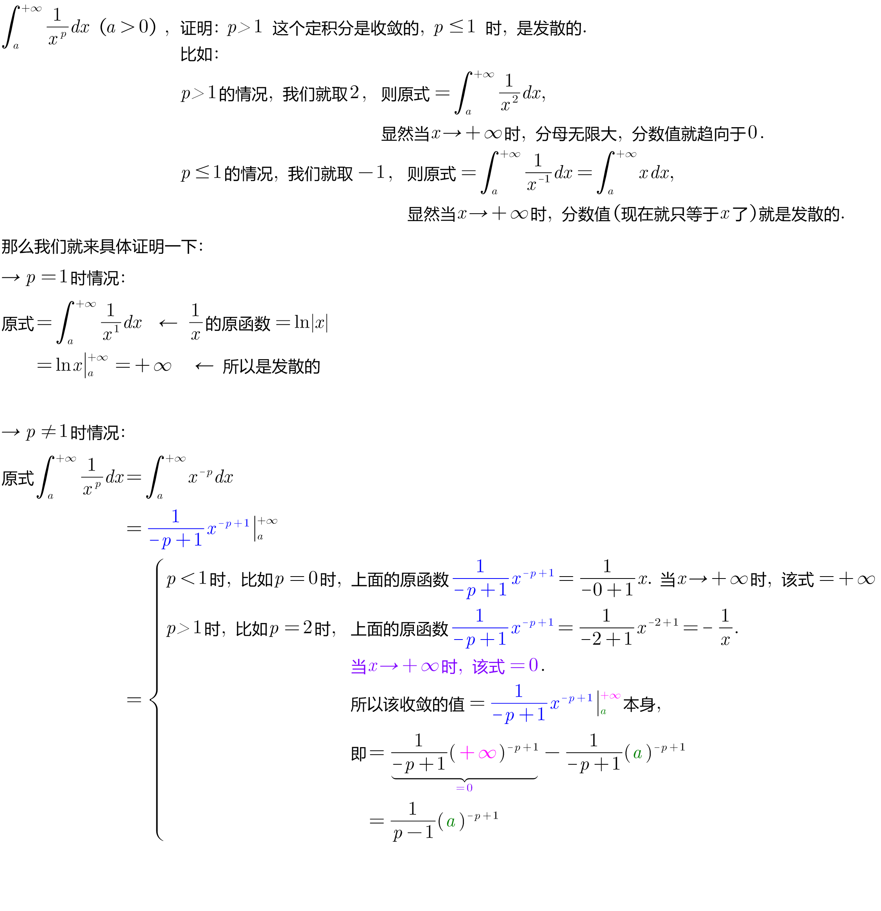
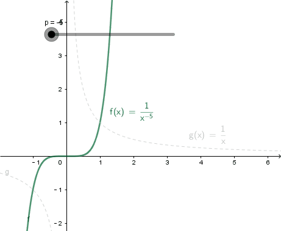

= 定积分_无穷限的反常积分 improper integral
:toc: left
:toclevels: 3
:sectnums:

---

== 无穷限的反常积分

反常积分又叫广义积分，指含有"无穷上限/下限".

---

==== stem:[\int_{-∞}^{+∞} \frac{1} {1 + x^2} dx]
.标题
====
例如： +

====

==== stem:[\int_{0}^{+∞} t \cdot  e^(-pt) dt]
.标题
====
例如： +

====

==== stem:[\int_{a}^{+∞} \frac{1} {x^p} dx ]
.标题
====
例如： +

====

---

