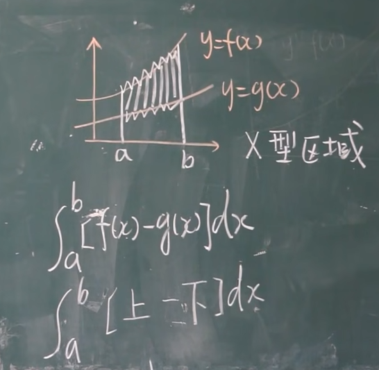
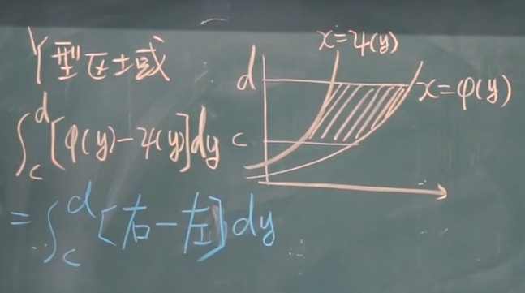
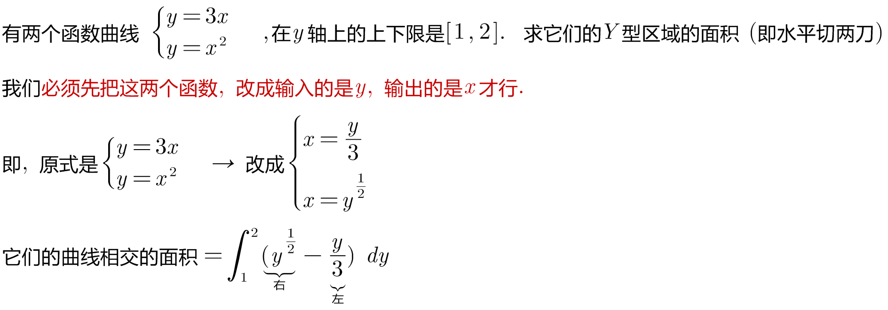
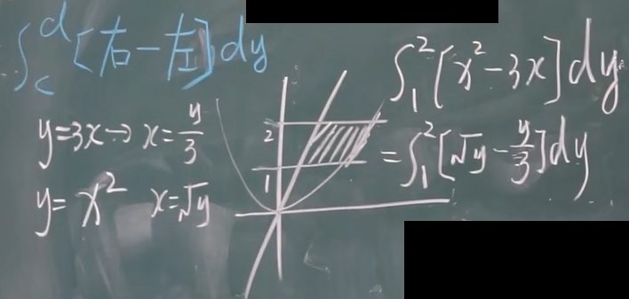
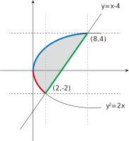
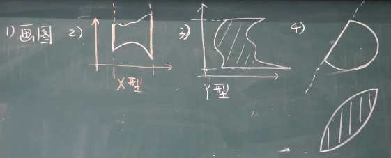
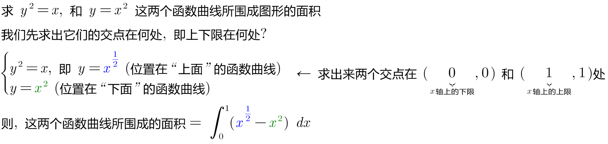
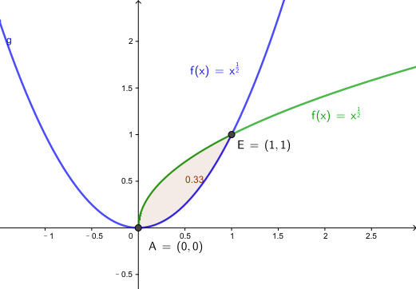
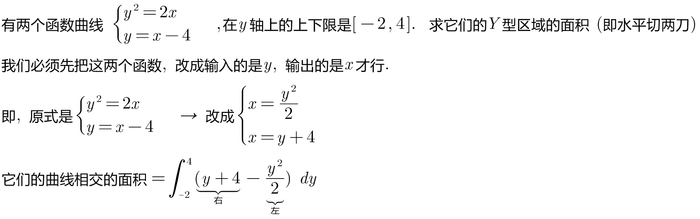
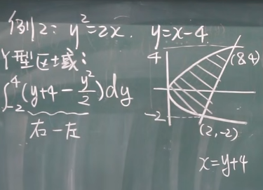

= 定积分 definite integral 的应用
:toc: left
:toclevels: 3
:sectnums:

---

== 定积分的元素法

---

== 求平面图形的面积 -> stem:[ A = \int_a^b f(x) dx]

[options="autowidth"]
|===
|Header 1 |Header 2

|X型区域 (竖着切两刀)
|

如上图, 要求两个函数夹角的面积, 就是=上面函数的面积 - 下面函数的面积.

假设上面的函数是 f, 下面的函数是 g, 即: +
\begin{align}
& \int_a^b f(x) \ dx - \int_a^b g(x) \ dx \\
& = \int_a^b [f(x) - g(x)] \ dx
\end{align}

|Y型区域 (水平切两刀)
|

*注意: 这里的函数, 输入的参数是y, 而不是x.* 所以, 你做题时, 比如原题给的函数是 y=3x (这里函数的输入参数就是x, 输出是y), 你必须先把它x与y的关系颠倒一下, 相当于求反函数后 (这样, 输入参数就是y了, 输出的就是x了), 再来做下去.

面积= 用右边的函数 - 左边的函数

如: +

|===

上图, 你既可以按 x型区域 (垂直切)去做, 也可以按y型区域(水平切) 去做.

[options="autowidth"]
|===
|Header 1 |Header 2

|x型区域
|如果是按"垂直切"来做的话, 你要看清楚围绕着灰色面积的区域, 哪个是"上面"的函数, 哪个是"下面"的函数.

-> 在[0,2]区间, 围绕着灰色面积, 显然, 蓝色的 stem:[y^2 =2x] 是"上面"的函数, 红色的 stem:[y^2 =2x] 是"下面"的函数.

-> 在[2,8]区间, 围绕着灰色面积, 蓝色的 stem:[y^2 =2x] 是"上面"的函数, 绿色的 stem:[y=x-4] 是"下面"的函数.

所以, 面积就是这两段区间的 灰色面积的和 = stem:[\int_0^2 \[ \sqrt{2x} - (- \sqrt{2x}) \] dx + \int_2^8 \[ \sqrt{2x} - (x-4) \] dx]

|y型区域
|灰色的面积 = 右边的函数曲线 - 左边的函数曲线

右边的函数是 stem:[y=x-4], 即 stem:[x=y+4] +
左边的函数是 stem:[y^2=2x], 即 stem:[ x=\frac{y^2} {2}]

所以, 面积就是= stem:[\int_(-2)^4 (y+4 - \frac{y^2} {2}) dy ]
|===

可以看出, 上例, 垂直切, 面积要两步才能算出. 水平切, 面积只需一步就能做出. 所以, 一个题目, 你在选择到底是"垂直切"还是"水平切"时, 先要这样来考虑:

1. 画出函数图.
2. -> 如果面积的边框, 有"垂直线", 就按"垂直切" (即x型)来做. +
-> 如果面积的边框, 有"水平线", 就按"水平切" (即y型)来做. +
-> 如果面积的边框, 只有斜着的直线边缘, 或者完全没有直线边缘, 那你就拿只笔, "从左到右"(垂直切), 也"从上到下"(水平切)来划过, 看哪一个只需更少的步骤(即更少个数的积分之和) 就能求出面积. 你就用哪一种切法.

---

.标题
====
例如： +

====

.标题
====
例如： +

====

https://www.bilibili.com/video/BV1Eb411u7Fw?p=58&vd_source=52c6cb2c1143f8e222795afbab2ab1b5

33.19
