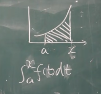
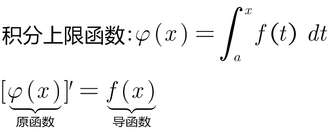
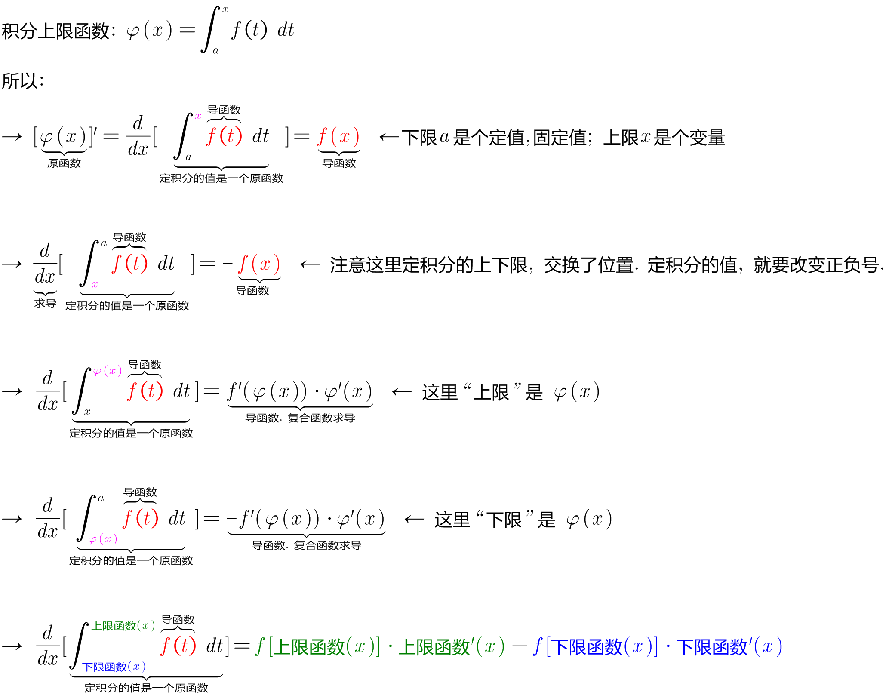
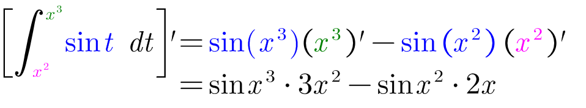
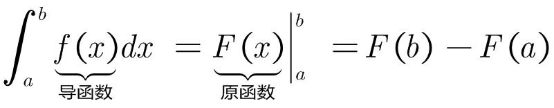
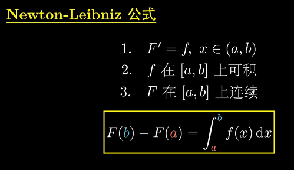
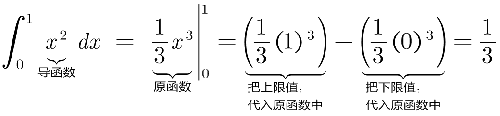
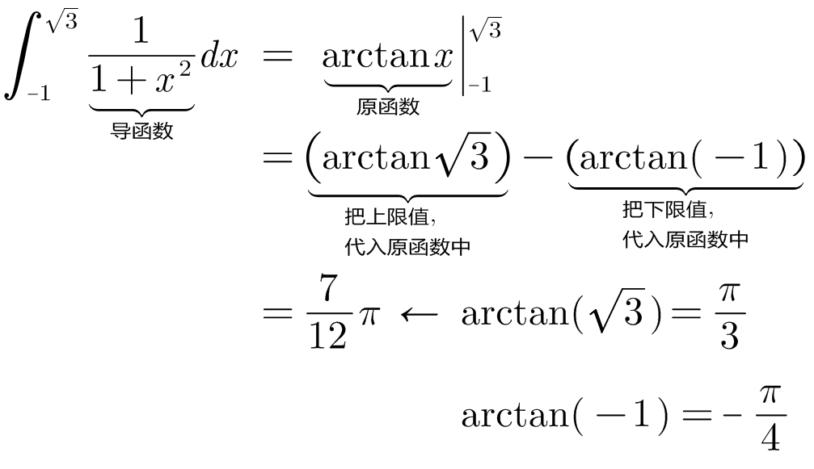
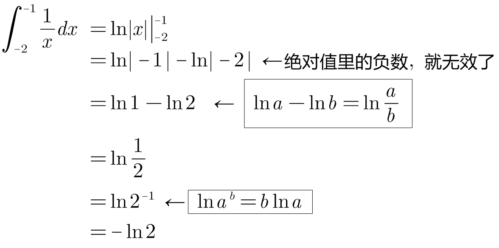
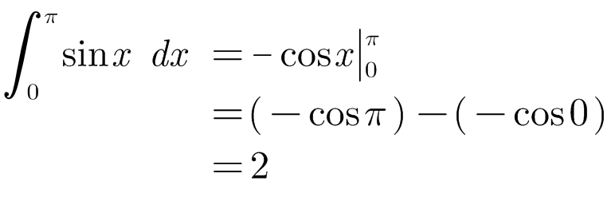

= 微积分 基本公式
:toc: left
:toclevels: 3
:sectnums:

---

== 积分上限函数 stem:[ φ(x)= \int_a^x f(t) dt ]

*定积分的结果, 和"被积变量"没有任何关系, 只和"定积分的上下限", 与"被积函数"有关系.* +
所以, 这个定积分 stem:[ \int_a^x f(t) dt], 其结果, 和"被积变量t"没有任何关系. 只和上下限, 比如x 有关系. 即:

\begin{align}
\boxed{
\int_a^x f(t) dt = φ(x)
}
\end{align}

上面, *我们用一个新的函数 φ(x) 来表示: 积分出来的结果, 是与x有关系的. 即"是个关于x的函数".*

 +
上图, 请把 上限x, 理解为可以任意左右拖动位置的手柄.

---

== 积分上限函数 的定理

=== 对"积分上限函数"求导 : stem:[φ'(x) = \frac{d} {dx} \[\int_a^x f(t) dt \] = f(x)]

---

=== stem:[φ(x) =\int_a^x f(t) dt ] 是 f(x) 的一个"原函数".

---

== 牛顿-莱布尼茨公式 Newton-Leibniz formula

牛顿-莱布尼茨公式, 给"定积分"提供了一个有效而简便的计算方法，大大简化了"定积分"的计算过程。

因为他们发现了求"定积分" 原来和"求原函数"有关系. 即: 只要知道被积函数的"原函数"，总可以求出"定积分"的精确值, 或一定精度的近似值。

牛顿-莱布尼茨公式, 是联系"微分学"与"积分学"的桥梁，它是微积分中最基本的公式之一。

.标题
====
例如： +

====

.标题
====
例如： +

====

.标题
====
例如： +

====

.标题
====
例如： +

====

---

https://www.bilibili.com/video/BV1Eb411u7Fw?p=51&vd_source=52c6cb2c1143f8e222795afbab2ab1b5

42.00

https://www.bilibili.com/video/BV1jJ411y7dY?spm_id_from=333.337.search-card.all.click&vd_source=52c6cb2c1143f8e222795afbab2ab1b5
