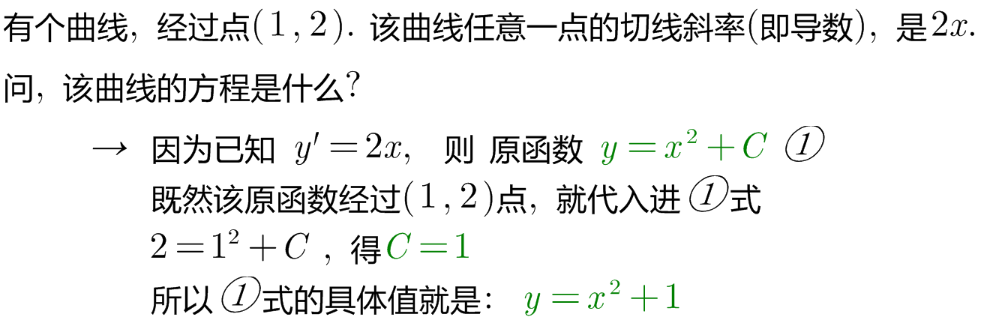
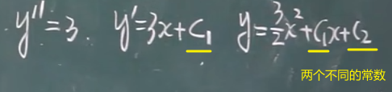

= 微分方程 differential equation
:toc: left
:toclevels: 3
:sectnums:

---

== 微分方程 differential equation

.标题
====
例如： +

====

一些概念:

[options="autowidth"]
|===
|Header 1 |Header 2

|微分方程
|什么是"微分方程"? 含有导数的, 就是微分方程.

|阶数
|求导的阶数, 就叫"微分方程的阶数".

|通解
|含常数的个数 = 阶数. +
对一个微分方程而言，它的解会包括一些常数，对于n阶微分方程，它的含有n个独立常数的解, 就称为该方程的"通解"。

如下图中, 对二阶导的求原函数, 原函数中就含有两个常数. +

|===

---

== 可分离变量的微分方程

---

https://www.bilibili.com/video/BV1Eb411u7Fw?p=65&vd_source=52c6cb2c1143f8e222795afbab2ab1b5
