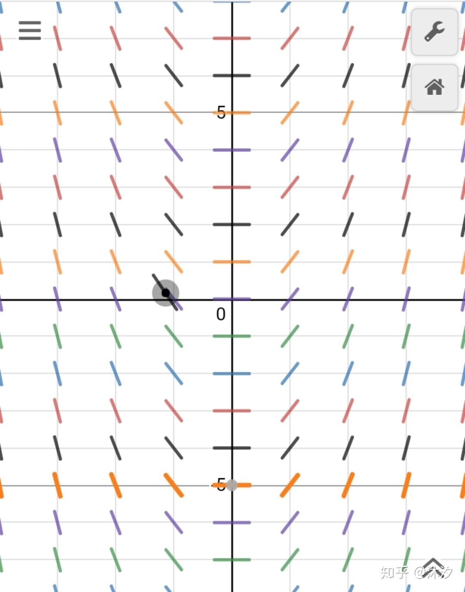
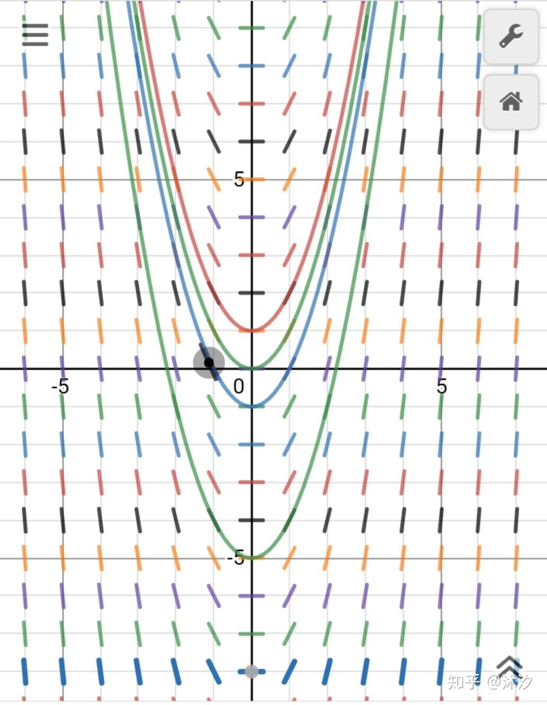
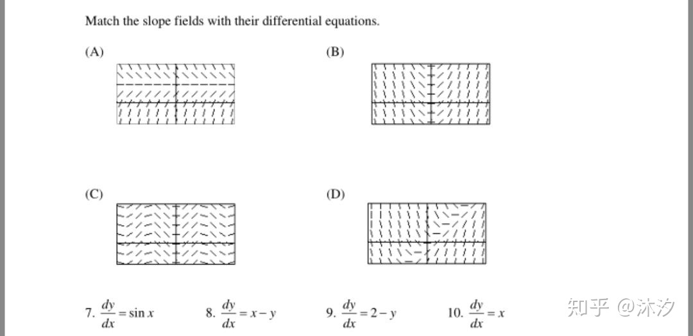
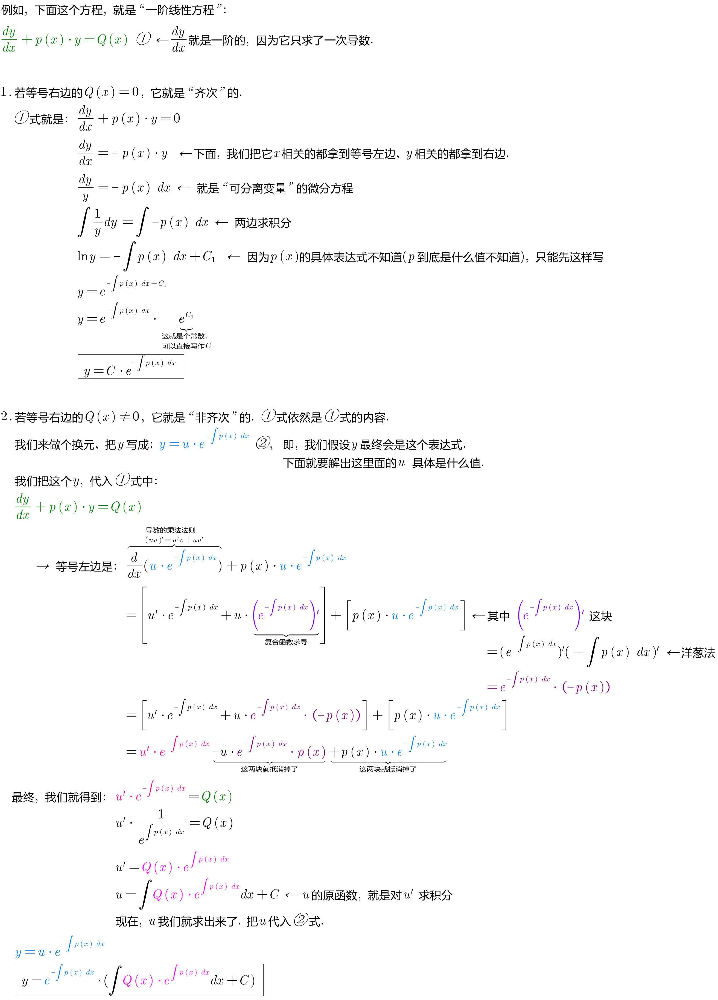
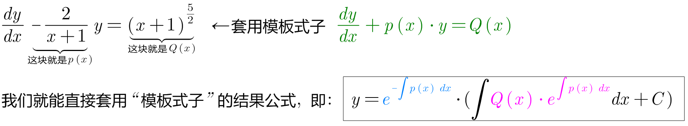
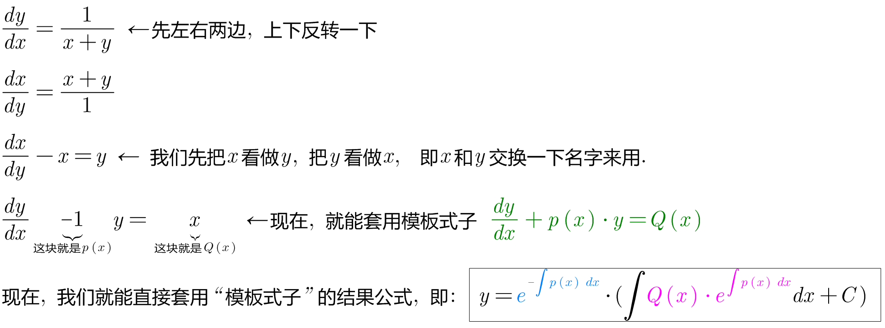
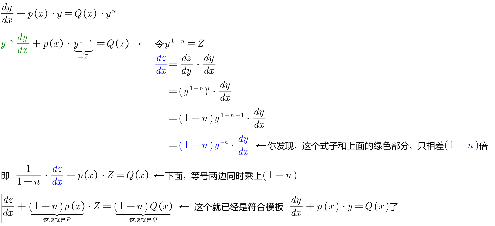
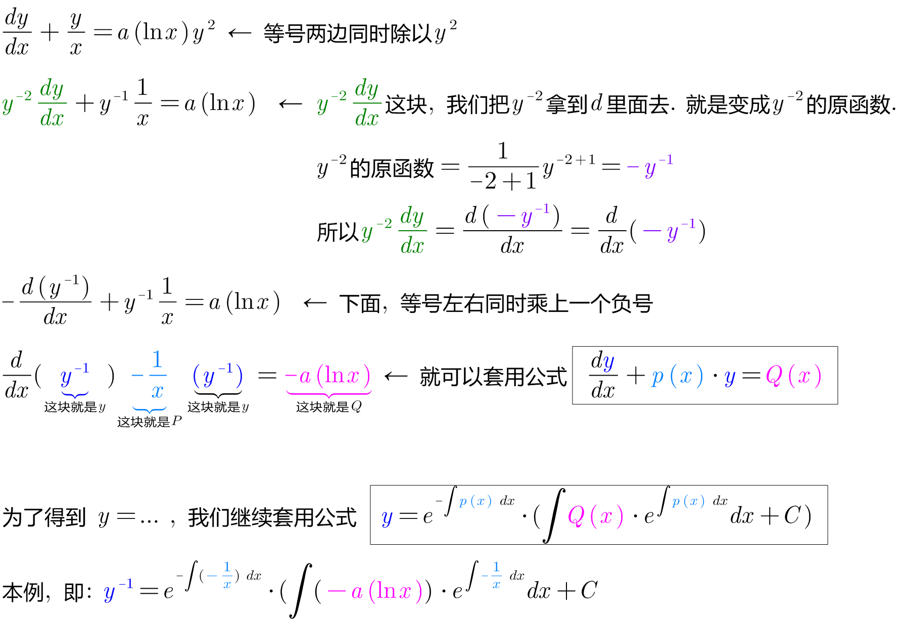

= 一阶线性微分方程 First order linear differential equation
:toc: left
:toclevels: 3
:sectnums:

---

== 一阶线性微分方程 First order linear differential equation

我们来看这个问题: 求 stem:[x(y^2-1) dx + y(x^2-1)dy=0 ]

这里面, 有两个未知量 x 和 y，还有两个微元小量 dx dy，然后是一个等式连接的，求解？是求谁的解呢？ +
*这就是微分方程的一种形式之一. 对它的处理过程, 就是要把这个抽象的等式, 变成 y=f（x）. 这一求 y=f（x）的过程, 就称为求解*.

和普通方程组相似，微分方程也是方程，符合左边等于右边的特性。然而和普通的一元一次, 或者二元一次方程组不同的是，*微分方程的式子中, 含有代表变化速率的"微分"部分。*

常见的一次微分方程的模型有：

- 有关人口变化的方程： stem:[\frac{dP} {dt} =kP \ (k>0)]
- 有关衰变的方程： stem:[\frac{dA} {dt} =kA  \ (k<0)]
- 有关牛顿冷却/加热原理的方程： stem:[\frac{dT} {dt} =k(T - T_m)  \ (k<0)]

从从以上三个例子中, **我们都可以发现方程的左边为"微分"，右边为"原函数"。因为我们就在同一个式子中同时拥有了y和y'，且导数的最高次次数为1，所以我们称这样的式子为"一阶微分方程"（DE）。**

同时，这些式子中有且只有一个自变量，故这些方程同时被称为"一阶常微分方程"（ODE）。 +
如果式子中含有一个以上的自变量, 将被称为"偏微分方程"（PDE）。

将微分具象化的一个重要数学工具, 为"斜率场  slope field"。

*一阶微分方程的左边通常是dy/dx，也就是斜率， 等式右边一般是含有x,y的表达式， 所以合理的选择(x,y)值， 就可以绘制出slope field. +
slope field的作用, 是求解微分方程的解(solution function)。*

==== 斜率场 slope field

slope field（斜率场）的出现, 是由于当你算积分（integral）的时候，你有个常数项（constant） C不知道具体的数值. 比如： stem:[\int 2x dx = x^2 + C]

这个C可以是任意值。而slope field的意义, 就是把C有可能的值都表示出来，每个短横线, 表示在不同点的"斜率" (即导数)。

把这些短横线连起来, 你看到了什么？(就是从"导数", 来倒推出"原函数"). 对的，slope field 画的, 就是导数, stem:[dy/dx = 2x]，函数图像(原函数)则是 stem:[y = x^2 + C]

看一下 AP Calculus中 的这道题：

方法是: 先找特殊的导数，比如先找斜率为0的地方。 比如图(A)，在y = 2 的时候, 是斜率全为0.  而上图中的第9个公式, 是 stem:[\frac{dy} {dx}=2-y], 把y=2 代入, 正好得到 stem:[\frac{dy} {dx}=2-2=0].

https://zhuanlan.zhihu.com/p/350908545

---

形如 stem:[ y'+P(x)y=Q(x)] 的微分方程, 称为"一阶线性微分方程". +

- Q(x)称为自由项。
- 一阶，指的是方程中, 关于Y的导数是一阶导数。
- 线性，指的是方程简化后的每一项关于y、y'的指数为1。
- 这里假设 P(x), Q(x) 是x的连续函数。

[options="autowidth"]
|===
|Header 1 |通解

|一阶/ 齐次/ 线性/ 微分方程 +
stem:[ y' + P(x) \cdot y=0]
|stem:[ y= C \cdot e^(-\int P(x) dx)]

|一阶/ 非齐次/ 线性/ 微分方程 +
stem:[ y' + P(x) \cdot y= Q(x)]
|stem:[ y= e^(-\int P(x) dx) \[ \int Q(x) \cdot e^(\int P(x) dx) dx + C \]]
|===

.标题
====
例如： +

====

.标题
====
例如： +

====

---

== 伯努利方程 Bernoulli's principle

.标题
====
例如： +

====

---
