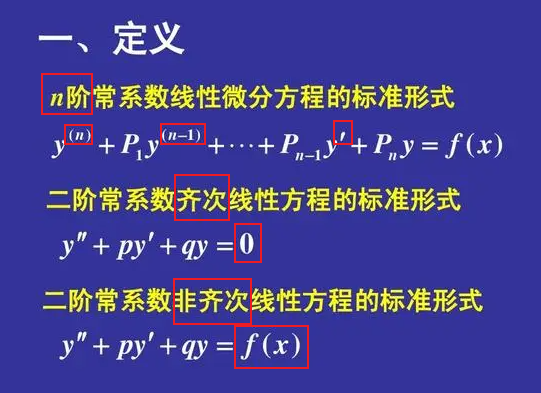
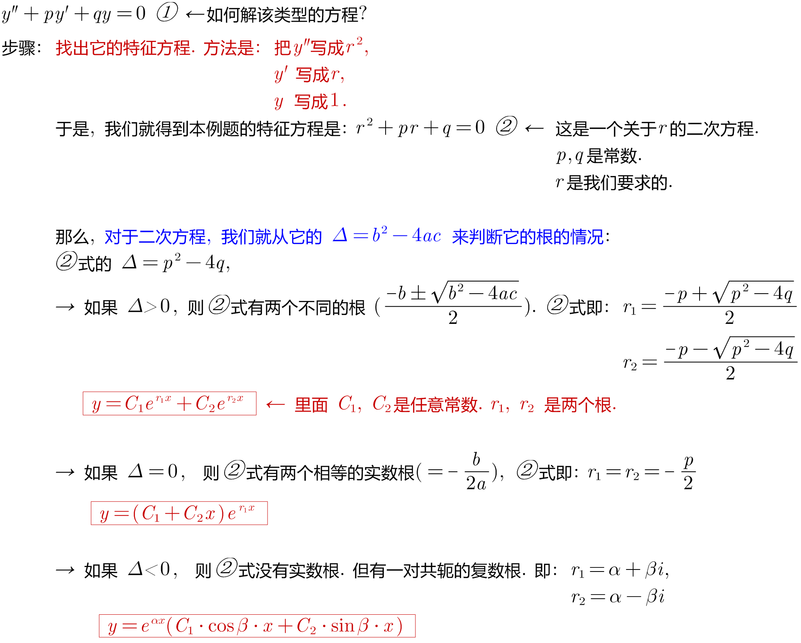
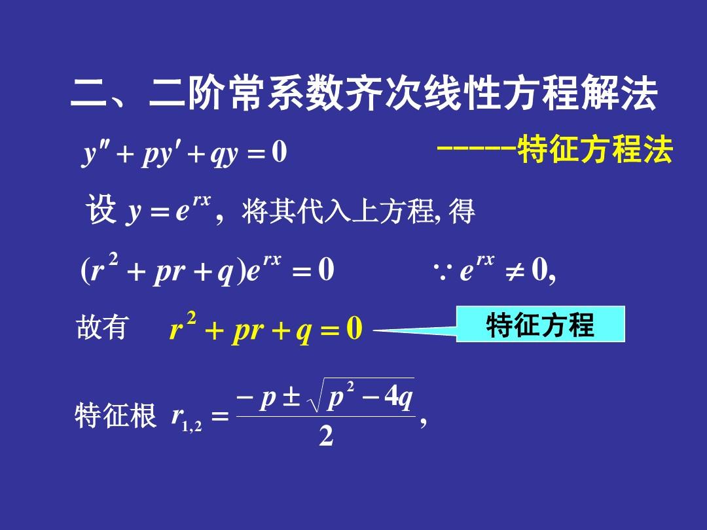
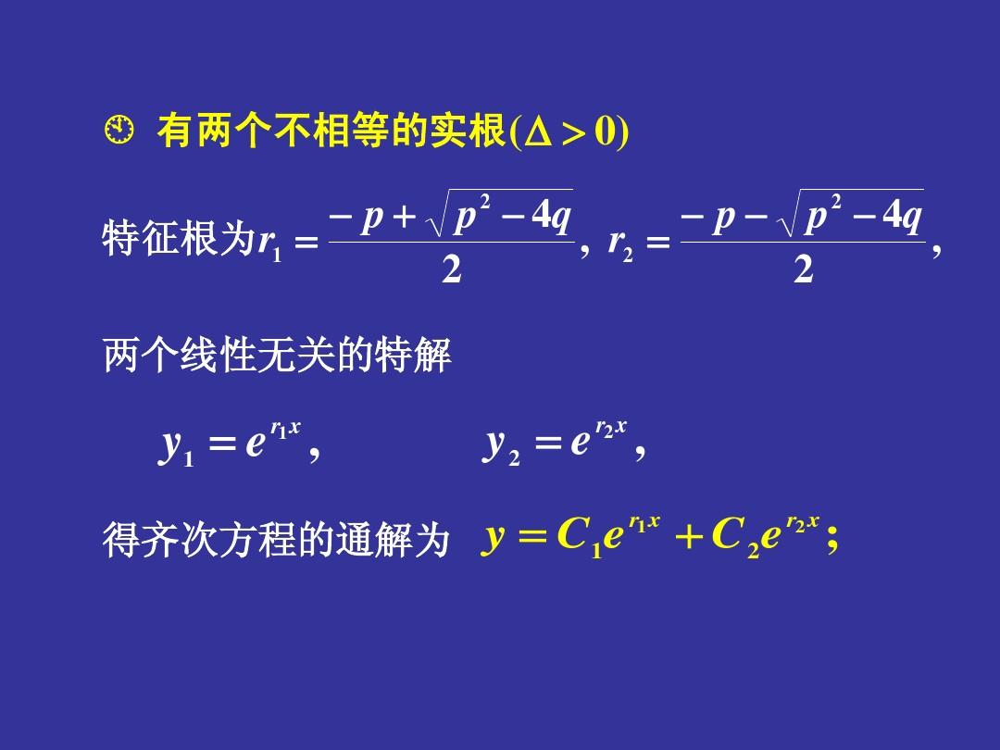
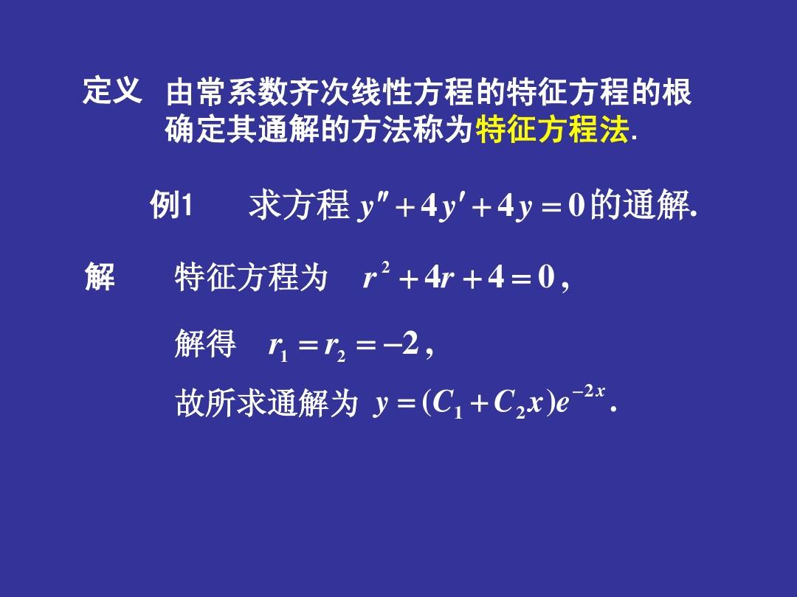
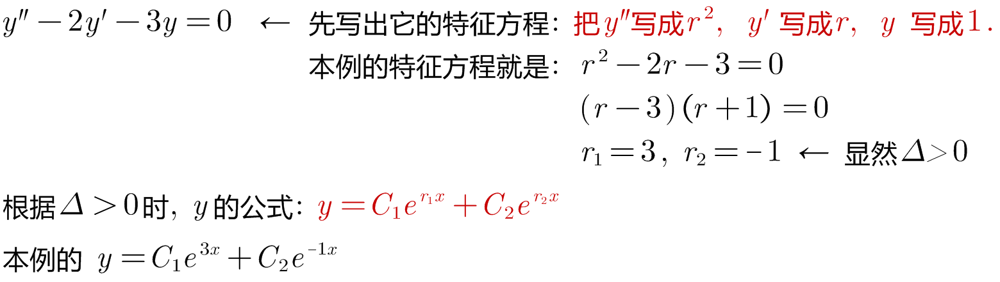
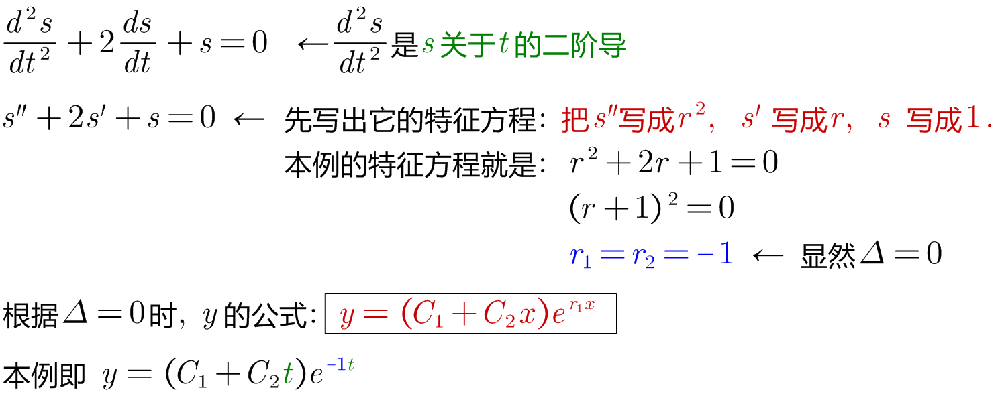
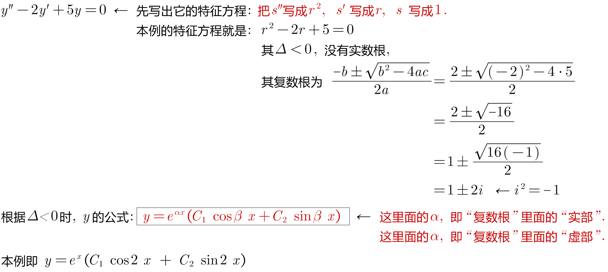
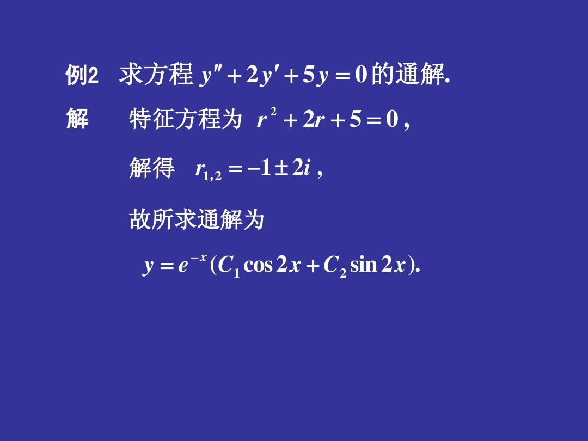

= 常系数 线性 齐次 微分方程
:toc: left
:toclevels: 3
:sectnums:

---

---

== 二阶齐次线性微分方程 的解法 -> 特征方程法

=== stem:[ y'' + p(x) \cdot y' + Q(x) \cdot y = 0] ← 这里, y是变量, x要看做是常数.

---

=== 二阶常系数齐次线性微分方程 linear differential equation with constant coefficients : stem:[ y'' + p \cdot y' +qy =0]

形如 stem:[ y''+py'+qy=f(x)] 的微分方程, 就是"二阶常系数线性微分方程"（linear differential equation with constant coefficients of the second order）.

- p，q是实常数。
- 其中, 若等号右边为0, 那它就是"齐次"的.

image:img/601.jpg[,300]
image:img/602.jpg[,300]

.标题
====
例如： +

====

.标题
====
例如： +

====

.标题
====
例如： +

====

.标题
====
例如： +

====

---

