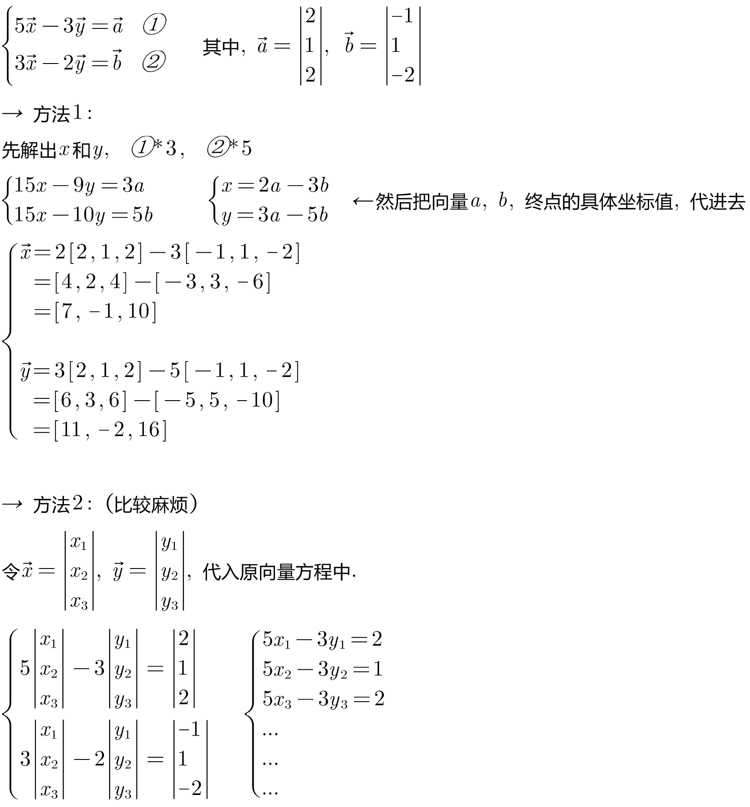
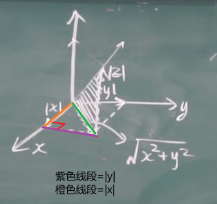
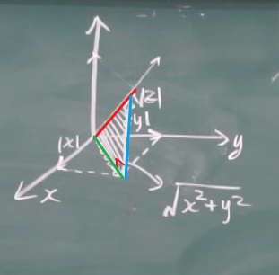

= 向量及线性运算
:toc: left
:toclevels: 3
:sectnums:

---

== 向量及线性运算

零向量的方向是任意的.

如果两个向量的夹角, 是0°(即两个向量同方向) 或 180°(即两个向量互为反方向), 则它们平行(或共线).

.标题
====
例如： +

====

---

== 向量的模长 : stem:[ = \sqrt{x^2 + y^2}]

image:img/609.png[,250]

绿线是一个直角三角形的条斜边, 绿色斜边的长度 stem:[ = \sqrt{x^2 + y^2}]
+

如下图: 红线就是向量的模长. 它和绿色, 蓝色线段, 构成一个直角三角形. 红色是斜边. 所以 stem:[ 蓝^2 + 绿^2 = 红^2].  即: 红色向量的模长 stem:[ = \sqrt{(x^2 + y^2) + z^2}]  +

---

== 两点之间距离公式 : stem:[ |AB| = \sqrt{(x_2 - x_1)^2 + (y_2 - y_1)^2 + (z_2 - z_1)^2)]

---

== 方向余弦 direction cosine

image:img/613.gif[]

image:img/614.png[,850]

一个向量的三个"方向余弦", 分别是: 这向量与三个坐标轴之间的角度的余弦。 +
两个向量之间的"方向余弦", 指的是这两个向量之间的角度的余弦。

*向量r 的方向余弦, 就是与r同方向的"单位向量".*

---

https://www.bilibili.com/video/BV1Eb411u7Fw?p=74&vd_source=52c6cb2c1143f8e222795afbab2ab1b5

11.10

---

