= 多元函数的几何意义 function of several variables
:toc: left
:toclevels: 3
:sectnums:

---

== 多元函数  function of several variables

- 单变量函数, 是形如f(x)=y 这类的, 即 只有一个输入变量, 然后也只输出一个值.
- 而多元函数, 是输入多个变量的. 我们在学习时, 一般只考虑两个变量, 如写作: f(x,y)=... . 这两个变量(x和y)同时影响到函数的输出. *我们把这多个输入量, 当成n维空间中的一个点的坐标.* +
*多元函数的输出值, 也可以输出多个数. 当有多个量被输出的时候, 我们一般把它认为是一个向量.* (就类似于python 编程里的, 把输出的多个数, 封装在一个 list 或 tuple中.)

\begin{align}
如:  f(x,y)= \left[ \begin{matrix}
x	\\
y	\\
\end{matrix} \right]  ← 某多元函数, 输出一个向量
\end{align}

当有二维(两个参数)输入的时候, 比如 stem:[ f(x,y)], 该多元函数的图像, 是三维的.

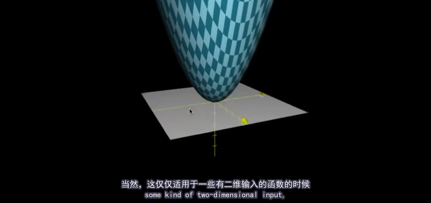

---

==== 接受两个参数(x,y)的多元函数, 其输出值, 在z轴上.

比如一个多元函数 stem:[ f(x,y)=x^2 + y^2], 它接收一个两变量(二维)参数(x和y), 那么它在三维空间中的函数图像, 是怎样的呢?

我们先输入一个二元参数进去, 比如 (x=1,y=2), 代入函数中, 输出就是 stem:[z= x^2 + y^2 =1^2 + 2^2 =5]. 所以我们得到一个三维空间的点坐标 : (x=1, y=2, z=5).

以此类推, 我们就能得到每一个输入进去的"二维参数"的输出值 -- 三维空间中的点坐标.

然后就能画出三维空间中的该"多元函数"的图像了 -- 一个曲面.

*记住: 你输入进去的每一个"二元参数", 都处在(XOY)这个二维平面上, 而它们在"多元函数"中的输出值, 对应着XOY平面上每个点的高度(Z轴上).  <- 这就像普通的"单变量函数", 输入值是x, 输出值是y, 而y 正是x点的高度(在y轴上).*

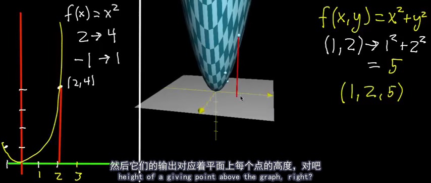

.标题
====
stem:[ f(x,y)= 1/2(x^2 + y^2)] 这个多元函数图像, 里面有stem:[1/2], 它就意味着, XY平面(底座)上每个点对应的高度, 都被压缩了一半. 比如, 原先的点高度是5, 现在就变成了2.5.

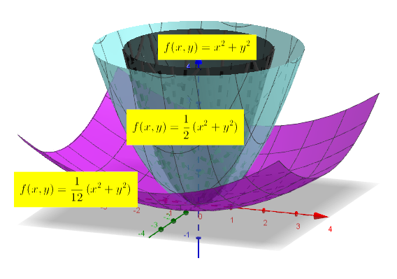
====

多元函数, 也能有三维的输入, 二维的输出. 即函数处理会执行"降维打击" (类似于"线性代数"中的矩阵变换, 将3维坐标系空间, 压缩成2维坐标系空间).

---

==== 固定其中一个参数, 放开另一个参数, 来研究多元函数

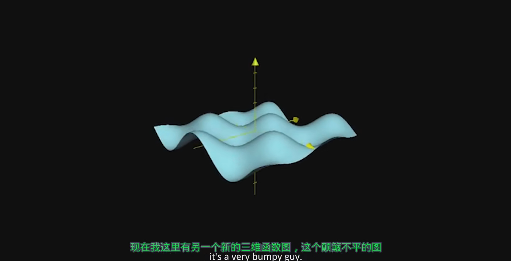

上图, 是 stem:[f(x,y)=cos(x) sin(y)] 的函数图像. 同样, 每个点上z轴的坐标, 就是函数的输出值.

我们把 x=0 代入进去, 而y的值仍然可以随便动. 这意味着我们就得到 stem:[ f(0,y)= cos(0) \cdot sin(y) = 1 \cdot siny]

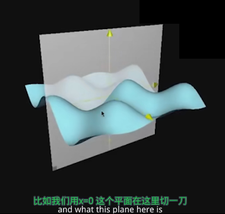

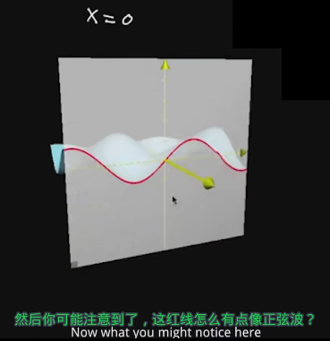

若把 y=0 代入进去, 就得到 stem:[ f(x,0)= cos(x) \cdot sin(0) = 0]

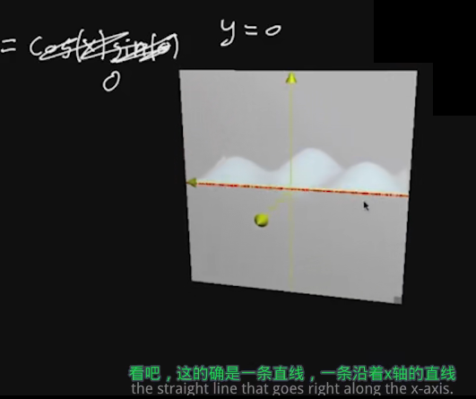

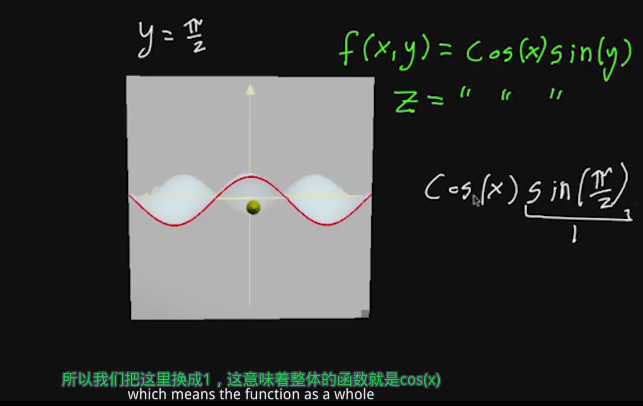

*所以, 当你拿到一个三维函数的时候, 其图像较难看穿, 要想更好的理解该函数, 一个比较好的方法是: 将函数中的一个参数固定为常数, 放开另一个参数, 再来看它的图像.* 这样, 它就变得不再那么复杂, 而是变成了一个普通的二元函数.

这种切片的思想, 在我们学习"偏导数"时, 也非常重要.

---

==== 等高线图

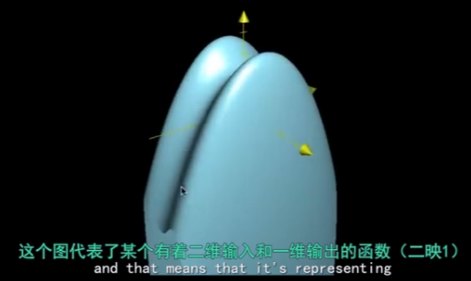

一种通过二维图, 来描述这种函数和图像(三维图像)的方法, 就是"等高线图".

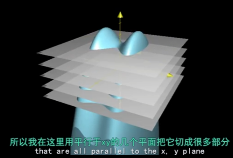

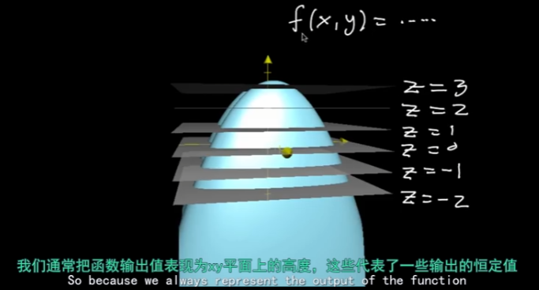

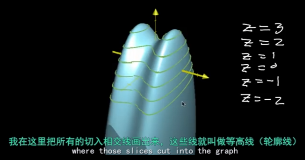

然后, 把这些等高线, 压倒 xy平面上.

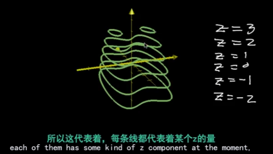

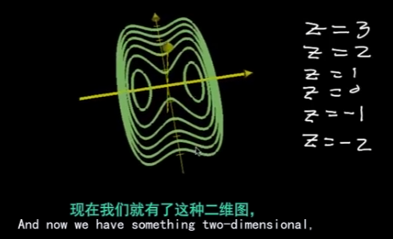

等高线图, 每条线代表了函数的一个常数输出.

在线条密集的地方, 就代表极速的高度变化.

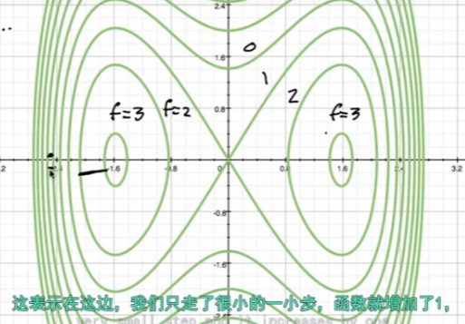

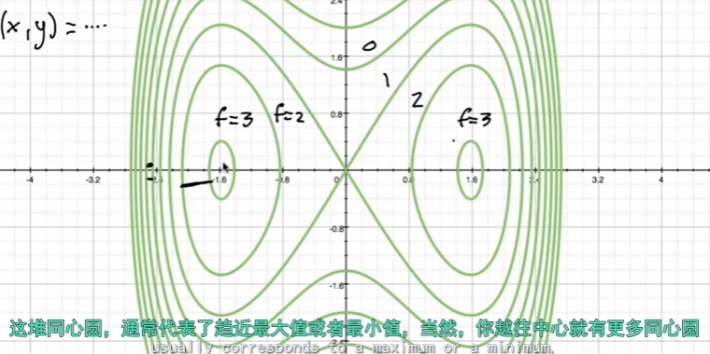

另一种对"等高线图"的常见操作, 就是上色.

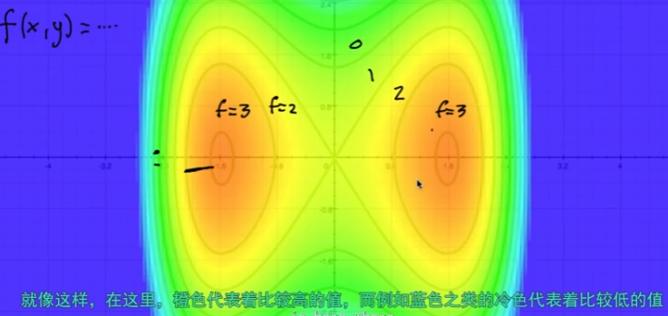

---

==== 参数化函数

.标题
====
假设有一个函数, 它接收一个输入变量t, 输出一个向量. 这个向量里的内容,是关于t的函数. 即: +
\begin{align}
f(t)= \left[ \begin{matrix}
t \cdot cos(t)\\
t \cdot sin(t)\\
\end{matrix} \right]
\end{align}

这个就是所谓的"一元参数函数" one-parameter parametric function. 之所以说它是一个"参数函数", 是因为它在输出空间中, 绘制了一条曲线. 一般这种函数的输出是多维的.

该方程, 输入值 t 取 0-10 时, 输出值就是下图中的螺旋曲线.

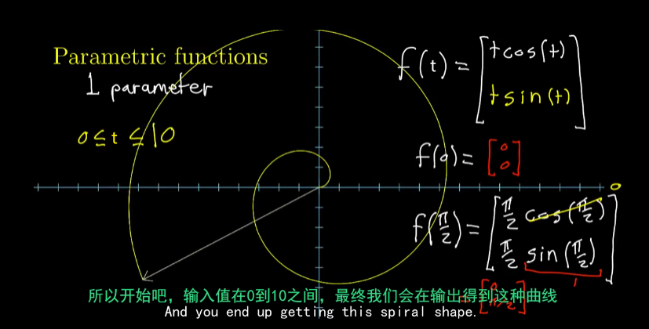
====

.标题
====
看这个函数: +
\begin{align}
f(t,s) = \left[ \begin{matrix}
3 cos(t) + cos(t) cos(s)\\
3 sin(t) + sin(t) cos(s)\\
sin(s)\\
\end{matrix} \right]
\end{align}

这个函数接收一个2维的输入, 即输入拥有两个维度的坐标, 然后输出一个3维的向量. 该向量中每一个分量, 都是一些 cos 和 sin 的表达式.

我们先给它输入一个值, 比如 (t=0, s=π), 输出值就是 [2,0,0], 即仅沿着x轴2个单位的那个点.

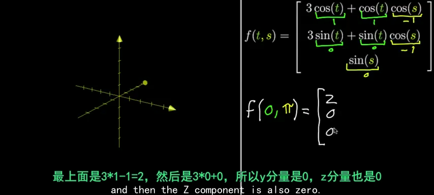

假如我们把参数s固定在=π, 让t自由变化. 现在的输出, 就变成了: +
\begin{align}
f(t,π) = \left[ \begin{matrix}
3 cos(t) - cos(t)\\
3 sin(t) - sin(t) \\
0\\
\end{matrix} \right]
=
2\left[ \begin{matrix}
cos(t)\\
sin(t)\\
0\\
\end{matrix} \right]
\end{align}

其输出的图像, 就是一些圆圈.

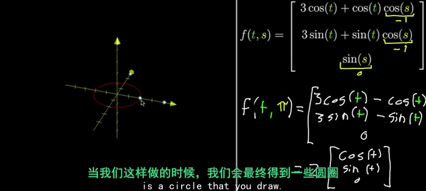

如果让参数s自由变化, 让t保持固定, 也会得到圆圈, 不过空间位置不同:

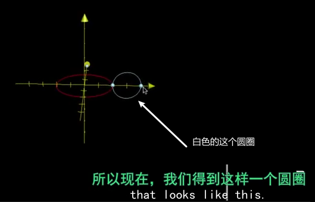

如果你让 s 和 t 都自由变化的话, 就想象:让s自由变化的这个白色圈, 扫过让t自由变换的这个红色圈, 你就会得到这样一个形状: 圆环面 torus -- 像个甜甜圈:

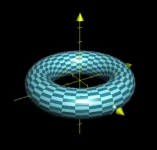

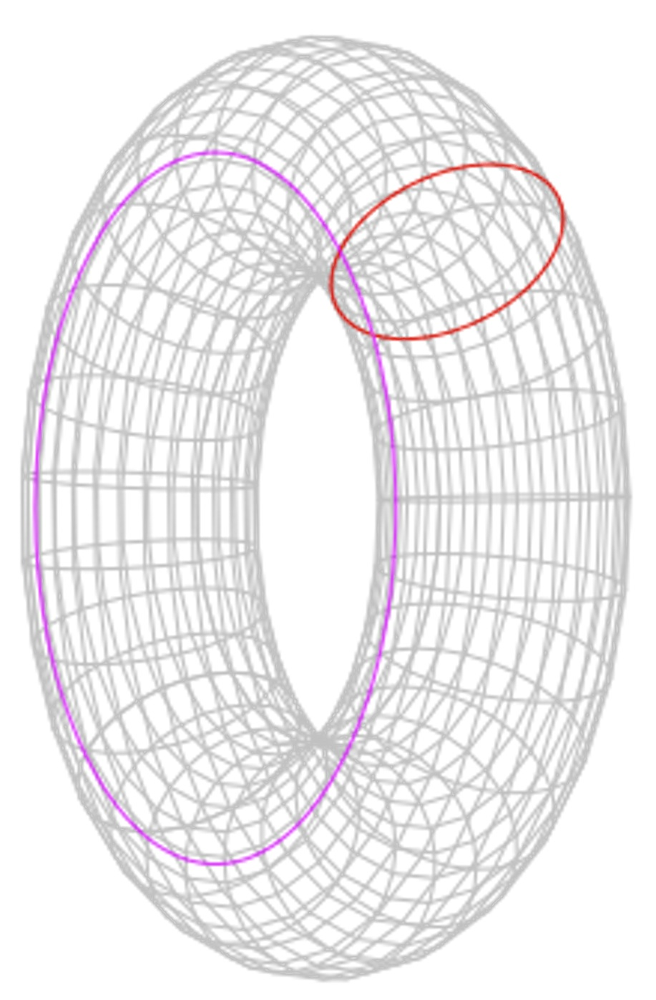
====

---

==== 一种思考函数的方式, 就是: 变换 transformation

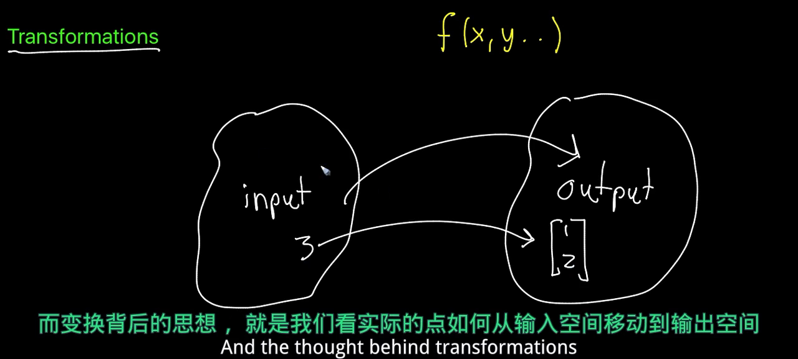

.标题
====
例如： +
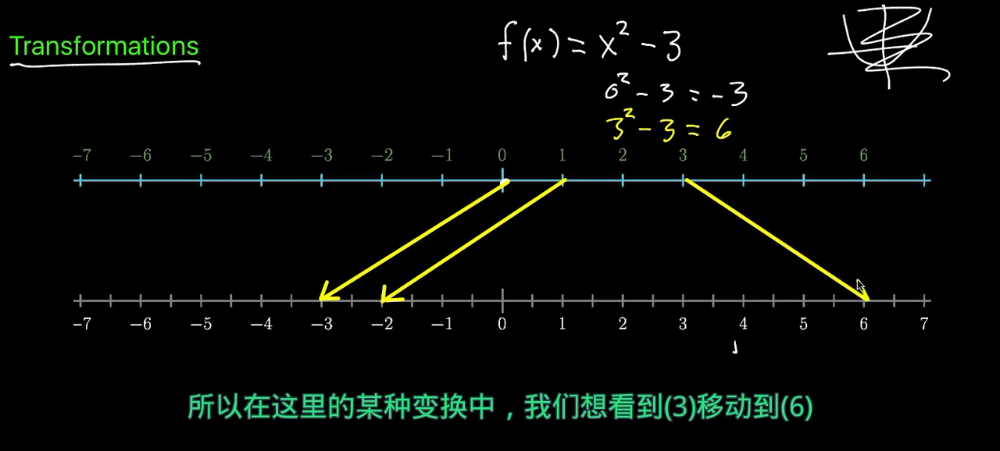

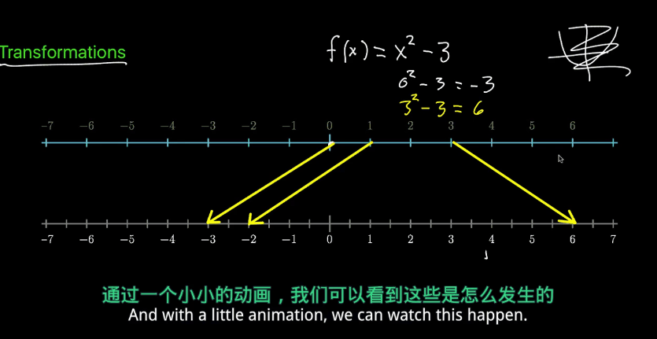

如上图, 我们要观察: 每个输入的数字, 移动到了输出的哪个位置?
====

.标题
====
现在, 让我们考虑这个函数, 它有着一维的输入, 二维的输出: +
\begin{align}
f(x) = \left[ \begin{matrix}
cos(x)\\
x \cdot  sin(x)\\
\end{matrix} \right]
\end{align}

你输入0, 则输出值就是 [1,0] 这个向量. +
你输入π, 则输出值就是 [-1,0] 这个向量.

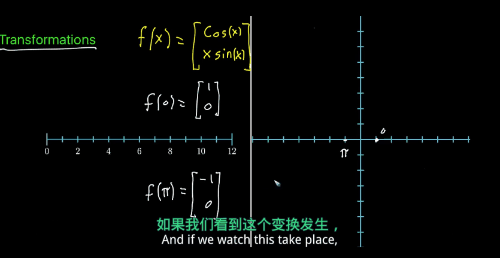
====

.标题
====
当输入值是二维的(来自二维空间), 输出值也是二维的(去往二维空间)时, 我们通常考虑把"输入空间", 和"输出空间", 放在一起来观察.

比如这个函数: +
\begin{align}
f(x,y)= \left[ \begin{matrix}
x^2 + y^2\\
x^2 - y^2\\
\end{matrix} \right]
\end{align}

其 stem:[ f(0,0)=\[0,0\]^T], 意味着函数会把"原点"映射到"原点"本身. 因此, 我们把这个点, 称为"函数的定点"(固定不动的点).

其 stem:[ f(1,1)=\[2,0\]^T],

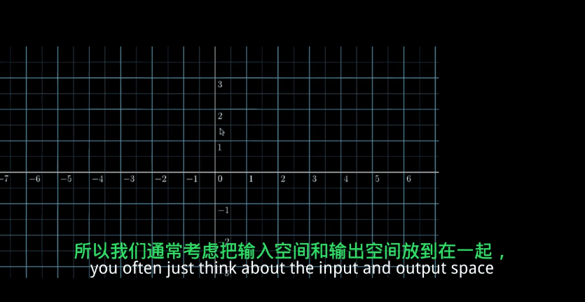

注意: 动画的变形过程是随意的. 只要"输入值"和"输出值"对应上即可. (这个很像"线性代数"中的矩阵变换)
====

*我们使用"变换"这种方式, 来理解函数, 意义在哪里呢? -- 在数学中, 或者说在函数中, 有很多概念, 当你从"变换"的角度去理解这些概念时, 它会给你更透彻的理解. 比如: 偏导(偏微分 derivatives), 及各种"偏导"的衍生物(比如"雅可比矩阵"). 而类似的这些概念, 当你从"向量场"或"函数图像"去理解的时候, 并不是很形象.*

除此之外, "变换"在"线性代数"中, 也是一个很重要的概念(线性变换). 所以, "变换"的概念, 在理解"线性代数"和"多元微积分"的联系中, 起到关键的作用.

.标题
====
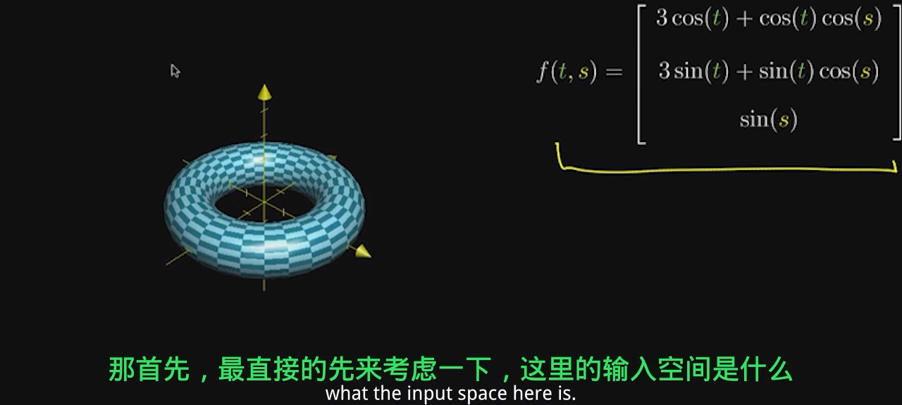

上图函数的输入空间, 可以认为是整个 ts平面. 我们来观察下, 这里的每一个点, 映射到了哪里?

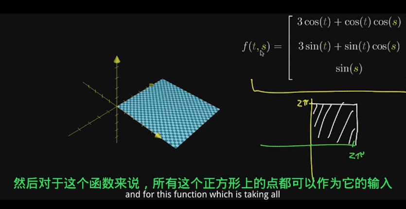
====

---
