= 偏导数 Partial derivative
:toc: left
:toclevels: 3
:sectnums:

---

== 偏导数 几何意义

=== 偏导

stem:[ f(x,y) = x^2 y +sin(y)]  ← 该多元函数, 只输出一个一维的数. 问:这个函数的导数是什么?

我们先思考一下普通导数的定义: 它表示着"由微小的输入引起的微小输出的改变比例" the resulting change in the output /after you make that initial little nudge. 所以, df 就是改变的结果. 所以, 当你从这种函数图去考虑 stem:[ (df)/(dx)]的时候, 它就是"斜率"

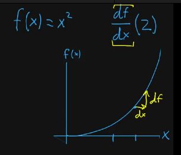

如你如果仔细思考一下, 我们也不一定要从这种函数图去考虑导数. **你可以这样想象: 输入空间是一条一维度的线, 输出空间也是一条一维度的线. 然后, 第一条线上的数, 以某种方式映射到第二条线上. 在这种情况下 你的微小改变 dx, 会变成第一条数轴的微小移动. 然后我们想知道: 这个微小改变, 会如何影响函数的输出? **

也许**"输出"的改变, 会是"输入"改变的4倍, 这就意味着: 你在那个点的导数是4.**

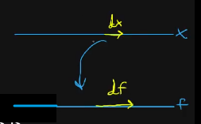

即, 我们在"多元函数的导数问题"中, 也可以这样考虑:  输入空间在x方向上有了一个微小的改变, 是如何影响输出的? how does a tiny change in the input in the x direction influence(v.) a output?

不过在多元函数中, 我们要考虑的输入空间, 不是一维的, 而是二维的xy平面. 比如:

\begin{align}
& \frac{df} {dx}(1,2)  <- 是问: 在[1,2]^T 点处, dx代表的x方向的微小变化, 是如何影响函数输出值的? \\
& \frac{df} {dy}(1,2)  <- 是问: 在[1,2]^T 点处, dy代表的y方向的微小变化, 是如何影响函数输出值的? \\
\end{align}

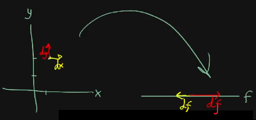

不过, 在"偏导"中, 我们不再用 stem:[ (df)/(dx)] 这种方式去写它们, 而是采用了一个新符号: stem:[ (∂f)/(∂x)], 它用来提醒人们: 这个导数算子涉及到的是"多元函数".  ∂ 是 delta, 不过一般读做 partial.

.标题
====
比如： stem:[ f(x,y) = x^2 y + sin y], 在 stem:[\[1,2\]^T] 点的导数是什么?

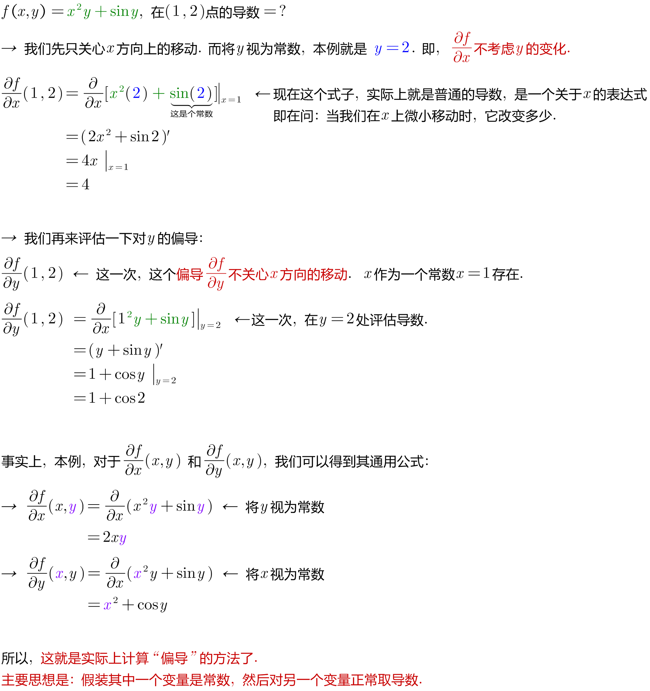

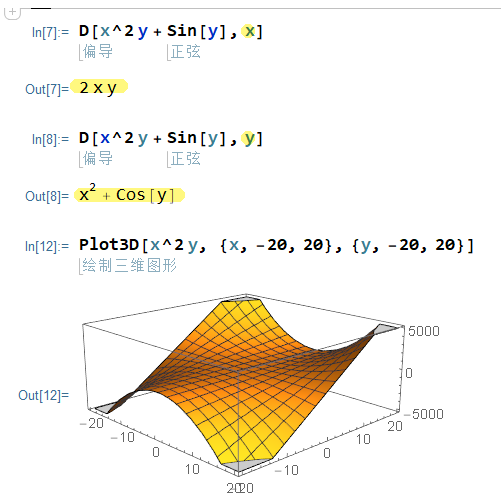
====

*你可以想象成, 这是由输入中某一个方向(dx)的微小移动, 引起的函数值改变. 然后是另一个方向(dy)的输入的微小移动, 而影响的函数值改变. you're just moving in one direction for the input /and you're seeing how that influences(v.) things. And then, you might move in one direction for another input /and see how that influences(v.) things.*

**因此, 图像和斜率, 不是理解"导数"的唯一方法 (此方法维度局限性很大). 因为当你考虑"多维映射到多维"的向量函数, 或者是"输入空间超过2个维度的标量函数"时, 你就无法从这种三维函数图和斜率去思考"偏导"了. **

而后面这种方法: "考虑输入空间的微小移动, 是如何影响到输出空间的变化"的思考方式, 和"取'输出的微小移动', 对'输入微小移动' 的比例(即导数)", 才是更一般化的思考"偏导"的方式. This idea of nudging(v.) the input in some direction, seeing how that influences(v.)  the output, and then *taking* the ratio of that output nudge *to* the input nudge, that's a more general way of viewing things.

....
nudge /nʌdʒ/
[ VN] to push sb gently, especially with your elbow, in order to get their attention （用肘）轻推，轻触 +
to push sb/sth gently or gradually in a particular direction （朝某方向）轻推，渐渐推动 +
用胳膊肘挤开往前走 +
to reach or make sth reach a particular level （使）达到，接近

- She nudged me out of the way. 她将我慢慢地推开了。
- Inflation is nudging 20%. 通货膨胀即将达到20%。
....

---

=== 偏导和函数图切片

.标题
====
例如： +
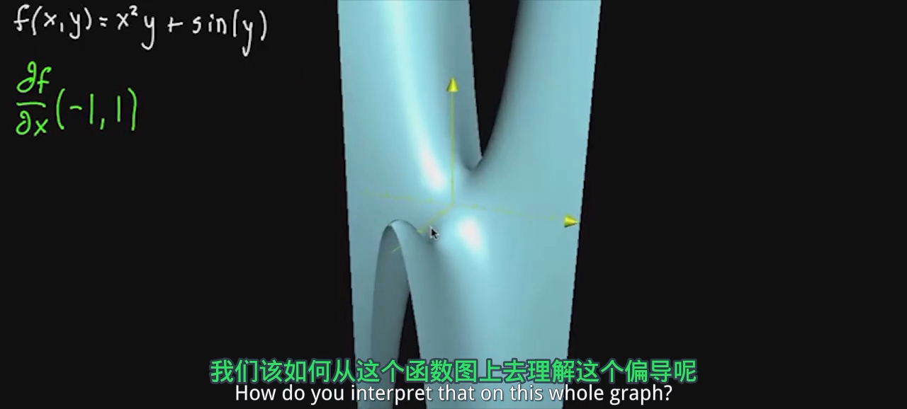

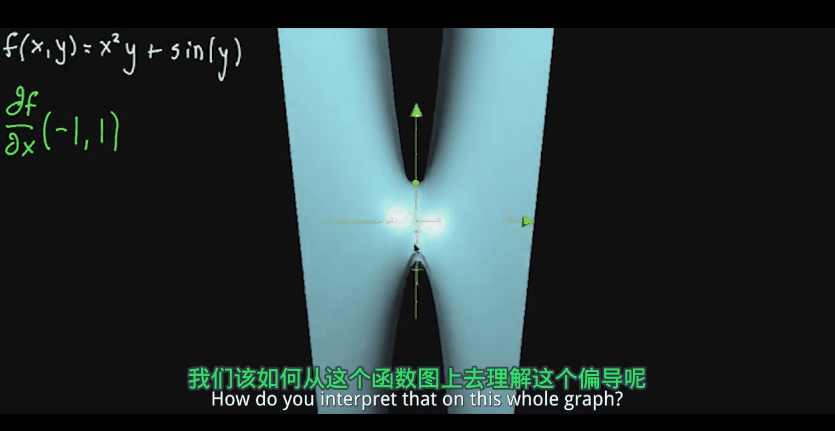

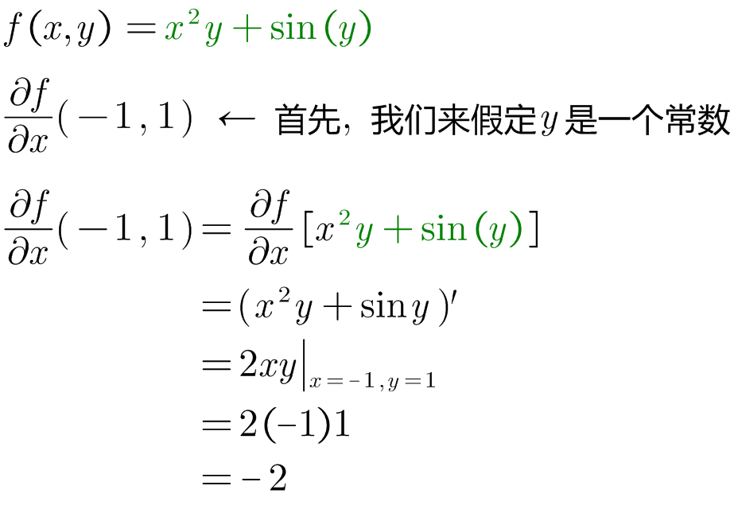

或许你在想: 这是不是在x方向轻微移动后, 在f产生的效果? 这对于函数图像又是代表着什么呢?

首先, 你把y视为一个常数的话, 基本上意味着可以以"y=那个常数值"的平面, 来切割函数图,

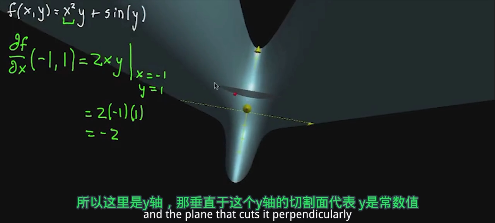

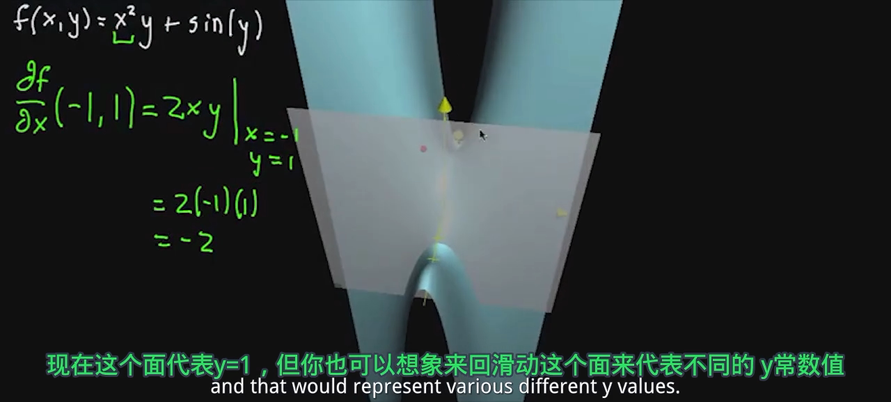

*这个切片, 上的所有的点, x坐标值全部相同, 只有y坐标和z坐标值是不同的, 变化的.*

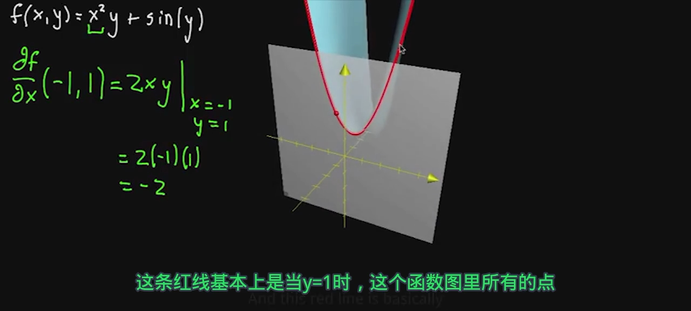

我们实际上已经可以将"偏导"解释成"斜率"了.

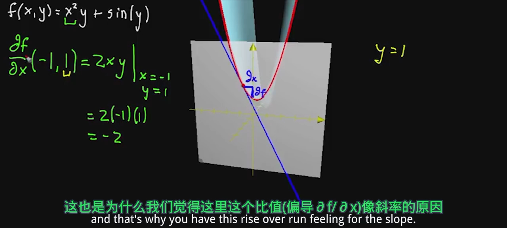

我们发现这条切线的斜率是 -2, 正好对应了我们的导数值.

下面,我们再对 x=常数= -1, 做切片

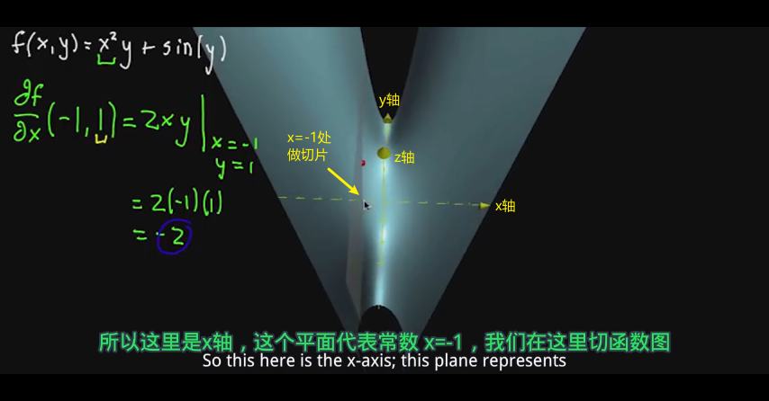

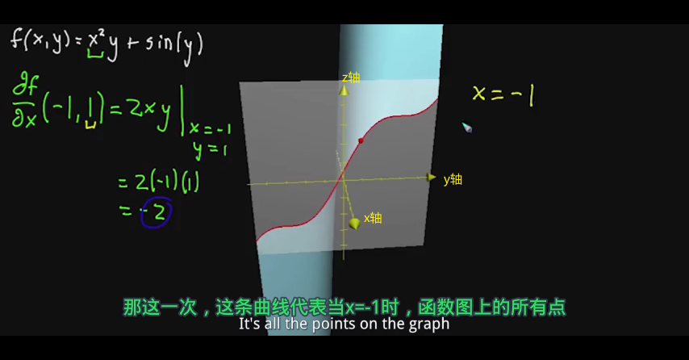

即, 上面的切片平面, 只有yz两个维度.  现在我们取"偏导"的话, 就能将其解释为是这条割曲线的斜率.

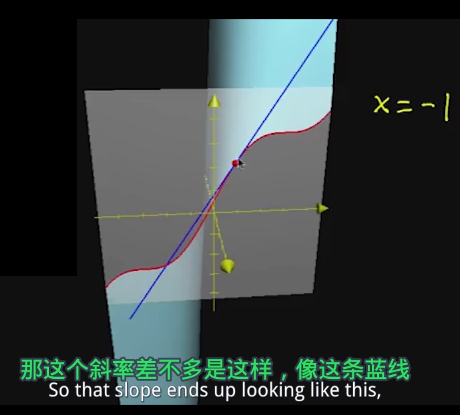

我们继续计算一下 stem:[ \frac{∂f} {∂y}] ← ∂f 就是 ∂z, 也证明了这个平面, 只有yz两个维度.
====

*所以, "偏导", 可以理解成三维函数图像的切片处"相交线"曲线的斜率.*

因此, 对于这种"二维输入"和"一维输出"的函数来说, 我们是可以从函数图去思考的. 但是对于其他函数, 情况可能就无法如此了. 比如, 那些是"多维输出"的函数, 你就无法可视化这些函数图.

---

=== 偏导的正式定义

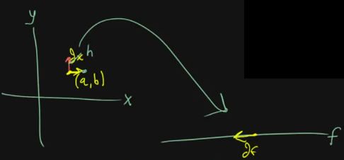

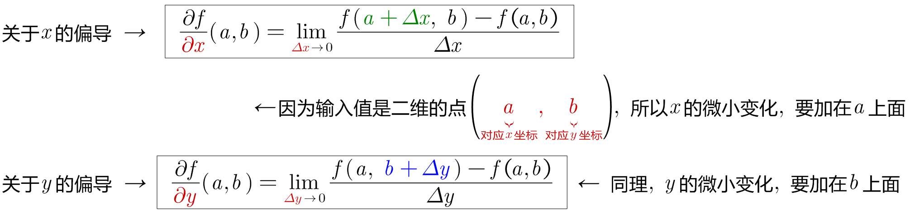

---

=== 二阶偏导 second partial derivatives

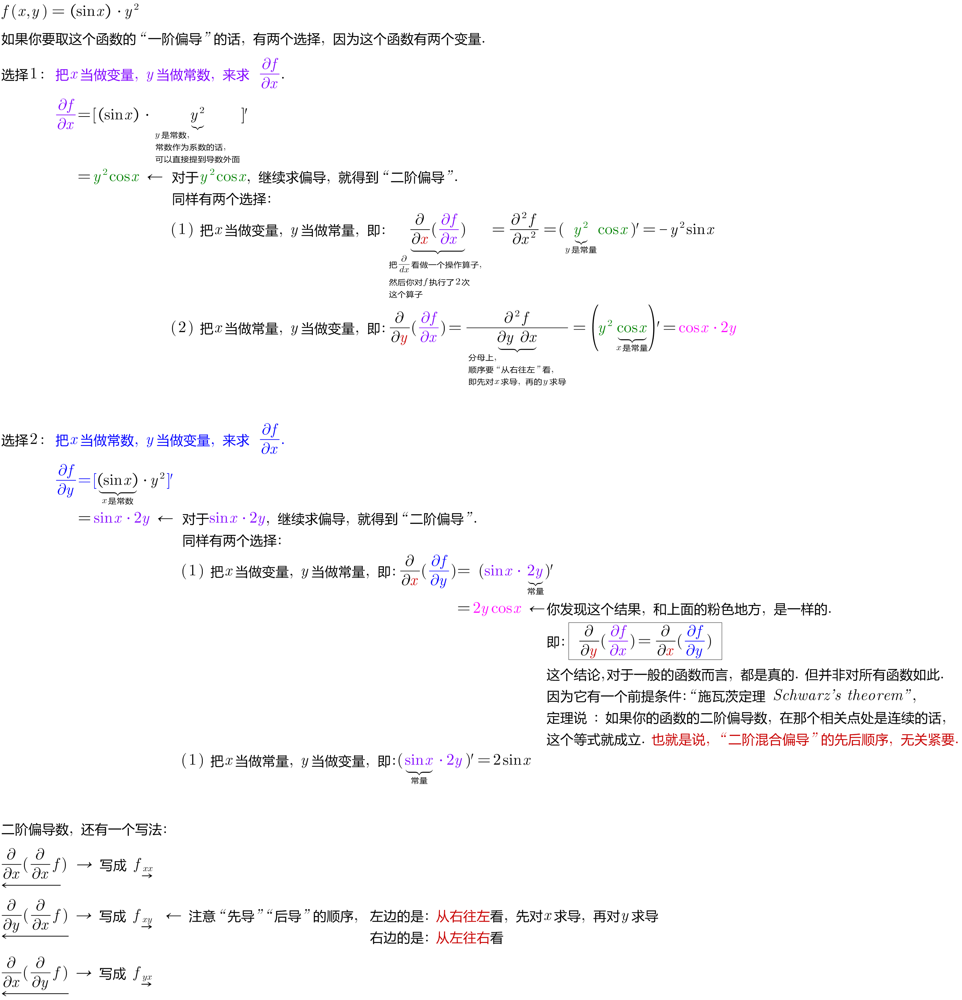

---

== 偏导数 Partial derivative

对于二元输入函数 stem:[ z = f(x,y)]来说, 它接收两个参数x,y, 所以每个参数都有一个"偏导数".

[options="autowidth" cols="1a,1a"]
|===
|Header 1 |Header 2

|对 x 的偏导数:
|*就是把 y 固定在 stem:[ y_0]处, 只剩 x 一个变量来变化.* 即, x在stem:[ x_0]处有一个增量 Δx,  则该函数对 x 的导数就是: stem:[ lim_{Δx -> 0} \frac{ f(x_0+ Δx, y_0) - f(x_0, y_0)} {Δx}]  ← 现在变化的只有 stem:[ x_0], 而 stem:[ y_0] 是固定住的.

对 x 的偏导数, 可以有下面几种写法:

- stem:[ \frac{∂z} {∂x} \|_{x= x_0, \ y=y_0}]
- stem:[ z_x^' \|_{x= x_0, \ y=y_0}]
- stem:[f_x^' (x_0, y_0) ]

|对 y 的偏导数:
|*就是把 x 固定在 stem:[ x_0]处, 只剩 y 一个变量来变化.* 即, y在stem:[ y_0]处有一个增量 Δy,  则该函数对 y 的导数就是: stem:[ lim_{Δy -> 0} \frac{ f(x_0, \ y_0+Δy) - f(x_0, y_0)} {Δy}]  ← 现在变化的只有 stem:[ y_0], 而 stem:[ x_0] 是固定住的.

对 y 的偏导数, 可以有下面几种写法:

- stem:[ \frac{∂z} {∂y} \|_{x= x_0, \ y=y_0}]
- stem:[ z_y^' \|_{x= x_0, \ y=y_0}]
- stem:[f_y^' (x_0, y_0) ]
|===

---

== ① 如何求对 x 的偏导? -> 把 y 视为常数, 直接对 x 求导就行. ② 如何求对 y 的偏导? -> 把 x 视为常数, 直接对 y 求导就行.

.标题
====
例如： +
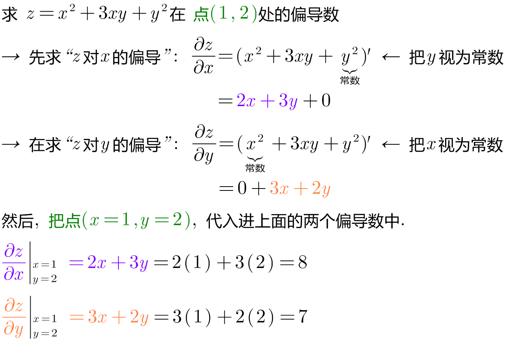
====

.标题
====
例如： +
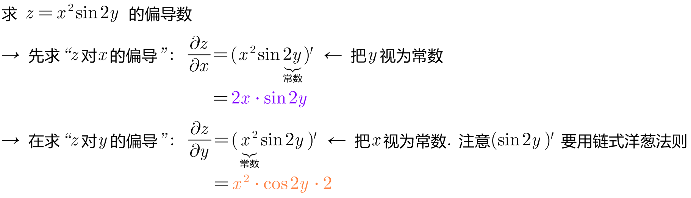
====

.标题
====
例如： +
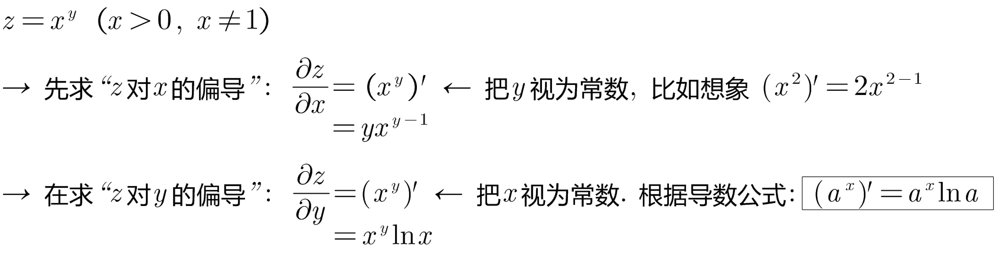
====

.标题
====
例如： +
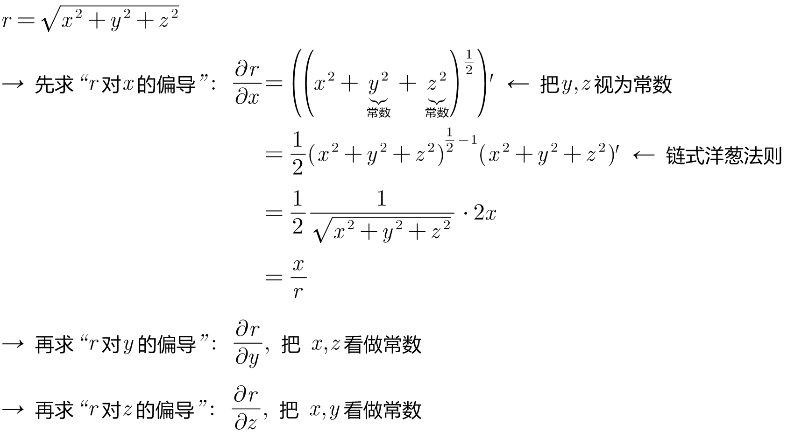
====

---

== 偏导数的几何意义

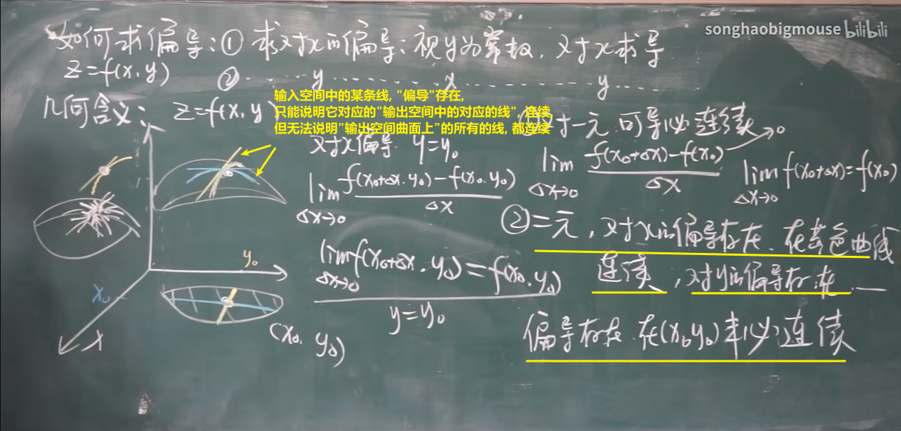

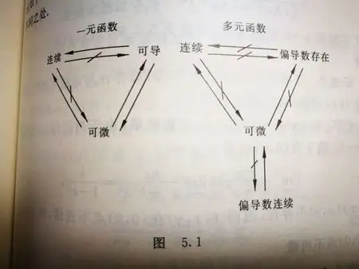

.标题
====
例如： +
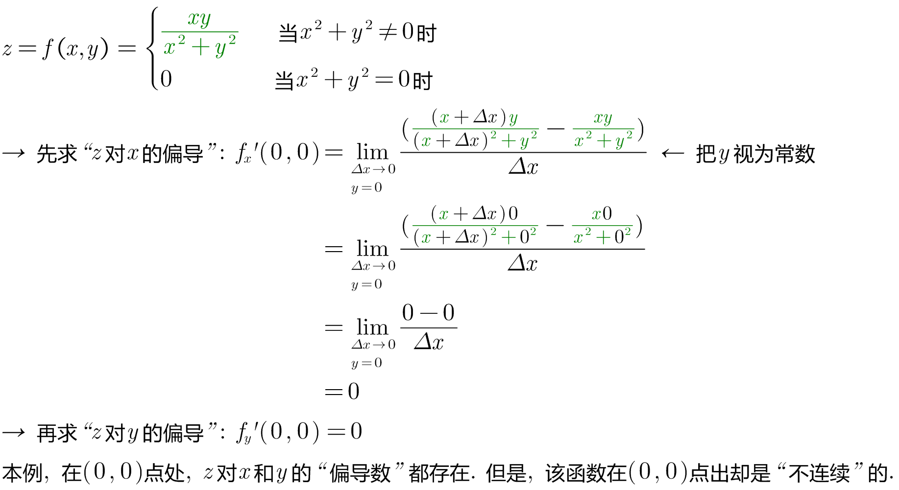
====

---

