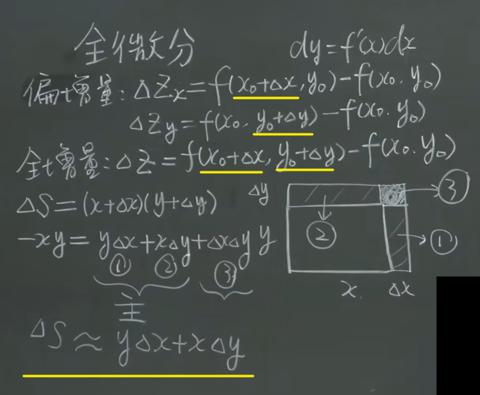
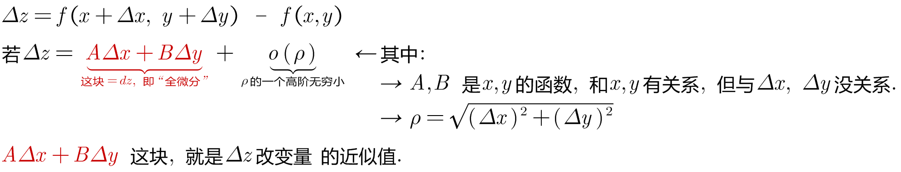

= 全微分 total differential
:toc: left
:toclevels: 3
:sectnums:

---

== 全微分 total differential

- 偏增量, 就是多元函数中的 一个参数保持不变, 让另一个参数变化.
- 全增量, 就是多元函数中, 让全部参数都变化.

---

https://www.bilibili.com/video/BV1Eb411u7Fw?p=92&vd_source=52c6cb2c1143f8e222795afbab2ab1b5

10.56
