= 多元复合函数求导
:toc: left
:toclevels: 3
:sectnums:

---

== 多元复合函数求导

====  z= f(u,v),  u=φ(t), v= φ(t)  <- "z对t 的导数"

(z-> t) = (z -> u -> t) + (z -> v -> t)

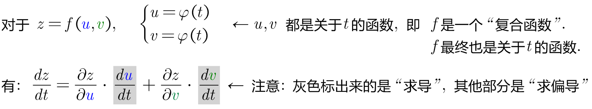

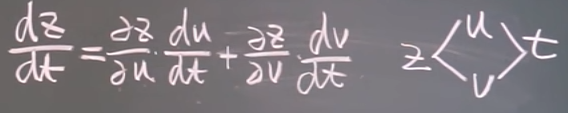

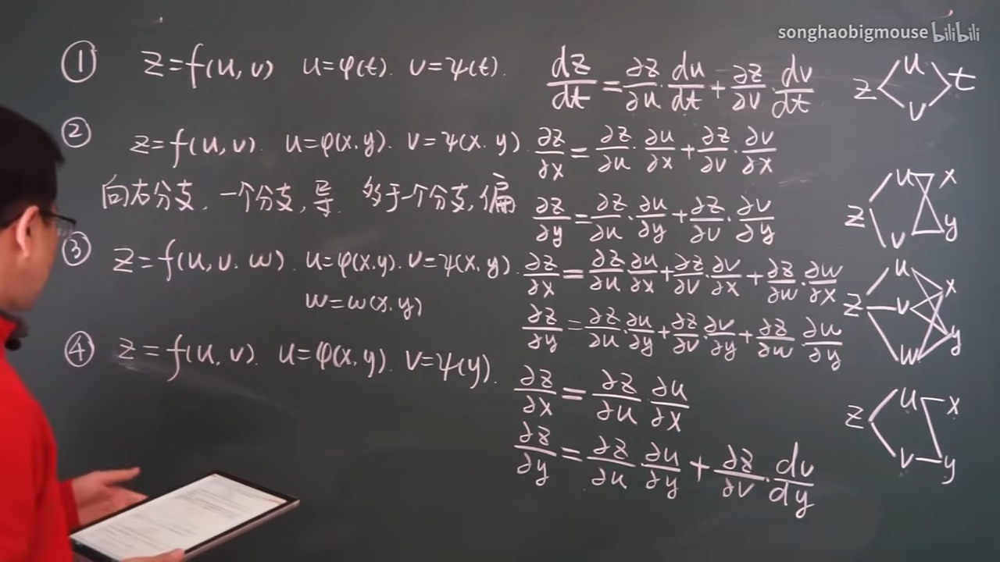

*上面的"变量路线图"中, 向右的分支, 只有一个分支存在的话, 就是"求导". +
向右的分支, 有2个或2个以上的分支存在, 就是"求偏导".*

---

==== z= f(u,v),  u=φ(x,y), v= φ(x,y) <- "z对x与y 的导数"

(z-> x) =  (z -> u -> x) + (z -> v -> x)

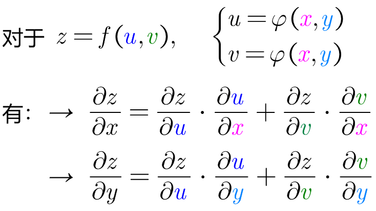

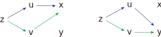

即, 对于 stem:[ \frac{∂z} {∂x}], 起点是z, 终点是x, 中间路过的变量要遍历. +
对于 stem:[ \frac{∂z} {∂y}], 起点是z, 终点是y, 中间路过的变量要遍历.

---

==== z= f(u,v, w),  u=φ(x,y), v= φ(x,y),  w= φ(x,y) <- "z对x与y 的导数"

(z-> x) =  (z -> u -> x) + (z -> v -> x) + (z -> w -> x)

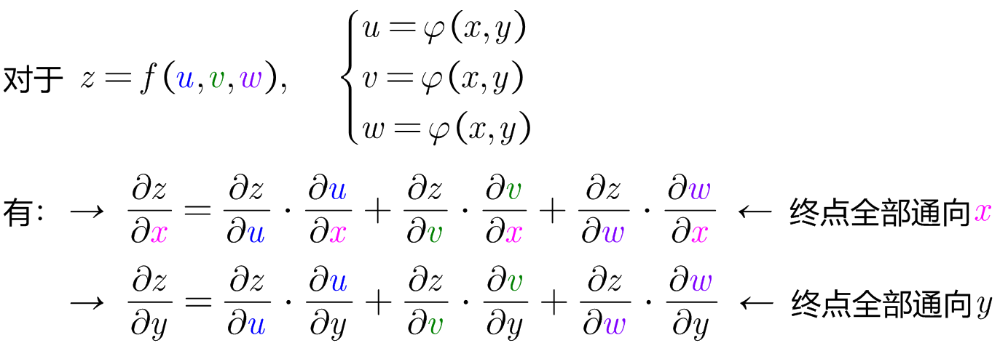

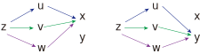

---

==== z= f(u,v),  u=φ(x,y), v= φ(y) <- "z对x与y 的导数"

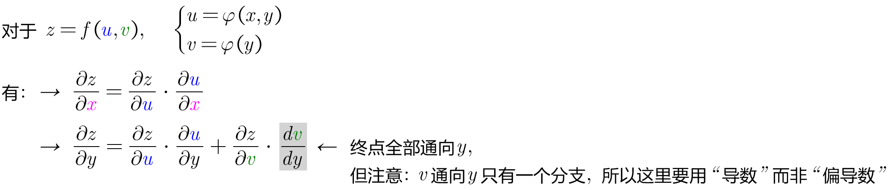

---

==== z= f(u,x,y),  u=φ(x,y)  <- "z对 x与y 的导数"

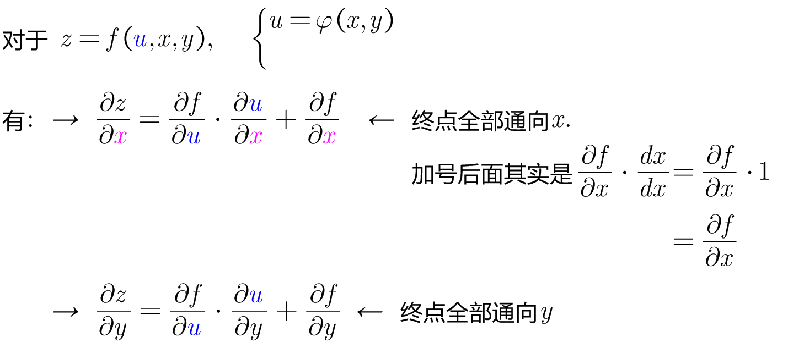

上面的公式中, stem:[ \frac{∂z} {∂x}] 与 stem:[ \frac{∂f} {∂x}] 有什么区别? +
这里是: +
-> **把 z 看做了 (x,y)的函数. 因为z是个复合函数, 最终只有x和y两个变量. 而u只不过是个中间函数而已, u不是最终变量. **  +
-> *把 f 看做了(u,x,y)的函数, 因为 f 函数的参数本来就是 f(u,x,y).*

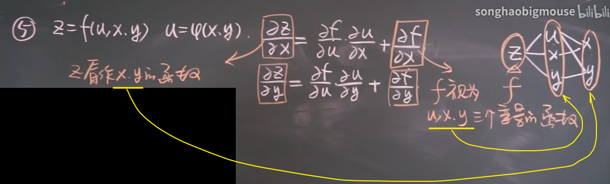

.标题
====
例如： +
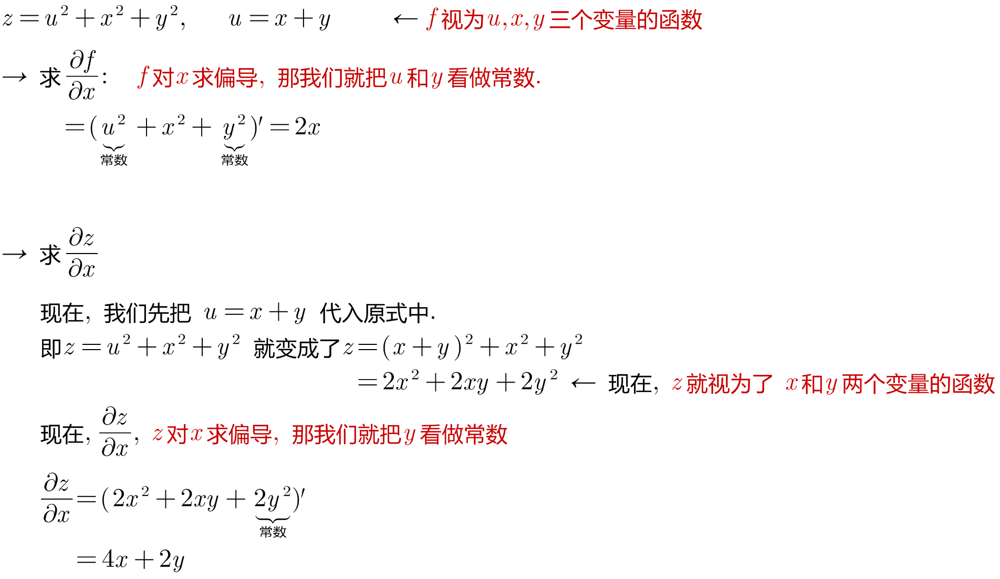
====

.标题
====
例如： +
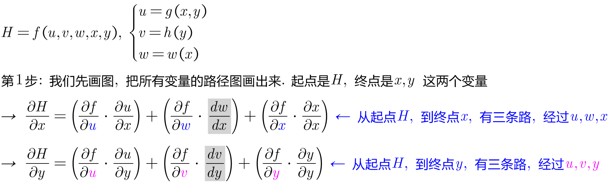

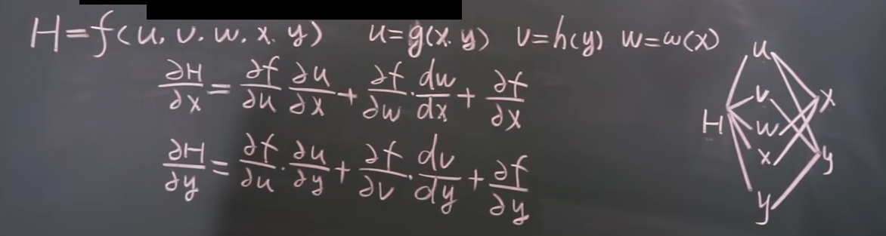
====

---

== 例题

.标题
====
例如：
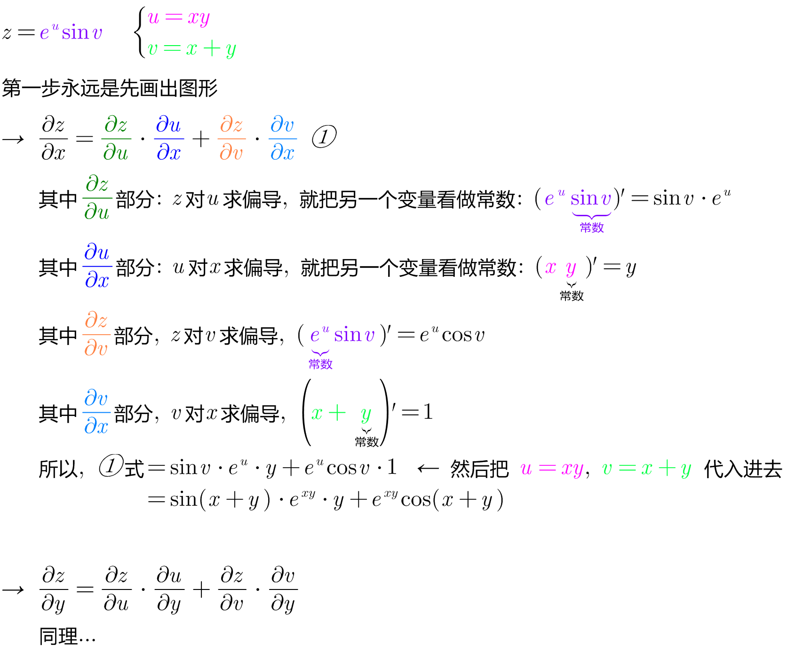

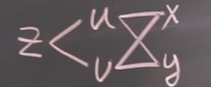
====

.标题
====
例如： +
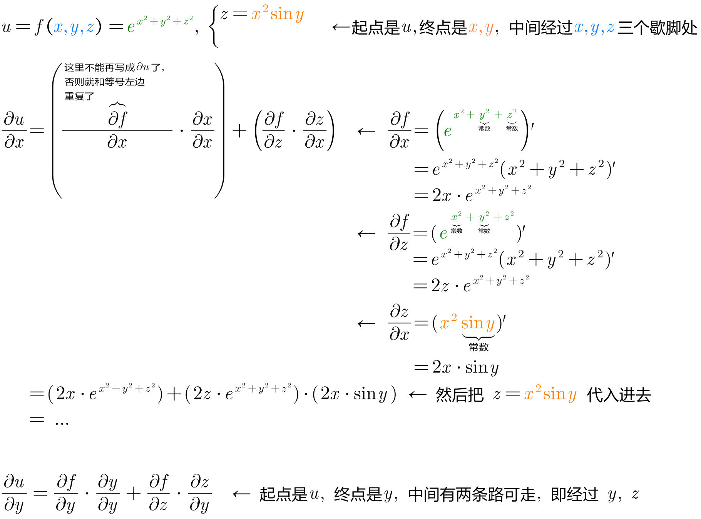

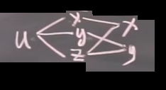
====

.标题
====
例如： +
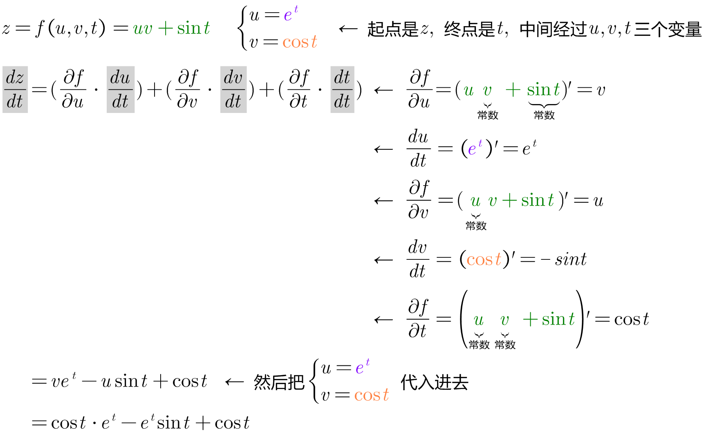

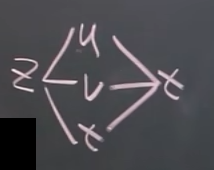
====

---

