= 梯度 gradient
:toc: left
:toclevels: 3
:sectnums:

---

== 梯度 gradient -> ▽f

我讨厌在亮出几何直观之前, 就给出计算方法, 因为通常来说, 这个步骤应该反过来. 但是"梯度"这个概念, 是特例之一. 梯度中, 你的计算方式, 看起来好像与几何直觉无关.

假设你有一个函数 stem:[ f(x,y) = x^2 sin(y)], 而**"梯度"是一种打包一个函数的所有"偏导信息"的方式. The gradient is a way of packing together all the partial derivative information of a function.** 所有, 我们从计算这个函数的"偏导"开始.

.标题
====
例如： +
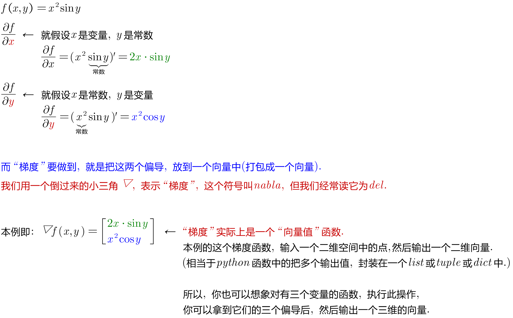
====

....
nabla  /ˈnæblə/ →another name for del  微分算符
....

所以, 我们可以说: 任何(标量)函数的"梯度", 是等于一个"含有该函数偏导"的向量. 即: +
\begin{align*}
▽f= \begin{bmatrix}
 \frac{∂f} {∂x}\\
 \frac{∂f} {∂y}\\
...\\
\end{bmatrix}
\end{align*}

*你可以把"梯度"想成"全导数", 因为它封装了所有你所需要的导数信息.*

也可以把▽ 这个符号, 想象成一个充满了"偏微分算子"的向量. +
你可以拿▽ 想象成来"应用到"f 身上, 它就像一个算子一样能操作这个f函数, 然后得到一个新的函数. 取到了f的"偏x导", "偏y导", 等等.  如果你的函数有100维输入的话, 那么就会有100个偏导在梯度向量里.

以后, 你还会遇到两个算子(operators), 叫做"散度 divergence" 和 "旋度 curl".

"梯度"对于一个叫"方向导数 the directional derivative"的概念来说, 也是一个很重要的工具.

---

== 梯度的几何意义 1

现在, 我们有一个双变量函数: stem:[F(x,y)=z]

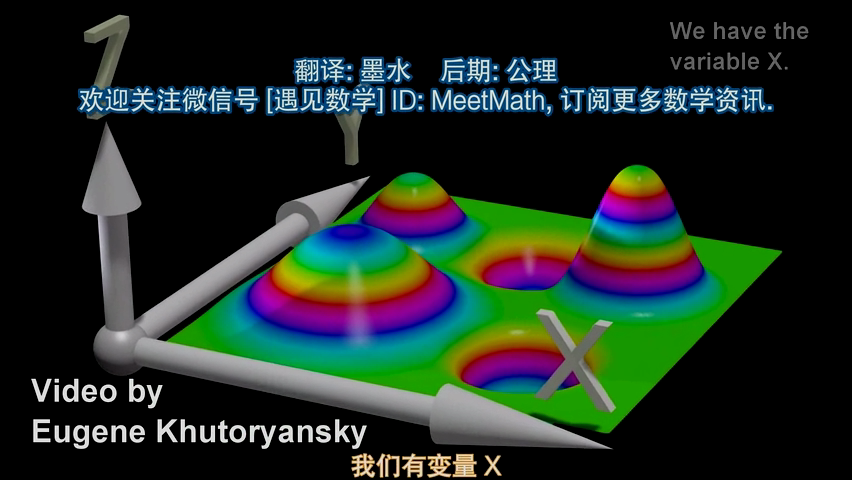

我们固定住x的值, 让y变化. 随着y值的连续变化, 函数的输出值 -- z值也随之改变.

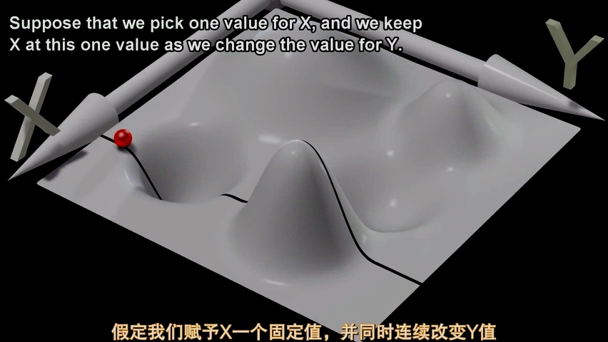

在每个点上, stem:[\frac{"z的变化值"} {"y的变化值"}] 这个比值, 即stem:[\frac{∂z} {∂y}], 就是此线的"斜率".

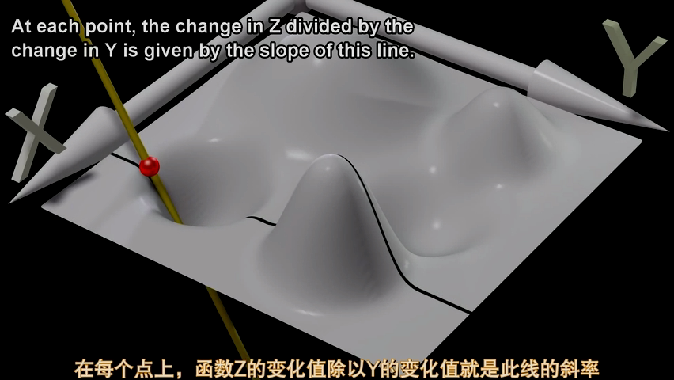

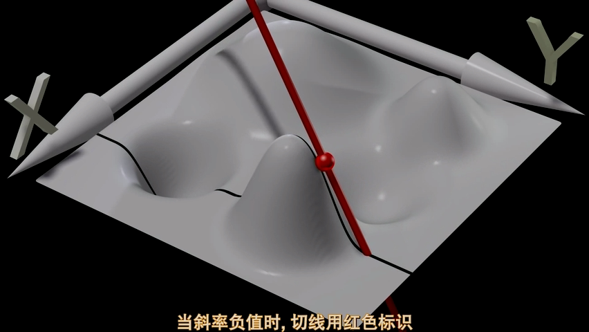

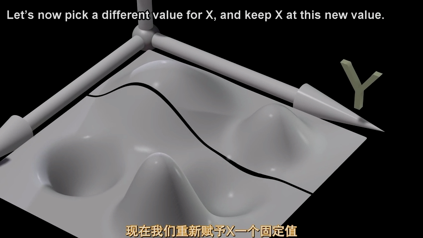

stem:[\frac{"z的增量"} {"y的增量"}] 这个比值, 我们就称之为"z对于y的偏导数".  +
The chagne in Z divided by the chagne in Y /is what we refer to as the derivative of Z with respect to Y.

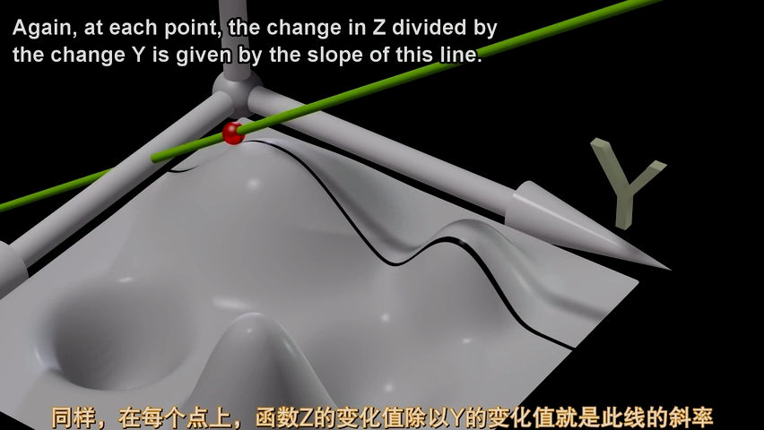

图中的每个点, 都有一个 "z对于y 的偏导数" stem:[\frac{∂z} {∂y}]; 也都有一个 "z对于x 的偏导数" stem:[\frac{∂z} {∂x}].

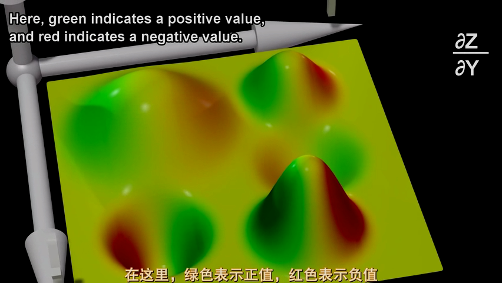

"z对于x 的偏导数" stem:[\frac{∂z} {∂x}], 也就是说, 在这种情况下, y值是固定的, 变动的只有x 和z.

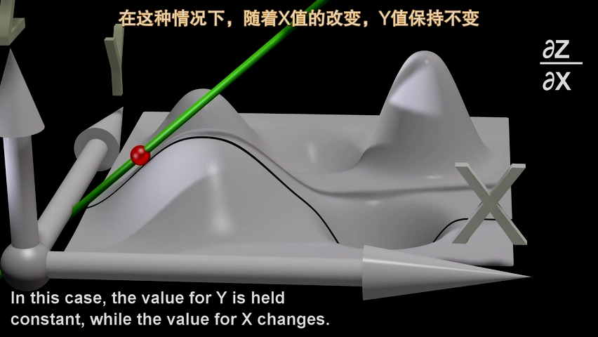

假如我们用一个箭头, 来表示该线的"斜率", *箭头的方向, 就表示斜率的"正负"; 箭头的长度, 表示函数在z方向上斜率的大小(越陡峭, 则箭头长度越长). The length of this arrow /indicate(v.)  by how much Z is increasing  in this direction.*

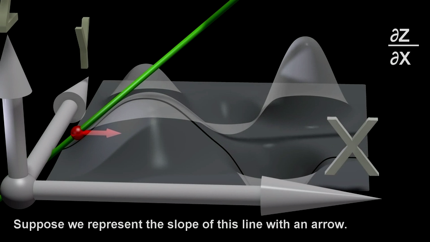

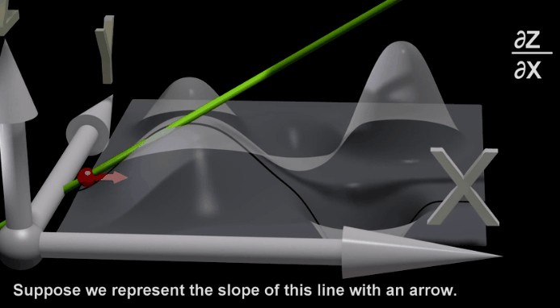

每个点, 都有一个箭头, 来表示"z对x 的偏导数" stem:[\frac{∂z} {∂x}]; 也都有一个箭头, 来表示"z对于y 的偏导数" stem:[\frac{∂z} {∂y}].  那么如何把这两个箭头合二为一来表示呢? 就是用"向量的加法", 平行四边形法则, 得到第三个向量箭头.  这个新箭头, 就叫做"梯度". 它总是指向函数(即z值)增长(升高)最大的方向.

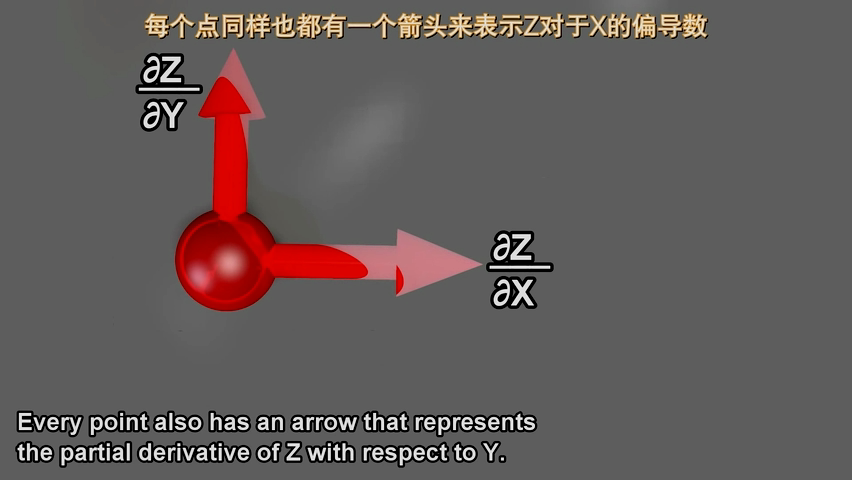

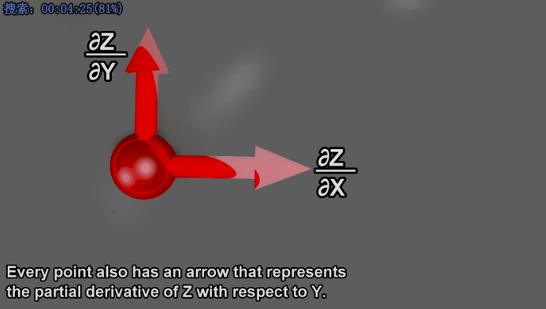

---

== 梯度的几何意义 2

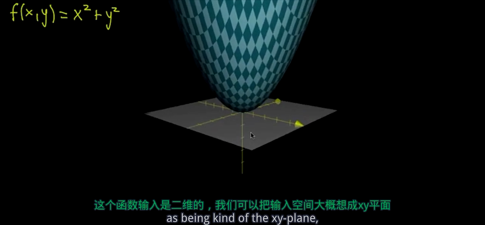

上图的函数, 接受一个二维输入, 输出一个一维的值(加号加在一起, 就变成一个值了). 输出的一维值, 可以理解成 xy平面上的高度 (即z轴值)

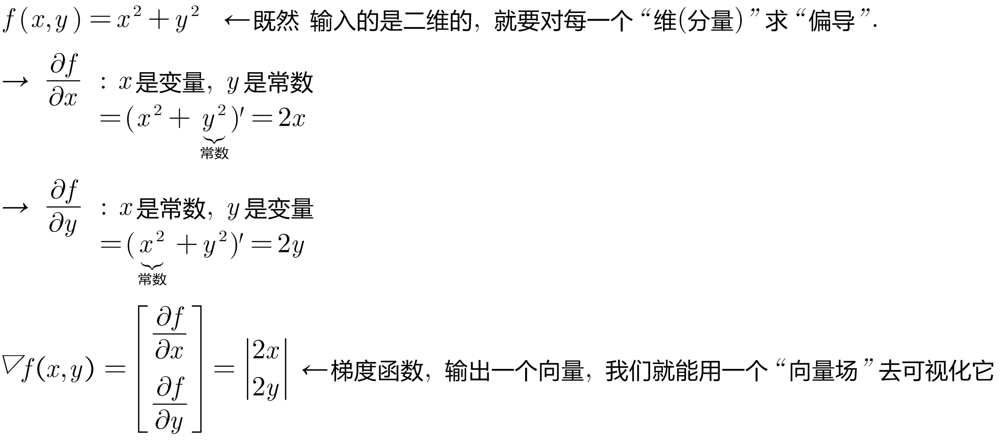

本例的梯度函数, 输入(x,y), 输出 stem:[ \[2x, 2y\]^T], 即, 该梯度函数, 将输入值, 拉长成了原来的2倍. 所以它的图像就是:

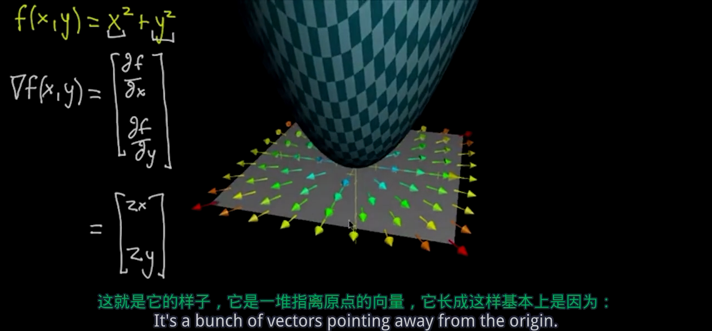

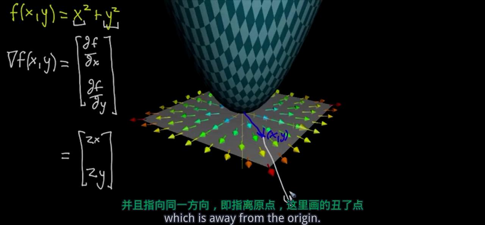

那么这个"梯度场"和我们的函数图, 有什么关系呢?

"梯度"指向"最快上升的地方". the gradient points int the direction of steepest ascent.

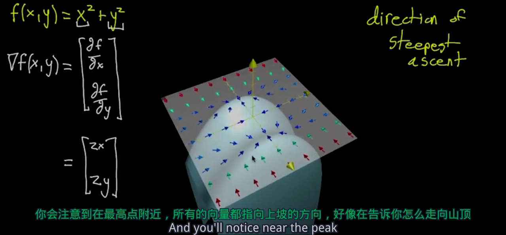

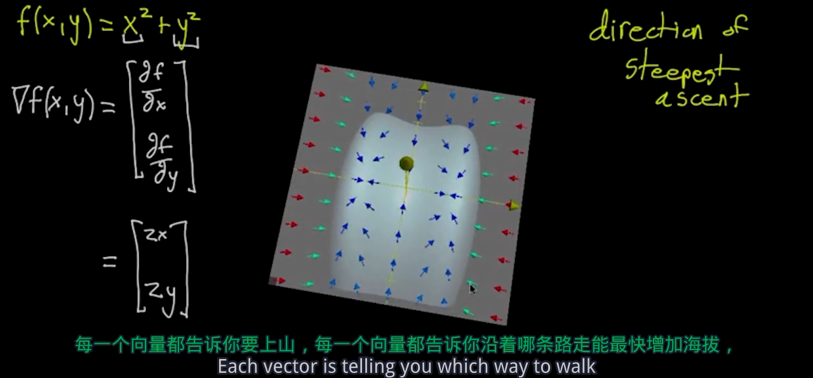

每一个向量, 都告诉你要上山; *每一个向量, 都告诉你沿着哪条路走, 才能最快增加海拔. 这就是"梯度方向"的意义.*

*那么"梯度的长度"呢? 图中, 红色意味着"长的向量", 即这些点对应的是非常非常陡峭的斜坡. 而蓝色的向量附近, 对应的是一些相对平缓的坡度. 知道你到达顶峰时, 坡度甚至变成平的.*  +
*所以, 梯度向量的长度, 实际上告诉了你"上升最快速"的那个地方的"陡峭程度". So the length of the gradient vector /actually tells you the steepness of that direction of steepest ascent.*

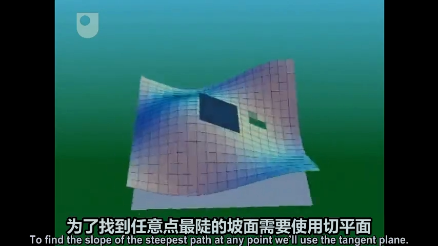

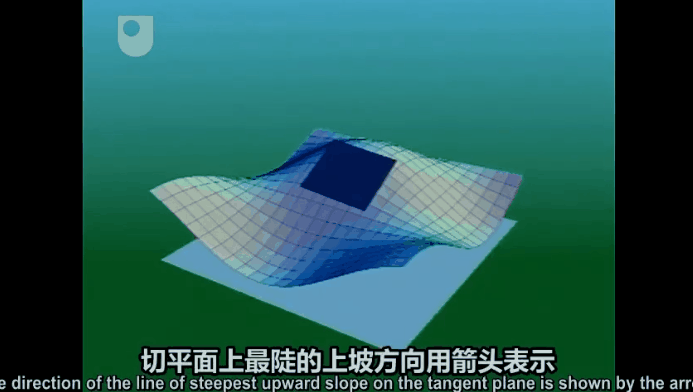

---

== 方向导数 the directional derivative

方向导数, 可以说是"偏导"的一种拓展.

偏导, 它和某些有着"多变量输入"的函数有关, 然后一般是"一个量"的输出, 它当然也能是"矢量(多个量)"的输出.

函数的偏导, 一种理解方式是: 分别看两个空间: 输入空间, 和输出空间. 本例函数的"输入空间"是二维的, "输出空间"是一维的. 即, 我们就想象它, 是从二维的平面空间, 映射到一维的一条实数线上.

**我们取某个点的"偏导", 比如对x取偏导, 你就想象: 在"输入空间"的 x方向上微调一下, 会对"输出空间"导致什么变化? ** stem:[\frac{"输出空间"上的变化} {"输入空间"上的微调变化}], 这个比值, 就是stem:[\frac{∂f} {∂x}]的值.

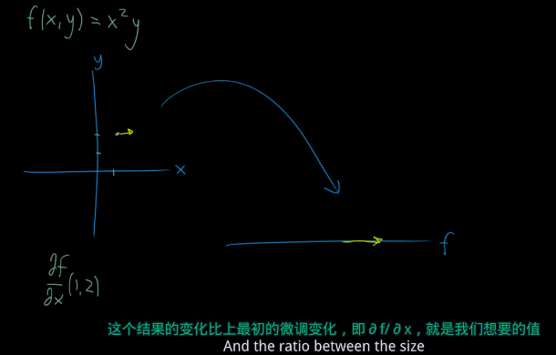

*同理, 当我们对y取偏导时, 就是考虑"输入空间"中的y方向上的微调, 会对输出空间, 引起什么变化.*

*"方向导数"的意思就是说: "输入空间"中的任意一个向量v, 该向量的微调, 为引起"输出空间"中的什么变化?*

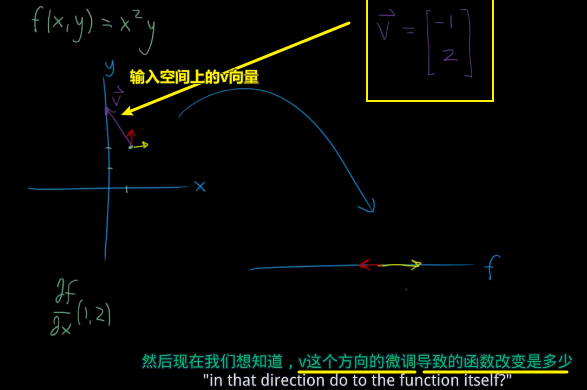

所以, *"方向导数"就是说, 当我们在那个(向量所指向的)方向取一个微调的时候, 会导致输出怎样的改变.*

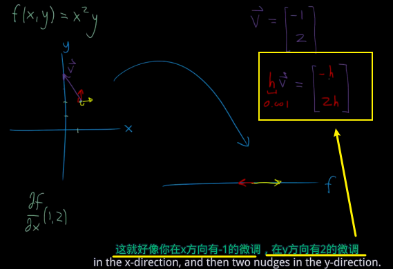

*"方向导数"的符号, 和梯度一样, 都是一个倒三角 ▽.* 然后"方向向量"写在▽的右下标上. 比如: stem:[▽_{\vec(v)}] , 就代表"v方向上的方向导数".

还有其他几种写法: +
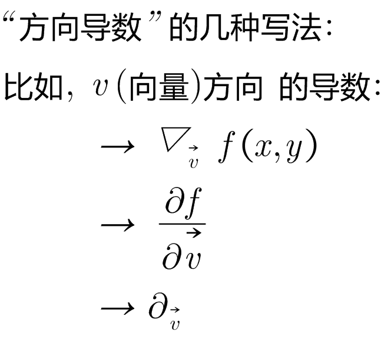

比如我们的"方向向量"是v, 它的分量是stem:[\[a,b\]^T], 则它的导数就是: +
\begin{align*}
▽_{\vec{v}} f = a\frac{∂f} {∂x} +  b\frac{∂f} {∂y}  ← 这个就是"方向导数"的公式
\end{align*}

这个公式的意思是: 在x方向上, 取一个微调a; 然后在y方向上, 取一个微调b.

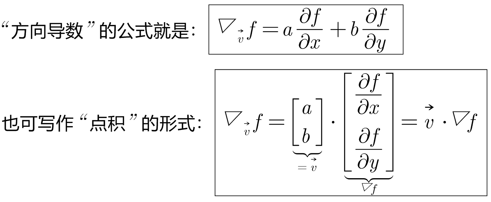

我们理解"方向导数"的方式, 就是想象: 沿着该向量移动, 沿着向量微调, 即用一个很小的量(系数, 倍数)乘以该向量(向量就被拉伸了), 这个微调会如何影响输出? 并且"输入的变化"与"输出的变化"的比例是多少?

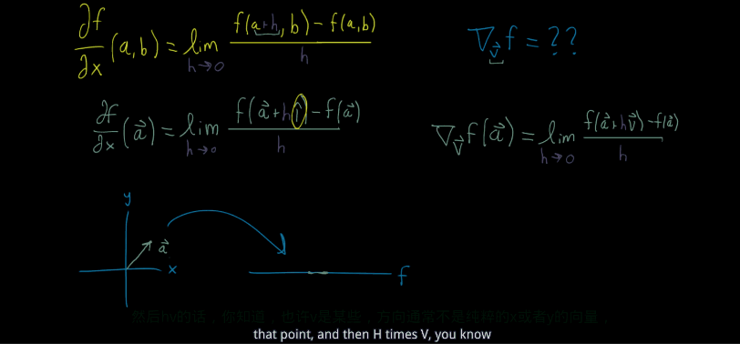

---

== 方向导数的几何意义

在输入空间中(其实我们将输入和输出空间, 显示在同一个画面中), 沿着向量的方向, 做一个平面, 来切割函数图.

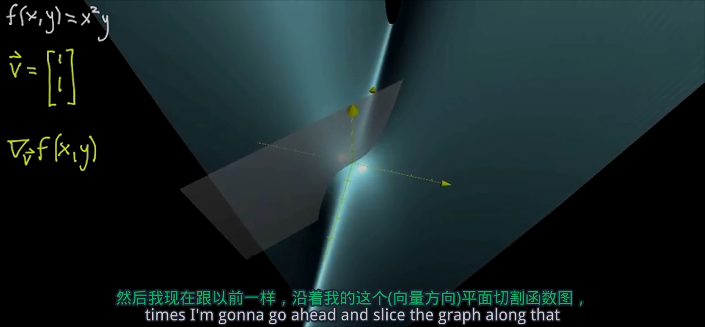

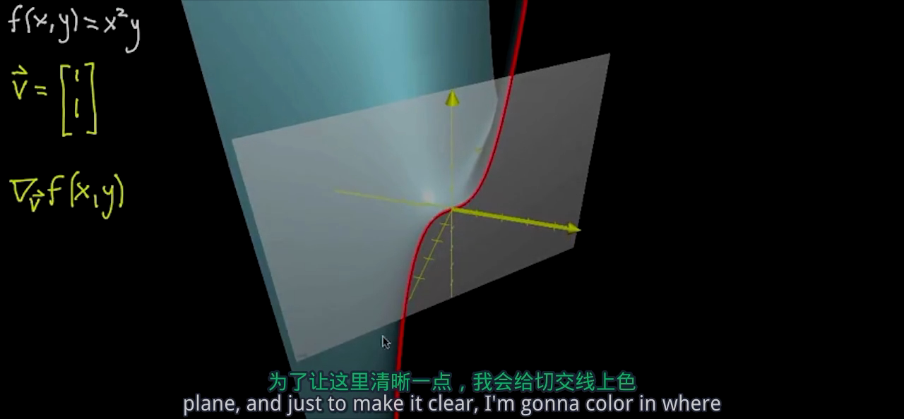

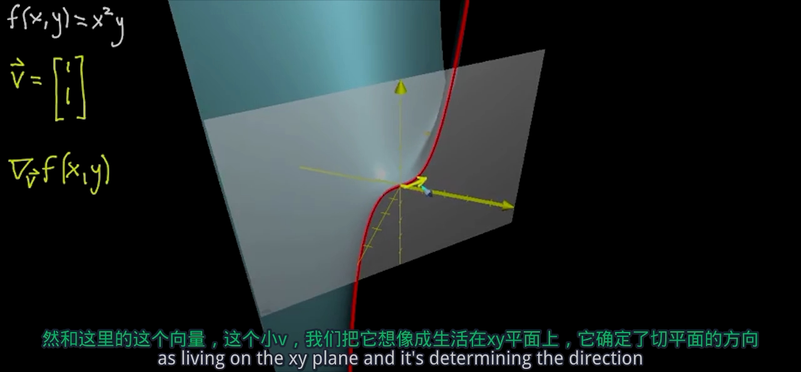

