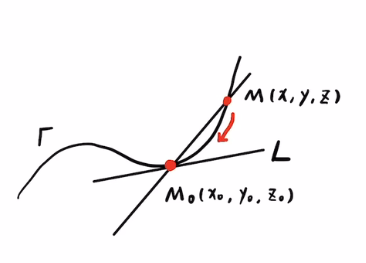
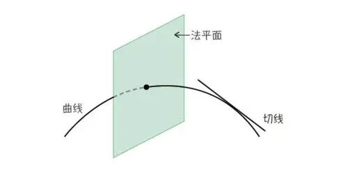

= 空间曲线的切线, 与法平面
:toc: left
:toclevels: 3
:sectnums:

---

== 空间曲线的切线

---

== 法平面  Normal plane

法线 normal line : 与"切线"垂直的, 就是"法线". 但在3维空间里, 与一条切线垂直的, 就不仅仅是一条法线了, 而是有无数条法线. 它们就构成一个平面 -- 法平面 Normal plane.

https://www.bilibili.com/video/BV1Eb411u7Fw?p=99&vd_source=52c6cb2c1143f8e222795afbab2ab1b5

4.38
