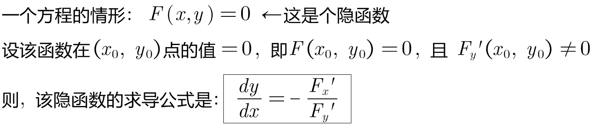
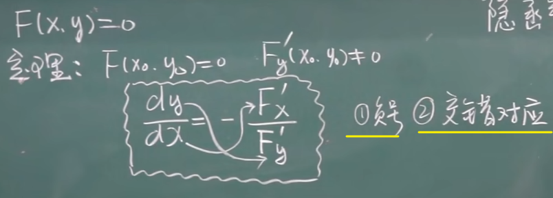
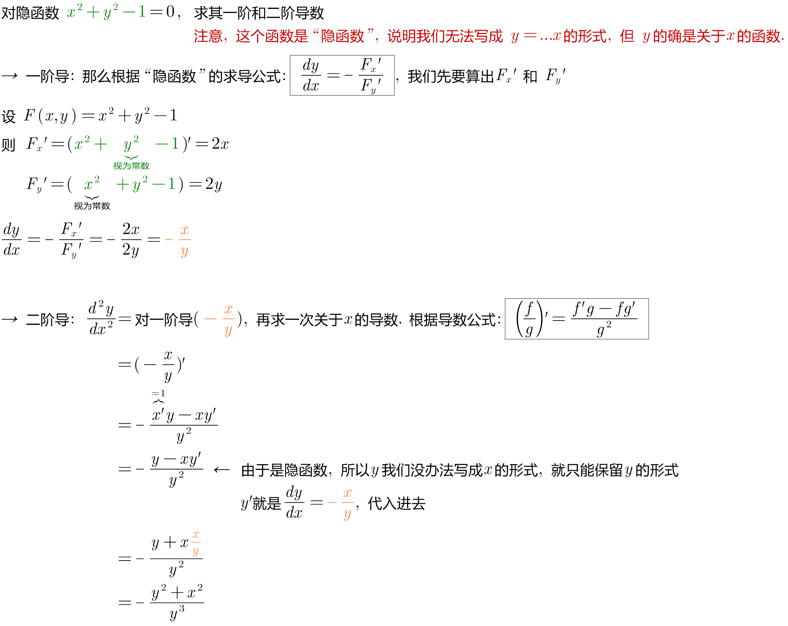
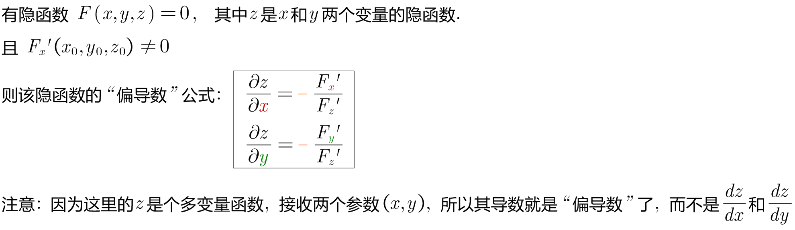
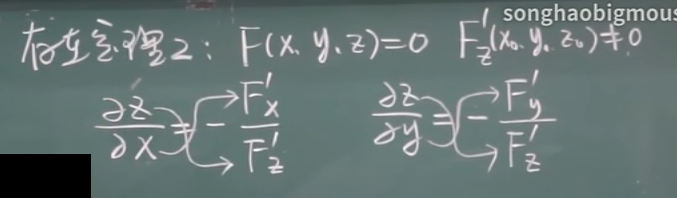
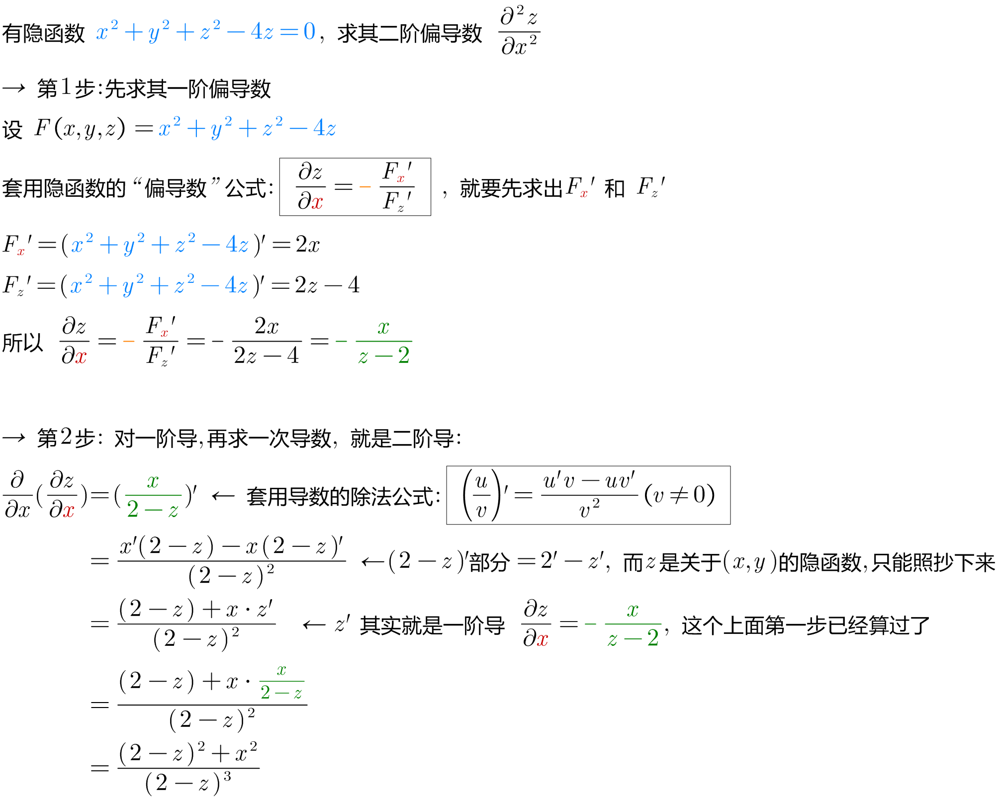
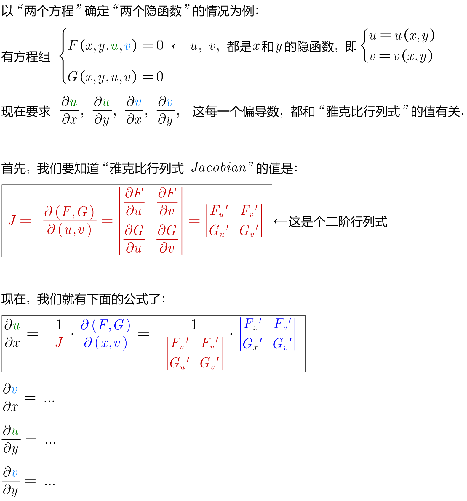

= 隐函数求导
:toc: left
:toclevels: 3
:sectnums:

---

== 隐函数求导

==== 隐函数 F(x,y)=0,  则其"导数"是: stem:[ \frac{dy} {dx} = - \frac{F_x^'} {F_y^'}]

*注意: 要使用"隐函数求导公式"之前, 必须先保证函数等号右边=0.*

.标题
====
例如： +

====

---

==== 隐函数 stem:[ F(x,y,z)=0], 则其"偏导数"是 stem:[ (\frac{∂z} {∂x} = - \frac{F_x^'} {F_z^'})] 和 stem:[ (\frac{∂z} {∂y} = - \frac{F_y^'} {F_z^'})]

.标题
====
例如： +

====

---

== 隐函数求导: 方程组的情形

上面这个求导公式, 太复杂, 对于实际的题目, 我们都是直接做的, 而不去套用上面的公式.

---

https://www.bilibili.com/video/BV1Eb411u7Fw?p=96&spm_id_from=pageDriver&vd_source=52c6cb2c1143f8e222795afbab2ab1b5

12.15

