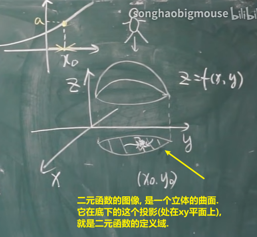
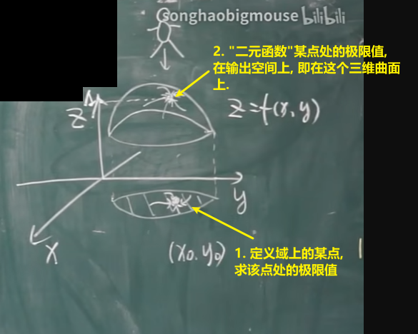
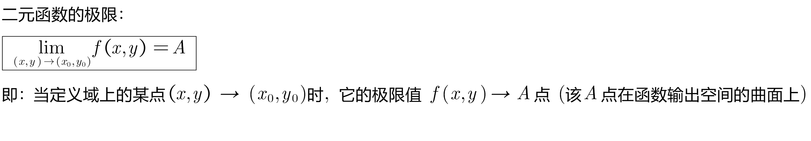
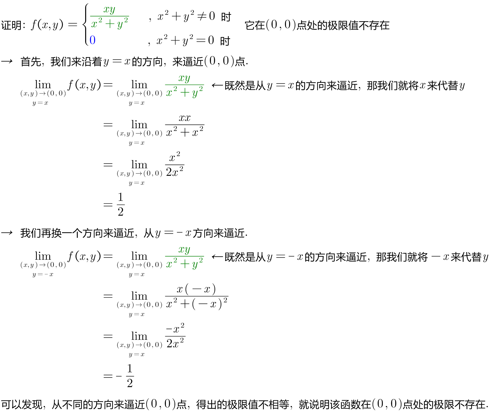
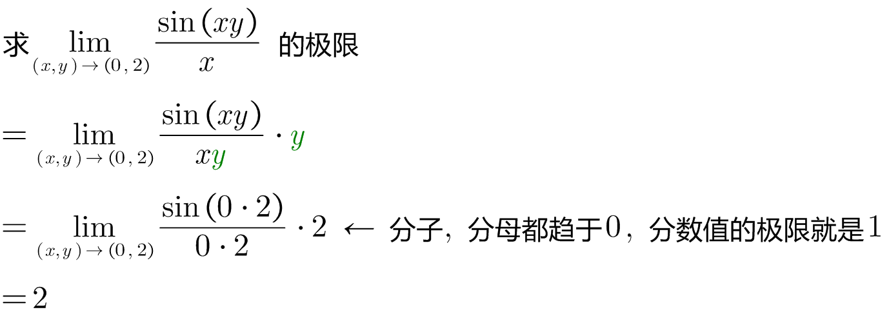
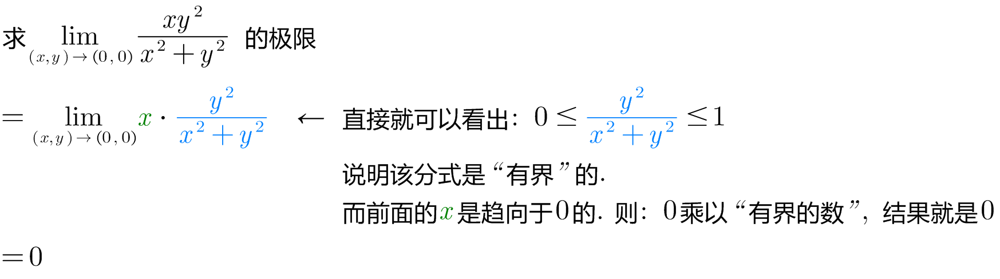
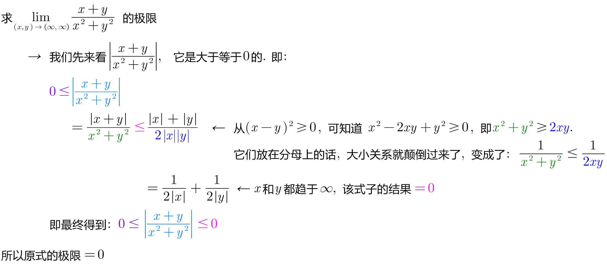

= 多元函数的极限 function of several variables
:toc: left
:toclevels: 3
:sectnums:

---

== 多元函数的极限

上图, "二元函数"的"定义域"中, 有一个点 stem:[(x_0, y_0)], 求它的极限时, 对它的逼近, 可以从xy平面上的任何方向(四面八方)来逼近它(包围它). 即"以任意方式"逼近stem:[(x_0, y_0)].

注意这和普通的"一元函数"极限的逼近方向是不一样的. 一元函数中, 逼近某一个点, 方向只有"从左侧逼近" 或"从右侧逼近"两种.  而"二元函数"的定义域, 是一个二维平面, 所以逼近方向也是大大拓展了维度范围的.

*如果一个函数, 定义域上的某点, 虽然能以"不同方式"来逼近, 但它们的极限值却不相等. 就说明, 该函数虽然是"多元函数", 但在该点处, 极限值不存在.*

.标题
====
例如： +

====

不过, 即使你证明了99.99%的从各种方向逼近时, 极限都存在, 只要你不能100%证明所有方向逼近时都有极限, 你依然无法证明该"多元函数"在该点处有极限.

.标题
====
例如： +

====

.标题
====
例如： +

====

.标题
====
例如： +

====

---

