= 二重积分 double integral
:toc: left
:toclevels: 3
:sectnums:

---

== 二重积分的定义 double integral

image:img/685.jpg[,400]

image:img/686.webp[,300]

image:img/687.png[]

二重积分, 是"二元函数"在空间上的积分. 本质是求"曲顶柱体"体积。

---

== 二重积分的几何意义

[options="autowidth"]
|===
|被积函数 |它的二重积分的几何意义

|stem:[ f(x,y) >=0]
|它的图, 是处在xy平面的上方. 它的二重积分, 就是表示该"被积函数"所代表的物体的"体积".

|stem:[ f(x,y) <0]
|它的图, 是处在xy平面的上方. 它的二重积分, 就是表示该"被积函数"所代表的物体的"体积"的相反数, 即前面加个负号.
|===

image:img/688.png[,300]

---

== 二重积分的 性质

==== 性质1 : "总体积"拆成多块"子体积", 总体积的值依然不变

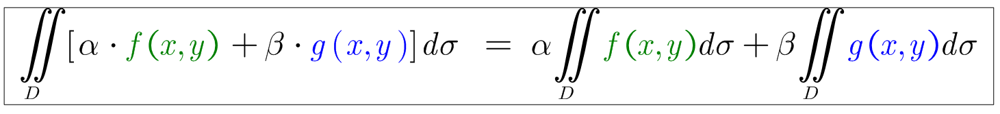

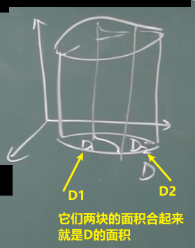

---

==== 性质2:  "底面积"拆分成多块, 它们的总体积不变

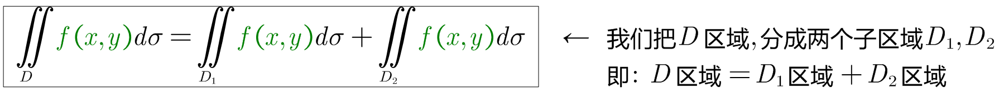

---

==== 性质3: 高度固定为1, 则"体积"就等于"底面积"的值了.

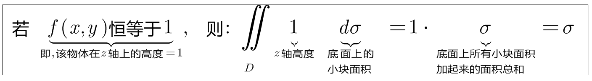

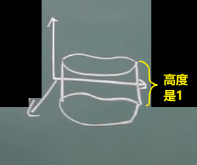

---

==== 性质4:  高度小的, 体积也小;  高度大的, 体积也大.

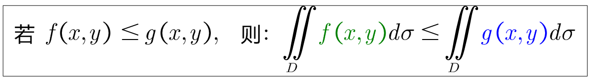

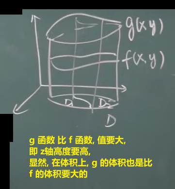

---

==== 性质5: 如果一个不规则的顶面扭曲的物体, 高度上有正有负, 则体积上, 会受到正负抵消掉一部分的影响. 而当把高度变成绝对值后, 原先负的高度也变成正的了, 体积就永远都是最大的.

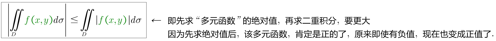

---

=== 性质6: 该物体的体积, 显然是夹在它在"z轴最高点算出的体积", 和它在"z轴最低点算出的体积"之间.

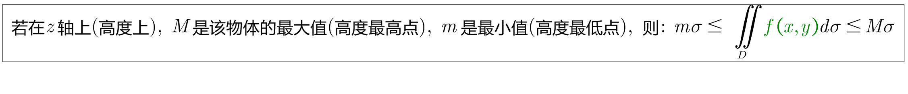

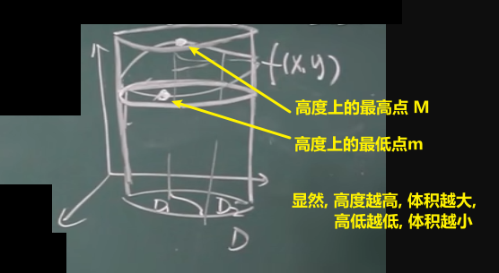

---

=== 性质7 : 我们在底面上, 一定能找到这样一个点: 它在z轴上的高度, 能代表整个物体的平均z轴高度.

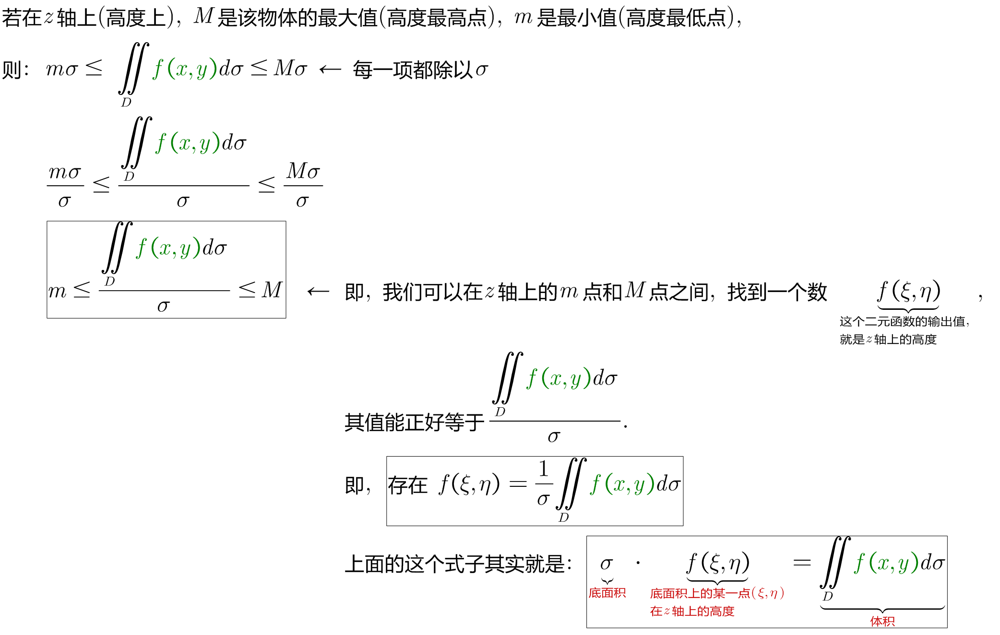

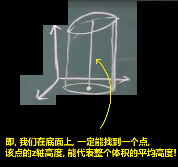

---

== 二重积分的计算 (直角坐标系下)

二重积分, 就是用来求"体积"的.

https://www.bilibili.com/video/BV1Eb411u7Fw?p=113&vd_source=52c6cb2c1143f8e222795afbab2ab1b5

