= 二重积分 double integral
:toc: left
:toclevels: 3
:sectnums:

---

== 二重积分的定义 double integral

=== 解释1: 如何计算曲顶柱体的体积?

image:img10/10_153.png[,300]

方法是: 先把底面, 切割成很多小矩形, 将每一块小矩形的"长(dx)" 和 "宽(dy)", 越来越小化, 取无穷小的极限:

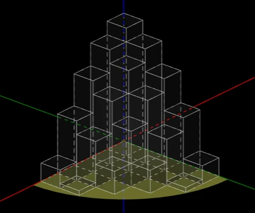

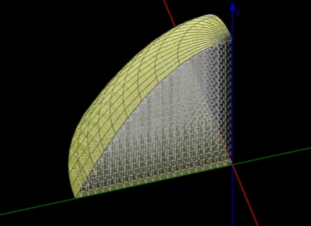

其中, 每一小块就会形成一个柱体:

image:img10/10_156.png[,300]

那么, *每一小块的底面积, 我们用 stem:[ dσ]来表示, 就是 stem:[ = dx \cdot dy]*

这个小柱体的高度, 就是多元函数的输出值. 即 stem:[=f(x,y)]

所以, 这个小柱体的体积, 就是 "底面积"乘以"高度", 即 stem:[ =(dx \cdot dy) \cdot f(x,y) ]

所以整个"曲顶柱体"的体积, 就是把所有这些"小柱体"的体积, 加起来, 就是stem:[ =  \sum (dx \cdot dy) \cdot f(x,y)]

image:img10/10_157.png[,700]

image:img10/10_158.png[,700]

image:img10/10_159.png[,250]

---

=== 解释2:

==== "直角坐标系"下, 物体的体积计算公式

image:img10/10_160.png[,500]

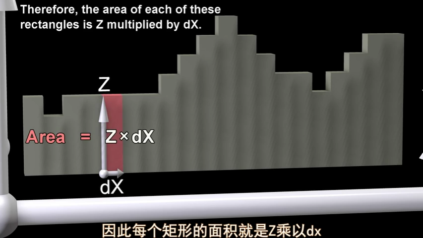

image:img10/10_162.png[,500]

上图, stem:[ \int z \ dx], 这个积分的值,  即 z曲线下方的阴影面积.

image:img10/10_163.png[,500]

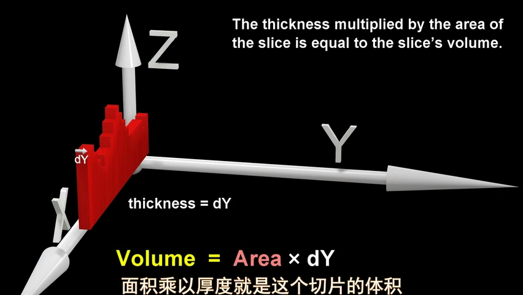

image:img10/10_165.png[,500]

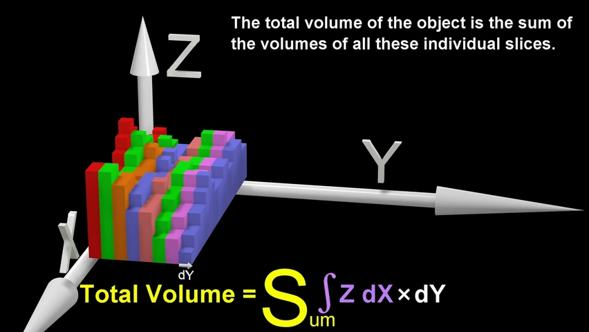

image:img10/10_167.png[,500]

image:img10/10_168.png[,500]

image:img10/10_169.png[,500]

image:img10/10_197.svg[,700]

---

==== "极坐标系"下, 物体的体积计算公式

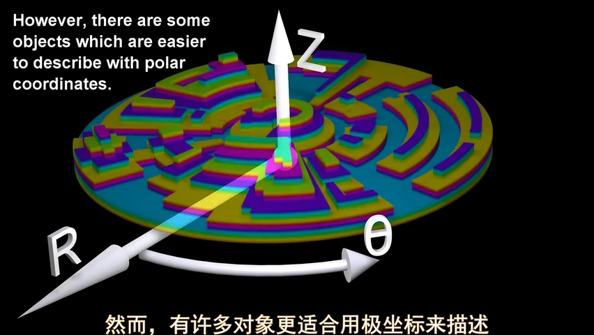

image:img10/10_171.png[,500]

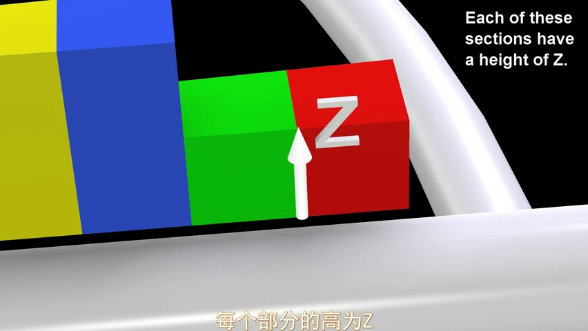

image:img10/10_174.png[,500]

但是, 由于是扇形切割, 所以 越靠近圆心,厚度越趋向于0; 越远离圆心, 厚度越宽.

image:img10/10_175.png[,500]

image:img10/10_176.png[,500]

image:img10/10_177.png[,500]

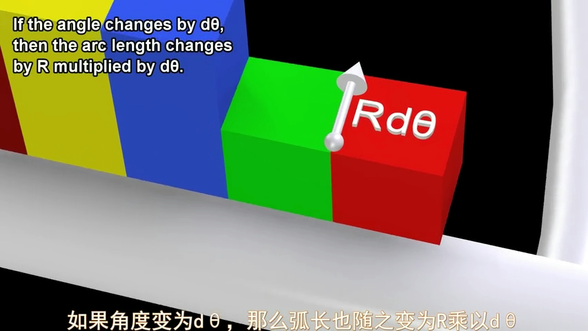

image:img10/10_179.png[,500]

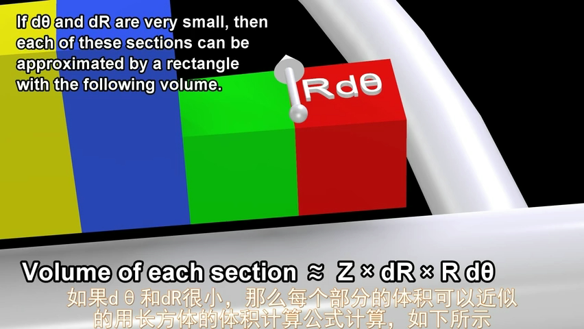

image:img10/10_182.png[,100]
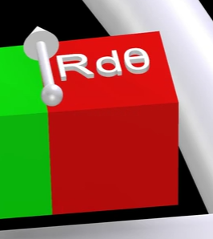

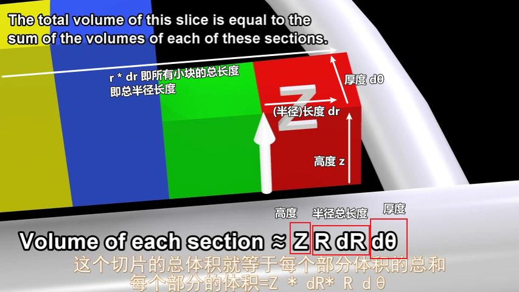

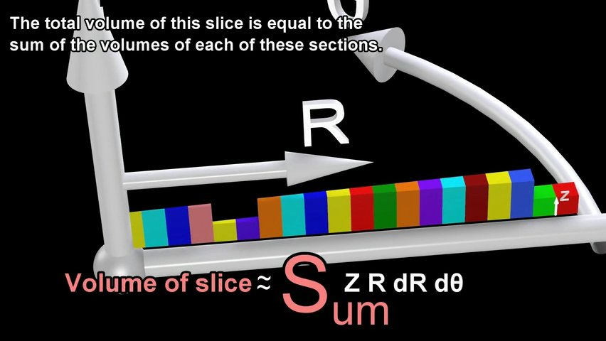

image:img10/10_186.png[,500]

极坐标系下, 物体的总体积, 就是把每一个扇形切片的体积, 加总起来:

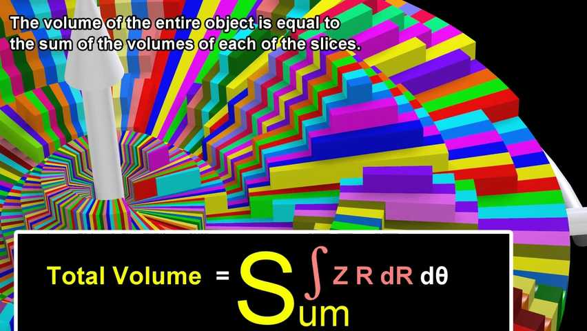

image:img10/10_188.png[,500]

image:img10/10_189.png[,500]

---

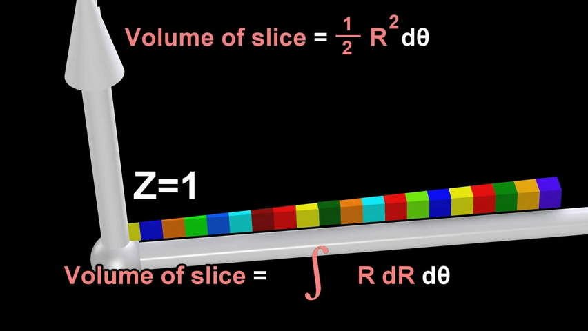

image:img10/10_196.png[,500]

---

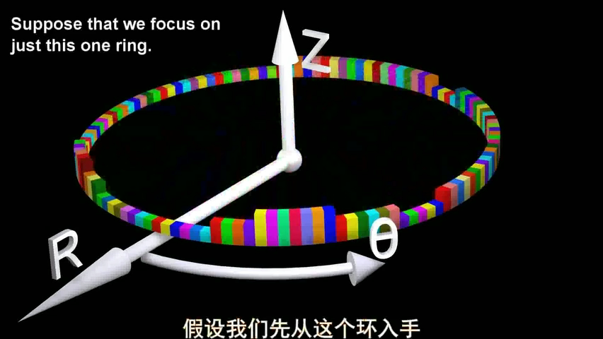

整个环的体积, 是每个小扇块体积的总和:

image:img10/10_191.png[,500]

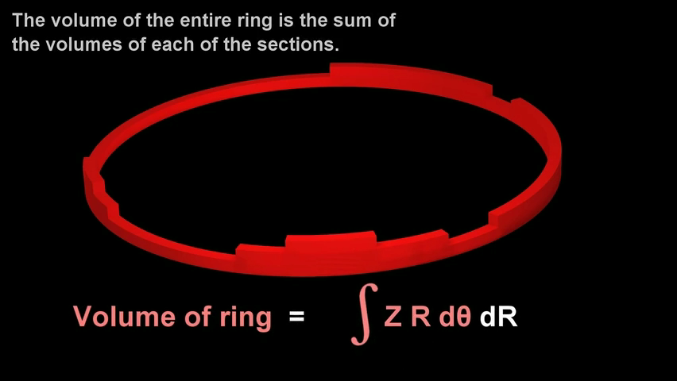

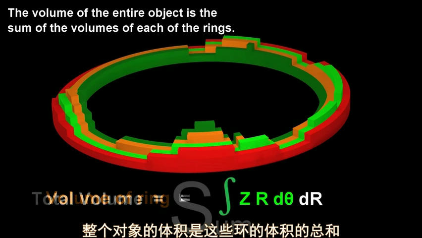

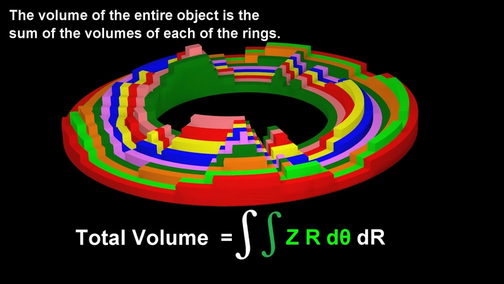

同样能得到和之前第一种体积计算方法, 相同的体积公式.

---

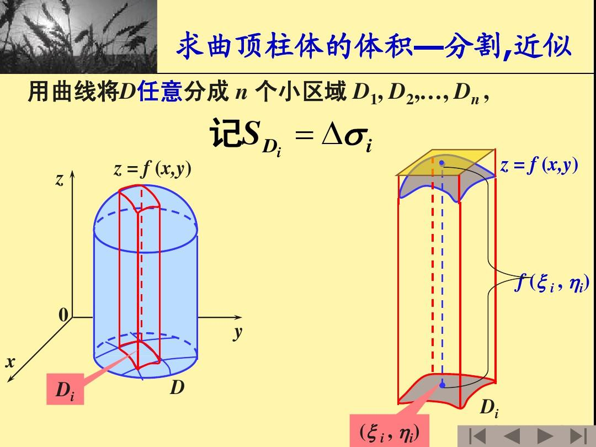

image:img/686.webp[,300]

image:img/687.png[]

二重积分, 是"二元函数"在空间上的积分. 本质是求"曲顶柱体"体积。

---

== 二重积分的几何意义

[options="autowidth"]
|===
|被积函数 |它的二重积分的几何意义

|stem:[ f(x,y) >=0]
|它的图, 是处在xy平面的上方. 它的二重积分, 就是表示该"被积函数"所代表的物体的"体积".

|stem:[ f(x,y) <0]
|它的图, 是处在xy平面的上方. 它的二重积分, 就是表示该"被积函数"所代表的物体的"体积"的相反数, 即前面加个负号.
|===

image:img/688.png[,300]

---

== ---------- ----------

---

== 二重积分的计算 (直角坐标系下)

二重积分, 就是用来求"体积"的.

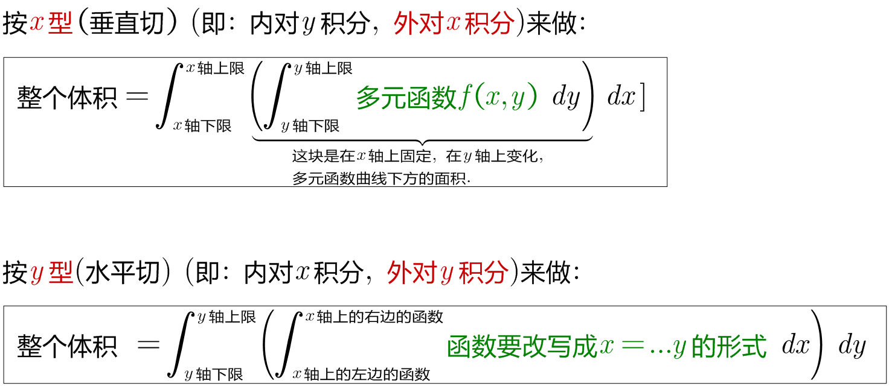

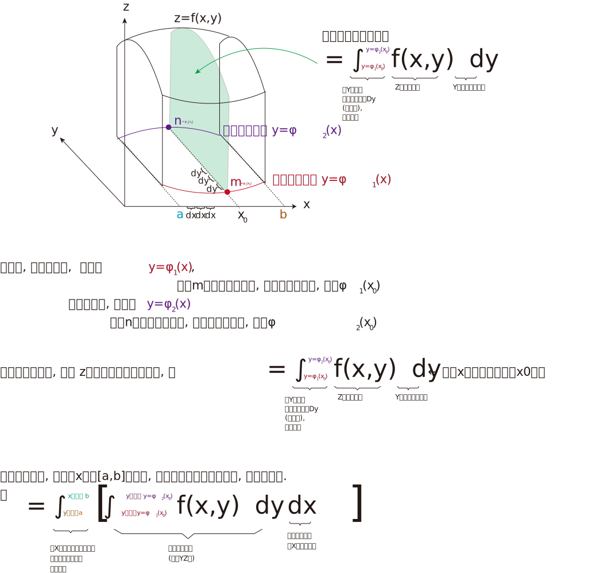

上图即: 先y, 再x 的二次积分 (累积积分)

所谓的X型: 就是"外层积分"是对 X 积分， +
Y型: 就是"外层积分"是对 Y 积分.

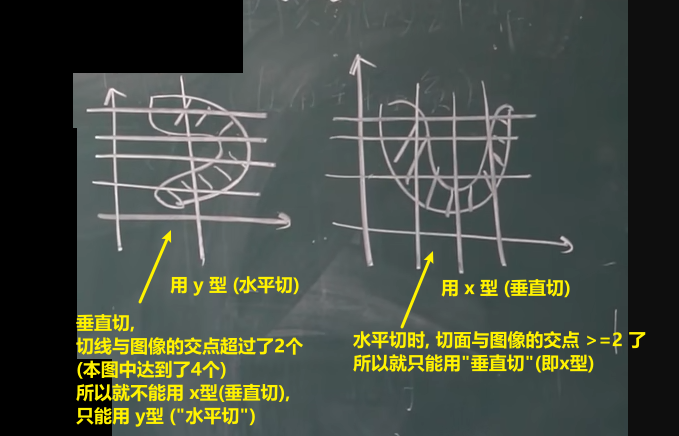

何时用 x型 来做, 何时用 y型 来做?

[options="autowidth"]
|===
|Header 1 |Header 2

|用垂直切(x型)的场合:
|水平切时, 如果切线与图像的交点超过了2个, 就只能用x型(垂直切)来做.

|用水平切(y型)的场合:
|垂直切时, 如果切线与图像的交点超过了2个, 就只能用y型(水平切)来做. 因为水平切时, 切线与图像的交点, 不会超过两个(事实上即只有两个).
|===

垂直切时, 如果切线与图像的交点超过了2个, 就只能用y型(水平切)来做. 因为水平切时, 切线与图像的交点, 不会超过两个(事实上即只有两个).

.标题
====
例如： +

x型(垂直切) 来做: +
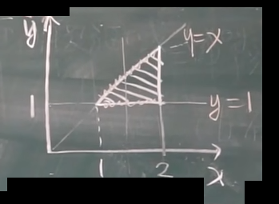

y型(水平切) 来做: +
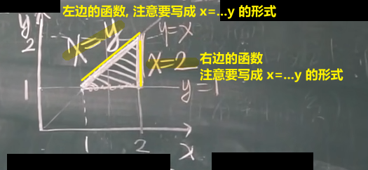

image:img/705.png[]
====

.标题
====
例如： +
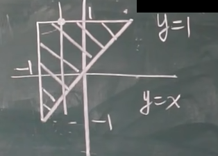

image:img/709.png[]

image:img/707.svg[]

下面用 y型(水平切) 来做:

image:img/710.png[,300]

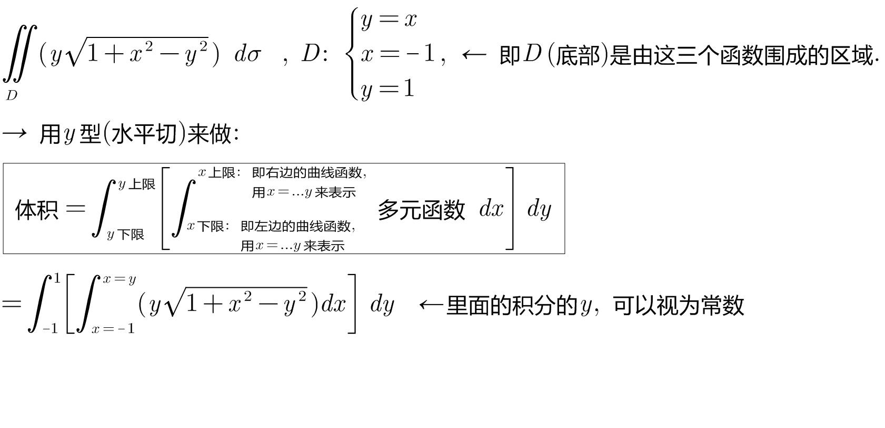
====

https://www.bilibili.com/video/BV1Eb411u7Fw?p=113&vd_source=52c6cb2c1143f8e222795afbab2ab1b5

44.10
