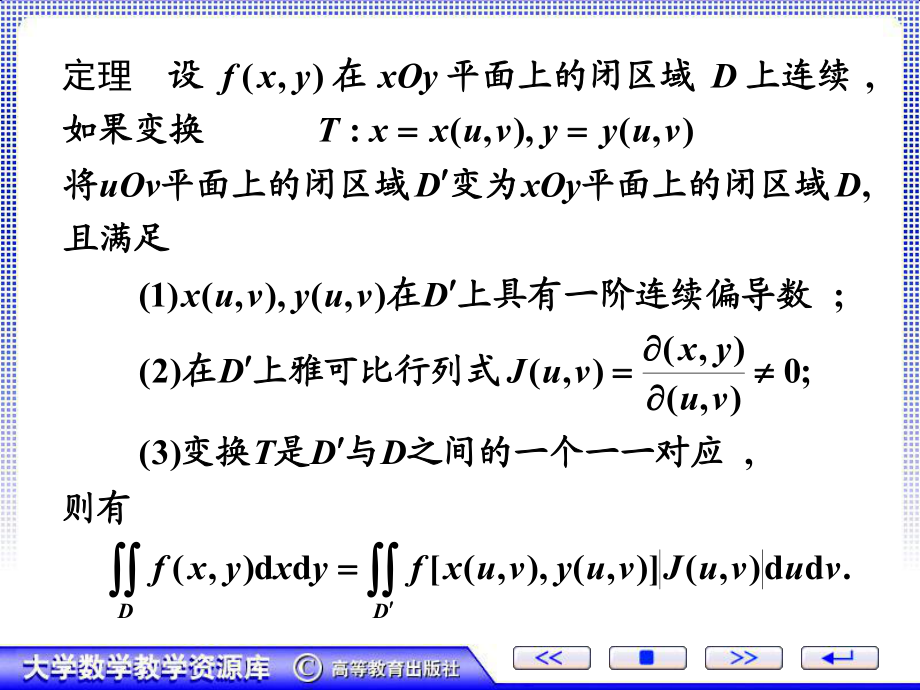
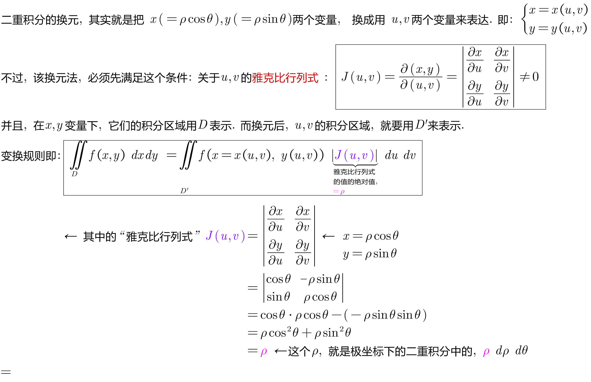
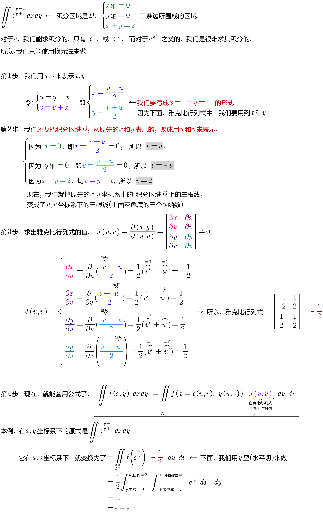

= 二重积分的换元法
:toc: left
:toclevels: 3
:sectnums:

---

== 二重积分的换元法

image:img/771.jpg[,400]

其实这种变换操作, 就类似于"线性变换":

image:img/773.jpg[,400]

.标题
====
例如： +
image:img/775.png[,300]

====

---

20.20

https://www.bilibili.com/video/BV1Eb411u7Fw?p=118&spm_id_from=pageDriver&vd_source=52c6cb2c1143f8e222795afbab2ab1b5

