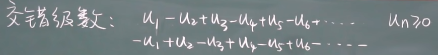
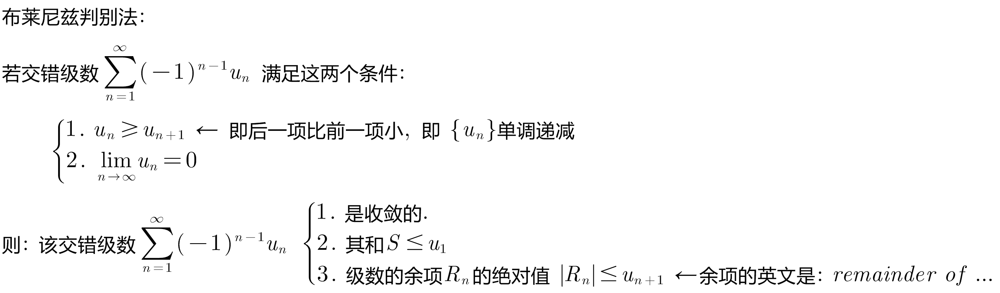
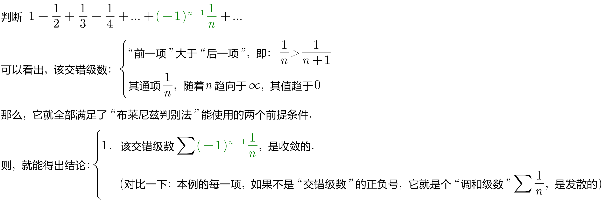

= 交错级数 alternating series
:toc: left
:toclevels: 3
:sectnums:

---

== 交错级数 alternating series

交错级数是正项和负项交替出现的级数.

---

== 莱布尼茨定理

莱布尼茨全告诉你了: 1. 该交错级数, 是收敛的,还是扩散的. 2. 它的和是多少. 3. 余项的误差是多少.

.标题
====
例如： +

====

---

