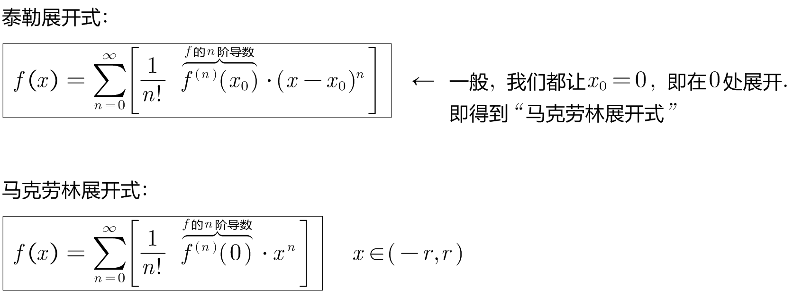
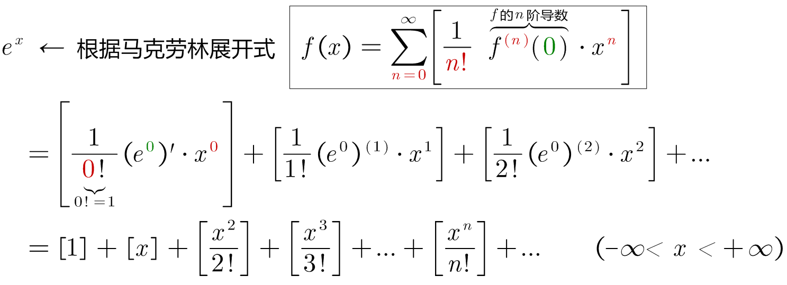
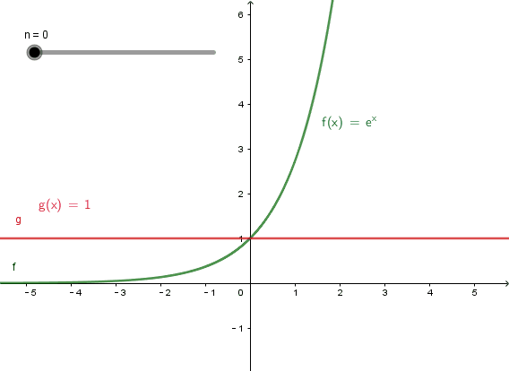
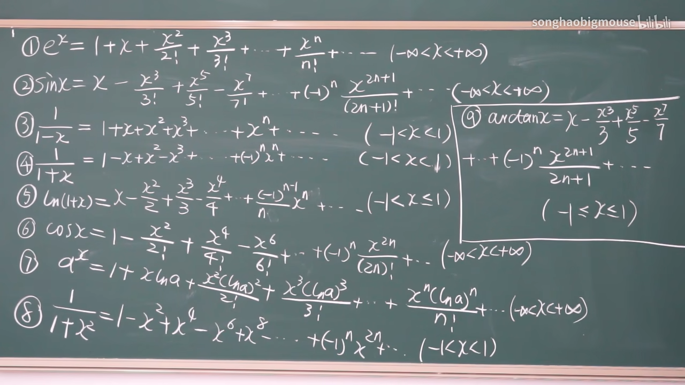
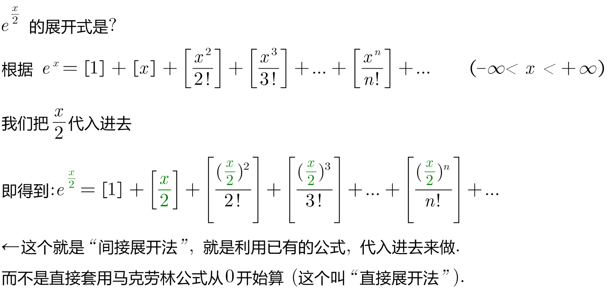

= 函数展开成幂级数 Power series
:toc: left
:toclevels: 3
:sectnums:

---

== 函数展开成幂级数

求和函数, 是 stem:[1+x+x^2 + x^3+... = 1/(1-x) ] +
而"函数展开成幂级数", 就是倒过来问: 已知一个函数是 stem:[ 1/(1-x) ], 它能展开成什么? 等于什么幂级数(即相加)?

并非所有的函数, 都能表示成幂级数.

.标题
====
例如： +

====

常用展开公式: +
[options="autowidth"]
|===
|Header 1 |Header 2

|stem:[ e^x]
| +
x 取值范围是 stem:[ (-∞< x< +∞+)]

|stem:[ sinx]
| +
(-∞ <x < +∞)

|stem:[ cosx]
|
x 取值范围是 stem:[ (-∞ <x <+∞)]

|stem:[ ln(1+x)]
| +
x 取值范围是 stem:[ (-1<x<=1)]

|stem:[ 1/(1-x)]
| +
即: "等比求和公式".  这里面的 x 取值范围是 (-1<x<1)

|stem:[ (1+x)^a]
|
|===

.标题
====
例如： +

====

https://www.bilibili.com/video/BV1Eb411u7Fw?p=151&vd_source=52c6cb2c1143f8e222795afbab2ab1b5

