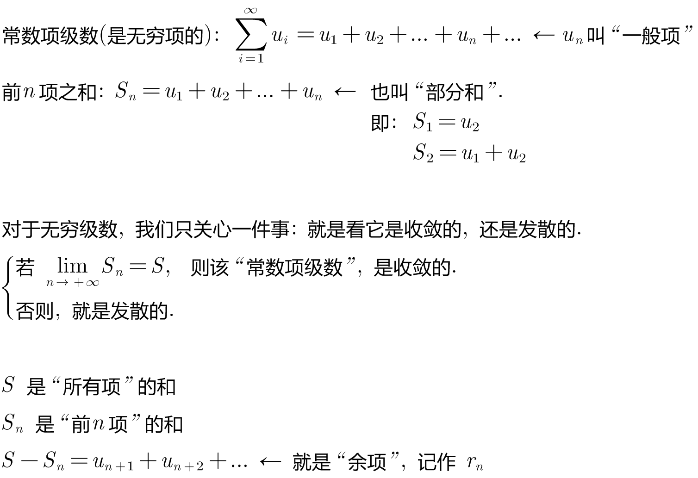
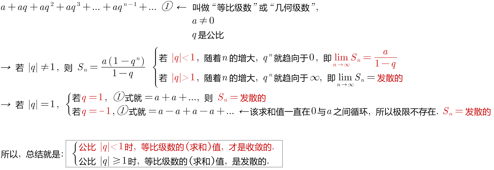
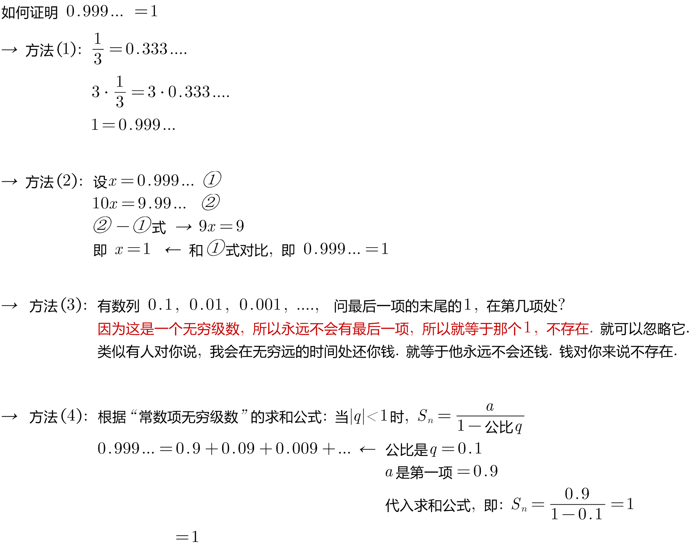
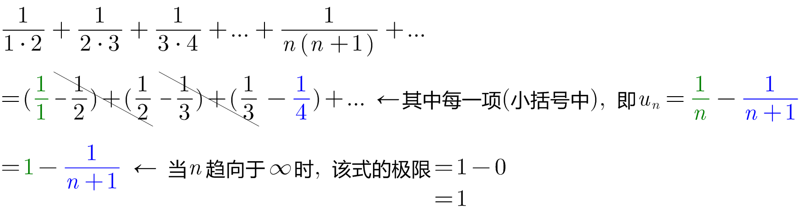
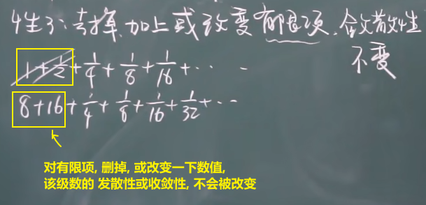

= 常数项级数
:toc: left
:toclevels: 3
:sectnums:

---

== 常数项级数

该无穷级数的每一项, 都是常数.

无穷级数, 其实就是无穷项的"求和".

.标题
====
例如： +

====

.标题
====
例如： +

====

---

== 性质

=== 性质1: 若 stem:[ \sum_{n=1}^{∞} u_n "收敛于S, 则"  \sum_{n=1}^{∞} k \cdot u_n "收敛于" kS]

即: 无穷级数中, **每项(用stem:[u_n ]表示)** 乘以一个常数k (stem:[k≠0]), 不改变它的收敛性.

---

=== 性质2: 若 stem:[ \sum_{n=1}^{∞} u_n] 和 stem:[ \sum_{n=1}^{∞} v_n], 分别收敛于 S 和 σ, 则 stem:[ \sum_{n=1}^{∞} (u_n \pm v_n)] 也收敛. 并且它们的"和"= stem:[ s \pm σ]

即:

- *两个收敛的级数, 相加或相减后, 仍然收敛.*
- 但是反过来则不成立, 即: *相加减后是收敛的级数, 它们自身未必收敛.*

如: 一个级数是 stem:[ 1,1,1...],  另一个级数是 stem:[ -1,-1,-1 ...], 它们各自是发散的, 但它们的和 stem:[ (1-1)+(1-1)+(1-1)+... =0] , 却是收敛的.

---

=== 性质3: 去掉, 加上, 或改变"有限项", 该级数的"敛散性"不变.

---

=== 性质4: 若 stem:[ \sum_{n=1}^{∞} u_n ] 是收敛的, 则它任意加括号后得到的级数, 也收敛. 且"其求和的值"不变.

---

https://www.bilibili.com/video/BV1Eb411u7Fw?p=140

43.40
