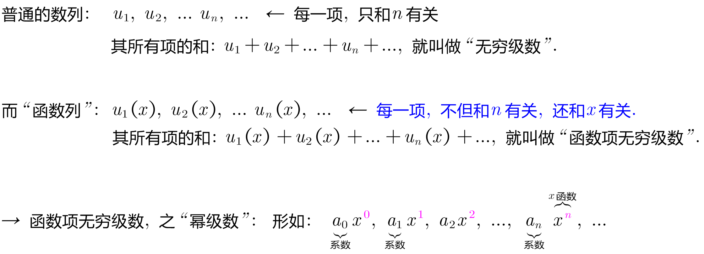
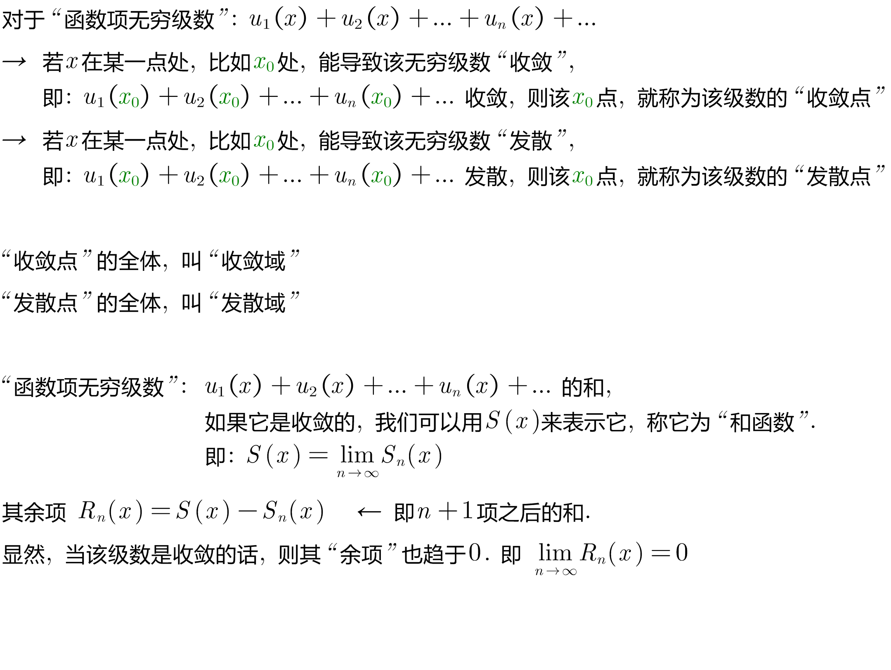
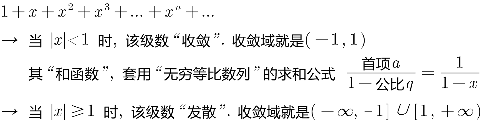
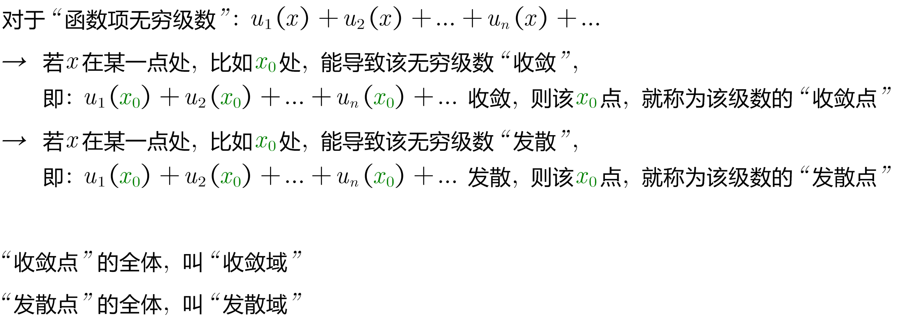
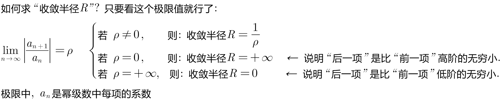
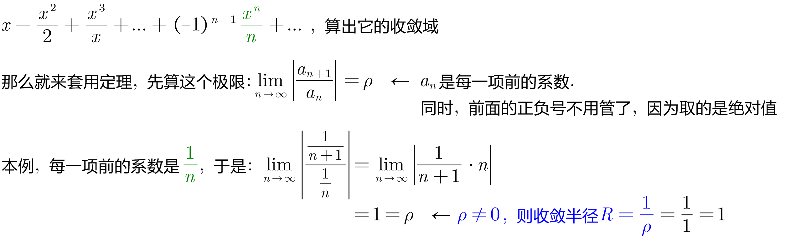

= 幂级数 Power series
:toc: left
:toclevels: 3
:sectnums:

---

== 幂级数 Power series

.标题
====
例如： +

====

---

=== 定理: (阿贝尔定理)

R : 就是"收敛半径" (R > 0) +
(-R, R) : 就是"收敛区间"  <- 注意: 收敛区间, 一定是开区间  +
(-R, R) + 收敛的端点 : 就是"收敛域".  <- "收敛域", 包含了"收敛区间", 还包扩闭区间. +

---

=== 定理:

.标题
====
例如： +

====

---

https://www.bilibili.com/video/BV1Eb411u7Fw?p=146

20.39

---

https://www.bilibili.com/video/BV1Eb411u7Fw?p=146

https://blog.csdn.net/hpdlzu80100/article/details/106455008
