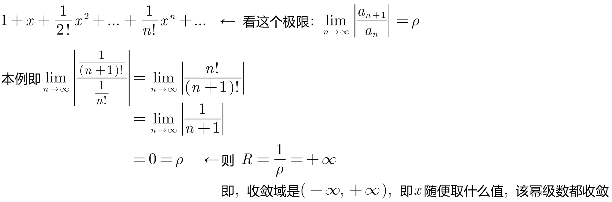
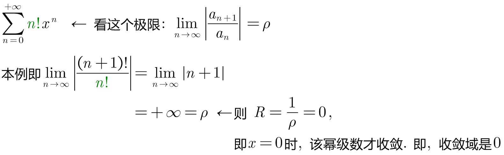
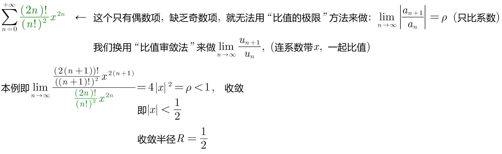
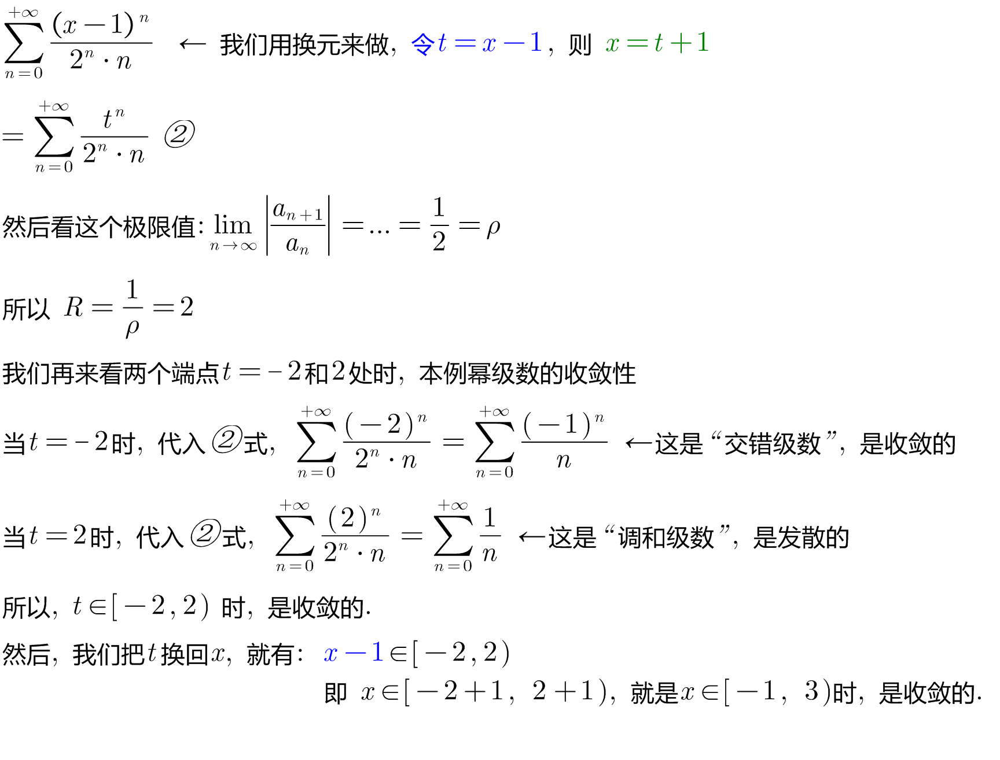

= 幂级数 Power series
:toc: left
:toclevels: 3
:sectnums:

---

== 幂级数 Power series

image:img/832.png[,670]

image:img/833.png[,650]

.标题
====
例如： +
image:img/834.png[,500]
====

---

=== 定理: (阿贝尔定理)

image:img/835.png[,650]

image:img/836.png[,800]

R : 就是"收敛半径" (R > 0) +
(-R, R) : 就是"收敛区间"  <- 注意: 收敛区间, 一定是开区间  +
(-R, R) + 收敛的端点 : 就是"收敛域".  <- "收敛域", 包含了"收敛区间", 还包扩闭区间. +

---

=== 定理:

image:img/837.png[,800]

.标题
====
例如： +
image:img/838.png[,800]

本例继续, 所以, 它的"收敛区间"就是 (-1,1) +

那么"收敛区间"呢? 我们要再来判断一下它两端的端点处的x值, 到底会令幂级数收敛, 还是发散? +
当x=-1 时, 本例的幂级数就变成了: stem:[ (-1)- (-1)^2/2 +  (-1)^3/3 + ... ] 是 负的调和级数, 是发散的. +
当 x=1 时, 本例的幂级数就变成了: stem:[ 1- 1/2 + 1/3 - 1/4 +...] 是交错正负号的调和级数, 是收敛的.

所以, 本例的收敛域, 就是 (-1,1]
====

.标题
====
例如： +

====

.标题
====
例如： +

====

.标题
====
例如： +

====

.标题
====
例如： +

====

---

== 幂级数的运算

https://www.bilibili.com/video/BV1Eb411u7Fw?p=147&spm_id_from=pageDriver&vd_source=52c6cb2c1143f8e222795afbab2ab1b5

---

https://blog.csdn.net/hpdlzu80100/article/details/106455008

