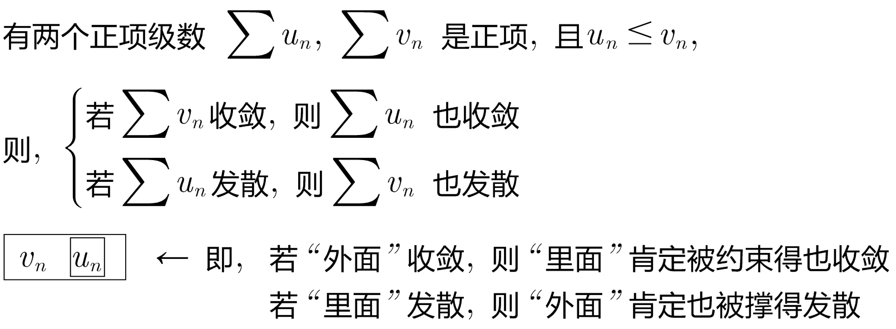

= 正项级数
:toc: left
:toclevels: 3
:sectnums:

---

== 正项级数

正项级数, 即每一项都是正数的. 即 stem:[u_n >= 0]

==== 定理1: 要想 stem:[\sum u_n] 收敛, 充要条件是 "部分和"那个数列{S_n}, 是有界的.

---

==== 定理2:

---

https://www.bilibili.com/video/BV1Eb411u7Fw?p=141&vd_source=52c6cb2c1143f8e222795afbab2ab1b5

27.40

