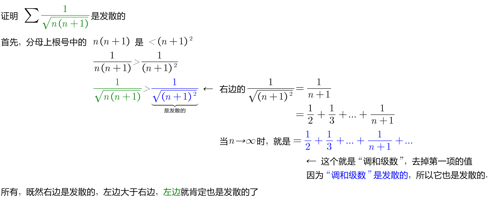
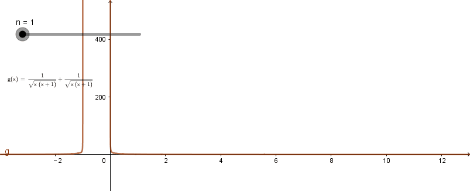
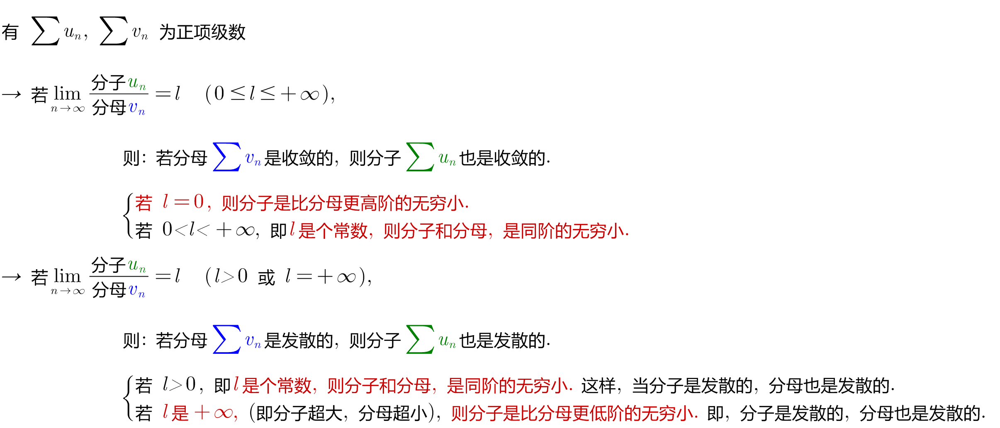

= 正项级数_等比级数
:toc: left
:toclevels: 3
:sectnums:

---

== 等比级数

正项级数, 即每一项都是正数的. 即 stem:[u_n >= 0]

==== 定理1: 要想 stem:[\sum u_n] 收敛, 充要条件是 "部分和"那个数列{S_n}, 是有界的.

---

==== 定理2: 外面大于里面, 1. 若里面发散, 则外面也被撑得一起发散; 2. 若外面收敛, 则里面也被约束得一起收敛.

image:img/802.png[,470]

同样: +
→ 里面收敛的, 外面不一定收敛 +
→ 外面是发散的, 里面不一定发散.

.标题
====
例如： +

====

但是, 这个定理("比较收敛法")在实际应用中, 有两个困难:

1. 你所比较的对象, 你并不知道它自身到底是收敛的, 还是发散. 就是说, 你一开始并不知道, 哪个是属于"外面的", 哪个是属于"里面的".
2. 因为这个定理, 从a推出b, 但倒过来却不一定成立, 所以如果你比较错了对象, 就得不出任何答案. 比如, 本来应该是要a推b的, 但你因为不知道哪个属于"里面", 哪个属于"外面", 所以你选错了, 倒过来用了b来推a,  但b本身是推不出a的. 正如: 你推出了外面的在发散, 但你依然不知道里面的到底是发散的还是收敛的.

下面, 我们来改进这个"比较收敛法", -- 升级版:  用极限改进的"比较收敛法".

---

==== 定理3:

关于几种无穷小的概念:

\begin{align}
& 有 \lim_{x -> x_0} \frac{f(x)} {g(x)} =0  \ <- 分母g超大, 分子f超小 \\
& 则称: 当x→ x_0 时，f 为 g 的"高阶无穷小量"， \\
& 或称: g 为 f 的"低阶无穷小量"。 \\
\\
& 当 \lim_{x -> x_0} \frac{f(x)} {g(x)} =C  \quad (C≠0)  \\
& 则称: f和g为 x→x_0 时的"同阶无穷小量". \\
\\
& 当 \lim_{x -> x_0} \frac{f(x)} {g(x)} =1  \quad (C≠0)  \\
& 则称: f和g 是当x→x_0时 的"等价无穷小量".  \\
& 记做：f(x) \~ g(x)（x→x_0）.
\end{align}

---

---

https://www.bilibili.com/video/BV1Eb411u7Fw?p=142&spm_id_from=pageDriver&vd_source=52c6cb2c1143f8e222795afbab2ab1b5

