= 反常积分 (又名: 广义积分)  improper integral
:toc: left
:toclevels: 3
:sectnums:

---

== 反常积分

指含有"无穷上限/下限"(无穷限广义积分)，或者被积函数含有"瑕点"的积分(瑕积分).

即, 若出现如下情况, 积分 stem:[\int_a^b f(x) dx] 就是"反常积分" :

- a= -∞
- b= ∞
- 函数f 在闭区间 [a,b]内是无界的, (-∞, +∞).

---

=== 无界处(无y值)的点(x点), 即"破裂点", 决定了函数曲线的积分, 是发散的,还是收敛的.

什么是"无界"? 如果一个函数, 在某个位置有垂直渐近线,那么该函数在这个位置, 是"无界"的. 该位置称为函数曲线的"破裂点".

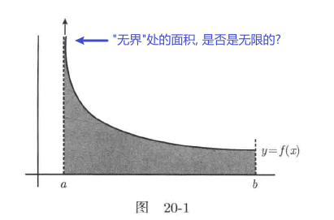

由于无界处, 该区域不停地向上延伸,那么其面积就是无限的.这个结论是正确的吧? 不一定. 如果该区域足够狭长,那会出现一个数学奇迹,面积就是有限的了.为了研究什么情况下一块无限区域的面积会是有限的,我们需要使用"极限".

方法是:

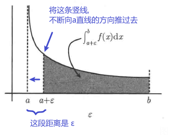

如上图, 即, *我们在无界处, 即 a 的附近, 找一个很小的正数ε.*  显然, 在区间 [a+ε, b]上, 函数f是可积的. a+ε 这个端点是"有界"的.  +
*然后, 我们把 a+ε 这个端点(国境线), 不断往"a这个无界处"推过去(即蚕食), 趋近于a. 即不断压榨出曲线下更多实际的面积. 如果 "区间 [a+ε, b]" 的积分面积, 会趋向于一个极限L, 则我们就能说: 积分(即面积) stem:[\int_a^b f(x) dx] 就收敛于 L.* 这样, 我们就解决了这个具有"无界"端点的 函数曲线的积分问题.

但如果我们找不到这个极限L 呢? 那我们就没法算这个曲线的积分了. 因为该曲线下的面积 相当于是∞的, 即其积分是"发散"的.

即: +
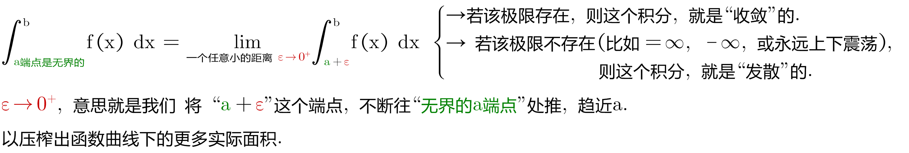

**所以, 当我们看到一个"反常积分"时, 我们首先要弄清的, 就是它到底是"收敛"的(面积是有极限的), 还是"发散"的(面积是无穷的). ** 而且你不能只依赖于计算机, 因为计算机还不能真正理解无限或疯狂的上下振荡, 所以如果你使用电脑来估算这个(反常)积分值, 可能会得到意想不到的结果.

.标题
====
例如： +
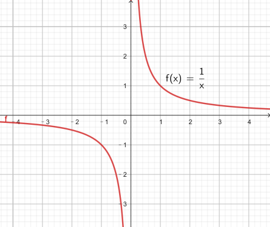

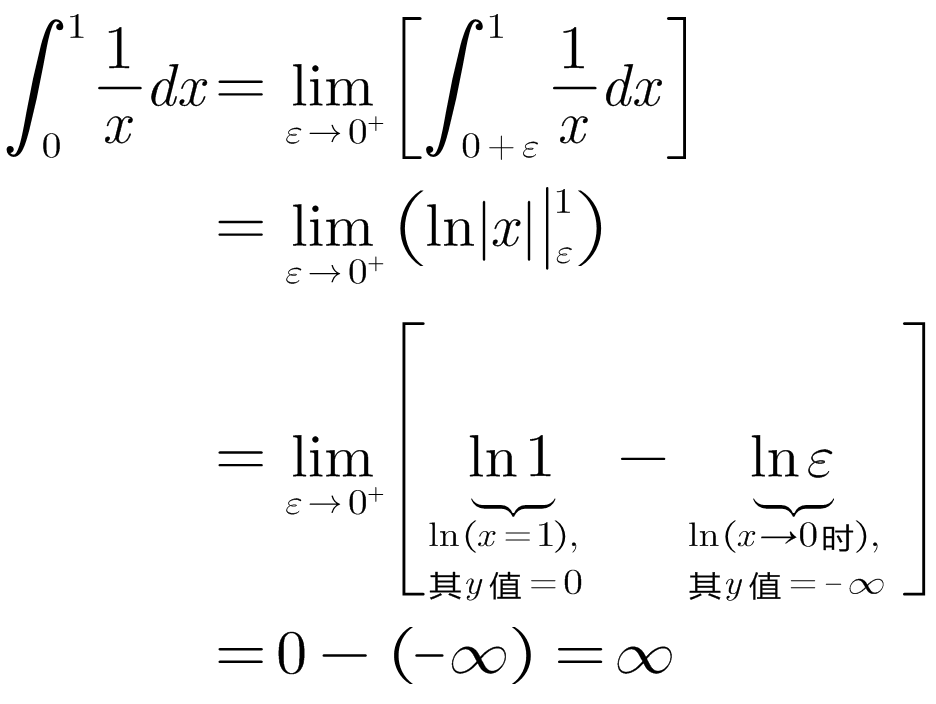

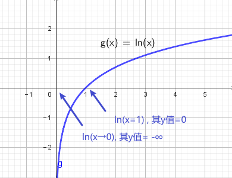
====

.标题
====
例如： +
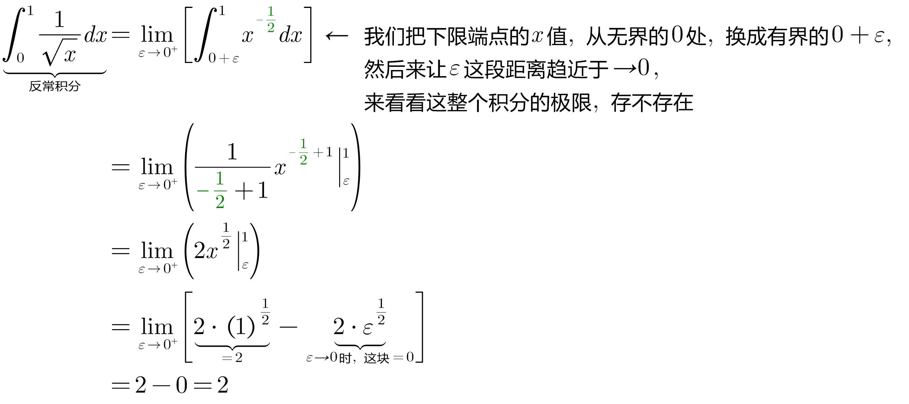

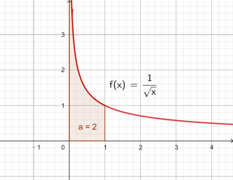
====

其实, 我们并不在乎它收敛的具体值是多少, 而只是关心它到底是收敛的, 还是发散的.

上面两个例子, 函数图像很相似, 但为什么一个积分是发散的,另一个积分却是收敛的呢?

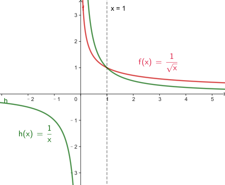

上图, 可以看出, 在 0<x<1 的区间上, 绿色的 stem:[1/x] 比 红色的 stem:[1/ \sqrt{x}] 的y值要大. 或者换句话说, 红色曲线要比绿色曲线, 更靠近y轴. 因此从几何直观上理解, 更靠近y轴的红色曲线, 其积分更可能是"收敛"的, 更远离y轴的绿色曲线, 其积分更可能是"发散"的.

*但不幸的是, 对于所有在 x=0点 有渐近线的函数,很难区分哪个函数足够接近于y轴, 哪个足够远离于y轴. 因此大多数情况下,你需要分别判断每个积分.*

**一个反常积分, 是收敛的, 还是发散的, 是由它的被积函数在非常接近"破裂点"时的走势决定的. 即, 相当于是由"无界处"端点决定的, 而不是由"有界端点"的值决定的. **因此, 既然 stem:[\int_0^1 1/x dx] 是发散的, 其下限端点0 是"破裂点" (只要有它存在, 1/x 的积分就是发散的, 而不管上限的值如何), 所以,  stem:[\int_0^2 1/x dx] ,  stem:[\int_0^100 1/x dx],  stem:[\int_0^{0.001} 1/x dx] 都是发散的.

同样,  既然 stem:[\int_0^1 \frac{1} {\sqrt{x}} dx] 是收敛的, 其破裂点是下限0. 所以  stem:[\int_0^100 \frac{1} {\sqrt{x}} dx], stem:[\int_0^{0.001} \frac{1} {\sqrt{x}} dx] 也都是收敛的.

---

=== 如果积分的上限, 是破裂点

如果函数f, 在积分上限 b 是无界的, 则我们就看:

\begin{align*}
\boxed{
\int_a^{无界b} f(x) dx = \lim_{ε -> 0^+} \int_a^{b-ε} f(x) dx
}
\end{align*}

若这个极限存在, 则函数积分是"收敛"的.  +
若这个极限不存在, 则函数积分是"发散"的.

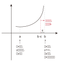

---

=== 如果破裂点, 在[a,b] 区间的中间 c处

那么, 我们就要把这个积分, 以c点为下刀处, 切成两块, 来看这两个极限是否存在:

stem:[\lim_{ε -> 0^+} \int_a^{c-ε} f(x) dx]

和

stem:[\lim_{ε -> 0^+} \int_{c+ε}^{b} f(x) dx]

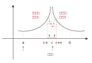

只有当这两部分的积分, 都收敛时,积分 stem:[\int_a^b f(x) dx] 才是收敛的. 里面只要有一个是发散的, 整个积分就是发散的. (就像两个连在一起的太空舱, 只要有一个漏气, 整个飞船中的氧气都会漏光)

---

=== 一个函数, 有n个瑕点的情况

所以, 一个函数, 如果有n个瑕点(破裂点是瑕点之一), 我们就把它分成n段, 每一段只处理一个瑕点, 即把该瑕点切除出去. 并且该"瑕点"要放在每一段积分的上下限处.

.标题
====
例如： +
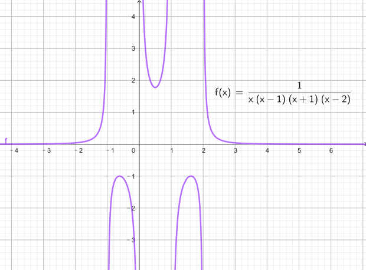

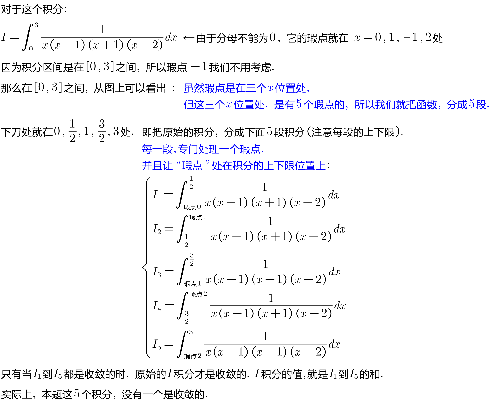

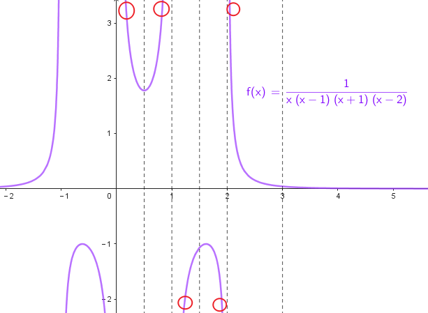
====

---

=== 积分的上下限, 是∞的情况

普林斯顿微积分
398

