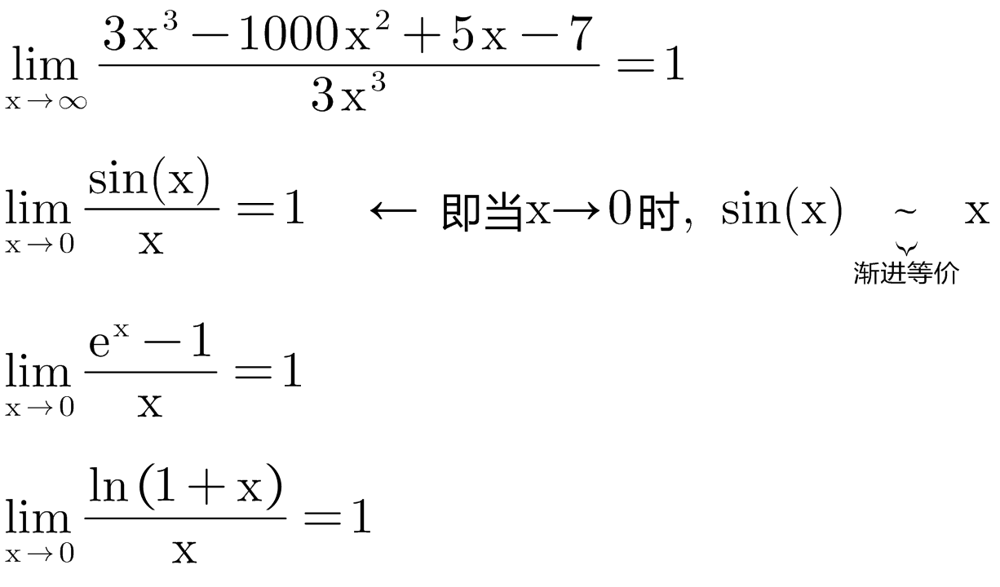
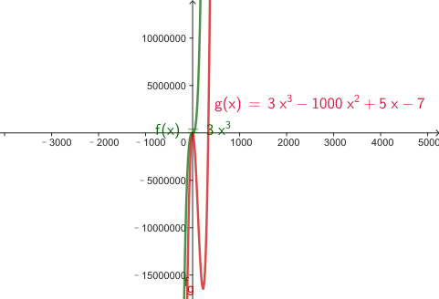
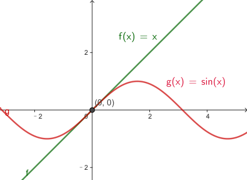
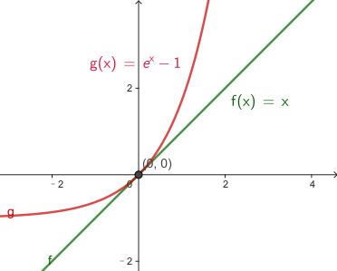
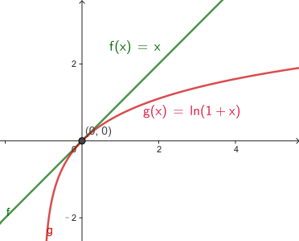
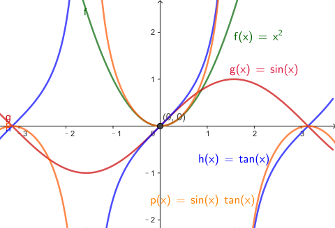
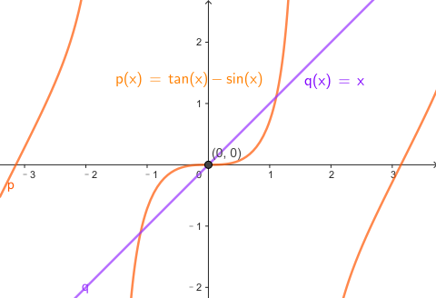
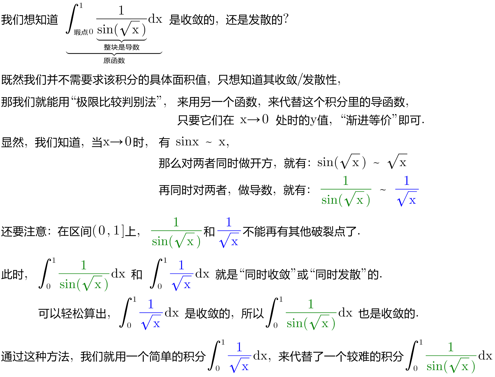
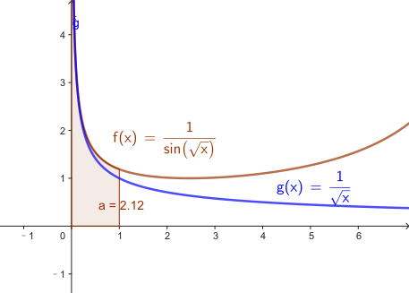
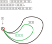

= "极限比较"判别法 comparison test
:toc: left
:toclevels: 3
:sectnums:

---

== "极限比较"判别法

"极限比较"判别法, 其基本思想是: 假设有两个函数在破裂点 x = α 处(的y值)是非常接近的 (并且它们再也没有其他的破裂点), 那么这两个函数的积分, 即 stem:[ \int_a^b f(x) dx ] 和 stem:[ \int_a^b g(x) dx ] , 就会同时"收敛"或同时"发散". 即它们的行为是相同的.

那什么叫两个函数是“非常接近”呢? 即, 它们满足这个的等式:  +
stem:[ \lim_{x→a} \frac{f(x)} {g(x)}=1] +
在x趋近于a处, 它们的"y值的比值"是 1 的话, 则, 可以说这两个函数在此x点处是"趋近于相等的". 我们记作 stem:[ f(x) ~ g(x)]

不过注意: f(x)非常接近于g(x), 并不意味着它们的差值非常小. 例如, 在x→a处, f(x)可能是万亿, g(x)可能是万亿+一百万, 两者相差一百万! 但它们在x→a 处的y的比值, 又的确是近似于1:1.

所以, 我们说, 当x→a 时, f(x) 和 g(x) 是"渐进等价"的.

同样, 不只是x→a,  其他如 x→∞  或 stem:[ x→ a^+] 也是一样道理. 这要两个函数在x的这些位置处, 极限值是 1:1 的关系.

.标题
====
例如： +

====

**实际上,你可以对"渐近等价"的函数, 做幂运算, 乘除运算 (但加减运算不行), 就能得到一对新的"渐近等价"的函数. **

[options="autowidth"]
|===
|Header 1 |Header 2

|→ 幂运算
|我们知道: 当 x→0 时, 有sin(x)~ x, 则就可以立刻写出: 当 x→0时, 也有 :   +
stem:[ sin^3(x) ~ x^3],  ← 即两者同时做3次方 +
或 stem:[ 1/sin(x) ~ 1/x]  ← 即两者同时被1除

|→ 乘除运算
|y=tan(x) 和 y=sin(x) 在 x→0时, y值都→0, 所以, 把这两个函数相乘, 在x→0处 依然是y→0. 所以就能有: stem:[ tan(x) sin(x) ~ x^2]

|→ *注意: 加减运算不行!*
|如, 虽然 当x→0时, sin(x) ~ x,  tan(x)~x, 但 tan(x)-sin(x) 却不"渐进等价" 于x.

为什么不能得到 tan(x)-sin(x) ~ x-x ?  因为这就意味着 stem:[ \lim_{x→a} \frac{tan(x)-sin(x)} {x-x} =  \lim_{x→a} \frac{f(x)} {0}=1 ] +
哪一个值 和 0 相比, 会等于1呢? 不存在. 所以这个极限没有任何意义.
|===

---

== "渐进等价"方法, 在哪些地方能排上用场?

比如, 一个函数 f, 它在a点处是个瑕点. 但你很想知道它的积分(有瑕点, 就属于是"反常积分"了) stem:[ \int_{瑕点a}^b f(x) dx] 到底是收敛的, 还是发散的. 该怎么操作呢? +
*你就来找一找, 有没有另一个函数g, 它满足 其x在→a时, 其y值的走势, 能非常接近于 f函数的情况. 若满足, 你就能用函数g, 来代替函数f, 来看g在[a,b]区间的积分, 是收敛的还是发散的就行了.* (因为f这个反常积分的收敛还是发散, 是由其瑕点a决定的, 所以你不用管另一个b点. 而且我们也不关心具体的积分面积值, 我们只关心其的发散/收敛情况而已.)

即, g的结论, 都适用于f.

换言之, *若当x→a 时, 有 f(x) ~ g(x), 并且这两个函数在区间[a,b]上没有其他瑕点. 则积分 stem:[ \int_{a}^b f(x) dx ] 和 stem:[ \int_{a}^b g(x) dx ] 是"同时收敛"或"同时发散"的.*  (如果同时收敛，它们的收敛值可能不同.)这就是"极限比较判别法"．

.标题
====
例如： +

打个比喻, 就如同:

====

---
