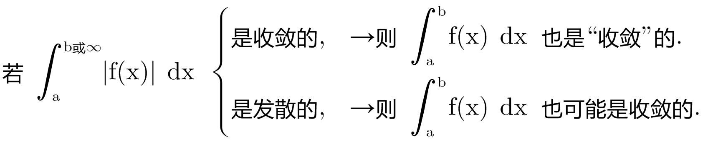
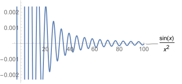
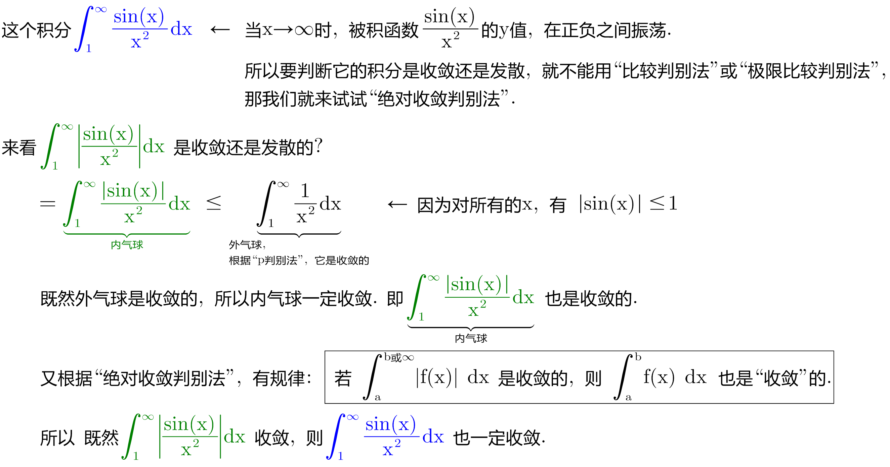

= 绝对收敛判别法
:toc: left
:toclevels: 3
:sectnums:

---

== 绝对收敛判别法

.绝对收敛判别法
****
*如果一个函数, 在其积分区间上,是不断在正负间上下振荡的, 怎么判断它的收敛/发散性? 方法是: 就用该函数的极限, 来代替它本身, 来看其极限在积分区间上, 是收敛的, 还是发散的.* 即:

\begin{align}
\boxed{
如果 \int_a^b |f(x)| dx 是收敛的, 那么 \int_a^b f(x) dx 也是收敛的.
}
\end{align}

这个规律, 对于无穷区间上的积分也是适用的. 例如 [a,∞).

*注意: 如果原始积分的绝对值是"发散"的, 那么这个原始积分, 可能还是"收敛"的!*

即:

****

.标题
====
例如： +

====

408

\begin{align}
\frac{a+\overset{\begin{matrix}{l}
	up\ somthing\\
	one...\\
	tow...\\
\end{matrix}}{\overbrace{b+c}}+x}{d+\underset{\begin{matrix}{l}
	down\ sth\\
	one...\\
	two...\\
\end{matrix}}{\underbrace{e}}+y}
\end{align}
