= 不定积分
:toc: left
:toclevels: 3
:sectnums:

---

== 不定积分 indefinite integral -> 即"原函数"的别名. 精确的说, "不定积分"就是"原函数的全体".

....
indefinite  /ɪnˈdefɪnət/
adj.
lasting for a period of time that has no fixed end 无限期的；期限不定的
• She will be away for the indefinite future. 她将离开一段时间，期限不定。

not clearly defined 模糊不清的；不明确的
SYN imprecise
• an indefinite science 界定不明的科学
....

....
integral   /ˈɪntɪɡrəl/
adj.
~ (to sth)being an essential part of sth 必需的；不可或缺的 +
• Practical experience is integral to the course. 这门课程也包括实践经验。

[ usually before noun] included as part of sth, rather than supplied separately 作为组成部分的
• All models have an integral CD player. 所有型号都有内置的激光唱片机。

[ usually before noun] having all the parts that are necessary for sth to be complete 完整的；完备的
• an integral system 完整的系统

....

一个原函数, 求其导数, 能得到"导函数". *反过来, 从"导函数"算出其"原函数"的过程, 就是求其"不定积分".* 换言之, "原函数"的别名就是"不定积分".

如: "原函数"是 F(x), 其"导函数"是 f(x), 即: stem:[ F'(x) = f(x)], 则  F(x) 就是 f(x) 的其中一个原函数.

注意: 能得到相同"导函数"的原函数, 可以不止一个. 比如: 2x 是导函数, 其原函数可以是 stem:[ x^2], 也可以是 stem:[ x^2 + 3] 等等. +
所以, 我们从"导函数"来反求其"原函数", 只要求出一个"原函数" stem:[ f(x)] 即可, 其他的的"原函数"可以表示为: stem:[ f(x) + C], C是常数.

即: +
\begin{align}
(原函数F(x)+ 常数C)' = 导函数f(x)
\end{align}

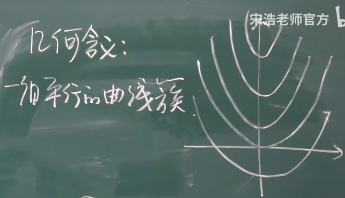

原函数什么时候会存在呢? -> 连续(即能一笔画)的导函数, 一定有"原函数".

"原函数"的别名就是"不定积分", 求原函数, 就是求"不定积分". 即写作: +
\begin{align}
& \int f(x) dx = 原函数 F(x) + C \\
& -> 其中, f(x) 叫做"被积函数", 也即"导函数". \\
& -> dx 叫做"积分变量" \\
\end{align}

符号 stem:[ \int] 是英文 sum 的 首字母s 变形.

stem:[ \int] 和 Σ 的区别是:

[options="autowidth"]
|===
|Header 1 |Header 2

|stem:[ \int]
|-> 是对"无穷个"连续的"无穷小量"的求和

|stem:[ Σ]
|-> 通常是对"有限个, 或者离散的量"求和。
|===

类似的:

[options="autowidth"]
|===
|Header 1 |Header 2

|stem:[ dx]
|-> 表示"无穷小"变量. 有"极限"的概念在里面.

|stem:[ Δ]
|-> 表示"有限小"的变量.
|===

[options="autowidth"]
|===
|Header 1 |Header 2

|Column 1, row 1
|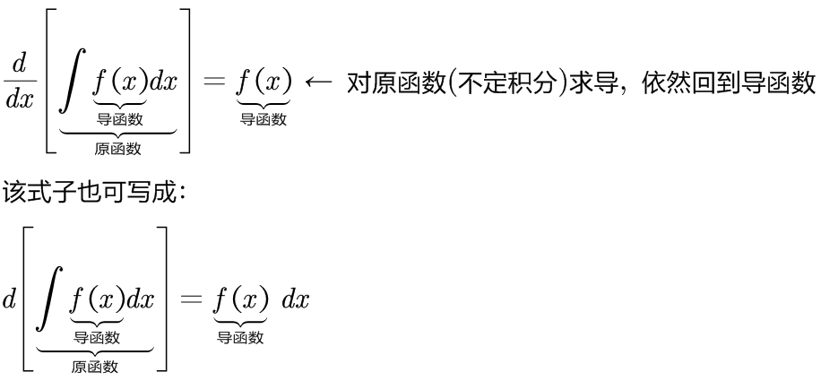

|
|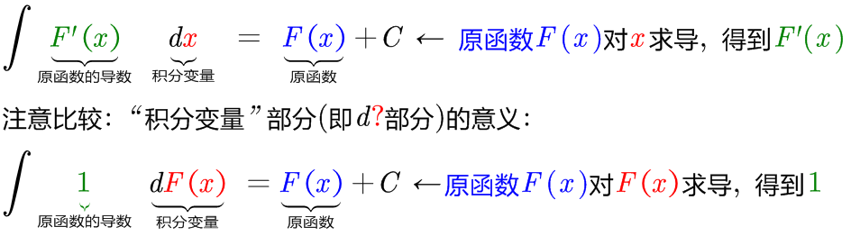
|===

所以:

\begin{align}
& \int 1 dx = x+C \\
& \int 1 du = u+C \\
& \int 1 d(x^2 -3) = x^2 -3 +C = x^2 +C \\
& \int 1 d F(u) = F(u) +C \\
\end{align}

|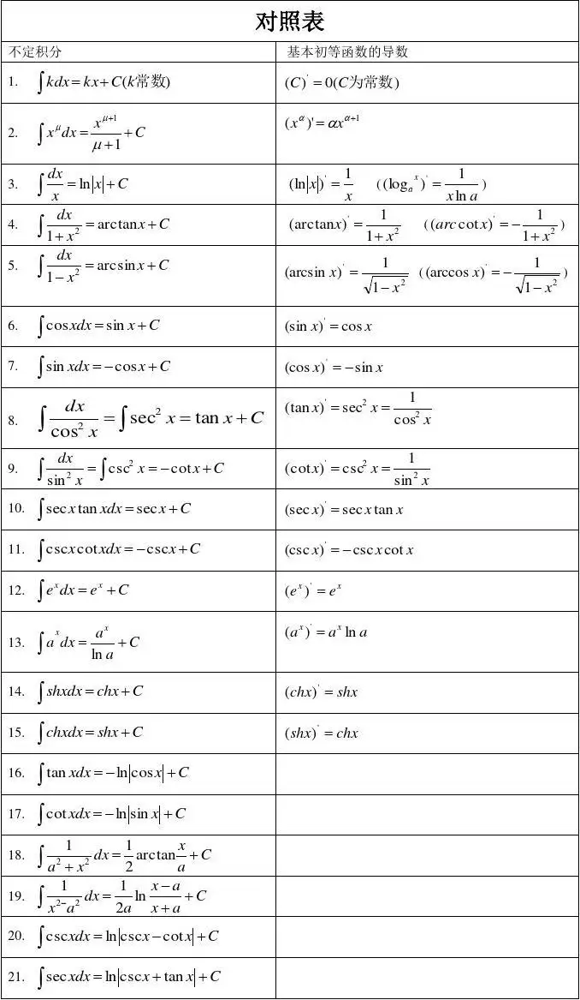

---

=== 公式表

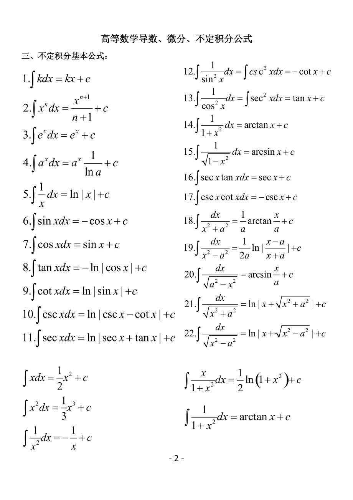

---

=== stem:[ \int (0) dx = C]

---

=== stem:[ \int (k) dx = kx + C]

---

=== stem:[ \int (x^n) dx=\frac{1} {n+1} x^{n+1} + C, \quad n \ne -1]

.标题
====
例如： +
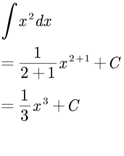
====

.标题
====
例如： +
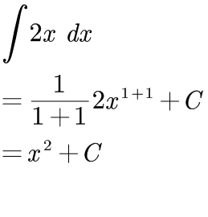
====

---

=== stem:[ \int (\frac{1} {x}) dx = ln \|x\| + C]

---

=== stem:[\int x dx = \frac{1} {2} x^2 + C]

---

=== stem:[ \int (e^x) dx = e^x + C]

---

=== stem:[ \int (a^x) dx = \frac{a^x} {\ln a} + C]

---

=== stem:[ \int (\frac{1} {1+ x^2}) dx = \arctan x + C,  或= -\arc cot x + C]

---

=== stem:[ \int (\frac{1} {\sqrt{1-x^2}}) dx = \arcsin x + C,  或= -\arccos x + C]

---

=== stem:[ \int (\sin x) dx = - \cos x + C]

---

=== stem:[ \int (\cos x) dx = \sin x + C]

---

=== stem:[ \int (\tan x) dx = -\ln \|cos x\| + C]

---

=== stem:[ \int (\cot x) dx = \ln \|sin x\| + C]

---

=== stem:[ \int (\sec x) dx = \ln \|sec x + tan x\| + C]

---

=== stem:[ \int (\csc x) dx = \ln \|csc x - cot x\| + C]

---

=== stem:[ \int (\sec^2 x) dx = \tan x + C]

---

=== stem:[ \int (\csc^2 x) dx = - \cot x + C]

---

=== stem:[ \int (\sec x \tan x) dx = \sec x + C]

---

=== stem:[ \int (\csc x \cot x) dx = -\csc x + C]

---

== 不定积分 的性质

=== stem:[ \int \[ f(x) \pm g(x) \] dx = \int f(x) dx \pm \int g(x) dx]

---

=== stem:[ \int (k f(x)) dx = k \cdot \int f(x) dx], 其中 k 是常数, 且 k ≠ 0. 注意: 如果k是一个变量, 如果该变量与x是无关的(即与"积分变量"无关的), 则可以朝外挪出去; 但如果该变量是与x相关的, 则就不能朝外挪.

---

=== 例题

.标题
====
例如： +
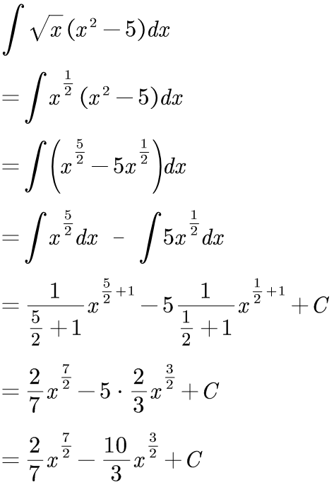
====

.标题
====
例如： +
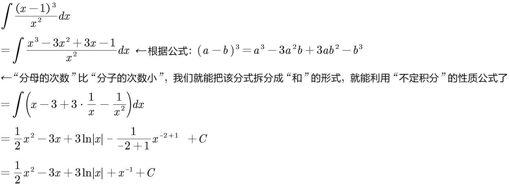
====

.标题
====
例如： +
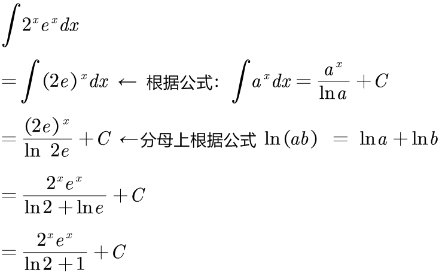
====

.标题
====
例如： +
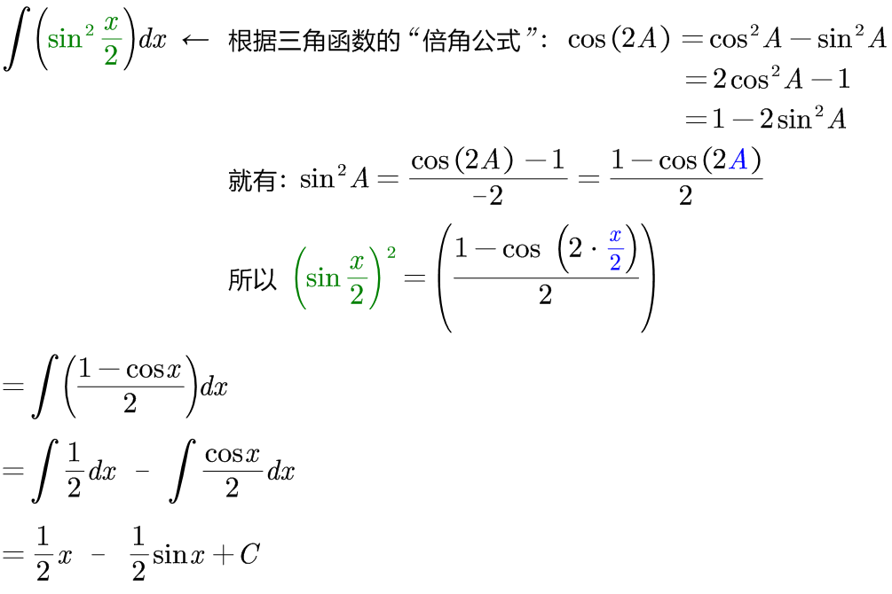
====

.标题
====
例如： +
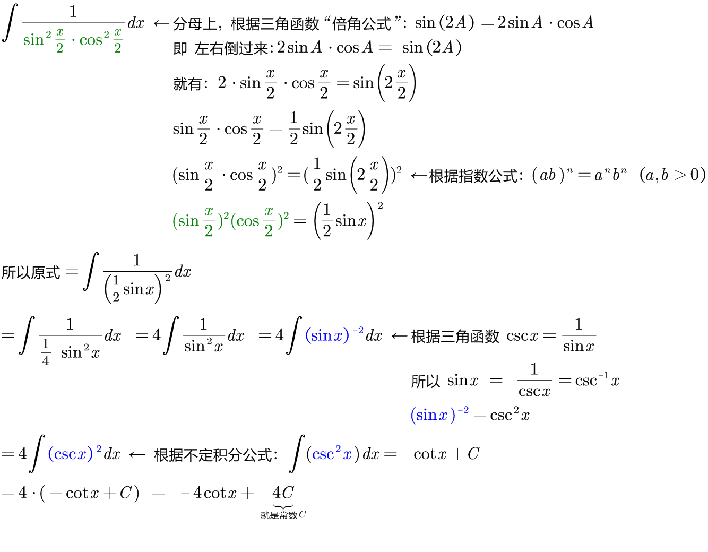
====

.标题
====
例如： +
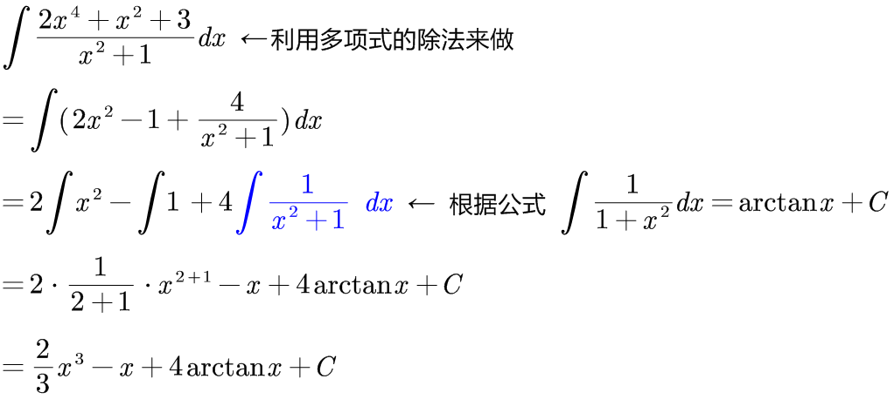
====

---

