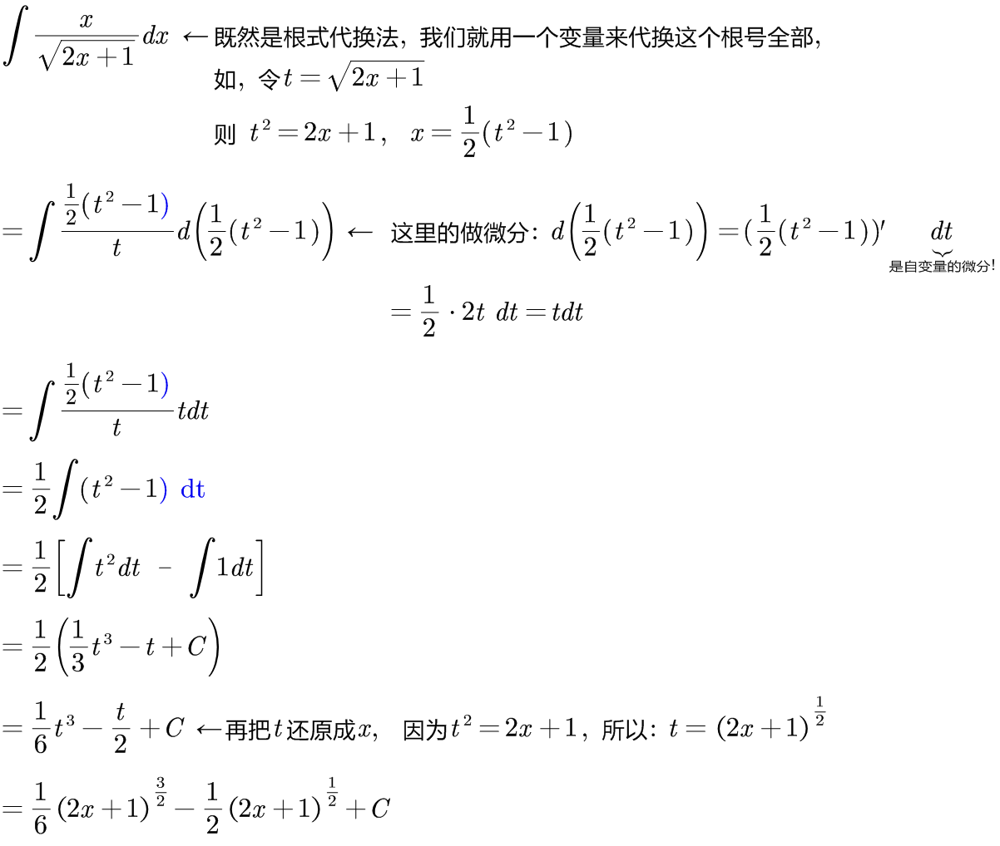
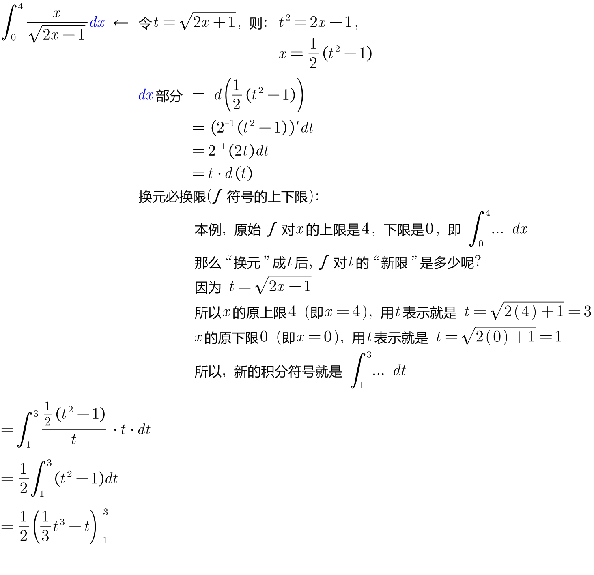

:toc: left
:toclevels: 3
:sectnums:

---

== 第二换元法 之"根式代换法"

.标题
====
例如： +

====

.标题
====
例如： +

====

---

https://www.bilibili.com/video/BV1Jo4y1R7Bx?spm_id_from=333.337.top_right_bar_window_history.content.click&vd_source=52c6cb2c1143f8e222795afbab2ab1b5

9.55
