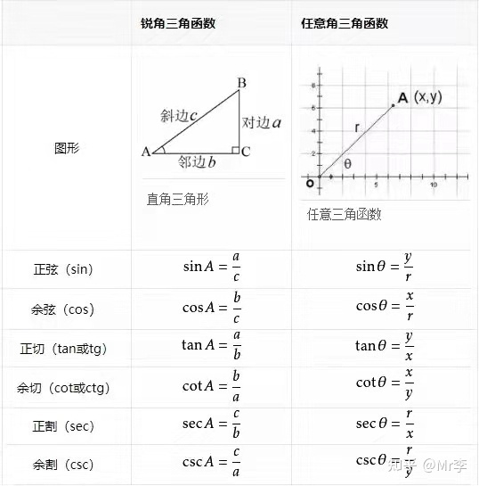

:toc: left
:toclevels: 3
:sectnums:

---

- sec是 与角度"相邻近"的左右两条边相比, 斜边在分子上. 即"斜边"比上"邻边".
- csc是 "斜边"比上"较远处的对边".

https://zhuanlan.zhihu.com/p/390928056?utm_source=wechat_session&utm_medium=social&utm_oi=35541970059264
