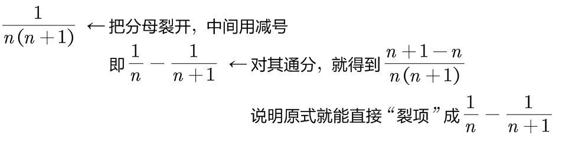
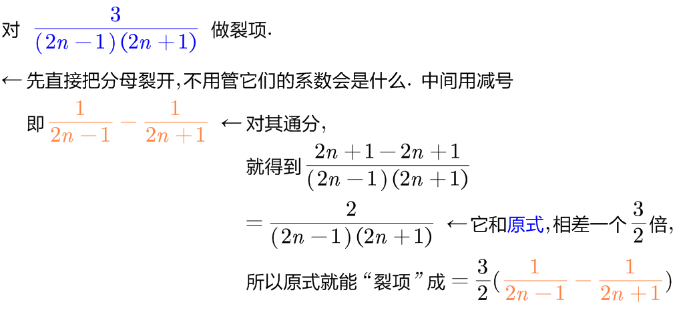
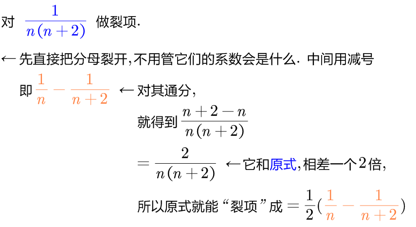
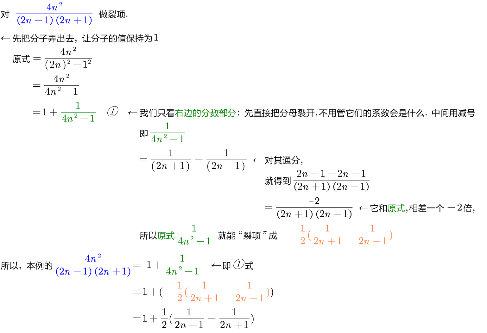
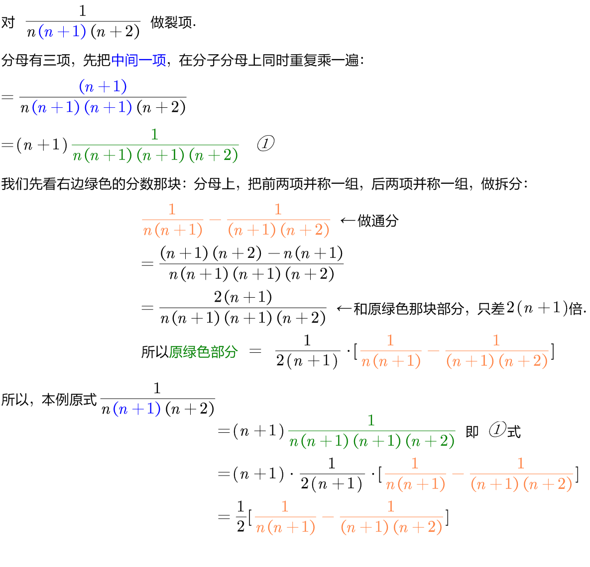
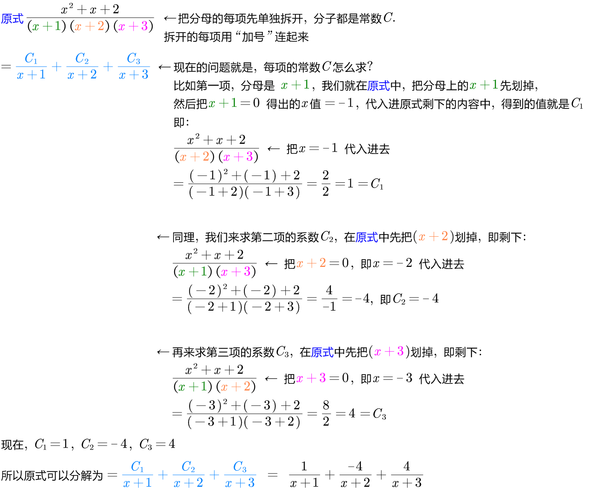
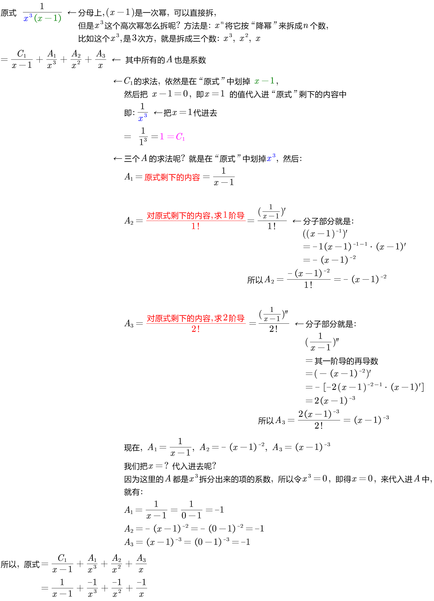
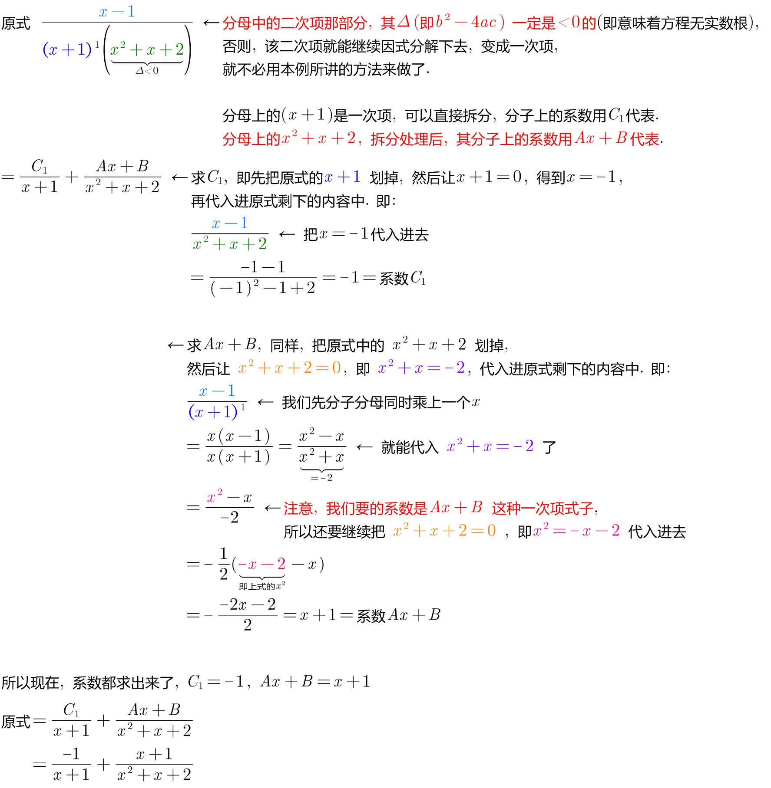

:toc: left
:toclevels: 3
:sectnums:

== 裂项

=== 分母上两个数, 是等差数列"相邻的两项", 即stem:[ \frac{1} {n \cdot (n+1)}]

如果分母上的两个数, 是等差数列相邻两项的乘积 (如: stem:[ \frac{1} {b_n \cdot b_{n+1}}]), 就可以用"裂项相消".

.标题
====
例如： +

====

.标题
====
例如： +

====

---

== 分母上两个数, 是等差数列"相隔一个item的两项", 即stem:[ \frac{1} {n \cdot (n+2)}]

.标题
====
例如： +

====

---

== 分子不为1的情况, 就把分子先变成1, 然后再用常规操作来处理

.标题
====
例如： +

====

---

== 分母中有三项 -> 就把中间一项重复乘一遍, 变成四项, 再前两项并成一组, 后两项并成一组, 来拆分

.标题
====
例如： +

====

---

== 分子都是"1次方"的情况, 快速裂项法

.标题
====
例如： +

====

---

== 分母有"高次幂"的情况, 快速裂项法

.标题
====
例如： +

====

.标题
====
例如： +

====

---

