:toc: left
:toclevels: 3
:sectnums:

---

== 导数 Derivative /dɪˈrɪvətɪv/ stem:[f'(x_0) = \lim_{Δx \to 0} \frac{Δy} {Δx}]

```
derivative /dɪˈrɪvətɪv/
n. a word or thing that has been developed or produced from another word or thing 派生词； 衍生字 ；派生物；衍生物
• ‘Happiness’ is a derivative of ‘happy’. happiness是happy的派生词。
•Crack is a highly potent and addictive derivative of cocaine. 强效纯可卡因是一种药效极强、容易使人上瘾的可卡因制剂。
```

导数, 就是一个"极限值", 比如, y 在 点 stem:[x_0]处的导数, 就是 \begin{align*}
& f'(x_0) = \lim_{Δx \to 0} \frac{Δy} {Δx}
\end{align*}

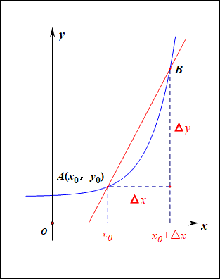

stem:[x_0]点处的导数, 其实可以有下面4种写法来表示: +
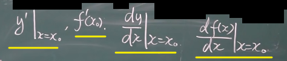


---

== 常用的导数


=== 常数的导数=0, 即 stem:[ f(x)=C, -> (C)'=0]

导数, 可以理解为速度的变化率, 即"加速度".  常数, 是一条水平线, 就是说"速度永远保持不变"的, 它自然也就没有"加速度"存在了. 所以导数就=0, 所以常数的导数就=0.

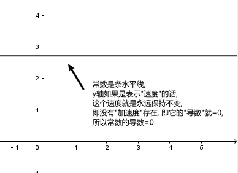

---

=== stem:[ f(x) = x^n, \quad n \in N^+], -> ① 当 指数n = 1 时, stem:[ (x^n)' =1], ② n>1时, stem:[ (x^n)' = n x^{n-1}]

\begin{align}
&f(x) = x^n, \quad n是正整数 \\
& ① 当 指数n = 1 时, \lim_{h \to 0} \frac{f(x+h)-f(x)} {h} =  \frac{f(x+h)^1 -f(x^1)} {h} = \frac{h} {h} = 1 \\
& 即: n=1时,  (x^n)' =1 \\
& ② 当 指数n > 1 时, \lim_{h \to 0} \frac{f(x+h)-f(x)} {h} =  \frac{f(x +h)^n -f(x^n)} {h} = n x^{n-1} \\
& 即: n>1时, (x^n)' = n x^{n-1}
\end{align}

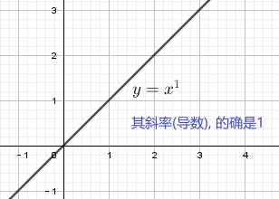


例如:
\begin{align}
(x^3)' = 3x^2
\end{align}

---

=== stem:[ f(x) = x^μ, \quad μ\in R, ->  (x^μ)' = μx^{μ-1}]

例:
\begin{align}
(\sqrt{x})' = (x^{\frac{1} {2}})' = \frac{1} {2} x^{ \frac{1} {2} -1} = \frac{1} {2} x^{-  \frac{1} {2}}
\end{align}

例:
\begin{align}
(x^{-3})' = -3x^{-4}
\end{align}

.标题
====
例如： 求 ① y = 1/x 在点 (1/2, 2) 处的切线的斜率(即导数). ② 求该切线的方程.
\begin{align}
&y = x^{-1}, 它的导数 y' = -1 x^{-1-1} = -x^{-2}. \\
& 然后把点(\frac{1}{2},2) 的x具体坐标值代入进去: \\
& y'|_{x=\frac{1}{2}} = -(\frac{1}{2})^{-2} = -4
\end{align}

所以, 该切线的方程就是 (用点斜式): stem:[ y- 2 = -4 (x-\frac{1}{2})] +
同样, 法线方程就是 : stem:[ y- 2 = \frac{1}{4} (x-\frac{1}{2})]
====


---

=== stem:[ f(x)= \sin x,  -> (\sin x)' = \cos x]

---

=== stem:[ f(x)= \cos x,  -> (\cos x)' = -\sin x]

---

=== stem:[  (a^x)' = a^x \ln a]

如:
\begin{align}
(2^x)' = 2^x \ln 2
\end{align}

---

=== stem:[  (e^x)' = e^x \ln e = e^x]

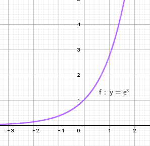

---

=== stem:[ (\log_a x)' = \frac{1} {x \ln a}]

---

=== stem:[ (\ln x)' = \frac{1} {x}]

---

== 单侧导数

单侧导数, 就是从"某一侧"逼近某一x点时, 该点的切斜斜率.

所以, 左导数, 就是"从左侧向右"逼近了. 右导数, 就是"从右边向左"逼近了.

[options="autowidth"]
|===
|Header 1 |Header 2

|左导数
|写作: stem:[ f_-^' (x_0) = \lim_{h \to 0^-} \frac{f(x_0 +h) - f(x_0)} {h} ]

也可写作: +
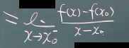

|右导数
|写作: stem:[ f_+^' (x_0) = \lim_{h \to 0^+} \frac{f(x_0 +h) - f(x_0)} {h} ]

也可写作: +
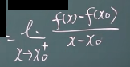
|===

如: stem:[ y = |x|] 在 x=0 点处的导数, 左导数和右导数, 就不一样. +
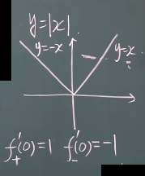

**如果某x点处, 它的左右导数不相等, 则改点处"不可导".** +
换言之, **某点出"可导"的充要条件是 <--> 它的左,右导数均存在, 且相等.**

---

== 导数的几何意义

**可导, 就意味着图像很"光滑". 即图像没有"尖角"存在 (因为尖角处的左右导数不相等). 并且还要满足: 切线不能垂直于x轴.** 如果切线是垂直于x轴的, 它的斜率就会是 +∞ 或 -∞了.

某点处的"导数", 就是该点处"切线的斜率". +
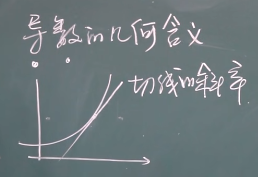

---

=== 法线 normal line: 和切线垂直的线, 就叫"法线".

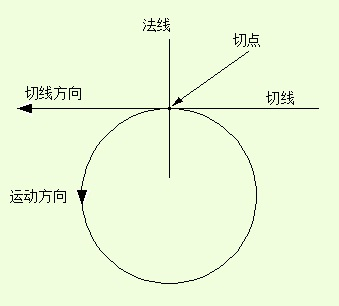
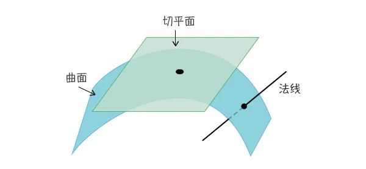

法线与切线垂直, 两者的斜率乘积 = -1. +
所以, 既然切线的斜率是 stem:[ f'(x_0)], 所以法线的斜率就是 stem:[ -\frac{1} {f'(x_0)}]

根据直线的"点斜式"公式, 就有:

- 切线的方程: stem:[ y- y_0 = f'(x_0) \cdot (x - x_0)]
- 法线的方程: stem:[ y- y_0 = -\frac{1} {f'(x_0)} \cdot (x - x_0)]


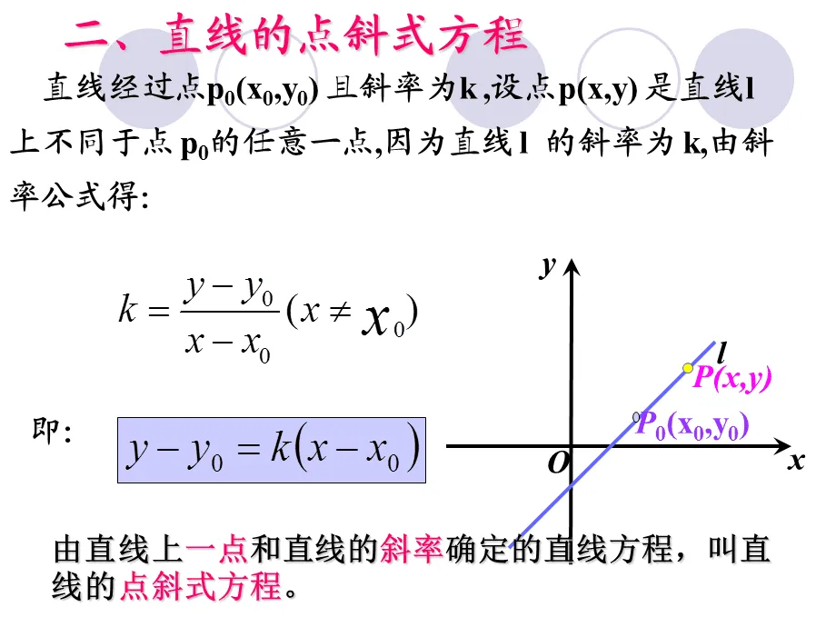

---

== 求导法则: 和差积商

=== stem:[  (a+b)' = a'+b']

如: +


---

=== stem:[  (a+b+c)' = a'+b'+c']

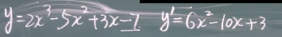


---

=== stem:[  (a-b)' = a'- b']

---

=== stem:[  (ab)' = a'b + ab']

如: +
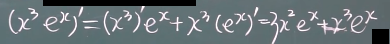

例: +
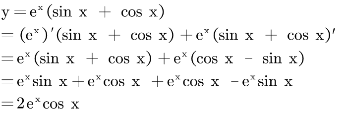


---

=== stem:[  (abc)' = a'bc + ab'c + abc']


---

=== C是常数, 则 stem:[(C a)' = C \cdot a' ] <- 直接把常数提出去就行了

如: +


---

=== stem:[(\frac{a} {b})' = \frac{a'b - ab'} {b^2}]

如: +
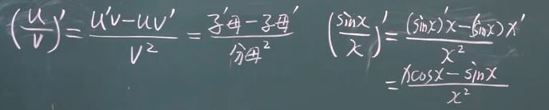

---

== 三角函数的导数

总结表

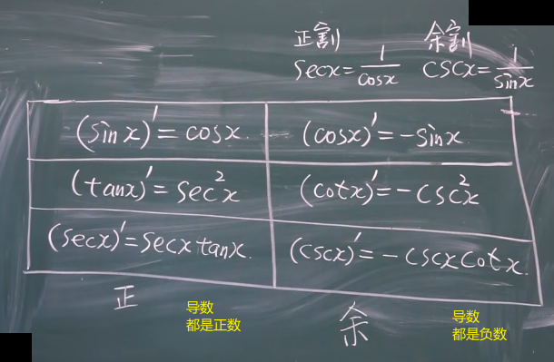


---

=== stem:[ (\sin x)' = \cos x]

---

===  stem:[ (\cos x)' = -\sin x]

---

=== stem:[ (\tan x)' = \sec^2 x]

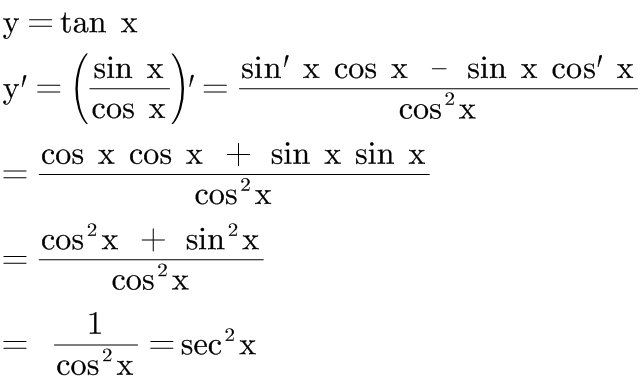

---

=== stem:[ (\cot x)' = -\csc^2 x]

---

=== stem:[ (\sec x)' = \tan x \cdot \sec x]

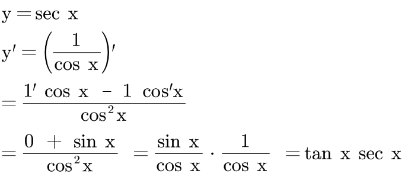

---

=== stem:[ (\csc x)' = - \cot x \cdot \csc x]

---

== 反函数 的求导法则 -> 反函数的导数, 和其原函数的导数, 呈"倒数关系".

原函数是 stem:[ y = f(x)], 其反函数是 stem:[ x = f(y)], 则, 反函数的导数, 就是"原函数导数"的倒数. 即:
\begin{align}
反函数的导数 [f^{-1}(y)]' = \frac{1} {原函数的导数 f'(x)}
\end{align}

换言之, 原函数的导数是 stem:[ \frac{Δy} {Δx}], 则其反函数的导数就是 stem:[ \frac{1} {\frac{Δx} {Δy}}]

换言之, 就是 关于 y=x 对称的 两条曲线上的镜像点, 它们的斜率之积 = 1.  "函数"与其"反函数"的图像, 就是关于 y=x 对称的. +
即如下图, 绿线与蓝线, 关于 y=x对称, 它们上面的镜像点 A 和 A' 点, 它们的斜率, 即两条红线的斜率, 相乘 = 1.

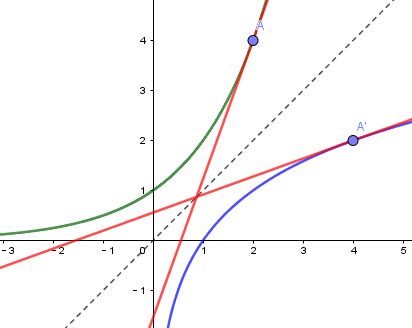

---

=== stem:[(\arcsin x)' = \frac{1} {\sqrt{1-x^2}} ]

证明过程: +
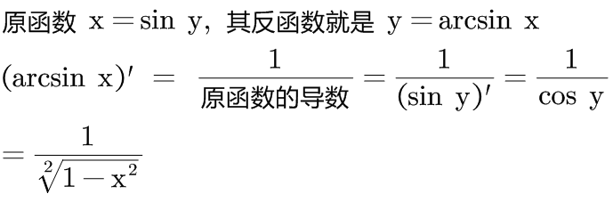

为什么 stem:[ cos y = \sqrt{1 - x^2}] ? 因为: +
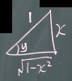

---

=== stem:[(\arccos x)' = - \frac{1} {\sqrt{1-x^2}} ]

---

=== stem:[(\arctan x)' =  \frac{1} {1 + x^2}]

---

=== stem:[(\arc cot x)' = - \frac{1} {1 + x^2}]


---

== 复合函数的求导 (链式法则)

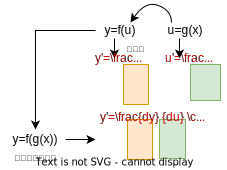

又例: +
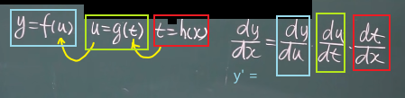

.标题
====
例如： +
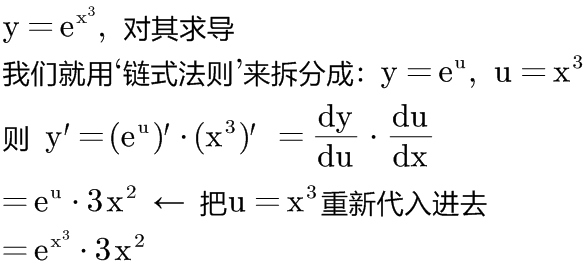
====


更好的方法, 是从外层向内层, 一层层求导进去就行了.

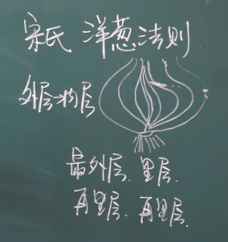


.标题
====
例如： +
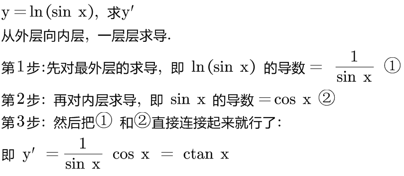
====


.标题
====
例如： +
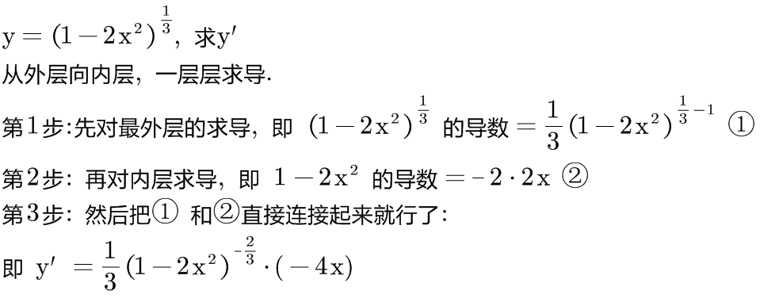
====

.标题
====
例如： +
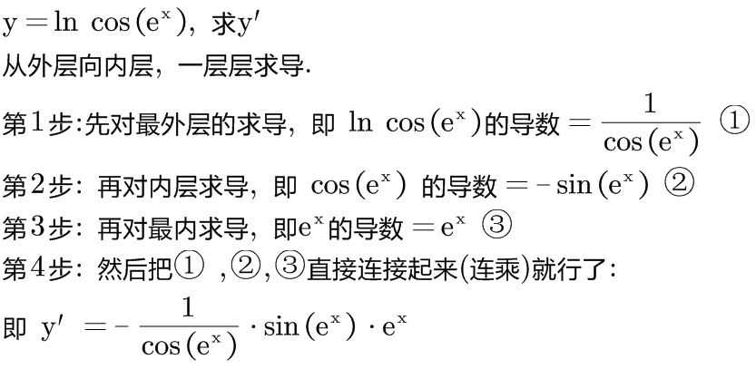
====

.标题
====
例如： +
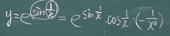
====
---

.标题
====
例如： +
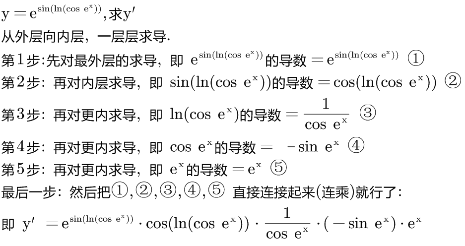
====

---

=== ★ 重要的公式: stem:[ a^b = e^{b \cdot \ln a} ] <- 把指数, 化为以e为底的表达式子.

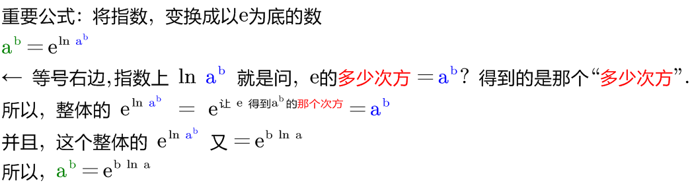

记忆法: +
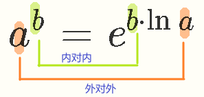


.标题
====
例如： +
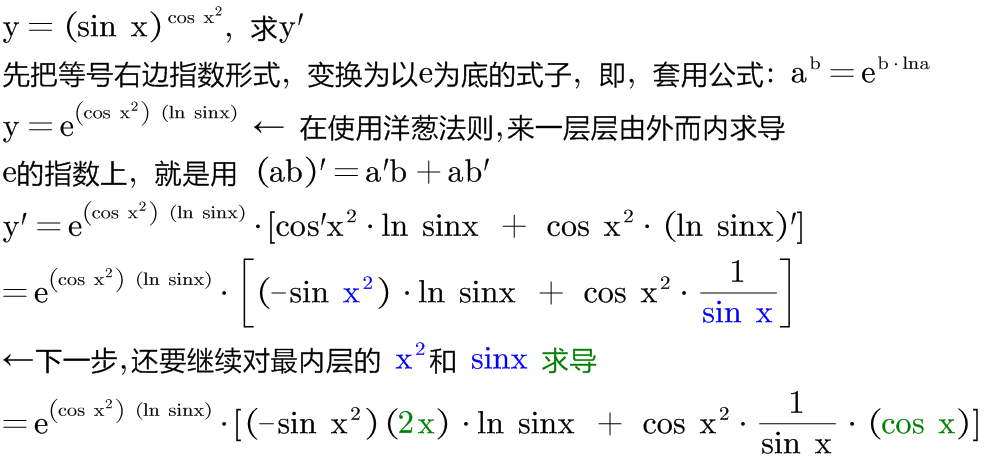
====


.标题
====
例如： +
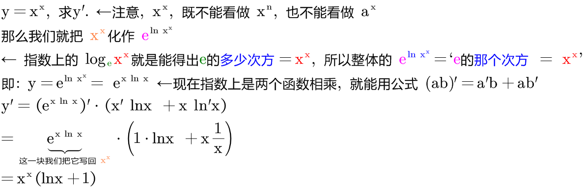


其实本例, 还有另一种做法: +

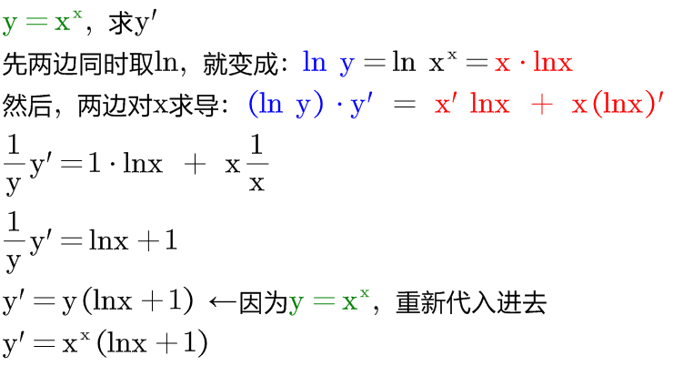
====


.标题
====
例如： +
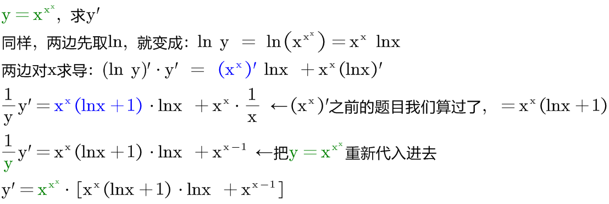
====

---

