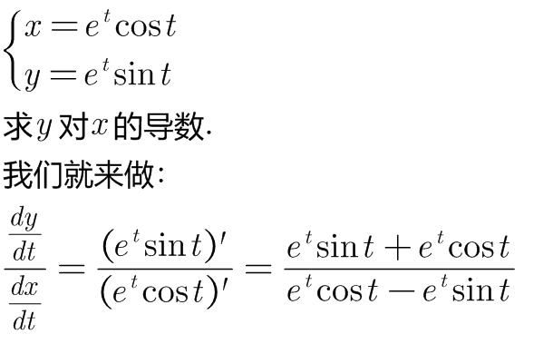
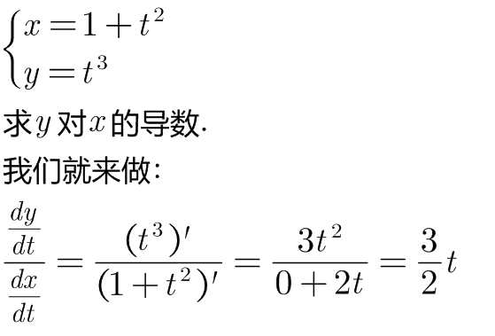
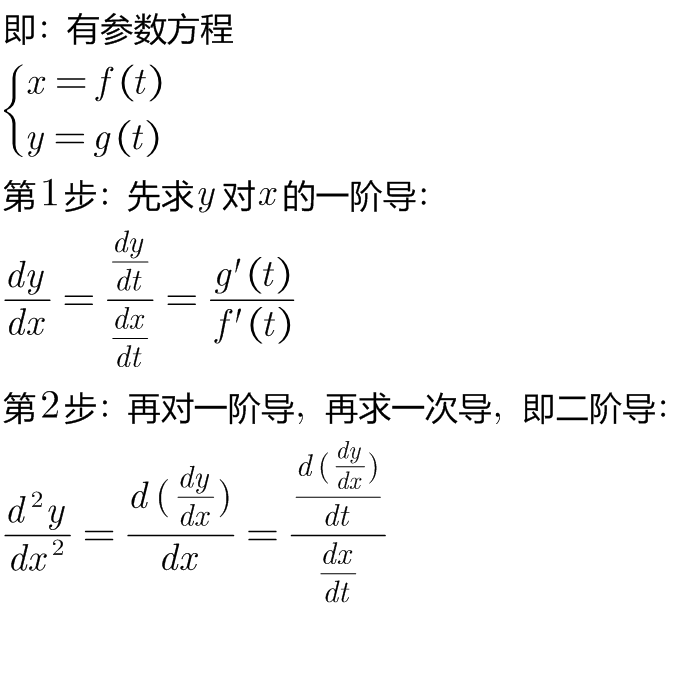
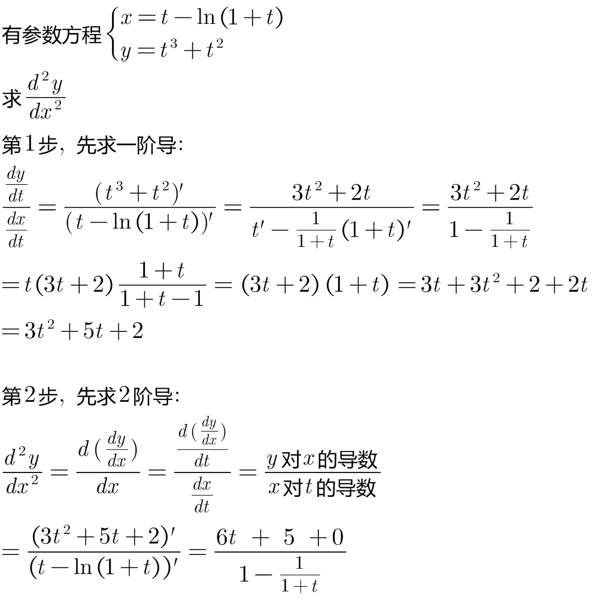
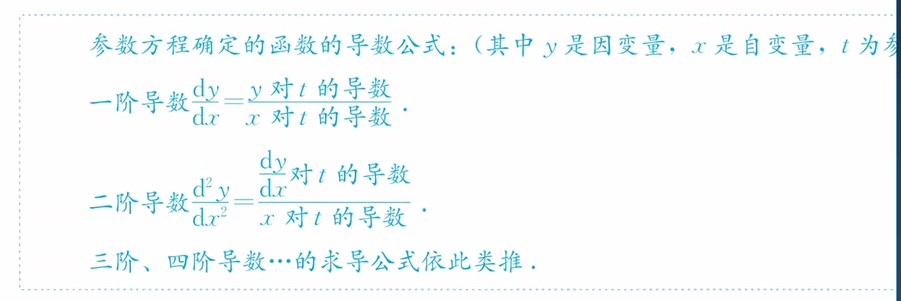

:toc: left
:toclevels: 3
:sectnums:

---

比如, 有这个参数方程:

\begin{align*}
\left\{ \begin{array}{l}
	x = f(t) \\
	y = g(t)\\
\end{array} \right.
\end{align*}

t 是参数.

要求 "y 对 x求导":

== 如果要求"一阶导数", 只需做这个操作就行了:  stem:[\frac{dy}{dx}=\frac{\frac{dy}{dt}}{\frac{dx}{dt}}]

.标题
====
例如： +

====

.标题
====
例如： +

====

---

== 如果要求"二阶导数", 就: ①先求一阶导 stem:[\frac{dy}{dx}=\frac{\frac{dy}{dt}}{\frac{dx}{dt}}], ② 然后再求二阶导.

.标题
====
例如： +

====

---

== 总结:

