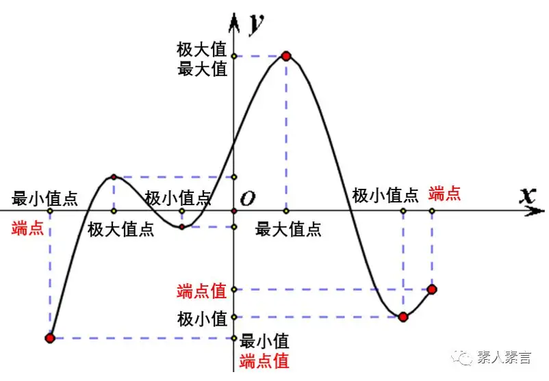

:toc: left
:toclevels: 3
:sectnums:

---

- 极值: 是指在某x点的"领域内", 找一个最大或最小值. 即: 极值是与它的两侧相比的. 大于两侧就是极大值，小于两侧就是极小值.

- 最值: 是在函数在"定义域", 或"指定区间内" 的最大或最小值。  +
"最值"是唯一的, 但"最值点"可能并不唯一. 比如有可能有好几个点, 具有相同的"最值数值".

- 驻点 Stationary Point : 是函数的"一阶导数=0"处的x点. 驻点处的切线平行于x轴。驻点不一定是这个函数的极值点.

---

== 极值  extremum

极值点, 导数一定=0. 但反过来, 导数=0处的点, 未必是极值点. 因为它可能处于"从下一级台阶到上一级台阶的 中间水平台阶上".

定理 如果函数可二阶导, 并且在 stem:[ x_0]处,它的导数 stem:[ f(x_0)'=0], 且它的二阶导 stem:[  f(x_0)'' \ne 0], 那么该 stem:[x_0 ]点, 到底是属于极大值, 还是极小值呢?  +
-> 若 stem:[  f(x_0)''  <0 ], 表明一阶导的切线斜率趋势一直在下降(越来越疲软), 则说明 stem:[x_0 ] 是极大值. +
-> 若 stem:[  f(x_0)''  >0 ], 表明一阶导的切线斜率趋势一直在上降(越来越强劲), 则说明 stem:[x_0 ] 是极大值.

image:img/239.png[]

如果 发现 stem:[  f(x_0)'' = 0] 呢? 此时, 就无法判断 stem:[ x_0] 点到底是"极大值"还是"极小值", 只能回到查看该stem:[ x_0]点左右两侧的一阶导数, 是>0 还是<0, 即: 左右两侧的曲线图像是单调增, 还是单调减, 才能来判断该  stem:[ x_0] 点 是极大值, 还是极小值了.

.标题
====
例如： +
image:img/240.png[]

image:img/241.png[]
====

---

